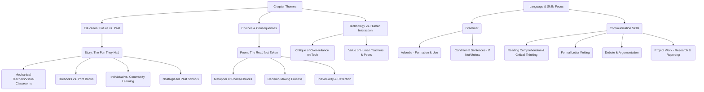

# Class 9 English - Beehive Chapter 101
**Language:** English

Okay, here is the NCERT-style summary for the provided text, structured according to your specifications for a hypothetical "Chapter 101," but using the actual content from Chapter 1 ("The Fun They Had") and its associated poem ("The Road Not Taken") and exercises from the NCERT Class 9 Beehive textbook.

**Note:** The provided text corresponds to Chapter 1 of the NCERT Class 9 English textbook "Beehive," focusing on "The Fun They Had" and "The Road Not Taken." This summary adheres to that content while following the requested structure for "Chapter 101." The "Cultural Context: Economic Data" mentioned in the prompt doesn't directly align with the provided literary text, but connections are made where possible, particularly in the Bharatiya Context section via digital initiatives.

# [Class 9] Beehive - Chapter 101

*(Content based on NCERT Beehive Chapter 1: "The Fun They Had" & Poem "The Road Not Taken")*

## 🌟 Core Concepts

This chapter explores themes of education, technology, human connection, and decision-making through a futuristic story and a reflective poem.

1.  **Future of Education vs. Past Systems:**
    *   **Technological Learning:** Explores education delivered via machines ('mechanical teachers,' 'telebooks,' 'virtual classrooms').
        *   Individualized pacing (geared to level).
        *   Isolation (learning at home).
        *   Efficiency (instant calculation).
    *   **Traditional Schooling:** Contrasts with past systems involving human teachers, communal learning, physical books, and shared experiences.
        *   Social interaction.
        *   Standardized teaching (same age group).
        *   Physical presence (special building).
2.  **Human Element in Learning:**
    *   Critiques the potential lack of social interaction, fun, and empathy in purely technology-driven education.
    *   Highlights the value of shared experiences and human teachers.
3.  **Making Choices and Consequences (Poem: The Road Not Taken):**
    *   **Metaphor:** Life as a journey with diverging paths representing choices.
    *   **Decision-Making:** The process of evaluating options and selecting one path.
    *   **Individuality vs. Conformity:** Choosing the "less travelled" path.
    *   **Reflection and Impact:** Looking back on choices and their perceived significance ("made all the difference").
4.  **Language and Communication Skills:**
    *   **Grammar in Context:** Adverbs (formation, usage), Negative Conditional Sentences (using 'if not' / 'unless').
    *   **Writing Skills:** Formal Letter Writing (structure, tone, specific purpose - e.g., ordering goods via VPP).
    *   **Speaking Skills:** Debate (structuring arguments, using appropriate phrases, presenting viewpoints).
    *   **Vocabulary Enrichment:** Understanding word meanings from context, word building.

📊 **Concept Hierarchy:**



## 📘 Key Learnings

1.  **Understanding Future vs. Past Education Systems ("The Fun They Had"):**
    *   The story contrasts Margie and Tommy's futuristic, home-based, technology-driven education (mechanical teachers, telebooks) with the traditional schools of the past (human teachers, printed books, communal learning).
    *   **Key Contrast:** Isolation and individual pacing in the future vs. social interaction and standardized learning in the past.
    *   Margie's dislike for her mechanical teacher, especially the geography sector, and her fascination with the "fun" of old schools highlight the potential downsides of overly mechanized learning.

    📈 **Diagram: Comparing School Systems**

    | Feature           | Margie's School (Future - 2157) | Old School (Past)              |
    | :---------------- | :------------------------------ | :----------------------------- |
    | **Teacher**       | Mechanical Teacher              | Human Teacher                  |
    | **Location**      | At home (schoolroom)            | Special Building               |
    | **Books**         | Telebooks (on screen)           | Printed Paper Books            |
    | **Learning Mode** | Individual, Virtual             | Group, Communal                |
    | **Social Aspect** | Isolated                        | Interactive (laughing, shouting) |
    | **Homework**      | Submitted via slot (punch code) | Discussed, collaborative help  |
    | **Pacing**        | Adjusted individually           | Same for same age group        |

2.  **Analyzing Choices and Their Impact ("The Road Not Taken"):**
    *   The poem uses the metaphor of two diverging roads in a wood to represent choices in life.
    *   The speaker reflects on choosing the "less travelled" road, suggesting a non-conformist decision.
    *   The ending ("And that has made all the difference") is ambiguous – it could imply satisfaction, regret, or simply acknowledgement of the choice's impact. It emphasizes how choices shape our lives.

    📈 **Diagram: Decision Process in the Poem**

    ```mermaid
    graph LR
        A[Traveller at Fork] --> B{Evaluate Options};
        B -- Road 1 --> C[Worn Path - More Travelled];
        B -- Road 2 --> D[Grassy Path - Less Travelled];
        A --> E{Decision Point};
        E --> D;
        D --> F[Experience of Chosen Path];
        F --> G[Future Reflection ("sigh")];
        G --> H[Acknowledgement of Impact ("made all the difference")];
    ```

3.  **Mastering Language Use:**
    *   **Adverbs:** Learn to form adverbs (often by adding '-ly' to adjectives, noting spelling changes like `angry -> angrily`) and use them to describe actions (e.g., `sorrowfully`, `completely`, `nonchalantly`).
    *   **Conditional Sentences (If Not/Unless):** Understand and use negative conditional sentences. Structure: `Unless + [condition in present tense], [result in future tense]` or `If + [subject] + do not + [verb - present tense], [result in future tense]`. Example: *Unless* you study (present), you *will not* pass (future). *If* you *don't study* (present), you *will not* pass (future).

4.  **Developing Communication Skills:**
    *   **Formal Letter Writing:** Understand the components (sender's address, date, receiver's address, salutation, body, closing, signature) and formal tone required for official communication, like placing an order via VPP (Value Payable Post). Avoid contractions and colloquialisms.
    *   **Debate:** Learn to structure arguments for or against a motion, use persuasive language and specific phrases (e.g., "In my opinion...", "I firmly reject...", "My worthy opponent..."), and present views clearly within a time limit.

## 🧩 Active Learning

1.  **Activity: Research-based Case Study Analysis 🔍**
    *   **Topic:** Adoption of Digital Services in Daily Life (Connects to the Project suggested in the textbook).
    *   **Task:** In groups, design a simple questionnaire ('opinionnaire') about the use of digital payment methods (like UPI, mobile wallets) and other digital services (online booking, learning apps) in your neighbourhood.
    *   **Process:** Collect responses from approx. 40 people. Tabulate the findings (e.g., frequency of use, perceived benefits, challenges). Analyse the data: What trends do you observe? How does this relate to the idea of technology changing daily life, similar to the changes in education depicted in the story?
    *   **Output:** Prepare a short group report and present findings to the class, potentially using charts. (Bloom's Level: Applying, Analyzing, Creating)

2.  **Discussion: Critical Analysis of Real-World Impacts 🌍**
    *   **Topic:** Technology in Education - Boon or Bane?
    *   **Prompt:** Based on "The Fun They Had" and your own experiences (especially with online learning), critically discuss the statement: "Technology makes learning more efficient but less engaging and human."
    *   **Guide Questions:** What are the advantages of using computers/internet for learning today? What aspects of traditional schooling (like interacting with teachers and classmates face-to-face) are valuable and potentially lost with over-reliance on technology? How can we balance technology with human interaction in education? Do you agree with Margie that past schools were more "fun"? Why or why not? (Bloom's Level: Evaluating)

## 📝 Assessment Prep

*   **Comprehension:** Practice answering questions based on the story and poem, focusing on both factual recall and inferential understanding (refer to "Thinking about the Text" sections I, II, III, IV).
*   **Language Focus:**
    *   Identify and correctly use adverbs formed from adjectives.
    *   Complete and formulate negative conditional sentences using 'if not' and 'unless'.
*   **Writing:** Practice writing a formal letter for a specific purpose (e.g., ordering books via VPP, following the structure provided).
*   **Speaking:** Prepare arguments for the debate topic ("Schools of the Future Will Have No Books and No Teachers!"). Practice using the suggested phrases for argumentation.
*   **Case Studies & Diagrams:** Use the comparison table (Future vs. Past Schools) and the decision flowchart (Poem Choices) provided in "Key Learnings" as tools for revision and understanding the core contrasts and themes. 📝

## 🌏 Bharatiya Context

1.  **Digital India Initiative:** The story's futuristic setting with telebooks and virtual learning resonates with India's ongoing **Digital India** campaign, which promotes digital literacy and the use of technology in various sectors, including education (e.g., DIKSHA platform, online classes). The suggested project on digital services directly connects to the increased use of digital payments (**UPI**, wallets) and services, a major push under this initiative. 📊
2.  **Value Payable Post (VPP):** The writing task involves ordering books via VPP, a specific postal service offered by **India Post**, where payment is collected upon delivery. This provides a concrete, India-specific context for formal letter writing.
3.  **Educational Landscape in India:** While the story presents a highly individualized future, the current Indian education system largely emphasizes classroom learning and peer interaction, reflecting the "old kind of school" Margie reads about. However, technology integration is rapidly increasing, creating a blended learning environment in many Indian schools. This provides a real-world backdrop for discussing the pros and cons presented in the story.
4.  **Cultural Value of Community:** The story's subtle appreciation for the community aspect of old schools (kids coming together, helping each other) aligns with the strong emphasis on community and social bonds in Indian culture, often reflected in traditional school environments.