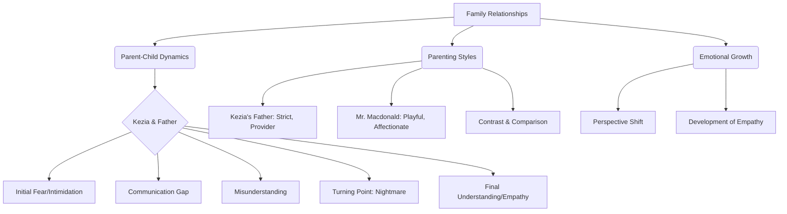

# Class 9 English - Beehive Chapter 103
**Language:** English

Okay, here is the NCERT summary for Beehive Chapter 3, "The Little Girl," following your specifications.

*Self-Correction Note: The provided text corresponds to Chapter 3, "The Little Girl," not Chapter 103. The summary has been prepared for Chapter 3.*

# [Class 9] Beehive - Chapter 3: The Little Girl (including the poem "Rain on the Roof")

## 🌟 Core Concepts

This chapter explores the complex dynamics of family relationships, focusing on a child's evolving perception of a parent.

1.  **Parent-Child Relationship (Father-Daughter Focus):**
    *   Initial Fear and Intimidation: Child's perspective of a strict, seemingly unaffectionate parent.
    *   Communication Gap: Lack of open dialogue leading to misunderstanding.
    *   Misinterpretation of Actions: Judging parental behaviour without understanding underlying reasons (e.g., fatigue, responsibility).
2.  **Emotional Development & Perspective Shift:**
    *   From Fear to Understanding: The journey of a child learning empathy.
    *   Influence of Observation: Comparing one's own family with others (Kezia observing the Macdonalds).
    *   Impact of Critical Incidents: How specific events (pin-cushion punishment, nightmare comfort) shape feelings.
3.  **Parenting Styles:**
    *   Authoritarian vs. Affectionate: Contrasting Kezia's father with Mr. Macdonald.
    *   Unexpressed Love: Recognizing that love can exist even without overt displays of affection.
    *   Parental Stress: Acknowledging the pressures and fatigue faced by working parents.

📊 **Concept Hierarchy:**



## 📘 Key Learnings

*   **Kezia's Initial Fear:** Kezia perceived her father as a giant figure to be feared due to his imposing size, loud voice, strict routine (morning kiss, evening demands for tea/paper/slippers), and critical nature (commenting on her stuttering, appearance). His Sunday routine involved resting, not interacting.
*   **The Pin-Cushion Incident:** Kezia's attempt to please her father by making a birthday gift backfired disastrously. She unknowingly used his important speech papers for stuffing. This led to severe punishment (beating with a ruler), reinforcing her fear and creating a lasting negative memory. This highlights the danger of actions without understanding context and the impact of harsh discipline.
*   **Contrast with the Macdonalds:** Observing Mr. Macdonald playing joyfully with his children made Kezia realize that "there were different sorts of fathers." This comparison provided an alternative model of fatherhood, deepening her feeling that her own father was harsh.
*   **The Turning Point - The Nightmare:** When Kezia had a nightmare while her mother and grandmother were away, her father unexpectedly provided comfort. He carried her to his bed, tucked her in, and stayed with her. This act of tenderness was crucial.
*   **Developing Empathy:** Lying beside her sleeping father, Kezia realized he was hardworking, tired, and perhaps lonely ("Poor Father... with no one to look after him"). She understood his "hardness" differently and felt sympathy, recognizing his vulnerability and the demands on him. Her final thought about his "big heart" signifies a profound shift from fear to understanding and affection.

📈 **Diagram: Kezia's Emotional Journey**

```mermaid
graph LR
    A[Fear & Avoidance] --> B(Misunderstanding: Pin-Cushion Incident);
    B --> C(Reinforced Fear & Punishment);
    C --> D(Observation: The Macdonalds - Contrast);
    D --> E(Realization: Different Fathers Exist);
    E --> F(Crisis: Nightmare & Solitude);
    F --> G(Father's Unexpected Comfort);
    G --> H(Empathy & Understanding: "Poor Father", "Big Heart");
```

## 🧩 Active Learning

*   **Activity: Research-based Case Study Analysis 🔍**
    *   **Topic:** Changing Father Roles in Urban India.
    *   **Task:** Research (using reliable online sources, interviews if possible) how the role and perception of fathers in Indian families have evolved over the last two generations. Consider factors like changing work patterns (longer hours, WFH), dual-income families, evolving social norms about masculinity and childcare. Present findings as a mini-case study (2-3 paragraphs), comparing the researched trends with Kezia's father's portrayal. *[Connects to Bloom's Creating/Evaluating, Bharatiya Context]*
*   **Discussion: Critical Analysis of Real-World Impacts 🌍**
    *   **Prompt 1 (Evaluating):** Was Kezia's father's reaction to the pin-cushion incident justified? Discuss the short-term and long-term effects of such punishment on a child's psyche and the parent-child relationship. Consider alternative ways he could have handled the situation.
    *   **Prompt 2 (Analyzing/Evaluating):** Kezia decides there are "different kinds of fathers." How might societal expectations, work pressure, and personality influence parenting styles, both in the story and in contemporary Indian society? Is one style definitively "better" than another?
    *   **Prompt 3 (Creating):** Based on Kezia's story, what practical steps can children and parents take to bridge communication gaps and foster mutual understanding within a family? Suggest specific communication strategies.

## 📝 Assessment Prep

*   **Case Studies & Analysis:**
    *   **Scenario:** A teenager feels their parent is overly strict about study time and screen usage, not allowing much social interaction. The parent works long hours in a high-pressure job and believes they are ensuring the child's future success. Analyze the perspectives of both the teenager and the parent. What misunderstandings might exist? How could they improve their relationship? *(Assesses understanding of perspective, communication, empathy)*
    *   Refer to the **Diagrams** (Concept Hierarchy, Kezia's Emotional Journey) provided above to understand character arcs and thematic development.
*   **Key Questions (Based on NCERT):**
    *   Why was Kezia initially afraid of her father? (Recall specific actions/descriptions)
    *   How did Kezia's grandmother try to bridge the gap between Kezia and her father?
    *   Explain the pin-cushion incident and its consequences.
    *   Compare and contrast Kezia's father and Mr. Macdonald.
    *   Describe the incident that led to Kezia's change in perception of her father. How did her feelings change? (Focus on the nightmare scene and her thoughts afterwards).
    *   Analyze the father's character: Was he intentionally cruel or simply undemonstrative and stressed? Justify with evidence. *(Requires Evaluation)*

## 🌏 Bharatiya Context

While the story is set elsewhere, its themes resonate strongly within the Indian context.

1.  **Role of Grandparents:** Kezia's grandmother plays a significant role as a buffer and mediator, encouraging interaction and providing comfort. This reflects the important role grandparents often play in joint families or even nuclear families in India, providing emotional support and sometimes bridging generational gaps between parents and children.
2.  **Traditional vs. Modern Parenting:** Kezia's father embodies aspects of a traditional patriarchal figure – the primary breadwinner, stern, expecting obedience, less involved in overt emotional expression or daily childcare. While this is changing, this figure is still recognizable in parts of Indian society. Mr. Macdonald represents a more modern, involved, and expressive style of fatherhood that is increasingly visible, especially in urban India.
3.  **Work Pressure and Family Time:** The father's fatigue ("too tired to be a Mr Macdonald") mirrors the reality for many parents in India facing demanding jobs and long commutes, particularly in cities. This pressure can impact the quality and quantity of time spent with children, sometimes leading to misunderstandings similar to Kezia's initial perception.
4.  **Emphasis on Discipline:** The father's strict reaction and punishment, while harsh, might be viewed by some through the lens of cultural emphasis on discipline, respect for elders, and the importance of safeguarding property/work, which are values sometimes stressed in Indian upbringing. However, the story encourages evaluating the *method* and *impact* of such discipline.

---

### **Poem: Rain on the Roof**

*   **Core Concepts:** The poem explores the themes of memory, the emotional impact of nature (specifically rain), comfort, and nostalgia, particularly focusing on maternal love.
*   **Key Learnings:** The sound of rain on the roof ("patter") triggers a cascade of memories ("recollections") and imaginative thoughts ("dreamy fancies") in the poet. The most prominent memory is of his mother tucking him and his siblings ("darling dreamers") into bed years ago. The rain's sound becomes a "refrain" that brings back the feeling of his mother's "fond look."
*   **Bharatiya Context:**
    *   **Significance of Rain:** Rain, especially the monsoon, holds immense cultural and emotional significance in India. While the poem depicts a cozy, personal experience, rain in India evokes diverse responses – relief from heat, agricultural prosperity, but also potential hardship (flooding, difficulty for the homeless – relating to NCERT Q II.3).
    *   **Mother's Love:** The theme of nostalgic remembrance of a mother's affection is universal and resonates deeply within the Indian cultural context, where the mother figure is often highly revered.