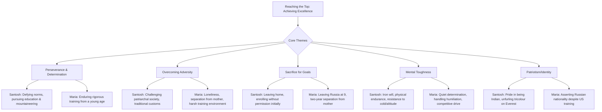

# Class 9 English - Beehive Chapter 107
**Language:** English

```markdown
# [Class 9] Beehive - Chapter 7: Reach for the Top

**Disclaimer:** The original request specified Chapter 107, which does not exist in the NCERT Class 9 Beehive textbook. This summary is based on the provided text content, which corresponds to **Unit 7: Reach for the Top (Parts I and II)**.

## 🌟 Core Concepts

This chapter explores the journeys of two remarkable women who achieved the pinnacle of success in their respective fields through determination, hard work, and resilience.

📊 **Concept Hierarchy:**



## 📘 Key Learnings

**Part I: Santosh Yadav - The Mountaineer**

1.  **Challenging Norms:** Santosh was born in Joniyawas, Haryana, in a society favouring sons. From a young age, she rejected traditional norms (like clothing) and insisted on living life on her own terms, believing in choosing a "correct and rational path."
2.  **Pursuit of Education:** Despite her affluent family adhering to local customs for schooling, Santosh fought for higher education. She threatened to never marry unless educated properly, enrolled herself in Delhi, and was prepared to work part-time, compelling her parents to support her.
3.  **Introduction to Mountaineering:** While studying in Jaipur (Maharani College, Kasturba Hostel), she saw villagers disappear into the Aravalli Hills. Curiosity led her to meet mountaineers, who encouraged her to take up climbing.
4.  **Dedication and Training:** She enrolled at the Nehru Institute of Mountaineering, Uttarkashi, even skipping going home after her semester ended late. She developed remarkable climbing skills, physical endurance, mental toughness, and resistance to harsh conditions.
5.  **Everest Achievements:**
    *   **1992:** Became the youngest woman in the world to scale Mt Everest at barely 20. Showed concern for fellow climbers, saving Mohan Singh by sharing oxygen, though unable to save another.
    *   **Within 12 months:** Scaled Everest a second time with an Indo-Nepalese Women's Expedition, becoming the *only woman* to have done so.
6.  **Recognition and Values:** Awarded the Padmashri. She describes the feeling atop Everest as "spiritual" and felt immense pride as an Indian. She is also a fervent environmentalist, bringing down 500 kg of garbage from the Himalayas.

📈 **Santosh Yadav's Journey:**
    *   Birth in traditional Haryana village -> Defying local customs -> Seeking higher education in Delhi & Jaipur -> Discovering mountaineering (Aravalli Hills) -> Training at Uttarkashi -> First Everest Summit (1992 - Youngest Woman) -> Second Everest Summit (Record: Only woman twice) -> Padmashri Award & Environmental Action.

**Part II: Maria Sharapova - The Tennis Star**

1.  **Early Sacrifice:** Maria was sent from Siberia, Russia, to Florida, USA, for tennis training before her 10th birthday. This required a "heart-wrenching" two-year separation from her mother Yelena due to visa restrictions. Her father Yuri worked hard to fund her training.
2.  **Hardships and Mental Toughness:** She faced loneliness and harsh treatment from older tennis pupils (being woken up to clean the room). Instead of getting depressed, she became more determined and mentally tough, learning self-care and focusing steadfastly on her dream. She believes coming from "nothing" made her "hungry and determined."
3.  **Rapid Ascent:** Within four years of turning professional, she reached the pinnacle of women's tennis. Her toughness was key to winning the Wimbledon women's singles title in 2004.
4.  **World No. 1:** Achieved the world number one position on 22 August 2005, barely eighteen years old.
5.  **Ambition and Motivation:** She is fiercely competitive and considers her sacrifices worthwhile. Her mantra is: "I work hard at what I do. It’s my job." While money is a motivation (tennis being a business), her primary dream was always to become number one in the world.
6.  **Identity and Interests:** Despite her American accent and US training, she proudly asserts her Russian nationality and citizenship. Her hobbies include fashion, singing, dancing, reading Arthur Conan Doyle, and enjoying pancakes and fizzy drinks.

📈 **Maria Sharapova's Journey:**
    *   Early life in Siberia -> Sent to USA for training (<10 yrs) -> Separation from mother -> Enduring loneliness & hardship -> Developing mental toughness -> Wimbledon Title (2004) -> World No. 1 Rank (2005) -> Global Tennis Stardom.

## 🧩 Active Learning

1.  **Activity: Comparative Case Study Analysis 🔍**
    *   Work in groups. Use the table provided in the textbook (Thinking about the Text section) to compare and contrast Santosh Yadav and Maria Sharapova based on:
        *   Humble beginnings (Consider societal context for Santosh, economic/geographical for Maria)
        *   Parents' approach (Initial resistance vs. supportive sacrifice)
        *   Willpower and desire to succeed (Specific examples from their stories)
        *   Evidence of mental toughness (How they handled specific challenges)
        *   Patriotism/National Identity (How they express connection to their country)
    *   *Research Extension:* Research one other female athlete or adventurer (Indian or international) and add them to your comparison.

2.  **Discussion: Critical Analysis of Real-World Impacts 🌍**
    *   Discuss the sacrifices involved in reaching the top. Were the sacrifices made by Santosh and Maria (and their families) justified by their achievements? Evaluate the "price" of excellence mentioned in Maria's story.
    *   Analyse the societal pressures faced by Santosh in India versus the competitive and isolating pressures faced by Maria in the US training system. How did their environments shape their paths?
    *   Evaluate the role of motivation: How did factors like personal ambition, national pride (Santosh), overcoming hardship (Maria), and financial rewards influence their journeys? Which motivations seem most powerful?

## 📝 Assessment Prep

Prepare for assessments by focusing on:

1.  **Character Analysis:**
    *   Describe Santosh Yadav's character using evidence from the text (e.g., determined, rational, adventurous, considerate, patriotic, environmentalist). Use the list provided in the textbook (Writing section II).
    *   Describe Maria Sharapova's key traits (e.g., determined, mentally tough, competitive, ambitious, focused, resilient).
2.  **Comparative Questions:** Be ready to compare and contrast the lives, challenges, motivations, and achievements of Santosh Yadav and Maria Sharapova. (Use the table from Active Learning).
3.  **Short Answer Questions:** Based on specific incidents and details:
    *   Why was the 'holy man' surprised? (Santosh)
    *   How did Santosh begin mountaineering?
    *   What incident shows Santosh's concern for fellow climbers? For the environment?
    *   Why was Maria sent to the US? Why didn't her mother accompany her?
    *   How did Maria cope with the difficult environment in the US training camp?
    *   What motivates Maria Sharapova?
4.  **Diagrams/Timelines:** Practice creating simple timelines or flowcharts summarizing the key milestones in each woman's journey to success.

## 🌏 Bharatiya Context

This chapter strongly highlights Indian context through the inspiring story of **Santosh Yadav**:

1.  **Social Fabric:** Her story begins in **Joniyawas village, Rewari District, Haryana**, depicting societal norms in rural India where daughters were traditionally not as welcomed as sons, and early marriage was common. Santosh's defiance of these norms (preferring shorts, insisting on education) showcases a struggle against patriarchal customs.
2.  **Educational Journey:** Her path through local school, then to Delhi, and finally Maharani College in Jaipur reflects educational aspirations and opportunities within India.
3.  **Indian Geography & Institutions:** The **Aravalli Hills** sparked her interest in mountaineering. Her formal training took place at **Uttarkashi’s Nehru Institute of Mountaineering**, a premier Indian institution.
4.  **National Pride & Recognition:** Santosh's achievement of scaling **Mt Everest** twice brought immense pride to India. Her act of unfurling the **Indian tricolour** on the summit is described as a "spiritual moment" and a moment of national pride. The Indian government recognized her unique achievement by bestowing upon her the **Padmashri**, one of the nation's highest civilian honours.
5.  **Environmental Consciousness:** Her action of collecting and bringing down 500 kgs of garbage from the **Himalayas** reflects a growing environmental awareness and responsibility relevant to India's ecological challenges.
6.  **Inspiration:** Santosh Yadav serves as a powerful role model, particularly for girls in India, demonstrating that determination can overcome societal and economic barriers. Her story resonates with the theme of 'reaching for the top' within an Indian context.
```