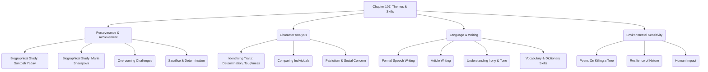

# Class 9 English - Beehive Chapter 107
**Language:** English

```markdown
# [Class 9] Beehive - Chapter 107: Reach for the Top & On Killing a Tree

## 🌟 Core Concepts

This chapter explores themes of **Perseverance, Ambition, and Achievement against Adversity** through biographical accounts and reflective poetry.

1.  **Biographical Narratives:**
    *   Understanding life stories of individuals who achieved extraordinary success.
    *   Identifying key factors contributing to success (determination, hard work, sacrifice).
    *   Analyzing character traits through actions and choices.
2.  **Overcoming Societal & Personal Challenges:**
    *   Examining how individuals challenge traditional norms and expectations (e.g., gender roles, early marriage).
    *   Understanding the role of personal sacrifice and resilience in achieving goals (e.g., separation from family, financial struggles, rigorous training).
3.  **Character Analysis:**
    *   Evaluating qualities like determination, mental toughness, physical endurance, patriotism, and concern for others/environment.
4.  **Language and Writing Skills:**
    *   **Formal Speech:** Structure, use of rhetorical devices (balance, imagery), anecdotes.
    *   **Article Writing:** Structure, contemporary language, adherence to word limits.
    *   **Figurative Language & Tone:** Understanding irony, descriptive language in travelogues and poetry.
    *   **Vocabulary & Dictionary Use:** Identifying word meanings based on context and parts of speech.
5.  **Environmental Sensitivity:**
    *   Reflecting on human impact on nature.
    *   Understanding the resilience and life force of nature (symbolized by the tree).

📊 **Concept Hierarchy:**



## 📘 Key Learnings

1.  **Santosh Yadav: Reaching the Summit Against Odds**
    *   **Background:** Born in Joniyawas, Rewari (Haryana), in a traditional society favouring sons. Her family was affluent but followed local customs initially.
    *   **Early Defiance:** Rejected traditional attire (wore shorts), insisted on proper education over early marriage, threatened parents to secure schooling in Delhi, and later Jaipur.
    *   **Path to Mountaineering:** Discovered mountaineering watching villagers on the Aravalli Hills from Kasturba Hostel, Jaipur. Enrolled in Nehru Institute of Mountaineering, Uttarkashi, demonstrating determination by going straight from college exams.
    *   **Achievements:**
        *   Scaled Mt. Everest in 1992 (at barely 20), becoming the youngest woman in the world to do so.
        *   Scaled Mt. Everest a second time within 12 months as part of an Indo-Nepalese Women's Expedition, becoming the *only* woman to have climbed it twice.
    *   **Character:** Possesses an iron will, physical endurance, amazing mental toughness, concern for fellow climbers (saved Mohan Singh), patriotism (unfurled Indian tricolour on Everest), and environmental consciousness (collected 500 kg garbage from Himalayas).
    *   **Recognition:** Awarded the Padma Shri by the Indian government.
    📈 **Diagram: Santosh Yadav's Journey**
    ```mermaid
    graph LR
        A[Birth in Haryana Village] --> B(Defies Tradition: Education over Marriage);
        B --> C(Schooling: Delhi & Jaipur);
        C --> D(Discovers Mountaineering: Aravalli Hills);
        D --> E(Training: Uttarkashi);
        E --> F(First Everest Summit: 1992 - Youngest Woman);
        F --> G(Second Everest Summit: 1993 - Only Woman Twice);
        G --> H(Recognition: Padma Shri & National Pride);
        style F fill:#f9d,stroke:#333,stroke-width:2px
        style G fill:#f9d,stroke:#333,stroke-width:2px
        style H fill:#ccf,stroke:#333,stroke-width:2px
    ```

2.  **Maria Sharapova: Tennis Pinnacle Through Sacrifice**
    *   **Background:** Born in Siberia, Russia.
    *   **Early Sacrifice:** Sent to the United States for tennis training before age 10, accompanied only by her father (Yuri). Separated from her mother (Yelena) for two years due to visa restrictions.
    *   **Hardships & Resilience:** Faced loneliness, financial constraints (father worked hard), and difficult conditions (being woken up by older pupils to clean the room). Instead of quitting, she became more determined and mentally tough.
    *   **Achievements:**
        *   Reached the World No. 1 position in women's tennis in August 2005, just four years after turning professional.
        *   Won the women's singles title at Wimbledon in 2004.
    *   **Character:** Fiercely competitive, hardworking ("It's my job"), mentally tough, unwavering desire to succeed, acknowledges sacrifices were necessary. Proudly maintains her Russian identity despite living in the U.S.
    *   **Motivation:** Driven by the desire to be number one, acknowledging money as a secondary motivation in the business of sport.

3.  **Poem: "On Killing a Tree" (Gieve Patel)**
    *   **Central Idea:** Killing a tree is a difficult and deliberate act, not accomplished by a simple cut ("jab").
    *   **Tree's Resilience:** The poem details how a tree grows, drawing sustenance from the earth, sun, air, and water. Even after being hacked ("hack and chop"), its "bleeding bark" will heal, and new growth ("curled green twigs") will emerge if unchecked.
    *   **The Act of Killing:** True killing requires uprooting the tree entirely ("pulled out — / Out of the anchoring earth"), exposing its hidden strength and life source (the "white and wet" root).
    *   **Final Destruction:** The process is completed only after the uprooted tree undergoes "scorching and choking / In sun and air," leading to browning, hardening, twisting, and withering.
    *   **Metaphorical Interpretation:** Can be seen as a metaphor for eradicating deep-rooted problems or habits, which require more than superficial efforts.

4.  **Developing Language Skills:**
    *   **Speeches:** Require meticulous preparation, formal language, rhetorical devices (like balance and imagery, e.g., Nehru's "Tryst with Destiny" or Kennedy's quote), examples, and anecdotes to be powerful.
    *   **Articles:** Should use everyday, contemporary language and adhere to specified word limits.
    *   **Identifying Clauses:** Understanding sentence structure, particularly clauses that indicate time (`when`, `ever since`), contrast (`where`), or sequence (`and`).
    *   **Dictionary Use:** Utilizing 'signposts' like parts of speech (noun, verb, adjective) to find the correct meaning of a word in context.

## 🧩 Active Learning

1.  **Activity: Research & Idol Analysis** 🔍
    *   **Task:** Following the pre-reading prompt for Part I, research one person you admire (from sports, arts, science, social work, etc., especially from India). Create a brief profile highlighting their background, challenges faced, key achievements, and the character traits that led to their success.
    *   **Outcome:** Develops research skills and analytical thinking about the ingredients of success, applying concepts from the chapter to new examples.

2.  **Discussion: Comparing Paths to Success** 🌍
    *   **Task:** In groups, discuss and compare the journeys of Santosh Yadav and Maria Sharapova using the table provided in the textbook (Thinking about the Text). Focus on:
        *   Similarities in determination and mental toughness.
        *   Differences in background (rural India vs. Siberia/US), nature of challenges (societal norms vs. displacement/loneliness), and expressions of patriotism.
        *   Evaluate the sacrifices made by both. Was the price of success similar or different?
    *   **Outcome:** Encourages critical analysis, comparative evaluation, and articulation of opinions based on textual evidence.

3.  **Creative Task: Speech Writing** 🎤
    *   **Task:** As suggested in the 'Speaking' section, prepare and deliver a short motivational speech (2-3 minutes) as either Santosh Yadav or Maria Sharapova, addressing young athletes. Use some of the suggested phrases (self-confidence, boost morale, etc.) and incorporate elements of formal speech discussed (e.g., a brief anecdote or powerful statement).
    *   **Outcome:** Practices formal spoken language, persuasive communication, and creative role-playing based on character understanding.

## 📝 Assessment Prep

1.  **Case Study Analysis (Santosh Yadav):**
    *   **Scenario:** Analyze Santosh Yadav's decision to pursue mountaineering despite her background and initial lack of family support.
    *   **Questions:**
        *   What specific societal pressures did Santosh overcome? (Bloom's: Understanding)
        *   Evaluate the key character traits that enabled her success. Provide textual evidence. (Bloom's: Evaluating)
        *   How did her actions demonstrate both personal ambition and national pride? (Bloom's: Analyzing)
    *   **Diagram:** Use the journey diagram provided above or create a timeline of key decisions and turning points.

2.  **Comparative Essay Prompt:**
    *   **Task:** Write an essay comparing and contrasting the sources of motivation and the types of challenges faced by Santosh Yadav and Maria Sharapova on their path to becoming world-renowned figures in their respective fields. (Bloom's: Analyzing/Evaluating)

3.  **Poem Interpretation:**
    *   **Task:** Explain the process of "killing a tree" as described by Gieve Patel. What deeper meaning or message might the poet be conveying about resilience and destruction? (Bloom's: Analyzing/Interpreting)
    *   **Diagram:** Create a flowchart illustrating the steps needed to kill the tree according to the poem, contrasting ineffective vs. effective actions.
    ```mermaid
    graph TD
        subgraph Ineffective Actions
            A[Simple Jab of Knife] --> B(Does Not Kill);
            C[Hack and Chop] --> D(Pain, Bleeding Bark);
            D --> E(Bark Heals);
            E --> F(New Twigs Sprout);
        end
        subgraph Effective Killing Process
            G[Uproot Completely] --> H(Pull out from Anchoring Earth);
            H --> I(Expose the Root - Strength Source);
            I --> J(Scorching & Choking in Sun/Air);
            J --> K(Browning, Hardening, Twisting, Withering);
            K --> L(Tree is Killed);
        end
        style G fill:#f99,stroke:#333,stroke-width:2px
        style L fill:#f99,stroke:#333,stroke-width:2px
    ```

4.  **Language Application:**
    *   Combine pairs of sentences using appropriate conjunctions (when, and, because, etc.), focusing on conveying time, contrast, or cause-effect relationships. (Practice based on 'Thinking about Language' exercises).

## 🌏 Bharatiya Context

1.  **Santosh Yadav - An Indian Icon:** Her story is deeply rooted in the Indian context – born in rural Haryana, challenging patriarchal norms prevalent in parts of Indian society, studying in Indian institutions (Delhi, Jaipur, Uttarkashi), climbing in the Himalayas (Aravalli, Everest), receiving a top national honour (Padma Shri), and expressing profound patriotism upon reaching the summit ("I felt proud as an Indian," unfurling the tricolour).
2.  **Social Norms & Change:** Santosh's struggle against early marriage and for education reflects social challenges and reforms ongoing in India. Her success serves as an inspiration, particularly for girls in similar situations.
3.  **National Pride & Achievement:** Reaching the "top of the world" (Mt. Everest) is a significant feat celebrated nationally. Santosh securing a unique place for India "in the annals of mountaineering" highlights the importance of individual achievement contributing to national prestige.
4.  **Environmentalism in the Himalayas:** Santosh's act of bringing down 500 kg of garbage from the Himalayas connects to the specific environmental challenges faced in the ecologically sensitive Indian Himalayan region.
5.  **Cultural References:** Mention of Nehru's 'Tryst with Destiny' speech provides a significant historical and cultural reference point for understanding powerful oratory in the Indian context. The Aravalli Range is a specific geographical feature in India.
```