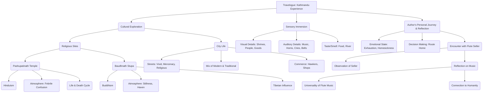

# Class 9 English - Beehive Chapter 108
**Language:** English

```markdown
# [Class 9] Beehive - Chapter 8: Kathmandu

*(Note: The provided text corresponds to Chapter 8, "Kathmandu", not Chapter 108)*

## 🌟 Core Concepts

This chapter, an excerpt from Vikram Seth's travelogue "Heaven Lake," focuses on the author's sensory and reflective experiences in Kathmandu. The core concepts revolve around:

1.  **Travel Writing:** Capturing personal experiences, observations, and reflections during a journey.
2.  **Cultural Observation:** Describing and contrasting different cultural and religious atmospheres (Hinduism vs. Buddhism).
3.  **Sensory Description:** Using vivid language to appeal to sight, sound, smell, and taste, immersing the reader in the location.
4.  **Juxtaposition:** Contrasting elements like chaos vs. serenity, sacred vs. commercial, ancient vs. modern.
5.  **Personal Reflection:** Exploring the author's feelings (exhaustion, homesickness) and deeper thoughts triggered by experiences (e.g., flute music).
6.  **Universality vs. Particularity:** Finding common human experiences (like music) within specific cultural contexts.

📊 **Concept Hierarchy:**



## 📘 Key Learnings

1.  **Contrasting Sacred Spaces:**
    *   **Pashupatinath Temple:** A principal Hindu site characterised by "febrile confusion." The author observes a chaotic mix of priests, devotees, hawkers, tourists, and animals. Rituals like offerings and cremation occur alongside everyday activities (washerwomen, children bathing) by the holy Bagmati river. Access is restricted to Hindus, highlighting religious boundaries. The atmosphere is intense and bustling.
    *   **Baudhnath Stupa:** A major Buddhist shrine offering a stark contrast with its "sense of stillness." The immense white dome creates a feeling of peace. The surrounding area has shops, many run by Tibetan immigrants, but lacks the overwhelming crowds of Pashupatinath, serving as a "haven of quietness."
    *   📈 **Comparison Diagram:**

        | Feature         | Pashupatinath Temple        | Baudhnath Stupa              |
        | :-------------- | :-------------------------- | :--------------------------- |
        | **Religion**    | Hinduism                    | Buddhism                     |
        | **Atmosphere**  | Febrile confusion, chaotic  | Stillness, quiet, serene     |
        | **Crowds**      | Many worshippers, tourists  | No crowds, peaceful          |
        | **Activities**  | Worship, rituals, cremation | Circumambulation, quiet trade|
        | **Commerce**    | Hawkers                     | Small shops (Tibetan goods)  |
        | **Access**      | Hindus only                 | Open                         |
        | **Key Feature** | River Bagmati, Shivalinga   | Immense white dome           |

2.  **Kathmandu's Vibrant Streets:**
    *   The author describes the city as "vivid, mercenary, religious."
    *   **Sensory Overload:** Narrow, busy streets filled with small shrines, fruit sellers, flute sellers, hawkers, shops selling diverse goods (cosmetics, film rolls, antiques, copper utensils).
    *   **Sounds:** A cacophony of film songs, car horns, bicycle bells, stray cows lowing, vendors shouting.
    *   **Author's Indulgence:** Buying street food (corn-on-the-cob), comics, drinks – immersing himself in the local street life.
    *   📈 **Mind Map: Kathmandu Streets**
        *   **Center:** Kathmandu Streets
        *   **Branches:**
            *   **Sights:** Small shrines, flower-adorned deities, fruit sellers, flute sellers, hawkers (postcards), shops (cosmetics, film rolls, chocolate, copper utensils, antiques), narrow/busy layout.
            *   **Sounds:** Film songs (radios), car horns, bicycle bells, stray cows lowing, vendors shouting.
            *   **Atmosphere:** Vivid, Mercenary, Religious, Busy.
            *   **Author's Actions:** Buys marzipan, corn-on-the-cob, comics, Coca Cola, orange drink.

3.  **The Flute Seller and Universality of Music:**
    *   The flute seller stands apart from other hawkers. He plays "slowly, meditatively," not shouting his wares, selling occasionally in an "offhanded way."
    *   His pole with protruding flutes resembles "the quills of a porcupine."
    *   The author is deeply affected by the flute music, finding it both "universal" and "particular."
    *   **Reflection:** Seth contemplates how every culture has its flute (reed neh, recorder, shakuhachi, bansuri, etc.). Hearing any flute connects him to the "commonality of all mankind," as music, especially flute music, is close to the human voice and powered by "living breath."

4.  **Author's Personal State and Decision:**
    *   Despite potential enthusiasm for a longer journey via Patna, Varanasi, Allahabad, Agra, the author feels "too exhausted and homesick."
    *   He decides to take the most direct route home, buying a plane ticket for the next day, prioritizing comfort and return over further adventure.

5.  **Narrative Technique:**
    *   The use of the **Simple Present Tense** (e.g., "A fight breaks out," "Film songs blare out") makes the descriptions immediate and dramatic, bringing the scenes to life for the reader as if happening now.

## 🧩 Active Learning

*   **Activity: Research-based Case Study Analysis 🔍**
    *   **Task:** Choose one Indian holy city/site mentioned in the "Before You Read" section (e.g., Varanasi, Madurai, Ajmer Sharif) or another significant one (e.g., Haridwar, Amritsar's Golden Temple). Research its atmosphere, the types of activities that occur there (religious and secular), the presence of commerce, and any specific rules or customs.
    *   **Analysis:** Create a comparative analysis (using a table or short essay) contrasting your chosen site with Vikram Seth's descriptions of Pashupatinath and Baudhnath. Evaluate the similarities and differences in how spirituality, daily life, and commerce intersect in these sacred spaces. (Bloom's: Evaluating)

*   **Discussion: Critical Analysis of Real-World Impacts 🌍**
    *   **Prompt 1:** Discuss the scene with the "saffron-clad Westerners" struggling for entry at Pashupatinath. What issues related to tourism, cultural appropriation, and religious boundaries does this highlight? How should access to sacred sites be managed in a globalized world?
    *   **Prompt 2:** Seth describes Kathmandu as "vivid, mercenary, religious." Analyse this blend. Is the presence of commerce ("mercenary" aspects like hawkers, shops) near holy sites a necessary part of the ecosystem, a distraction, or something else? Compare this with experiences in Indian pilgrimage centres. How does this blend impact the spiritual experience? (Bloom's: Evaluating/Analyzing)

## 📝 Assessment Prep

*   **Case Studies & Diagrams:**
    *   **Case Study 1: Contrasting Atmospheres:** Be prepared to compare and contrast the atmosphere, sights, sounds, and activities in and around Pashupatinath Temple and Baudhnath Stupa, using specific details from the text. (Use the comparison table 📈 above for revision).
    *   **Case Study 2: Sensory Description:** Analyse how Vikram Seth uses sensory details (sight, sound, etc.) to create a vivid picture of Kathmandu's streets. Identify specific examples for each sense. (Use the mind map 📈 above for revision).
*   **Key Questions (Based on NCERT Exercises & Bloom's Taxonomy):**
    *   Describe the "febrile confusion" at Pashupatinath temple, providing examples. (Understanding/Applying)
    *   Explain the sense of "stillness" at Baudhnath stupa. (Understanding/Applying)
    *   How does the flute seller differ from other hawkers? What deeper reflections does he inspire in the author? (Analyzing)
    *   Why does the author say, "To hear any flute is...to be drawn into the commonality of all mankind"? Explain this statement in the context of the chapter. (Analyzing/Evaluating)
    *   Evaluate the author's decision to fly home directly. What does this reveal about his state of mind? (Evaluating)
    *   Analyse the effectiveness of using the simple present tense in the narrative. (Analyzing)

## 🌏 Bharatiya Context

1.  **Comparison with Indian Holy Sites:** The descriptions of Pashupatinath (chaotic, riverbank rituals, restricted entry) resonate strongly with Hindu pilgrimage sites in India like **Varanasi** (Ganges ghats, cremations, bustling activity) or **Haridwar**. The mix of devotion, commerce, and everyday life is a common feature. Baudhnath's serenity might be compared to Buddhist sites in India like **Sanchi** or **Sarnath**, or the peaceful atmosphere within the main sanctums of large South Indian temples like those in **Madurai** (despite busy surroundings).
2.  **The Bansuri and Indian Music:** The author specifically mentions the *bansuri*, the deep flute of **Hindustani classical music**. This directly connects the narrative to a significant Indian cultural and musical tradition, deeply embedded in Indian arts and mythology (associated with Lord Krishna). Seth's reflection on its sound evokes the rich heritage of Indian classical music.
3.  **Urban India Parallels:** The description of Kathmandu's busy streets—with their mix of traffic (cars, bicycles), vendors, diverse shops (selling traditional antiques and modern cosmetics), shrines, and noise—mirrors the vibrant, often chaotic, urban landscape found in many Indian cities, such as the old quarters of **Delhi (Chandni Chowk)**, **Kolkata**, or **Mumbai**. The blend of traditional and modern elements is a shared characteristic.
4.  **Religious Tourism Economy:** While not explicitly detailed, the presence of tourists, hawkers, and shops points to the economic dimension of religious sites. This is highly relevant in India, where pilgrimage tourism is a major economic activity around sites like **Tirupati**, **Vaishno Devi**, **Ajmer Sharif**, and others, supporting livelihoods but also posing challenges for infrastructure and preservation. The text provides a glimpse into this socio-economic aspect common to both Nepal and India.
```