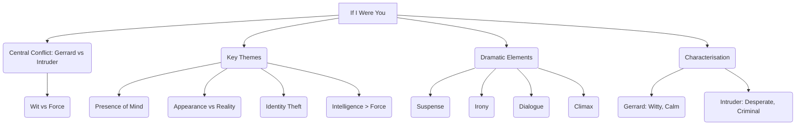
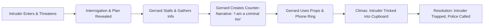

# Class 9 English - Beehive Chapter 109
**Language:** English

Okay, here is the NCERT summary for Class 9 English, Beehive Chapter 109 ("If I Were You"), adhering to your specifications.

# [Class 9] Beehive - Chapter 109: If I Were You

## 🌟 Core Concepts

This play explores themes of identity, intelligence, and survival through a tense encounter. The core concepts can be structured as follows:

1.  **Central Conflict:** Man vs. Man
    *   Gerrard (Protagonist) vs. Intruder (Antagonist)
    *   Battle of Wits vs. Brute Force
2.  **Key Themes:**
    *   **Presence of Mind:** Gerrard's ability to stay calm and think quickly under threat.
    *   **Appearance vs. Reality:**
        *   Gerrard's mysterious persona vs. his actual profession (playwright).
        *   Intruder's attempt to adopt Gerrard's identity.
        *   Gerrard's fabricated criminal identity.
    *   **Identity:** The Intruder's desire to steal an identity to escape his past.
    *   **Intelligence Overcoming Force:** How Gerrard outsmarts the armed Intruder.
3.  **Dramatic Elements:**
    *   **Suspense:** Built through the Intruder's threats and Gerrard's unpredictable responses.
    *   **Irony:** Heavily used by Gerrard to mask fear and control the situation.
    *   **Dialogue:** Drives the plot and reveals character.
    *   **Climax:** Gerrard tricking the Intruder into the cupboard.
4.  **Characterisation:**
    *   **Gerrard:** Cultured, witty, intelligent, observant, calm, resourceful.
    *   **Intruder:** Criminal, desperate, boastful, less intelligent, easily manipulated despite being armed.

📊 **Concept Hierarchy:**

## 📘 Key Learnings

This play teaches valuable lessons about handling difficult situations and the power of intellect.

1.  **The Power of Calmness and Wit:** Gerrard's primary strength is his ability to remain calm ("nonchalant") even with a gun pointed at him. He uses humour and irony ("At last a sympathetic audience!") not just to stall, but to subtly gain psychological advantage and gather information. This contrasts sharply with the Intruder's reliance on threats and physical force.
2.  **Exploiting Assumptions (Appearance vs. Reality):** The Intruder assumes Gerrard is merely a well-to-do, slightly eccentric person living alone. Gerrard cleverly uses his existing mysterious reputation ("queer," "mystery man") and builds upon it, fabricating a story of being a fellow criminal on the run. This plays on the Intruder's assumptions and makes the lie believable.
3.  **Strategic Deception:** Gerrard doesn't just panic; he formulates a plan.
    *   He gathers information about the Intruder's motives (escape after killing a cop).
    *   He creates a plausible counter-narrative (he's also a criminal expecting trouble).
    *   He uses props (packed bag, disguise kit) and external events (telephone ringing) to support his story.
    *   He engineers the climax by offering a fake escape route (the cupboard).
4.  **Understanding Irony:** The play is rich in irony, primarily used by Gerrard. Recognizing irony is key to understanding his character and strategy.
    *   *"Why, this is a surprise, Mr— er—"* (Meaning: This is a shocking and unwelcome intrusion.)
    *   *"You seem to have taken a considerable amount of trouble."* (Meaning: You've been spying on me, which is alarming.)
    *   *"You have been so modest."* (Meaning: You've been boastful and threatening, not modest at all.)
5.  **Plot Structure and Climax:** The play follows a clear structure leading to a satisfying climax where intelligence triumphs.

📈 **Plot Progression Diagram (Conceptual):**

📊 **Character Comparison:**

| Feature         | Gerrard                                    | Intruder                                     |
| :-------------- | :----------------------------------------- | :------------------------------------------- |
| **Demeanour**   | Calm, Cultured, Witty, Nonchalant          | Tense, Aggressive, Boastful, Anxious         |
| **Intelligence**| High, Strategic Thinker, Observant         | Cunning but easily fooled, Overconfident     |
| **Motivation**  | Survival, Protecting himself             | Escape from law, Identity theft, Survival    |
| **Method**      | Intellect, Deception, Psychological play   | Threats, Physical force (gun), Intimidation |
| **Speech**      | Sophisticated, Ironic                      | Colloquial, Direct, Threatening              |
| **Weakness**    | Initial vulnerability (alone, surprised) | Gullibility, Overconfidence, Desperation     |

## 🧩 Active Learning

*   **Activity: Research-based Case Study Analysis 🔍**
    *   **Objective:** Evaluate the effectiveness of Gerrard's strategy.
    *   **Task:** Treat Gerrard's handling of the Intruder as a case study in crisis management and psychological manipulation.
        1.  Identify each step Gerrard took after the Intruder revealed his plan to kill him.
        2.  Analyse *why* each step was effective (or potentially risky). Consider the Intruder's psychology (desperate, hunted, looking for an escape).
        3.  Evaluate the specific elements of Gerrard's fabricated story (being a fellow criminal, expecting police, disguise kit, man on the road). How did these elements contribute to deceiving the Intruder?
        4.  Could Gerrard have used a different strategy? Discuss potential alternatives and their likely outcomes. (Bloom's Level: Evaluating)
        5.  **Create:** Write a brief report summarizing your analysis, concluding with the key factors that led to Gerrard's success. (Bloom's Level: Creating)

*   **Discussion: Critical Analysis of Real-World Impacts 🌍**
    *   **Objective:** Connect the play's themes to contemporary issues and personal safety.
    *   **Prompts:**
        1.  The Intruder planned identity theft. How is identity theft a problem in the real world today, especially with digital technology? Discuss its potential consequences.
        2.  Gerrard used his wit and calmness to overcome a physically dangerous situation. Can presence of mind be developed? Discuss real-life scenarios (e.g., emergencies, unexpected confrontations) where staying calm and thinking clearly is crucial.
        3.  The play highlights how appearances can be deceiving. How does this theme relate to judging people in real life or trusting information encountered online? Why is critical thinking important?
        4.  Gerrard lived in a "lonely cottage." Discuss the potential vulnerabilities and advantages of living in isolated versus populated areas, considering personal safety.

## 📝 Assessment Prep

Focus on questions requiring analysis, evaluation, and understanding of literary techniques.

*   **Character Analysis:** Be prepared to contrast Gerrard and the Intruder, citing specific dialogues and actions to support your points. Evaluate Gerrard's intelligence and the Intruder's folly.
    *   *Example:* "Evaluate Gerrard's claim that he was 'luckier than most melodramatic villains'. Was it luck, or calculated intelligence?"
*   **Theme Exploration:** Explain themes like 'Appearance vs. Reality' or 'Presence of Mind' using evidence from the play.
    *   *Example:* "How does the play demonstrate that intelligence is more powerful than brute force?"
*   **Plot Analysis:** Understand the sequence of events, especially how Gerrard turned the tables. Be ready to explain the significance of key moments (e.g., the phone call, the reveal of the 'disguise kit', the cupboard trick).
*   **Literary Devices:** Identify and explain the use of irony and suspense. Analyse key ironic statements by Gerrard and explain their underlying meaning.
    *   *Example:* "Analyse the dramatic significance of Gerrard's line, 'This is your big surprise,' when he reveals his own 'criminal' identity."
*   **Case Studies & Diagrams:** Use the character comparison table and plot progression understanding (as shown above) to structure answers about character contrast and plot development. 📝

## 🌏 Bharatiya Context

While the play is set in Essex, England, its themes resonate universally and can be viewed through an Indian lens:

1.  **Presence of Mind in Folklore and Reality:** Gerrard's quick thinking echoes the celebrated wit of figures in Indian folklore like **Birbal** (advisor to Emperor Akbar) or **Tenali Raman** (poet in the court of Krishnadevaraya), who often solved problems using intelligence rather than force. This highlights a culturally valued trait.
2.  **Identity and Verification in Modern India:** The Intruder's plan to steal Gerrard's identity mirrors concerns in contemporary India regarding identity theft. With the widespread use of **Aadhaar** and digital transactions, verifying identity and protecting personal data are critical issues. The play serves as a cautionary tale about the potential dangers and the need for vigilance, relevant in a rapidly digitizing India. 📊 (While not economic data, this relates to national systems and social data security).
3.  **Appearance vs. Reality in a Diverse Society:** India's diverse society often involves navigating complex social cues and appearances. Gerrard's ability to project a false persona and the Intruder's misjudgment based on appearances touch upon the importance of looking beyond superficialities. This is pertinent in social interactions and in evaluating information, especially in the age of social media where curated appearances can be misleading – a significant issue in urban and rural India alike.
4.  **Resourcefulness (Jugaad):** While Gerrard's actions are more calculated than typical 'jugaad' (improvisational problem-solving common in India), his resourcefulness in using available elements (props, phone, his own reputation) to create a solution under pressure shares a similar spirit of innovative thinking to overcome constraints.