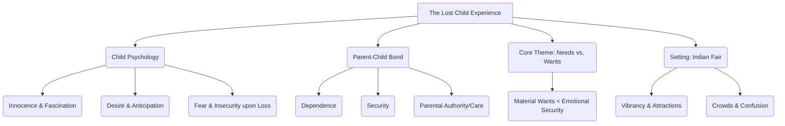

# Class 9 English - Moments Supplementry Chapter 101
**Language:** English

Okay, here is the NCERT-aligned summary for "The Lost Child" (typically Chapter 1 of the Moments supplementary reader, presented here as Chapter 101 per your request), following the specified structure and rules.

```markdown
# [Class 9] Moments Supplementry - Chapter 101: The Lost Child

## 🌟 Core Concepts

This chapter explores fundamental human emotions and relationships through the experience of a young child at a fair. The core concepts can be hierarchically understood as:

1.  **Child Psychology**
    *   **Innocence and Fascination:** The child's initial state of wonder and attraction towards the vibrant environment of the fair.
        *   Sensory Appeal: Attraction to colours, sounds, smells (toys, flowers, sweets, music).
        *   Fleeting Interests: Easily distracted by new stimuli (dragonflies, petals, doves).
    *   **Desire vs. Anticipation:** The conflict between wanting material objects and knowing/expecting parental refusal.
    *   **Fear and Insecurity:** The overwhelming panic and distress upon separation from parents.
        *   Loss of Security: Realisation that parents are the ultimate source of safety.
        *   Emotional Turmoil: Manifestation of fear through crying, running frantically, confusion.
2.  **Parent-Child Relationship**
    *   **Dependence:** The child's complete reliance on parents for guidance and security.
    *   **Security:** The sense of safety and well-being derived solely from parental presence.
    *   **Parental Authority & Care:** Implied parental control (refusals) possibly stemming from economic constraints, discipline, or safety concerns, alongside underlying care (distractions, holding finger).
3.  **Thematic Exploration**
    *   **Materialism vs. Emotional Needs:** The story contrasts the child's desire for tangible things (toys, sweets) with his fundamental need for love and security (parents). It highlights that emotional security supersedes material desires in moments of crisis.
    *   **Loss and Rediscovery of Priorities:** The experience of getting lost forces a profound shift in the child's priorities.
4.  **Setting and Atmosphere**
    *   **The Indian Village Fair (Mela):** Depiction of a traditional fair as a microcosm of life – full of attractions, crowds, and potential dangers.

📊 **Concept Hierarchy:**



## 📘 Key Learnings

This story provides deep insights into human nature, particularly the psychology of a child and the fundamental need for security.

1.  **The Nature of Childhood Desire:**
    *   The child is initially captivated by the sensory richness of the fair – colourful toys, sweets, balloons, garlands, music.
    *   His desires are immediate but often tempered by the knowledge of his parents' likely refusal ("the old, cold stare of refusal"). He murmurs his wants but moves on without waiting for an answer, showing an understanding of limitations or past experiences.
    *   *Diagrammatic Representation (Flowchart):*
        ```mermaid
        graph LR
            See[Child Sees Attraction <br/>(e.g., Toy, Sweet)] --> Want{Desire Awakens};
            Want --> Anticipate(Anticipates Parental Refusal);
            Anticipate --> Suppress(Suppresses Desire / Moves On);
            See --> Distracted(Gets Distracted by New Stimulus);
            Distracted --> See;
        ```

2.  **The Overwhelming Power of Fear and Loss:**
    *   The turning point occurs when the child realizes he is separated from his parents while engrossed in the roundabout.
    *   His previous fascinations vanish instantly. The vibrant fair transforms into a confusing, terrifying place.
    *   His reaction is visceral: a "full, deep cry," frantic running ("hither and thither"), physical signs of distress (flushed face, tears, muddy clothes, untied turban). This demonstrates the primal fear of abandonment.

3.  **The Primacy of Parental Security:**
    *   A kind stranger finds the lost child and, attempting to console him, offers all the things the child had previously desired: a ride on the roundabout, the snake charmer's music, colourful balloons, a garland, and sweets.
    *   Crucially, the child rejects *all* these offers vehemently. His only plea is, "I want my mother, I want my father!"
    *   *Key Insight:* This starkly illustrates that the child's earlier desires were conditional upon the security provided by his parents' presence. Without them, those objects hold no value; his only need is reunification and the restoration of safety.
    *   *Visual Metaphor (Needs Pyramid):*
        ```
           / \
          /   \  <-- Material Wants (Toys, Sweets) - Desired only when base is secure
         /_____\
        /       \
       /_________\ <-- **Parental Presence & Security (Fundamental Need)**
      ```

4.  **Implied Social Commentary:**
    *   The story subtly touches upon potential economic constraints (parents refusing "cheap" flowers or thinking the child is "greedy" for sweets) and the overwhelming nature of large crowds in public spaces. The description of the dense crowd near the shrine highlights potential dangers.

## 🧩 Active Learning

1.  **Activity: Emotional Journey Mapping 🔍**
    *   **Task:** Trace the child's dominant emotions throughout the story. Create a timeline or a graph plotting his emotional state (e.g., Happiness, Fascination, Hesitation, Fear, Desperation) against key events (entering the fair, seeing toys, seeing mustard field, wanting roundabout ride, realizing parents are lost, encountering the kind man).
    *   **Objective:** To analyze the character's psychological arc and understand the triggers for his emotional shifts. (Bloom's Level: Analyzing)

2.  **Discussion: Evaluating Choices and Motivations 🌍**
    *   **Prompt 1:** Why do you think the parents consistently refused or ignored the child's requests earlier in the story? Discuss possible reasons (economic, disciplinary, safety, distraction). Were their actions justified from their perspective?
    *   **Prompt 2:** Evaluate the kind man's actions. Were his attempts to soothe the child appropriate? Why did they fail? What does this reveal about the child's state of mind?
    *   **Prompt 3 (Creating):** If you were the kind man, what alternative approach might you have taken to help the child, knowing his only desire was his parents?
    *   **Objective:** To critically analyze character motivations, evaluate actions based on context, and propose creative solutions. (Bloom's Level: Evaluating, Creating)

## 📝 Assessment Prep

Prepare for assessments by focusing on analysis, interpretation, and application of the story's themes.

1.  **Case Study Analysis:**
    *   **Scenario:** Imagine a modern-day scenario where a child gets separated from parents in a crowded shopping mall. The child had desperately wanted a specific video game moments before. A security guard finds the child crying and offers to buy them the game.
    *   **Questions:**
        *   Based on "The Lost Child," predict the child's likely reaction to the offer. Justify your prediction.
        *   Compare and contrast the stimuli and environment of the village fair in the story with a modern shopping mall. How might the child's experience of being lost differ?
        *   What universal truth about the parent-child bond does this story, and the hypothetical scenario, illustrate? (Bloom's Level: Applying, Analyzing, Evaluating)

2.  **Diagrammatic Representation:**
    *   **Task:** Create a Venn diagram comparing the child's perspective *before* getting lost and *after* getting lost. Focus on:
        *   What he values/desires.
        *   His perception of the fair.
        *   His primary emotion.
    *   **Objective:** To visually synthesize the dramatic shift in the child's priorities and perception. (Bloom's Level: Creating)

3.  **Long Answer Question Practice:**
    *   "The child’s sense of security was solely dependent on his parents." Elaborate on this statement with specific examples from the text, explaining the psychological shift he undergoes upon realizing he is lost. (Bloom's Level: Analyzing, Evaluating)
    *   "The story 'The Lost Child' highlights that material possessions cannot replace the need for love and security." Discuss this theme, analyzing the child's rejection of the kind man's offers. (Bloom's Level: Analyzing)

## 🌏 Bharatiya Context

The story is deeply rooted in the cultural fabric of India, particularly the setting of a traditional village fair (*mela*).

1.  **The Indian Village Fair (Mela):**
    *   The narrative vividly portrays a typical Indian *mela* during a festival (Spring). These fairs are significant cultural events, combining commerce (sweets, toys, flowers), entertainment (roundabout, snake charmer), and social gathering.
    *   **Specific Examples:** The mention of Indian sweets like *gulab-jaman, rasagulla, burfi, jalebi*, garlands of *gulmohur*, the presence of a *snake charmer* (sapera) with his flute, and modes of transport like *bamboo and bullock carts* firmly place the story in a traditional Indian setting.
2.  **Social and Cultural Elements:**
    *   **Attire:** The mention of the child's *yellow turban* coming untied reflects traditional Indian clothing.
    *   **Community:** The dense crowds ("throngs," "surging crowd," "jostled") depict the bustling nature of public life. The presence of the kind man who helps the lost child reflects a sense of community responsibility, a common value emphasized in Indian society.
    *   **Agricultural Landscape:** The description of the *flowering mustard field* ("pale like melting gold") is characteristic of the rural Indian landscape, particularly in North India during spring.
3.  **Family Values:**
    *   The story underscores the strong emphasis on family bonds and the central role of parents in providing security and identity to a child within the Indian cultural context. The child's ultimate and only desire – his parents – resonates deeply with these values.

This summary aligns with NCERT objectives by promoting comprehension, interpretation, analysis of themes and character, and appreciation of the cultural context, while encouraging higher-order thinking skills.
```