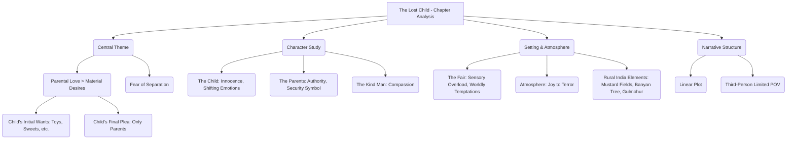

# Class 9 English - Moments Supplementry Chapter 101
**Language:** English

```markdown
# [Class 9] Moments Supplementry - Chapter 101 (Actual Chapter 1: The Lost Child)

## 🌟 Core Concepts

This chapter explores universal themes through the specific experience of a child at an Indian fair. The core concepts can be hierarchically understood as:

1.  **Central Theme:** The Paramountcy of Parental Love and Security
    *   Sub-theme 1: Worldly Attractions vs. Emotional Bonds (Child's initial desires vs. later desperation for parents)
    *   Sub-theme 2: Fear and Insecurity upon Separation
2.  **Character Analysis:**
    *   The Lost Child (Protagonist): Represents innocence, desire, changing emotions (joy, longing, fear, panic, inconsolable grief).
    *   The Parents: Represent authority, guidance, and the ultimate source of security (though largely absent in the latter half). Their refusal acts as a narrative device.
    *   The Kind Man: Represents compassion, empathy, and societal kindness towards a distressed child.
3.  **Setting & Atmosphere:**
    *   The Village Fair (Mela): A vibrant, chaotic microcosm of the world, filled with sensory attractions (sights, sounds, smells).
    *   Atmosphere Shift: From joyous and colourful to terrifying and overwhelming.
    *   Rural Indian Landscape: Mustard fields, groves, banyan tree, dusty paths.
4.  **Narrative Structure:**
    *   Linear Progression: Journey to the fair -> Fascination & Desire -> Separation -> Panic & Search -> Encounter with Kind Man -> Rejection of Attractions.
    *   Point of View: Third-person limited, focusing primarily on the child's experiences and feelings.

📊 **Conceptual Hierarchy Diagram:**



## 📘 Key Learnings

This story provides profound insights into child psychology and the fundamental need for parental security.

1.  **The Nature of Desire:** The child is initially captivated by numerous attractions at the fair: toys, sweets (*burfi*), garlands (*gulmohur*), balloons, the snake-charmer's music, and the roundabout. These represent common childhood desires and the allure of the material world. However, his desires are tempered by the awareness of his parents' likely refusal, indicating a learned restraint.
    *   *Diagrammatic Representation (Child's Initial State):*
        ```
        Child --> Sees Toy --> Wants Toy --> Knows Parents Will Refuse --> Suppresses Desire --> Moves On
        Child --> Sees Sweet (Burfi) --> Wants Sweet --> Knows Parents Will Call Greedy --> Suppresses Desire --> Moves On
        Child --> Sees Garland (Gulmohur) --> Wants Garland --> Knows Parents Will Call Cheap --> Suppresses Desire --> Moves On
        Child --> Sees Balloons --> Wants Balloons --> Knows Parents Will Say Too Old --> Suppresses Desire --> Moves On
        Child --> Hears Snake-Charmer --> Curious --> Knows Parents Forbade --> Proceeds Farther
        Child --> Sees Roundabout --> Wants Ride --> Makes Bold Request
        ```

2.  **The Primacy of Security:** The moment the child realizes he is lost, his perspective undergoes a dramatic transformation. The very things that fascinated him moments ago become meaningless, even repulsive. His overwhelming fear and panic eclipse all previous desires. His only need is to reunite with his parents. This highlights that emotional security and parental presence are far more fundamental than any material possession or fleeting pleasure.
    *   *Diagrammatic Representation (Child's State After Loss):*
        ```
        Child Realizes Parents Are Gone --> Deep Cry, Real Fear, Panic --> Runs Hither & Thither --> Weeps Bitterly
        Kind Man Offers Roundabout --> Child Shouts: "I want my mother, I want my father!"
        Kind Man Offers Music --> Child Shuts Ears, Shouts: "I want my mother, I want my father!"
        Kind Man Offers Balloon --> Child Turns Eyes Away, Sobs: "I want my mother, I want my father!"
        Kind Man Offers Garland --> Child Turns Nose Away, Sobs: "I want my mother, I want my father!"
        Kind Man Offers Sweet --> Child Turns Face Away, Sobs: "I want my mother, I want my father!"
        ```
    *   **Conclusion:** The child's consistent rejection demonstrates that his fundamental need for his parents overrides all other wants when faced with insecurity.

3.  **Parent-Child Relationship Dynamics:** The story subtly portrays the dynamics: the child's awareness of parental authority ("old, cold stare of refusal," "familiar tyrant's way"), the mother's occasional tenderness, and the child's obedience mixed with longing. The parents' perspective is not explored, leaving their reasons for refusal open to interpretation (perhaps financial constraints, disciplinary reasons, or simply being focused on reaching the fair).

4.  **Sensory Details and Imagery:** The author, Mulk Raj Anand, uses vivid descriptions appealing to sight (mustard fields like "melting gold," "gaudy purple wings" of dragonflies, colourful sweets and balloons), sound (hawkers' calls, snake-charmer's flute, cooing doves, child's cries, crowd's roar), and emotion (joy, fascination, fear, panic, grief) to immerse the reader in the child's experience.

## 🧩 Active Learning

*   **Activity: Case Study Analysis - "The Child's Shifting Priorities"** 🔍
    *   **Objective:** To evaluate the psychological impact of separation on the child's desires and behaviour.
    *   **Procedure:**
        1.  Divide the story into two phases: Phase 1 (With Parents - Journey to the Fair) and Phase 2 (Lost - Encounter with Kind Man).
        2.  In Phase 1, list all the things the child desired and his reasons (stated or implied) for wanting them. Note his reactions when he anticipates refusal.
        3.  In Phase 2, list the same items/experiences when offered by the kind man. Note the child's reaction and his sole, repeated demand.
        4.  **Analysis:** Compare the child's responses in both phases. Evaluate *why* the same attractions evoke drastically different reactions. What does this reveal about the child's core needs versus superficial wants? Create a short report summarizing your evaluation.

*   **Discussion: Critical Analysis of Real-World Impacts** 🌍
    *   **Objective:** To connect the story's themes to broader human experiences and evaluate their significance.
    *   **Prompts:**
        1.  Evaluate the effectiveness of the kind man's attempts to soothe the child. Why did his strategy fail? What alternative approaches could he have tried?
        2.  "The story suggests that the value of relationships is often truly understood only in their absence." Critically analyze this statement using evidence from the text and potentially drawing parallels to real-life experiences (without needing external research, just reflective analysis).
        3.  How does the setting of the bustling, chaotic fair contribute to the child's sense of fear and helplessness once he is lost? Evaluate the author's use of the setting to amplify the story's emotional impact.
        4.  Consider the parents' actions (or lack thereof regarding purchases). From an evaluative standpoint, were they being responsible, overly strict, or something else? Justify your perspective based *only* on the information given in the text.

## 📝 Assessment Prep

*   **Case Study Based Questions:**
    1.  **Scenario:** Imagine the child *had* accepted the sweets or the balloon ride from the kind man. Create a brief narrative extension exploring how this might have momentarily affected his distress, and whether it would have changed his ultimate desire to find his parents. Justify your created scenario based on the child's characterization in the story.
    2.  **Analysis:** Evaluate the description of the crowd near the shrine ("heavy men, with flashing, murderous eyes and hefty shoulders"). How does this description, from the perspective of a small, lost child, contribute to the theme of fear and the overwhelming nature of the world without parental protection?
*   **Diagram-Based Questions:**
    1.  Create a flowchart illustrating the escalating stages of the child's fear and panic from the moment he realizes he is lost until he is picked up by the kind man. Include key actions and emotions described in the text.
    2.  Draw a Venn diagram comparing and contrasting the child's perception of the fair (its sights, sounds, people) *before* and *after* getting lost.

## 🌏 Bharatiya Context

The story is deeply embedded in the cultural and social milieu of rural/semi-urban India, particularly during a festival.

1.  **The Fair (Mela):** The setting itself is a quintessential Indian experience – a vibrant, bustling festival fair, a common feature of community life, especially during spring festivals. It's a place of commerce, entertainment, and social gathering.
2.  **Specific Cultural Items:**
    *   **Sweets:** The mention of specific Indian sweets like ***gulab-jaman, rasagulla, burfi, jalebi*** provides authentic local flavour. The child's favourite, *burfi*, is a common and popular sweet.
    *   **Flowers:** The offering of a ***gulmohur*** garland is culturally specific. *Gulmohur* trees are common in India, known for their vibrant flowers.
    *   **Entertainment:** The ***snake-charmer*** playing a flute to a cobra is a traditional, though now less common, form of Indian street entertainment.
3.  **Social & Environmental Details:**
    *   **Attire:** The mention of the child's ***yellow turban*** coming untied points to traditional Indian clothing.
    *   **Transport:** The description of people arriving via ***bamboo and bullock carts*** reflects traditional modes of transport in rural India.
    *   **Landscape:** The imagery of ***flowering mustard fields***, a ***grove***, a ***banyan tree***, and dusty footpaths paints a picture of the North Indian rural landscape.
    *   **Community:** The dense ***crowd***, the gathering near the ***shrine/temple***, and the presence of various vendors depict a typical Indian community gathering.

These elements ground the universal story of a lost child within a distinctly Indian cultural context, making the setting and atmosphere authentic and relatable within the Bharatiya experience. The story uses these specific details not just as backdrop, but to enhance the sensory experience and the child's initial wonder and later confusion.
```