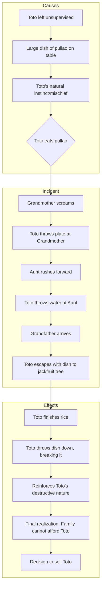

# Class 9 English - Moments Supplementry Chapter 102
**Language:** English

```markdown
# [Class 9] Moments Supplementry - Chapter 2: The Adventures of Toto

## 🌟 Core Concepts

This chapter explores themes related to human-animal interaction, the challenges of domesticating wild animals, mischief, and the consequences of actions, framed within a middle-class Indian family setting.

📊 **Concept Hierarchy:**

1.  **Human-Animal Relationships:**
    *   Grandfather's fondness for collecting animals (Private Zoo).
    *   Initial secrecy from Grandmother (Differing attitudes towards pets).
    *   Attempts to integrate Toto into the household.
    *   The eventual realization that Toto is unsuitable as a pet.
2.  **Animal Behaviour & Nature:**
    *   Toto's inherent mischievousness (contrasted with 'docile').
    *   Intelligence demonstrated (e.g., testing bath water, attempting escape).
    *   Destructive tendencies (tearing wallpaper, clothes, breaking dishes).
    *   Inability to socialize with other pets (Nana the donkey).
    *   Monkey characteristics (using tail as a third hand, grinning, chattering).
3.  **Consequences of Actions:**
    *   Toto's mischief leads to material losses (wallpaper, blazer, dishes).
    *   Toto's actions cause trouble for Grandfather (train fare incident).
    *   The cumulative effect of Toto's behaviour leads to his return.
4.  **Narrative Elements:**
    *   Humour derived from Toto's antics and the family's reactions.
    *   First-person narration (by the grandson).
    *   Character development (Toto as consistently mischievous, Grandfather as indulgent but ultimately practical).
5.  **Socio-Economic Context:**
    *   Cost of acquiring and managing pets (Purchase price: Rs 5, Sale price: Rs 3).
    *   Financial strain caused by damages ("We were not well-to-do").
    *   Middle-class household setting (servants' quarters, specific meals like pullao).

## 📘 Key Learnings

This story illustrates the difficulties and impracticalities of keeping a wild, mischievous animal like a monkey as a household pet, despite its initial appeal. It highlights the clash between an animal's natural instincts and a domestic environment.

**1. Toto's Character:**
*   **Appearance:** Pretty monkey, bright mischievous eyes, pearly white teeth (used in frightening grins), dried-up looking hands, long tail (used as a third hand).
*   **Nature:** Highly mischievous, clever, destructive, quick, unable to coexist peacefully with other animals, sensitive (feelings hurt when laughed at during bath).
*   **Learned Behaviour:** Imitates the narrator's bathing routine.

📈 **Diagram: Toto's Journey & Escalating Mischief**

```mermaid
graph TD
    A[Purchase from Tonga-driver (Rs 5)] --> B{Kept Secret in Closet};
    B --> C[Destroys Wallpaper & Blazer];
    C --> D{Moved to Servants' Quarters Cage};
    D --> E[Troubles Other Pets];
    E --> F{Trip to Saharanpur};
    F --> G[Causes Train Fare Incident (Rs 3)];
    G --> H{Accepted by Grandmother; Moved to Stable};
    H --> I[Annoys Nana the Donkey];
    I --> J{Learns Bathing Routine};
    J --> K[Nearly Boils Self in Kettle];
    K --> L[Tears Aunts' Dresses];
    L --> M[Pullao Incident: Eats rice, throws plate & water, breaks dish];
    M --> N[Family Realizes Toto is Unaffordable];
    N --> O[Sold Back to Tonga-driver (Rs 3)];
```

**2. Grandfather's Role:**
*   Animal lover with a 'private zoo'.
*   Initially amused by Toto's cleverness and mischief.
*   Underestimates the extent of Toto's destructive nature.
*   Takes responsibility (pays fare, ultimately sells Toto back).
*   Represents indulgence but also eventual pragmatism due to financial constraints.

**3. Thematic Understanding:**
*   **Wild vs. Domestic:** The story demonstrates that not all animals are suited for domestication. Toto's wild instincts constantly clash with the requirements of living in a human household.
*   **Cost of Pets:** Keeping pets, especially exotic or destructive ones, involves financial costs (purchase, upkeep, damages) that may become unsustainable, as seen with Toto.
*   **Humour in Chaos:** Much of the story's appeal lies in the humorous portrayal of the chaos Toto creates.

## 🧩 Active Learning

**1. Activity: Research-based Case Study Analysis 🔍**

*   **Case:** The Financial Impact of Toto.
*   **Task:** Research the approximate cost of items Toto damaged (wallpaper, blazer, dishes) in a modern Indian context. Compare this hypothetical cost with the purchase price (Rs 5) and sale price (Rs 3) mentioned in the story (assuming historical value).
*   **Analysis:** Evaluate the economic burden Toto placed on the family. Was Grandfather's decision to sell Toto primarily financial, behavioural, or both? Prepare a short report presenting your findings and analysis, considering the family was "not well-to-do".

**2. Discussion: Critical Analysis of Real-world Impacts 🌍**

*   **Topic:** Ethics of Keeping Exotic Pets.
*   **Prompts:**
    *   Was Grandfather justified in buying Toto from the tonga-driver, even if the monkey looked "out of place"? Discuss the ethical implications of removing animals from their potential natural/familiar environments for private collections.
    *   Considering Toto's behaviour, discuss the potential dangers monkeys can pose as pets in a household, especially with children or elderly people (like the aunts or Grandmother).
    *   Relate the story to modern-day issues of the exotic pet trade in India. What are the laws? What are the common problems faced?
    *   Evaluate Grandfather's approach to pet ownership. Was he responsible? What could he have done differently?

## 📝 Assessment Prep

**Case Studies & Diagram Analysis:**

1.  **Case Study 1: The Saharanpur Train Incident**
    *   **Scenario:** Toto travels secretly in a kit-bag but reveals himself at the turnstile, leading the ticket-collector to classify him as a dog and charge a fare.
    *   **Questions:**
        *   Why did Grandfather have to take Toto to Saharanpur secretly?
        *   Analyze the ticket-collector's reasoning for charging a fare. Was it logical? Why did he insist Toto was a dog?
        *   Evaluate Grandfather's reaction and his attempt to get his "own back" with the tortoise. What does this reveal about his character?
        *   How does this incident contribute to the overall theme of the challenges posed by Toto?

2.  **Case Study 2: The Bathing Ritual & Kettle Incident**
    *   **Scenario:** Toto learns to bathe by observing the narrator but later nearly boils himself alive in a kettle.
    *   **Questions:**
        *   Describe the steps Toto followed during his bath. What does this show about his intelligence and ability to imitate?
        *   Explain how Toto ended up in the kettle. What was his reasoning?
        *   Analyze the danger of the situation. How does this incident highlight the risks of having an unsupervised, curious animal in the house?
        *   "If there is a part of the brain especially devoted to mischief, that part was largely developed in Toto." How do the bathing and kettle incidents support this statement?

📈 **Diagram for Analysis: Cause and Effect - The Pullao Incident**


*   **Task:** Explain the sequence of events shown in the diagram. How did each action lead to the next? What was the ultimate consequence of this specific incident?

## 🌏 Bharatiya Context

The story is firmly rooted in an Indian setting and reflects certain socio-cultural and economic aspects of the time.

*   **Setting:** The story takes place in North India, specifically mentioning **Dehra Dun** and **Saharanpur** (in Uttar Pradesh), common settings in Ruskin Bond's works.
*   **Characters & Social Milieu:**
    *   **Tonga-driver:** Represents a common mode of transport and livelihood in India during that era.
    *   **Anglo-Indian Ladies:** Their frightened reaction to Toto's grin hints at the social composition of some Indian towns.
    *   **Family Structure:** A middle-class family setup with grandparents, children, and servants' quarters. Grandfather receiving a **pension** is also indicative of a common background.
*   **Flora & Food:** Mention of the **jackfruit tree** and the dish of **pullao** (pulao) are distinctly Indian elements.
*   **Economic Data within the Narrative:**
    *   The transaction values (**Rs 5** purchase price, **Rs 3** train fare, **Rs 3** sale price) provide a glimpse into the monetary values of that period in India.
    *   The family being "**not well-to-do**" and unable to afford frequent losses (dishes, clothes, curtains, wallpaper) reflects the economic realities for many Indian households, making the decision to sell Toto a practical necessity.

📊 **Table: Toto's Economic Footprint**

| Item/Event                 | Monetary Value (as per story) | Implication                                     |
| :------------------------- | :---------------------------- | :---------------------------------------------- |
| Purchase of Toto           | Rs 5                          | Initial investment by Grandfather               |
| Train Fare Incident        | Rs 3                          | Unexpected expense due to Toto's actions        |
| Damages (Implied Cost)     | Not specified                 | Significant loss (wallpaper, blazer, dishes)    |
| Sale of Toto               | Rs 3                          | Recovery of some cost, but overall net loss     |
| **Family Financial Status** | **"Not well-to-do"**          | **Inability to sustain recurring losses**       |

This economic dimension, set within the Indian context, underscores the practical challenges that override Grandfather's fondness for the animal, leading to the story's resolution.
```