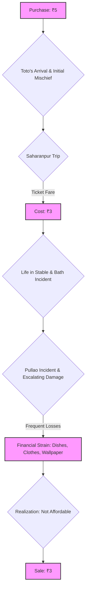

# Class 9 English - Moments Supplementry Chapter 102
**Language:** English

Okay, here is the NCERT-aligned summary for "The Adventures of Toto", following your specifications.

# [Class 9] Moments Supplementry - Chapter 102: The Adventures of Toto

*(Note: Based on standard NCERT curriculum, "The Adventures of Toto" is typically Chapter 2 in the 'Moments' supplementary reader. The chapter number '102' provided in the request seems incorrect, but the content below is based on the provided text of "The Adventures of Toto".)*

## 🌟 Core Concepts

This chapter revolves around the humorous and troublesome experiences of a family who temporarily adopts a mischievous monkey named Toto.

📊 **Concept Hierarchy:**

1.  **Introduction of Toto:**
    *   Acquisition by Grandfather (from a tonga-driver for ₹5).
    *   Physical Description (pretty, bright mischievous eyes, pearly teeth, dried-up hands, long tail used as a third hand).
    *   Initial Secrecy (hidden from Grandmother).
2.  **Toto's Mischief & Character:**
    *   Destructive Nature (tearing wallpaper, shredding blazer).
    *   Inability to Cohabit (disturbing other pets).
    *   Cleverness & Curiosity (train journey incident, bathing ritual, kettle incident).
    *   Temperament (easily offended, spiteful - throwing the dish).
3.  **Key Incidents:**
    *   The Closet Incident (destruction of wallpaper and blazer).
    *   The Saharanpur Train Journey (classified as a 'dog', fare charged ₹3).
    *   Interaction with Nana the Donkey (biting ears).
    *   The Bathing Ritual (imitating the narrator, near-boiling incident).
    *   The Pullao Incident (eating pullao, throwing plate/water, breaking the dish).
4.  **Consequences & Resolution:**
    *   Financial Strain (cost of damages - dishes, clothes, curtains, wallpaper).
    *   Realization of Unsuitability (family not well-to-do, Toto too destructive).
    *   Return of Toto (sold back to the tonga-driver for ₹3).
5.  **Themes:**
    *   Human-Animal Relationships (challenges of keeping wild animals).
    *   Mischief and Humour.
    *   Adaptability (or lack thereof).
    *   Economic Considerations in Pet Ownership.

## 📘 Key Learnings

*   **Character Analysis:** Understand the distinct personalities of Toto (mischievous, clever, destructive), Grandfather (animal lover, tolerant), and Grandmother (initially strict, practical). Toto is portrayed as intelligent but untamed, highlighting the difference between wild animals and domestic pets.
*   **Narrative Sequence:** Follow the chronological events of Toto's arrival, his various escapades, and his eventual departure. Each incident escalates the level of trouble, leading to the final decision.
*   **Humour:** Appreciate the use of humour in the narrative, often arising from Toto's unexpected actions and the reactions of the human characters (e.g., the ticket-collector incident, the near-boiling incident).
*   **Inference:** Infer the reasons behind characters' actions (e.g., why Toto's presence was kept secret, why Grandfather was pleased with Toto's 'cleverness' initially, why Toto was finally sold back).
*   **Theme Exploration:** Recognize the underlying theme that wild animals, despite being attractive or intelligent, may not be suitable as pets, especially for families with limited means. The story subtly explores the responsibilities and costs associated with pet ownership.

📈 **Toto's Journey & Financial Impact:**

*This diagram illustrates the key events involving Toto and highlights the financial transactions and losses incurred by the family, linking to the economic context.*

## 🧩 Active Learning

*   **Activity: Research-based Case Study Analysis 🔍**
    *   **Task:** Research the natural behaviour, habitat, and needs of Rhesus monkeys (the likely species of Toto). Compare these with Toto's behaviour in the story. Create a short report evaluating the feasibility and ethics of keeping such a monkey as a pet in a typical home environment. Consider factors like diet, social needs, space requirements, and potential dangers.
    *   **Bloom's Level:** Evaluating (assessing feasibility and ethics based on research). Creating (producing a report).
*   **Discussion: Critical Analysis of Real-World Impacts 🌍**
    *   **Topic:** Debate the statement: "Grandfather's love for animals was irresponsible in the case of Toto." Discuss the consequences of Toto's actions on the family's finances, emotional well-being, and relationships (e.g., with Grandmother, the aunts). Was selling Toto back the most responsible decision? Could there have been alternative solutions?
    *   **Bloom's Level:** Evaluating (judging Grandfather's actions and the final decision). Analyzing (breaking down the impacts on the family).

## 📝 Assessment Prep

*   **Case Study Analysis:**
    *   *Scenario:* Imagine a family friend gifts you a young parrot known for mimicking sounds but also for chewing furniture. Drawing parallels from Toto's story, outline the potential challenges your family might face. What steps would you take to manage the situation, considering both the bird's well-being and your family's resources?
    *   *Focus:* Applying lessons learned about managing difficult pets and considering financial/practical constraints.
*   **Diagram-Based Questions:**
    *   Create a character map for Toto, listing his key traits (e.g., mischievous, clever, quick-fingered, sensitive to ridicule) and providing textual evidence for each.
    *   Draw a flowchart detailing the events of the Saharanpur train journey, highlighting the cause-and-effect sequence leading to Toto being charged a fare.
*   **Higher-Order Questions:**
    *   "Toto was not the sort of pet we could keep for long." Evaluate this statement from the perspective of Grandfather, Grandmother, and the narrator. How might their reasons differ?
    *   Analyze the humour in the incident where Toto almost boils himself. What makes it funny, and what underlying danger does it reveal?
    *   Create a 'Pet Suitability Rubric' based on the story, outlining criteria (like temperament, destructiveness, cost of upkeep, safety) to evaluate whether an animal is appropriate for a household like the narrator's.

## 🌏 Bharatiya Context

*   **Setting & Cultural Elements:** The story is firmly set in India, referencing locations like **Dehra Dun** and **Saharanpur** in North India. It includes culturally specific elements like the **tonga-driver**, a common mode of transport in the past; the mention of **Anglo-Indian ladies** reacting to Toto; the specific dish **pullao** (pulao); and fauna like the **jackfruit tree**.
*   **Economic Reality:** The narrative reflects the economic conditions of a middle-class Indian family ("We were not well-to-do").
    *   The purchase price (₹5) and eventual sale price (₹3) of Toto, along with the train fare (₹3), provide concrete monetary values. While small sums today, they were more significant relative to income in the era the story likely depicts.
    *   The family's inability to "afford the frequent loss of dishes, clothes, curtains and wallpaper" directly links Toto's destructive behaviour to **financial strain**. This highlights a common reality where unexpected expenses can significantly impact household budgets in India.
    *   📊 **Simple Cost Analysis:**
        *   Initial Cost: ₹5
        *   Train Fare Cost: ₹3
        *   **Total Outlay:** ₹8
        *   Sale Revenue: ₹3
        *   **Net Monetary Loss:** ₹5 (excluding the significant, unquantified cost of damages).
        This simple calculation underscores the financial burden Toto represented, reinforcing the theme that keeping certain pets can be economically unsustainable for many Indian households.