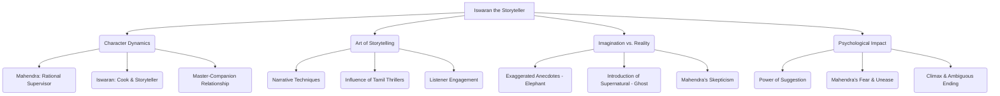

# Class 9 English - Moments Supplementry Chapter 103
**Language:** English

```markdown
# [Class 9] Moments Supplementry - Chapter 3: Iswaran the Storyteller

*(Note: The chapter number is corrected to 3 based on the NCERT 'Moments' textbook content matching the provided text.)*

## 🌟 Core Concepts

This chapter explores the art of storytelling, the relationship between a master and his companion, and the power of imagination versus rationality.

1.  **Character Dynamics:**
    *   **Mahendra:** A practical, junior supervisor, adaptable but rational.
    *   **Iswaran:** Mahendra's multi-talented cook, companion, and exceptionally gifted storyteller.
    *   **Relationship:** Iswaran is more than a cook; he's an asset, providing companionship and entertainment, filling the void of Mahendra's solitary life.

2.  **The Art of Storytelling:**
    *   **Narrative Techniques:** Suspense, dramatic gestures, voice modulation, vivid descriptions, cliffhangers.
    *   **Influence:** Impact of popular Tamil thrillers on Iswaran's style.
    *   **Effect:** Iswaran's ability to make mundane events seem thrilling and hold his listener (Mahendra) captive.

3.  **Imagination vs. Reality:**
    *   **Iswaran's Tales:** Blend of possible exaggeration and vivid imagination (e.g., the elephant story).
    *   **Supernatural Element:** Introduction of ghost stories, blurring the line between fiction and potential reality for the listener.
    *   **Mahendra's Rationality:** Initial dismissal of ghosts as "figment of imagination."

4.  **Psychological Impact:**
    *   **Power of Suggestion:** How Iswaran's ghost story affects Mahendra's state of mind, leading to fear and unease.
    *   **Climax:** Mahendra's potential sighting of the ghost and his subsequent decision to leave.
    *   **Ambiguity:** The unresolved question of whether Mahendra actually saw a ghost or if it was his imagination influenced by Iswaran's story.

**Concept Hierarchy:**



## 📘 Key Learnings

1.  **Iswaran as an Asset:** Iswaran is indispensable to Mahendra not just for his cooking and domestic skills (managing in desolate places, conjuring delicious meals) but primarily for his companionship and storytelling, which alleviates Mahendra's loneliness in isolated postings. He compensates for the lack of other entertainment like television.

2.  **Iswaran's Storytelling Craft:**
    *   **Dramatic Flair:** He doesn't simply recount events; he performs them. Uses arched eyebrows, dramatic hand gestures, and vocal modulation.
    *   **Building Suspense:** Even minor incidents (like seeing an uprooted tree) are narrated with suspense ("enormous bushy beast lying sprawled across the road").
    *   **Vivid Imagery:** Influenced by Tamil thrillers, his descriptions are imaginative and captivating (e.g., the mad elephant's rampage).
    *   **Cliffhangers:** He often leaves stories unfinished at a crucial point (like after describing the elephant collapsing), making the listener eager for the conclusion.
    *   **Example - The Elephant Story:** This tale showcases his style: a dramatic prologue, escalating action (elephant's destruction), a heroic climax (Iswaran felling the beast with a karate/ju-jitsu move learned from a book), and a casual, delayed resolution. Its plausibility is questionable, highlighting Iswaran's tendency to embellish.

3.  **The Power of Suggestion and Fear:**
    *   Initially, Mahendra enjoys Iswaran's stories uncritically but dismisses the supernatural elements as nonsense ("figment of your imagination").
    *   However, Iswaran's vivid description of the female ghost (matted hair, shrivelled face, holding a foetus) plants a seed of fear in Mahendra's mind.
    *   Despite his rational stance, Mahendra becomes uneasy, peering out the window nightly and avoiding looking out on full moon nights.
    *   **Climax Explanation:** Mahendra hears a moan, looks out, and sees a "dark cloudy form clutching a bundle." He is terrified. While he tries to rationalise it as auto-suggestion, Iswaran's comment the next morning ("Well, you saw her yourself last night...") confirms Mahendra's fear, leading him to resign immediately. The story cleverly leaves it ambiguous whether the ghost was real, an illusion created by Mahendra's fear, or even a prank by Iswaran.

    ```mermaid
    graph LR
        A[Iswaran tells Ghost Story] --> B{Mahendra's Mind};
        B -- Rationality --> C[Dismisses as Nonsense];
        B -- Subconscious --> D[Plants Seed of Fear];
        D --> E[Unease & Avoidance];
        E --> F[Hears Moan, Sees Figure];
        F --> G[Terror & Rationalization Attempt];
        G --> H[Iswaran's Confirmation];
        H --> I[Resignation & Escape];
    ```

4.  **Theme of Perception:** The story highlights how perception can be shaped by narratives. Mahendra's perception of his surroundings changes drastically after hearing the ghost story. What was once a normal night becomes potentially terrifying.

## 🧩 Active Learning

1.  **Activity: Storytelling Technique Analysis (Case Study)** 🔍
    *   **Objective:** To identify and evaluate the effectiveness of Iswaran's storytelling techniques.
    *   **Task:** Select either the "uprooted tree" incident or the "mad elephant" anecdote. Reread the description carefully.
    *   **Analysis:**
        *   List the specific techniques Iswaran uses (e.g., suspense, exaggeration, gestures, sound emulation).
        *   Explain *how* each technique contributes to the overall effect of the story.
        *   Evaluate how convincing the story is and why Mahendra enjoys listening despite potential incredulity.
        *   Compare Iswaran's way of telling the story to a plain, factual account. What is gained or lost?
    *   **Outcome:** A short report or presentation analysing the chosen case.

2.  **Discussion: Reality, Imagination, and Belief** 🌍
    *   **Objective:** To critically analyse the interplay between storytelling, belief, and psychological impact.
    *   **Prompts:**
        *   Do you think Mahendra actually saw a ghost, or was it purely his imagination triggered by Iswaran's story? Provide textual evidence for your view.
        *   Was Iswaran deliberately trying to scare Mahendra with the ghost story, perhaps as a prank, or did he genuinely believe in it himself? What clues does the text offer?
        *   How does the story explore the theme that fear can be more powerful than reason? Relate this to real-world examples where stories or rumours influence behaviour.
        *   What qualities make Iswaran a "fascinating storyteller"? Discuss the qualities of a good storyteller in general.

## 📝 Assessment Prep

1.  **Character Analysis:**
    *   Create a character map for Iswaran, detailing his skills (cooking, managing), personality traits (imaginative, dramatic, loyal, possibly mischievous), and his role in Mahendra's life.
    *   Contrast the characters of Mahendra and Iswaran, focusing on their approach to life, imagination, and fear.

2.  **Plot Analysis (Diagram):**
    *   Draw a plot diagram (Exposition, Rising Action, Climax, Falling Action, Resolution) for the ghost story element within the chapter.
    *   **Exposition:** Mahendra's life, Iswaran's storytelling habit.
    *   **Rising Action:** Iswaran tells the ghost story; Mahendra's initial dismissal but growing unease.
    *   **Climax:** Mahendra hears the moan and sees the figure outside his window.
    *   **Falling Action:** Mahendra tries to rationalise the experience; Iswaran's comment the next morning.
    *   **Resolution:** Mahendra resigns and decides to leave.

3.  **Short Answer Questions (Evaluating):**
    *   Why was Iswaran's storytelling more engaging than watching TV might have been for Mahendra?
    *   Evaluate the ending: Is it effective? Why or why not? Could the story have ended differently? (Refer to 'Think About It' question 6).
    *   "It has something to do with a Japanese art... Karate or ju-jitsu... It temporarily paralyses the nervous system." Analyse this explanation by Iswaran regarding the elephant. What does it reveal about his character?

## 🌏 Bharatiya Context

The story is richly embedded in the Indian context, adding authenticity and flavour:

1.  **Diverse Work Locales:** Mahendra's job takes him to various Indian settings – coal mining areas, railway bridge construction sites, chemical plants – reflecting the landscape of developing India.
2.  **Influence of Regional Literature:** Iswaran's storytelling style is explicitly linked to "popular Tamil thrillers," showcasing the influence of regional language literature and narrative traditions.
3.  **Cultural Practices & Beliefs:**
    *   **Auspicious Days:** The mention of preparing special delicacies "to feed the spirits of our ancestors" refers to practices like *Shraddha* or *Mahalaya Amavasya*, common in Hindu tradition.
    *   **Supernatural Beliefs:** The ghost story itself, particularly the description of the female ghost (often referred to as *chudail* or similar figures in folklore), taps into widespread traditional beliefs and superstitions about spirits and burial grounds in India.
    *   **Elephants and Mahouts:** The detailed anecdote about the tusker escaping from a timber yard and the role of the *mahout* (elephant keeper/rider) is specific to regions in India where elephants are used for labour.
4.  **Everyday Life:** Details like makeshift shelters ("zinc-sheet shelter"), travelling cooks, and simple living conditions paint a picture of life for those working on remote projects in India.
```