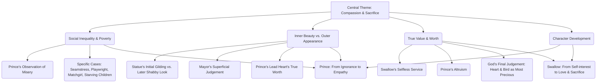
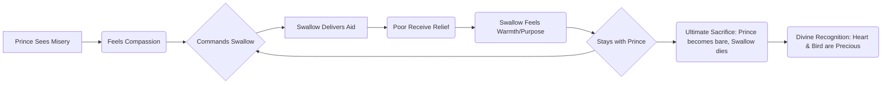

# Class 9 English - Moments Supplementry Chapter 105
**Language:** English

Okay, here is the NCERT summary for Class 9 Moments Supplementry, Chapter 105 ("The Happy Prince"), adhering to your specifications.

# [Class 9] Moments Supplementry - Chapter 105: The Happy Prince

## 🌟 Core Concepts

This chapter explores profound themes through a seemingly simple narrative. The core concepts can be understood hierarchically:

*   **Compassion & Sacrifice:** The primary driving force, demonstrated by the Prince and the Swallow.
*   **Social Inequality & Poverty:** The stark contrast between the lives of the rich and the suffering of the poor in the city.
*   **Inner Beauty vs. Outer Appearance:** The story critiques judging value based on external looks, highlighting the inner goodness of the Prince (lead heart) despite his shabby exterior later.
*   **True Value & Worth:** Redefining preciousness not in terms of gold and jewels, but through acts of love, kindness, and self-sacrifice.
*   **Character Development:** Tracing the transformation of both the Prince and the Swallow.

## 📘 Key Learnings

This story imparts several significant lessons:

1.  **Empathy as a Catalyst for Action:** The Prince, once oblivious in his palace ("where sorrow is not allowed to enter"), gains empathy upon seeing the city's misery from his pedestal. This newfound understanding compels him to act, sacrificing his adornments.
2.  **The Nature of True Happiness:** The Prince was called 'Happy' when he was ignorant. True, deeper (though perhaps melancholic) fulfilment comes from alleviating the suffering of others, as experienced by both the Prince and the Swallow ("I feel quite warm now, although it is so cold... That is because you have done a good action").
3.  **Critique of Social Apathy and Superficiality:** The Mayor and Town Councillors represent societal indifference and focus on superficiality. They admire the statue when beautiful but discard it when shabby ("As he is no longer beautiful he is no longer useful"), failing to recognise its true worth or the sacrifices made.
4.  **The Power of Selfless Love and Sacrifice:** The Swallow initially prioritises its migration but stays out of compassion, eventually sacrificing its life. This act, alongside the Prince's sacrifices, is deemed eternally valuable by God.
5.  **Redefinition of 'Precious':** The narrative challenges conventional notions of value. The ruby, sapphires, and gold are valuable only as means to help the needy. The truly precious items, recognised by God, are the instruments of compassion: the broken lead heart and the dead Swallow.

**Diagram: The Cycle of Compassion and Sacrifice**

*This flowchart illustrates how the Prince's observation initiates a cycle where the Swallow acts as an agent, leading to relief for the poor, a sense of fulfilment for the Swallow, and ultimately, profound sacrifice recognised as true value.*

## 🧩 Active Learning

1.  **Activity: Research-based Case Study Analysis 🔍**
    *   **Task:** Research a contemporary individual or organisation known for significant philanthropic work or social service, particularly focusing on poverty alleviation or aiding the marginalised in a specific region.
    *   **Analysis:** Create a short report (or presentation) comparing and contrasting their motivations, methods, challenges, and impact with those of the Happy Prince and the Swallow.
    *   **Evaluation Questions:**
        *   How does modern philanthropy address systemic issues compared to the Prince's direct, individual aid?
        *   What are the limitations of the Prince's approach in a real-world context?
        *   Evaluate the role of 'sacrifice' in modern social work versus the story. Is personal sacrifice always necessary or effective?

2.  **Discussion: Critical Analysis of Real-World Impacts 🌍**
    *   **Prompt:** "The Happy Prince provides temporary relief but doesn't change the underlying social structures that cause poverty and suffering. The Mayor and Councillors remain in power, and the system persists."
    *   **Discuss:**
        *   To what extent do you agree with this statement?
        *   Can individual acts of charity, like the Prince's, bring about significant long-term change, or are systemic reforms (policy changes, economic restructuring) more crucial?
        *   How does the story's ending (divine reward) potentially undermine or support the message about tackling real-world misery?
        *   Critically evaluate the effectiveness and ethical implications of the Prince using the Swallow to the point of its death, even for noble reasons.

## 📝 Assessment Prep

Prepare for assessments by focusing on analysis and application:

1.  **Case Study Application:**
    *   *Scenario:* Imagine a modern city facing issues like homelessness during winter and lack of access to education for poor children. If the 'spirit' of the Happy Prince existed today (not as a statue, but perhaps as a guiding principle for a community group), what actions might they take, drawing parallels from the story? What challenges would they face that the Prince didn't?
    *   *Analysis Task:* Analyse the effectiveness and sustainability of these potential actions.

2.  **Diagram Creation:**
    *   *Task:* Create a diagram (e.g., Venn diagram, flowchart, mind map) illustrating the contrasting values held by:
        *   The Happy Prince (post-realisation) & the Swallow
        *   The Mayor & the Town Councillors
    *   *Focus:* Highlight differences in their perception of beauty, utility, wealth, and human worth.

3.  **Evaluating Character Motivation:**
    *   Why did the Swallow ultimately choose to stay, knowing the risk? Analyse the mix of pity, love, and sense of purpose in its decision.
    *   Evaluate the Mayor's decision to pull down the statue. Was it purely aesthetic, or did it reflect deeper societal values? Justify your answer with evidence from the text.

## 🌏 Bharatiya Context

The themes of "The Happy Prince" resonate deeply within the Indian context, where social and economic disparities are significant aspects of reality.

1.  **Socio-Economic Disparity:** The story's depiction of extreme wealth alongside abject poverty mirrors situations observable in many parts of India. Data from sources like the National Family Health Survey (NFHS) or reports on the Multidimensional Poverty Index (MPI) often highlight disparities in access to basic needs (nutrition, housing, sanitation, education) across different socio-economic groups and regions. The suffering of the seamstress, playwright, and matchgirl finds echoes in the challenges faced by marginalised communities in India.
2.  **Concept of 'Seva' (Selfless Service):** The actions of the Prince and the Swallow align closely with the Indian cultural and spiritual concept of 'Seva' – selfless service performed without expectation of reward. Figures like Mahatma Gandhi emphasised 'Sarvodaya' (upliftment of all), and numerous social reformers and organisations in India (e.g., the Ramakrishna Mission, various NGOs) embody this principle, working to alleviate suffering and empower the disadvantaged. The story serves as an allegory for the profound impact and inner satisfaction derived from such service.
3.  **Critique of Materialism and Superficiality:** The story's critique of valuing outward appearances (the gilded statue, the Mayor's priorities) over inner worth (the lead heart, acts of kindness) connects with philosophical traditions in India that often emphasise detachment from materialism and the pursuit of inner truth or dharma. The ultimate valuation by God in the story parallels spiritual teachings that prioritise compassion and righteousness over worldly possessions or status. For instance, the story contrasts sharply with societal pressures sometimes seen around ostentatious displays of wealth, reminding readers of deeper human values.