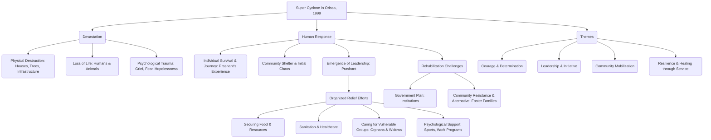

# Class 9 English - Moments Supplementry Chapter 106
**Language:** English

```markdown
# [Class 9] Moments Supplementry - Chapter 6: Weathering the Storm in Ersama

## 🌟 Core Concepts

This chapter explores the devastating impact of a natural disaster and the emergence of leadership, community resilience, and compassion in its aftermath.



**Hierarchy:**
1.  **Natural Disaster:** The 1999 Orissa Super Cyclone as the central event.
2.  **Impact:** Widespread destruction, loss of life, and psychological distress.
3.  **Response:**
    *   **Individual:** Prashant's survival, journey, and search for family.
    *   **Community:** Gathering at the shelter, initial despair.
    *   **Leadership:** Prashant stepping up to organize relief.
4.  **Organized Action:** Specific steps taken by Prashant and volunteers (food, sanitation, care, communication).
5.  **Rehabilitation:** Addressing long-term needs, particularly for orphans and widows; evaluating different approaches (institutions vs. community integration).
6.  **Underlying Themes:** Courage, leadership, community spirit, resilience, empathy.

## 📘 Key Learnings

**1. The Fury of Nature:**
*   The chapter vividly describes the catastrophic impact of the super cyclone that hit coastal Orissa (now Odisha) in October 1999.
*   **Impact:** Winds reached 350 km/hr, accompanied by incessant rain and ocean surge, leading to widespread destruction of homes, uprooting of ancient trees, and washing away people and animals.
*   **Visualisation:** Imagine a vast, brown sheet of swirling water covering everything, with only broken structures, floating carcasses, and fallen trees visible.

**2. Individual Courage and Determination:**
*   Prashant, a 19-year-old, was stranded at his friend's house in Ersama. He survived two days on the rooftop amidst the storm.
*   Driven by the need to find his family, he undertook a perilous 18-km journey back to his village, Kalikuda, navigating waist-deep, debris-filled floodwaters with a stick.
*   **Diagram: Prashant's Journey**
    ```
    Ersama (Stranded on Rooftop) ---[18 km Trek with Stick]---> Encountered Friends ---> Witnessed Macabre Scenes ---> Reached Kalikuda (Home Destroyed) ---> Red Cross Shelter (Family Found)
    ```

**3. The Power of Community Leadership:**
*   Finding his village devastated and ~2500 people in a shelter facing despair and hunger, Prashant, despite his own trauma, took charge.
*   **Organisational Steps:**
    *   **Food:** Pressurized the merchant to release rice supplies; organized cooking.
    *   **Sanitation:** Formed youth volunteer teams to clean the shelter (filth, carcasses).
    *   **Healthcare:** Arranged for tending to the injured.
    *   **Communication:** Used children with utensils on their stomachs to signal helicopters for food and supplies.
    *   **Childcare:** Created a separate shelter for orphans, mobilizing women to care for them.
    *   **Engagement:** Persuaded women to join NGO 'food-for-work' programs; organized sports (cricket) for children to combat grief.

**4. Community Mobilisation and Mutual Help:**
*   Prashant did not act alone; he mobilized youths and elders.
*   The community members helped each other: women looked after orphans, men secured food and materials, volunteers cleaned and provided care.
*   This collective action was crucial for survival and initial recovery.

**5. Rehabilitation and Social Integration:**
*   A critical issue arose regarding the future of orphans and widows.
*   **The Debate:**
    *   *Government Plan:* Set up dedicated institutions.
    *   *Prashant & Volunteers' View:* Resisted institutions, fearing children would lack love and widows would suffer stigma/loneliness.
    *   *Proposed Alternative:* Resettle orphans within their own community, creating foster families with childless widows and children needing care. This emphasizes community-based rehabilitation.
*   **Diagram: Rehabilitation Models**
    ```mermaid
    graph TD
        subgraph Government Plan
            O(Orphans) --> I(Institution);
            W(Widows) --> I;
            I -- Potential Issues --> L(Lack of Love);
            I -- Potential Issues --> S(Stigma & Loneliness);
        end
        subgraph Prashant's Group Plan
            O2(Orphans) --> FF(Foster Family);
            CW(Childless Widows) --> FF;
            FF -- Benefits --> C(Community Integration);
            FF -- Benefits --> L2(Love & Care);
            FF -- Benefits --> R(Reduced Stigma);
        end
        Gov(Government Plan) -- Resisted By --> PG(Prashant's Group Plan);
    ```

**6. Healing Through Service:**
*   Six months later, Prashant's own spirit healed because he focused on helping others, having no time for his personal pain. He became a symbol of hope for the widows and orphans.

## 🧩 Active Learning

*   **Activity: Research-based Case Study Analysis 🔍**
    *   **Objective:** To evaluate Prashant's leadership qualities and decision-making during the crisis.
    *   **Task:** Imagine you are part of a disaster management review team. Based *only* on the chapter's text, analyze Prashant's actions at the Red Cross shelter.
        1.  Identify 3 key challenges Prashant faced upon reaching the shelter.
        2.  List 5 specific actions Prashant took to address these challenges.
        3.  Evaluate the effectiveness of his strategy to signal the helicopters. What does this suggest about his resourcefulness?
        4.  Critically assess the proposal for foster families versus institutional care. What are the potential long-term benefits and challenges of the foster family model in the Indian context?
        5.  Based on his actions, identify 3-4 leadership qualities Prashant demonstrated. Justify your choices with evidence from the text.
*   **Discussion: Critical Analysis of Real-World Impacts 🌍**
    *   **Prompt:** The story highlights the immediate aftermath of the cyclone. Discuss the potential long-term challenges (economic, social, psychological) that the community of Kalikuda might face years after the disaster, even with initial relief efforts. How can communities build long-term resilience against such natural calamities, drawing lessons from Prashant's community mobilization? Consider aspects like infrastructure, livelihood, mental health support, and disaster preparedness education.

## 📝 Assessment Prep

*   **Case Study Question:** Prashant's intervention transformed the situation at the Red Cross shelter from despair to organized action. Trace the sequence of his key initiatives, starting from organizing food to addressing the psychological needs of women and children. Explain how each step contributed to the community's immediate survival and morale.
    *   *(Hint: Use a flowchart or sequence diagram if helpful)*
    ```
    [Initial Despair/Chaos] -> [Organize Food (Rice)] -> [Organize Sanitation/Health] -> [Signal Helicopters] -> [Care for Orphans/Widows] -> [Engage Women (Food-for-Work)] -> [Engage Children (Sports)] -> [Propose Foster Families]
    ```
*   **Diagram-Based Question:** Study the diagram comparing Institutional Care and Community Foster Care (from Key Learnings section). Why did Prashant and the volunteers advocate strongly for the foster family model? Elaborate on the perceived shortcomings of institutions and the strengths of community-based resettlement, especially considering the social fabric of rural India.
*   **Evaluation Question:** "Prashant's greatest achievement was not just organizing relief, but restoring hope and agency to a grief-stricken community." Evaluate this statement, citing specific examples from the text to support your argument. Consider his work with youth, women, and children.

## 🌏 Bharatiya Context

*   **Specific Event:** The chapter is based on the real **1999 Odisha Super Cyclone (formerly Orissa)**, one of the most intense tropical cyclones in the region's history, causing immense loss of life and property, particularly in coastal districts like Ersama.
*   **National Data Context:** While the chapter focuses on one village, the cyclone affected a vast area. Official estimates reported nearly 10,000 deaths and millions affected across Odisha. This event significantly influenced India's approach to disaster management.
*   **Community & Family Structures:** Prashant's group's preference for **community-based foster families** over state-run institutions reflects the strong emphasis on kinship, community bonds, and social integration prevalent in many parts of India. Institutionalization is often seen as a last resort, potentially leading to social isolation.
*   **Role of NGOs and Government:** The mention of an **NGO (Non-Governmental Organization)** running a 'food-for-work' programme and the initial government plan for institutions highlights the typical multi-agency response (government, NGOs, community volunteers, military aid like helicopters) seen during major disasters in India.
*   **Disaster Management Evolution:** Events like the Odisha cyclone spurred the strengthening of disaster management frameworks in India, leading to the establishment of bodies like the **National Disaster Management Authority (NDMA)** and State DMAs, focusing on preparedness, mitigation, and improved early warning systems. Prashant's local, community-led initiative exemplifies the importance of grassroots action complementing formal structures.
```