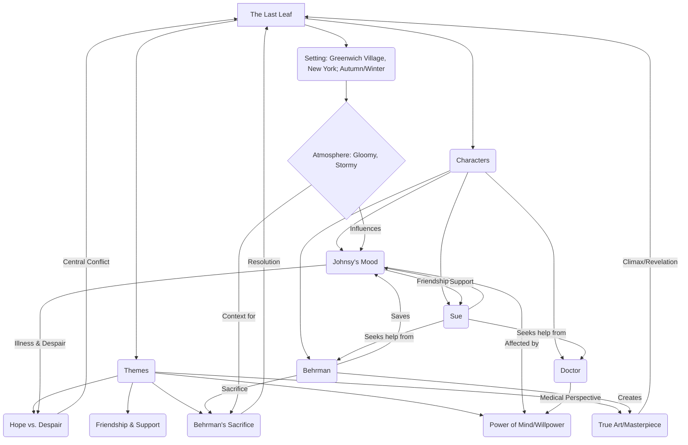

# Class 9 English - Moments Supplementry Chapter 107
**Language:** English

```markdown
# [Class 9] Moments Supplementry - The Last Leaf

*(Note: The provided text corresponds to the chapter "The Last Leaf" by O. Henry, not a hypothetical Chapter 107)*

## 🌟 Core Concepts

This story explores the intricate relationship between mind and body, the profound impact of hope and despair, the value of friendship, and the nature of true sacrifice and art.


*Diagram: Concept Hierarchy illustrating the interplay of characters, themes, and setting.*

## 📘 Key Learnings

1.  **The Psychological Impact on Physical Health:** Johnsy's recovery is hindered not just by pneumonia, but primarily by her loss of will to live. The doctor explicitly states that medicines are ineffective if the patient lacks the desire to get better. Her fixation on the falling ivy leaves symbolizes her dwindling hope.
    *   **Diagram:**
        ```mermaid
        graph LR
            A[Pneumonia] --> B{Johnsy's Condition};
            C[Loss of Hope / Will to Live] --> B;
            D[Belief: Death tied to Last Leaf] --> C;
            E[Medicines] -- Ineffective due to C --> B;
            F[Last Leaf (Painted)] --> G[Renewed Hope];
            G --> H[Will to Live Rekindled];
            H -- Enables --> I[Recovery];
            A --> I;

            style C fill:#f9f,stroke:#333,stroke-width:2px;
            style G fill:#ccf,stroke:#333,stroke-width:2px;
        ```
        *Chart: Illustrating the critical role of Johnsy's psychological state (Hope/Despair) in her battle with pneumonia.*

2.  **Selfless Sacrifice:** Behrman, initially portrayed as a gruff, unsuccessful artist, performs the ultimate act of sacrifice. He braves a stormy night to paint a leaf onto the wall, giving Johnsy the hope she needs to survive, but contracts pneumonia himself and dies. His act embodies selfless love and dedication.

3.  **The Nature of a Masterpiece:** Behrman dreamt of painting a masterpiece. Ironically, his masterpiece wasn't a grand canvas but a single, realistically painted leaf on a wall. Its value lay not in its artistic technique alone, but in its profound impact – saving a life. This challenges conventional notions of great art.

4.  **The Strength of Friendship:** Sue's unwavering support, care, and determination to help Johnsy are crucial. She nurses Johnsy, tries to distract her, seeks medical help, and confides in Behrman, demonstrating deep loyalty and compassion.

5.  **Hope as a Lifeline:** The story powerfully illustrates that hope, even when derived from an illusion (the painted leaf), can be a potent force for survival. The persistent leaf becomes a symbol of resilience that rekindles Johnsy's own desire to live.

## 🧩 Active Learning

*   **Activity: Research-based Case Study Analysis 🔍**
    *   **Topic:** The Placebo Effect and Psychosomatic Illness.
    *   **Task:** Research documented cases or studies where a patient's belief system significantly impacted their physical health outcome (positively or negatively). Compare these findings with Johnsy's case. Consider factors like:
        *   The role of symbols (like the ivy leaf) in shaping belief.
        *   The interaction between medical treatment and psychological state.
        *   Ethical considerations if deception is involved (like the painted leaf).
    *   **Outcome:** Present findings, evaluating the scientific basis for the mind-body connection highlighted in the story.

*   **Discussion: Critical Analysis of Real-World Impacts 🌍**
    *   **Prompt:** Evaluate Behrman's action. Was his sacrifice justified? Discuss the ethical dimensions of his decision to paint the leaf without Johnsy's knowledge.
    *   **Consider:**
        *   Alternative actions Behrman or Sue could have taken.
        *   The value placed on one life versus another.
        *   Does the positive outcome (Johnsy living) outweigh the means (deception) and the cost (Behrman's life)?
        *   How does this story make you reflect on acts of sacrifice you see or read about in the real world?
    *   **Level:** Evaluating (Judging the value and ethics of actions).

## 📝 Assessment Prep

1.  **Case Study Analysis:**
    *   **Scenario:** Imagine you are the doctor treating Johnsy. Based on the text, write a brief medical note outlining:
        *   Johnsy's primary diagnosis.
        *   The main complicating factor affecting her prognosis (beyond the physical illness).
        *   Your recommended approach, considering both medical and psychological aspects (as suggested by the doctor in the story).
        *   Evaluate the likelihood of recovery *before* and *after* the turning point related to the last leaf.
    *   **Focus:** Applying understanding of the story's core conflict to a simulated real-world task.

2.  **Diagram Interpretation & Creation:**
    *   **Task 1:** Explain the relationship depicted in the "Key Learnings" diagram regarding Johnsy's condition. How does the painted leaf interrupt the negative cycle?
    *   **Task 2:** Create a simple timeline or flowchart diagram illustrating the sequence of key events leading to Behrman's sacrifice and its consequences.
    *   **Focus:** Visual literacy, understanding cause-and-effect, and summarizing narrative structure.

3.  **Evaluating Character Motivation:**
    *   Why does Johnsy associate her life with the falling leaves? Analyze the psychological reasons behind her morbid fixation.
    *   Evaluate Sue's methods in trying to help Johnsy. Were they effective? What does this reveal about her character?
    *   What motivates Behrman to paint the last leaf? Is it purely altruism, or does his artistic ambition play a role? Justify your answer with evidence from the text.
    *   **Focus:** Deep analysis of character psychology and motivation (Evaluating).

## 🌏 Bharatiya Context

While the story is set in New York, its themes resonate universally and can be viewed through an Indian lens:

1.  **Health, Hope, and Community Support:**
    *   Johnsy's despair mirrors challenges faced by patients battling serious illnesses in India. The story underscores the importance of psychological well-being alongside medical treatment, a growing focus in Indian healthcare.
    *   **Data Point:** Mental health support is crucial. As per recent National Mental Health Surveys in India, there's a significant treatment gap for mental illnesses. Stories like "The Last Leaf" highlight the non-medical factors (hope, support) vital for recovery.
    *   Sue's role exemplifies the strong community and family support systems often crucial for patient care in India.

2.  **Struggles of Artists:**
    *   Sue and Johnsy's financial worries ("I want to finish the painting and get some money for us") reflect the economic precarity often faced by artists in India. Many artists struggle for recognition and stable income.
    *   **Example:** Think of traditional artisans or contemporary artists in India striving to make a living. Behrman's unfulfilled dream of a masterpiece, contrasted with his final, impactful act, speaks to the often-unseen struggles and sacrifices in artistic pursuits everywhere.

3.  **Concept of Sacrifice (Tyāga/Balidāna):**
    *   Behrman's sacrifice resonates with cultural narratives in India that value selflessness and sacrifice for the greater good or for loved ones.
    *   **Example:** Historical figures or mythological stories in India often depict profound acts of self-sacrifice (e.g., Dadhichi, Karna). Behrman's act, though fictional, taps into this universal, culturally significant theme.

4.  **Resilience Symbolism:**
    *   The single leaf clinging to life against the storm can be compared to symbols of resilience found in Indian nature and culture (e.g., the Banyan tree's ability to regenerate, the Lotus blooming in muddy waters). It represents the enduring spirit against adversity.
```