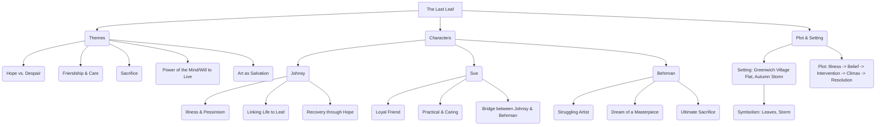
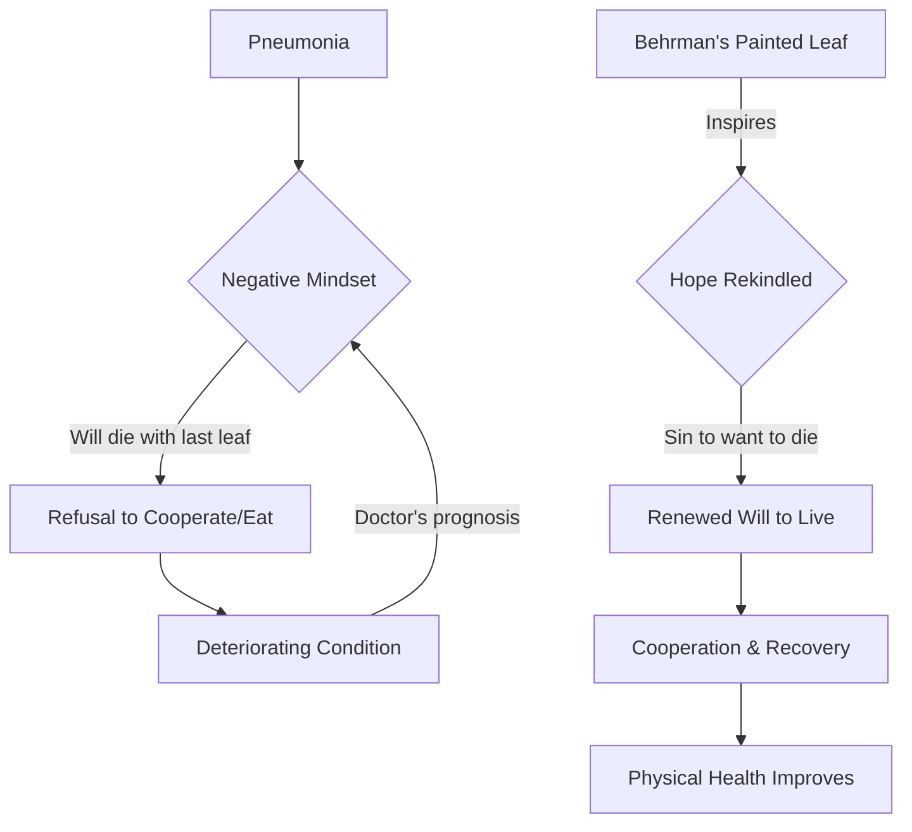

# Class 9 English - Moments Supplementry Chapter 107
**Language:** English

```markdown
# [Class 9] Moments Supplementry - Chapter 107 (The Last Leaf)

## 🌟 Core Concepts

This chapter explores profound themes related to human psychology, relationships, and the purpose of art, primarily focusing on:

📊 **Concept Hierarchy:**



*   **Hope vs. Despair:** Johnsy's psychological state, where she equates her life with the falling leaves, represents despair. The eventual survival of the "last leaf" (Behrman's painting) rekindles her hope and will to live.
*   **Friendship and Sacrifice:** Sue's unwavering care for Johnsy and Behrman's ultimate sacrifice highlight the depth and power of human connection.
*   **The Power of Belief:** The story underscores how strongly the mind can influence physical health. Johnsy's belief that she will die with the last leaf is as potent as her later belief, inspired by the leaf's persistence, that she must live.
*   **Art and its Purpose:** Behrman's painted leaf, his masterpiece, transcends mere aesthetics; it becomes a life-saving act, fulfilling his lifelong dream in the most unexpected and meaningful way.

## 📘 Key Learnings

**1. The Interplay of Physical and Psychological Health:**
Johnsy suffers from pneumonia, but the doctor notes that her recovery depends more on her "will to live" than on medicine. Her decision that she will die when the last ivy leaf falls demonstrates a powerful psychosomatic connection. When the painted leaf gives her hope, her health improves rapidly.

📈 **Diagram: Johnsy's Condition Cycle**


**2. The Nature of True Friendship:**
Sue exemplifies selfless friendship. She tends to Johnsy's physical needs, tries to uplift her spirits (talking about fashion, whistling), supports them financially through her art, and seeks help from the doctor and Behrman. Her actions show loyalty, care, and practical support in times of crisis.

**3. Sacrifice and the Meaning of a Masterpiece:**
Behrman, an old, seemingly unsuccessful painter, harbours a dream of creating a masterpiece. He dismisses Johnsy's fancy as foolish but is deeply moved by her plight. He braves a stormy night to paint a realistic leaf on the wall, saving Johnsy's life at the cost of his own (contracting pneumonia and dying). This act of sacrifice *is* his masterpiece – not just a painting, but an act of profound love and selflessness that gives life.

**4. Symbolism in Literature:**
*   **Ivy Leaves:** Represent Johnsy's fragile hold on life. As they fall, her hope dwindles.
*   **The Last Leaf (Painted):** Symbolises enduring hope, resilience, and the life-giving power of sacrifice and art.
*   **Autumn/Storm:** Represent adversity, despair, and the harsh realities of life (and death) that Johnsy, Sue, and Behrman face.

## 🧩 Active Learning

**1. Activity: Research-based Case Study Analysis 🔍**
*   **Task:** Research documented cases or studies exploring the "placebo effect" or the impact of psychological well-being (hope, positivity) on patient recovery from serious illnesses.
*   **Analysis:** Compare your findings with Johnsy's case in "The Last Leaf". How does medical science explain the connection between mind and body illustrated in the story? Present your findings as a brief report or presentation.
*   **Connection:** Discuss how support systems (like friends, family, community) can influence a patient's psychological state and recovery prospects, drawing parallels to Sue's role.

**2. Discussion: Critical Analysis of Real-world Impacts 🌍**
*   **Topic 1: The Value of Art:** Is art only valuable for its aesthetic appeal or monetary worth? Discuss Behrman's masterpiece. Can art truly save lives or change perspectives? Provide examples (perhaps murals inspiring communities, art therapy, etc.).
*   **Topic 2: Altruism and Sacrifice:** Was Behrman's sacrifice justified? Discuss the concept of altruism and self-sacrifice. Are there limits to what one should do for others? Relate this to acts of sacrifice seen in society.
*   **Topic 3 (Connecting to Context):** Johnsy and Sue are struggling artists. Discuss the economic hardships faced by artists (in India or globally). How does this economic pressure contrast with the profound, non-monetary value of Behrman's final artwork?

## 📝 Assessment Prep

**Case Studies & Diagram-Based Questions:**

1.  **Case Study 1 (Johnsy):** Analyse Johnsy's psychological state. What factors contributed to her despair? How did the "last leaf" change her perspective? Evaluate the doctor's statement: "If she doesn’t want to live, medicines will not help her."
2.  **Case Study 2 (Behrman):** Describe Behrman's character arc. How does his final act contrast with his initial portrayal? Explain why Sue calls the painted leaf his "masterpiece".
3.  **Diagram Analysis:** Refer to the 'Johnsy's Condition Cycle' diagram above. Explain the transition from point D (Deteriorating Condition) to point G (Renewed Will to Live), highlighting the catalyst and its effect.
4.  **Short Answer:**
    *   What illness did Johnsy have? What unconventional belief did she develop regarding her illness?
    *   Describe Sue's efforts to help Johnsy recover.
    *   What evidence found near Behrman's bed revealed the truth about the last leaf?
5.  **Long Answer:** Discuss the central themes of hope, friendship, and sacrifice as presented in "The Last Leaf", using specific examples from the text.

## 🌏 Bharatiya Context

While the story is set abroad, its themes resonate universally and can be connected to Indian contexts:

1.  **Resilience and Hope:** Johnsy's eventual recovery mirrors the spirit of resilience often celebrated in Indian culture. Examples range from historical figures who overcame adversity during the freedom struggle to everyday stories of people rebuilding lives after natural disasters (like the Kerala floods or Odisha cyclones). The belief in karma and a higher power often provides hope in difficult times, similar to how the leaf (though man-made) became a symbol of hope for Johnsy.
2.  **Community Support:** Sue's dedication to Johnsy reflects the strong emphasis on community and family support systems prevalent in India. In times of illness or crisis, neighbours and extended family often play crucial roles, much like Sue did. This contrasts with the often-perceived individualism of Western societies depicted in the story's setting.
3.  **Struggles of Artists:** The economic vulnerability of Sue and Johnsy finds parallels in India. Many traditional artisans (e.g., weavers, potters) and contemporary artists face financial instability. Government schemes and NGOs in India work to support artists, acknowledging that art's value isn't solely economic, much like Behrman's masterpiece had immeasurable human value. Discussing initiatives like `Hunar Haat` or support for folk artists can provide a relevant link.
4.  **Health and Belief:** The story's focus on the will to live connects with diverse health beliefs in India, where traditional medicine (Ayurveda, Unani, Siddha) often emphasizes holistic well-being, including mental and spiritual aspects, alongside physical treatment. The role of faith and belief in healing is a significant aspect of healthcare experiences for many Indians.
```