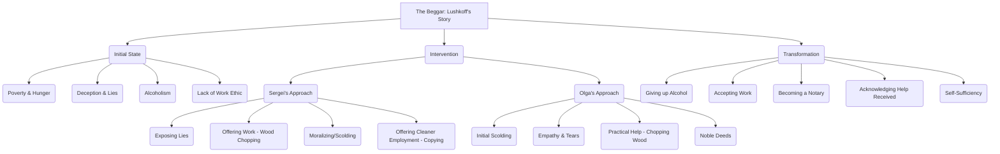

# Class 9 English - Moments Supplementry Chapter 109
**Language:** English

```markdown
# [Class 9] Moments Supplementry - Chapter 9: The Beggar

*(Note: Based on the provided text, the chapter is "The Beggar", typically Chapter 9 in the NCERT Class 9 Moments textbook, not Chapter 109 as mentioned in the context.)*

## 🌟 Core Concepts

This chapter explores themes related to human behaviour, social responsibility, and personal transformation.

1.  **Poverty and Desperation**
    *   Begging as a means of survival.
    *   Factors leading to destitution (e.g., job loss, alcoholism).
2.  **Deception vs. Truth**
    *   Lushkoff's initial reliance on lies (pretending to be a student/schoolteacher).
    *   The consequences and effectiveness of telling the truth vs. falsehoods.
3.  **Work Ethic and Dignity of Labour**
    *   Sergei's belief in work as a solution to poverty and moral failing.
    *   Lushkoff's initial aversion and eventual acceptance of work.
4.  **Compassion and Empathy**
    *   Different forms of help: Moralizing (Sergei) vs. Practical/Emotional Support (Olga).
    *   The transformative power of genuine kindness and noble deeds.
5.  **Alcoholism and its Impact**
    *   Lushkoff's dismissal from the choir due to drunkenness.
    *   Alcoholism as a barrier to employment and self-improvement.
6.  **Personal Transformation and Redemption**
    *   Lushkoff's journey from a deceitful beggar to a self-sufficient notary.
    *   The catalysts for change (Sergei's intervention, Olga's actions and words).

📊 **Concept Hierarchy:**



## 📘 Key Learnings

1.  **The Nature of Deception:** Lushkoff initially resorts to elaborate lies (claiming to be an expelled student or a victimized schoolteacher) to evoke pity and gain alms. He believes telling the truth about his dismissal for drunkenness would yield nothing. This highlights the desperation that can drive dishonesty.
2.  **Sergei's Intervention - Work as Reform:** Advocate Sergei catches Lushkoff in his lies and, instead of merely dismissing him or calling the police, offers him manual labour – chopping wood. Sergei believes that hard work is the antidote to idleness and moral decay. He takes pride in believing his words and actions have reformed Lushkoff.
3.  **Olga's Unseen Influence - Compassion as Catalyst:** While Sergei provides the opportunity, it is his cook, Olga, whose actions have the most profound impact. Initially harsh, she later shows deep empathy, weeps for Lushkoff's plight, and crucially, chops the wood *for* him while scolding him. Her "noble deeds" and words touch Lushkoff's heart, leading to his genuine transformation.
4.  **The Complexity of Change:** Lushkoff's transformation is not instantaneous or solely due to Sergei's stern approach. It's a combination of being confronted (Sergei), being offered a chance (Sergei), experiencing unexpected, selfless compassion (Olga), and perhaps his own underlying desire to escape his situation. He admits Olga's actions, not Sergei's words alone, were the primary reason for his change.
5.  **Dignity Regained:** The story concludes with Lushkoff having become a respectable notary, earning a steady income. He expresses gratitude to both Sergei and Olga, acknowledging their respective roles in helping him escape the "pit" of his former life. This emphasizes that intervention, whether through structured opportunity or profound empathy, can lead to significant positive change.

📈 **Lushkoff's Transformation Journey:**

```mermaid
graph LR
    A[Beggar: Alcoholic, Liar, Idle] -- Encounter with Sergei --> B(Lies Exposed);
    B -- Sergei's Offer --> C(Agrees to Chop Wood (reluctantly));
    C -- Olga's Actions --> D(Wood Chopped *for* him + Empathy Experienced);
    D -- Regular Odd Jobs --> E(Starts Working Intermittently);
    E -- Sergei's Further Help --> F(Offered Copying Work);
    F -- Two Years Later --> G(Reformed: Sober, Notary, Self-Sufficient);
    G -- Meeting Sergei --> H(Acknowledges Olga's Crucial Role);
```

## 🧩 Active Learning

1.  **Activity: Research-based Case Study Analysis 🔍**
    *   **Task:** Research the issue of begging and homelessness in a major Indian city (e.g., Delhi, Mumbai, Kolkata, Chennai). Identify:
        *   Common reasons cited for begging (socio-economic factors, personal circumstances like Lushkoff's alcoholism).
        *   At least two different approaches used by NGOs or government agencies to help beggars (e.g., shelters, skill training, rehabilitation centers, anti-begging laws).
    *   **Analysis:** Compare and contrast these real-world approaches with the methods used by Sergei (offering work, moral guidance) and Olga (empathy, practical help) in the story. Evaluate which approaches seem more effective or sustainable in the Indian context, considering the scale of the problem. Prepare a short report or presentation.
    *   **Bloom's Level:** Evaluating, Creating.

2.  **Discussion: Critical Analysis of Real-World Impacts 🌍**
    *   **Prompt 1 (Evaluating):** Was Sergei right to force Lushkoff into work he was initially unwilling and perhaps unfit to do? Was his method ethical? Compare the effectiveness and ethical implications of Sergei's "tough love" versus Olga's compassionate intervention.
    *   **Prompt 2 (Creating):** Lushkoff admitted lying because "No one will give me anything when I tell the truth". How does this reflect societal attitudes towards issues like alcoholism or job loss due to personal failings? How can society create an environment where people feel they can be truthful about their struggles and still receive help?
    *   **Prompt 3 (Applying/Evaluating):** If you encountered someone like Lushkoff today in India, what would be the most appropriate and helpful course of action, drawing lessons from the story and considering available resources/support systems? Discuss the balance between individual responsibility and societal support.
    *   **Bloom's Level:** Evaluating, Creating, Applying.

## 📝 Assessment Prep

1.  **Case Study Analysis:**
    *   Trace the character development of Lushkoff, citing specific instances from the text that mark his transformation. Explain the key factors (people, events, internal changes) responsible for his redemption.
    *   Compare and contrast the characters of Sergei and Olga. Analyse their motivations, methods of helping Lushkoff, and the impact each had on him. Who do you think played a more significant role in Lushkoff's reform, and why?
2.  **Diagram-Based Questions:**
    *   Refer to the 'Lushkoff's Transformation Journey' diagram (in Key Learnings). Explain the significance of the transition between 'Agrees to Chop Wood' and 'Wood Chopped *for* him + Empathy Experienced'. How did this specific phase contribute to the final outcome?
    *   Create a simple flowchart illustrating the different lies Lushkoff told and how Sergei exposed them. What does this reveal about Sergei's character?
3.  **Higher-Order Thinking Questions:**
    *   "I am happy that my words have taken effect," says Sergei. Evaluate the accuracy of this statement based on Lushkoff's final revelation. What irony is present here?
    *   "Owing to her words and noble deeds, a change took place in my heart." Discuss the power of 'noble deeds' as highlighted in the story. Can actions speak louder than words in bringing about change? Justify your answer with reference to the text.

## 🌏 Bharatiya Context

While the story is set in Russia, its themes resonate strongly with the socio-economic landscape of India.

1.  **Prevalence of Begging:** Begging is a visible social issue in many parts of India, stemming from complex factors like extreme poverty, unemployment, disability, social displacement, and sometimes, organized rackets. Lushkoff's initial state mirrors the desperation seen in many individuals forced onto the streets. His lies about being a student or teacher reflect a common tactic to gain sympathy, similar to narratives sometimes encountered in India.
2.  **Attitudes towards Labour:** Sergei's insistence on work ("Work! That's what you can do!") aligns with the emphasis on 'Shramdaan' (voluntary contribution of labour) and the 'Dignity of Labour' in Indian ethos. However, Lushkoff's initial hesitation and Olga doing the work highlight the challenges: lack of physical capacity (due to illness/addiction), lack of skills, and the sheer difficulty of finding work, even menial jobs, which is a significant issue for the unskilled workforce in India.
3.  **Role of Compassion and Social Support:** Olga's compassion is the cornerstone of Lushkoff's transformation. In India, while societal attitudes towards beggars vary (ranging from sympathy to annoyance or suspicion), the principle of 'Daya' (compassion) is culturally significant. Many NGOs and religious institutions in India work towards rehabilitating the destitute, providing food, shelter, and sometimes vocational training (e.g., **Skill India Mission** aims at broader skill development, which can prevent destitution). Olga's individual act reflects the potential impact of community support and individual kindness in addressing social problems, complementing or sometimes substituting formal systems.
4.  **Addressing Alcoholism:** Lushkoff's core problem was alcoholism. This remains a significant social and health issue in India, contributing to poverty, unemployment, and broken families. The story subtly shows that addressing the root cause (addiction), often requiring empathy and support (like Olga provided, albeit indirectly), is crucial for sustainable rehabilitation, a challenge faced by rehabilitation programs across India.

By examining Lushkoff's journey, we can reflect on the multifaceted nature of poverty and social exclusion in the Indian context and evaluate the effectiveness of different intervention strategies – from providing opportunities (like Sergei) to offering unconditional compassion and practical help (like Olga).
```