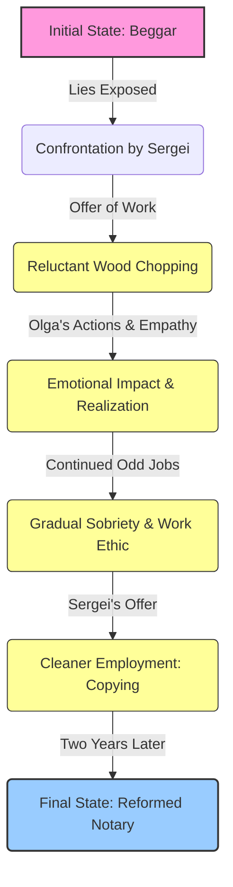

# Class 9 English - Moments Supplementry Chapter 109
**Language:** English

Okay, here is the NCERT summary for "The Beggar" (Chapter 109, Moments Supplementry Reader, Class 9 English), formatted according to your specifications.

```markdown
# [Class 9] Moments Supplementry - Chapter 109: The Beggar

## 🌟 Core Concepts

This chapter explores themes of deception, poverty, human kindness, the dignity of labour, and personal transformation through the story of a beggar named Lushkoff.

📊 **Concept Hierarchy:**

1.  **The Protagonist: Lushkoff**
    *   Initial State:
        *   Deception: Lies about his identity (schoolteacher, student) to evoke pity.
        *   Poverty & Desperation: Begs for money, lacks food and lodging.
        *   Addiction: Suffers from alcoholism (admitted choir singer dismissed for drunkenness).
        *   Weakness & Idleness: Physically weak, lacks inclination for work.
    *   Catalysts for Change:
        *   Confrontation by Sergei: Exposure of lies leads to shame.
        *   Offer of Work (Sergei): Opportunity for earning through labour (chopping wood).
        *   Influence of Olga (The Cook):
            *   Initial Scolding & Harshness.
            *   Underlying Compassion & Empathy (weeping for him).
            *   Crucial Action: Chopping the wood *for* Lushkoff.
    *   Transformation Process:
        *   Reluctant Acceptance of Work: Driven by shame initially.
        *   Gradual Improvement: Continued odd jobs, attempts at sobriety.
        *   Opportunity for Cleaner Work: Sergei offers copying job.
    *   Final State:
        *   Redemption & Self-Sufficiency: Becomes a notary, earning a stable income.
        *   Gratitude: Acknowledges both Sergei and Olga, revealing Olga's pivotal role.

2.  **Supporting Characters & Their Influence**
    *   **Sergei (The Advocate):**
        *   Role: Provides opportunity, confronts dishonesty, offers practical (though somewhat detached) help.
        *   Motivation: Annoyance at deceit, a sense of duty, satisfaction in believing his words caused the change.
        *   Impact: Initiates the process by offering work instead of alms.
    *   **Olga (The Cook):**
        *   Role: Provides unexpected, crucial support through actions and emotional response.
        *   Motivation: Genuine empathy and compassion hidden beneath a harsh exterior.
        *   Impact: Her actions (doing the work) and emotional suffering for Lushkoff become the primary catalyst for his inner change and decision to stop drinking.

3.  **Key Themes**
    *   **Dignity of Labour:** Sergei's insistence on work over charity; Lushkoff eventually finding self-respect through employment.
    *   **Empathy vs. Sympathy:** Contrasting Sergei's practical help with Olga's deep, impactful empathy.
    *   **Transformation & Redemption:** The possibility of positive change even for someone seemingly lost to addiction and deceit.
    *   **Truth vs. Deception:** The initial reliance on lies and the eventual path to honesty and self-improvement.
    *   **Impact of Actions vs. Words:** Sergei believes his words changed Lushkoff, but Lushkoff reveals Olga's actions and emotional response were more significant.

## 📘 Key Learnings

This story teaches us about the complexities of human nature, the devastating effects of poverty and addiction, and the profound impact of genuine kindness and opportunity.

📈 **Lushkoff's Transformation Journey:**



*   **The Power of Opportunity:** Sergei's offer to chop wood, though initially met with reluctance, was the first step away from begging. It provided a path, however difficult, towards earning money through effort rather than deceit.
*   **The Unseen Impact of Empathy:** Olga's role is crucial. While Sergei provided the structure (work), Olga provided the emotional and practical support that touched Lushkoff's heart. Her "noble deeds" (chopping the wood) and her genuine sorrow for his state ("how many tears she shed") were the true catalysts for his change, demonstrating that compassion can be more powerful than stern lectures.
*   **Dignity through Work:** The story underscores the idea that meaningful work, even menial labour initially, can restore a person's self-worth and provide a way out of desperate circumstances. Lushkoff's journey from a weak, unwilling woodchopper to a self-sufficient notary highlights this.
*   **Complexity of Helping:** It contrasts two approaches to helping someone in need: Sergei's logical, work-oriented approach and Olga's emotional, action-oriented compassion. The story suggests that a combination, particularly genuine empathy, is most effective.

## 🧩 Active Learning

*   **Activity: Research-based Case Study Analysis 🔍**
    *   **Task:** Research an Indian non-governmental organisation (NGO) or a government initiative (like a specific shelter program or skill development centre under NRLM/NULM) that works towards rehabilitating destitute individuals, beggars, or those struggling with addiction in India.
    *   **Analysis:**
        1.  Describe the methods used by the chosen organisation/initiative.
        2.  Compare and contrast these methods with Sergei's approach (offering work, stern advice) and Olga's approach (empathy, direct help, scolding).
        3.  Evaluate the potential effectiveness of the organisation's methods based on the lessons learned from "The Beggar". Which character's approach does it resemble more, if any?
        4.  Present your findings as a brief case study report (250-300 words).
    *   **Bloom's Level:** Evaluating, Creating (Analysis, Comparison, Report Generation).

*   **Discussion: Critical Analysis of Real-world Impacts 🌍**
    *   **Topic:** Considering Lushkoff's story, debate the effectiveness and ethical implications of different ways society responds to begging.
    *   **Prompts:**
        *   Is simply giving money to beggars helpful or harmful in the long run? Why?
        *   How effective is the approach of offering immediate, often menial, work, like Sergei did? What are its limitations?
        *   What role should empathy (like Olga's) play in rehabilitation efforts? Can empathy be systematically incorporated into social programs?
        *   How can society balance compassion with the need to discourage deceit and encourage self-reliance, drawing parallels from the story and the Indian context?
    *   **Bloom's Level:** Evaluating (Critiquing different approaches, Justifying opinions).

## 📝 Assessment Prep

Use these case studies and diagram prompts to prepare for assessments, focusing on analysis and evaluation.

*   **Case Study 1:** Imagine Sergei had caught Lushkoff lying but, instead of offering work, had simply given him the money for the train ticket to Kaluga. Based on Lushkoff's character at the beginning of the story, predict what might have happened next. Justify your prediction using evidence from the text. (Evaluating potential outcomes)
*   **Case Study 2:** Consider the moment Olga scolds Lushkoff harshly but then proceeds to chop the wood for him. If Olga had *only* scolded him and *not* done the work, how might Lushkoff's path have differed? Explain the significance of her actions beyond just getting the wood chopped. (Evaluating the impact of specific actions)
*   **Diagram Task:** Create a Venn diagram comparing and contrasting the motivations and impacts of Sergei and Olga on Lushkoff's transformation. Include specific actions or quotes in each section. (Analyzing and Comparing character influences)

    ```
    +-----------------------+      +-----------------------+
    |        SERGEI         |      |         OLGA          |
    | - Motivation: Duty,   |      | - Motivation: Empathy,|
    |   Annoyance, Pride    |      |   Compassion          |
    | - Actions: Confronts, |      | - Actions: Scolds,    |
    |   Offers work, Gives  |      |   Weeps, Chops wood   |
    |   advice, Offers job  |      |   (Secretly)          |
    | - Impact: Opportunity,|      | - Impact: Emotional   |
    |   Structure, Initial  |      |   Catalyst, Moral     |
    |   push                |      |   Change, Saves him   |
    |                       |      |                       |
    |       +---------------+------+---------------+       |
    |       |      SHARED IMPACT ON LUSHKOFF      |       |
    |       | - Both contribute to his eventual   |       |
    |       |   reformation and self-sufficiency|       |
    |       | - Both interact with him directly |       |
    +-------+-------------------------------------+-------+
    ```
    *(Students should fill this with more detail)*

## 🌏 Bharatiya Context

The themes in "The Beggar" resonate strongly with the socio-economic realities and cultural values in India.

*   **Poverty and Destitution:** India faces significant challenges with poverty and homelessness, leading many individuals into begging for survival. As per various reports (e.g., those discussed by NITI Aayog or UNDP), a substantial population lives below the poverty line, often lacking access to basic necessities and stable employment, mirroring Lushkoff's initial plight. The reasons can range from lack of education and skills to health issues, addiction, and social displacement.
*   **Dignity of Labour (Shram ki Pratishtha):** The story emphasizes the value of earning through honest work, a principle deeply ingrained in Indian culture. Initiatives like the Mahatma Gandhi National Rural Employment Guarantee Act (MGNREGA) aim to provide livelihood security through manual labour. Skill India Mission and Pradhan Mantri Kaushal Vikas Yojana (PMKVY) focus on empowering youth with skills for better employment, reflecting Sergei's idea of offering work, albeit in a more structured manner.
*   **Compassion and 'Seva':** Olga's actions reflect the Indian value of 'Seva' (selfless service) and compassion ('Daya'). Many religious and social organizations in India run community kitchens ('langars'), night shelters ('rain baseras'), and rehabilitation centers, providing support driven by empathy, similar to Olga's underlying motivation. Examples include organizations working with the homeless in major cities or faith-based charities providing food and aid.
*   **Addressing Begging:** The approach to begging in India is complex, involving laws (like the Prevention of Begging Act, implemented differently across states), rehabilitation efforts by NGOs, and societal debate. The story prompts reflection on whether punitive measures, simple charity, or structured rehabilitation involving work and compassionate support (like a combination of Sergei's opportunity and Olga's empathy) is the most effective path forward in the Indian context.

```