# Class 9 English - Word And Expression Chapter 101
**Language:** English

```markdown
# [Class 9] Word And Expression - Unit 1: The Fun They Had

## 🌟 Core Concepts

This unit explores the intersection of language skills with themes of future technology, automation, and human interaction, drawing connections to the NCERT Beehive chapter "The Fun They Had".

```mermaid
graph TD
    A[Unit 1: Future & Technology] --> B(Reading Comprehension);
    A --> C(Vocabulary Building);
    A --> D(Grammar Focus);
    A --> E(Writing Skills);
    A --> F(Listening & Speaking);

    B --> B1(Text I: Future Transport);
    B --> B2(Text II: Humanoid Robots);
    B1 --> B1a(Self-driving Cars);
    B1 --> B1b(Drones);
    B1 --> B1c(Flying Cars);
    B2 --> B2a(Sophia the Robot);
    B2 --> B2b(Artificial Intelligence - AI);

    C --> C1(Prefixes: dis-, un-, mis-, in-);
    C --> C2(Suffixes: -sion, -er, -ed, -able, -ful, -ous, etc.);
    C --> C3(Synonyms & Contextual Meaning);
    C --> C4(Odd One Out);

    D --> D1(Conditional Clauses: unless / if...not);
    D --> D2(Adverb Placement);
    D --> D3(Punctuation & Editing);
    D --> D4(Sentence Structure);

    E --> E1(Paragraph Writing);
    E --> E2(Formal Letter Writing);

    F --> F1(Listening Comprehension: Tuesdays with Morrie);
    F --> F2(Speaking: Expressing Views on Technology & Education);

    subgraph Themes
        T1(Technology's Impact)
        T2(Future of Education)
        T3(Human-Robot Interaction)
        T4(Automation & Society)
    end

    A --> T1;
    A --> T2;
    A --> T3;
    A --> T4;
```



## 📘 Key Learnings

**1. Reading Comprehension: Exploring Future Technologies**
   *   **Text I: The Future Cars:**
        *   **Self-driving Cars:** Explores autonomous vehicles that navigate without human input. Key benefits include increased safety (fewer human errors), efficient use of space (reduced need for parking, potentially 20-30% of city space freed up), cleaner air (likely electric), and productive commuting time. They communicate with each other to avoid collisions and traffic jams.
        *   **Drones & Flying Cars:** Discusses the evolution of drones from military to consumer/commercial uses (infrastructure inspection, disaster survey, medical delivery, anti-poaching). Introduces flying cars as a potential future mode of transport, leveraging drone technology (advances in materials, batteries, software) to become more affordable and convenient than current air travel options.
        *   **Diagram: Benefits of Self-Driving Cars**
            ```mermaid
            graph LR
                A[Self-Driving Cars] --> B(Reduced Human Error);
                A --> C(Car-to-Car Communication);
                A --> D(Continuous Use / Hailing);
                A --> E(Likely Electric);

                B --> F(Increased Safety);
                C --> F;
                C --> G(Reduced Traffic Jams);
                D --> H(Reduced Parking Needs);
                H --> I(More Parks/Sidewalks);
                E --> J(Cleaner Air);
                A --> K(More Free Time During Commute);
            ```
   *   **Text II: Humanoid Robot, Sophia:**
        *   Focuses on Sophia, a real-world humanoid robot by Hanson Robotics, known for her AI-driven interactions.
        *   Highlights her witty responses during an event in India (WCIT-2018, Hyderabad), expressing preferences (Shah Rukh Khan, Space) and aspirations (using robotics for women's rights, developing love for all).
        *   Addresses the potential of AI and robotics, with creators like David Hanson envisioning robots as future friends, emphasizing mutual trust and respect.

**2. Vocabulary Enhancement**
   *   **Prefixes:** Understanding how prefixes like `dis-`, `un-`, `mis-`, `in-` change word meanings to their opposites (e.g., *agree* -> *disagree*, *visible* -> *invisible*).
   *   **Suffixes:** Recognizing how suffixes form different parts of speech, especially nouns (`-sion`, `-er`) and adjectives (`-ed`, `-able`, `-ful`, `-ous`, `-ly`). (e.g., *depress* -> *depression*, *danger* -> *dangerous*, *comfort* -> *comfortable*).
   *   **Contextual Meanings:** Identifying synonyms and understanding words based on their usage in the text (e.g., *sorrowfully*, *strange*, *probably*, *nonchalantly*, *flashing* from 'The Fun They Had').

**3. Grammar Application**
   *   **Conditional Clauses (`unless` / `if...not`):** Using these structures to express conditions. `Unless` means 'except if'.
        *   *Example:* "You can't go on a holiday **unless** you save some money." is equivalent to "**If** you **don't** save some money, you can't go on a holiday."
   *   **Adverb Placement:** Understanding the standard positions for adverbs (modifying verbs, adjectives, or other adverbs) within a sentence. Adverbs of manner often go after the verb/object, while adverbs of frequency often go before the main verb (but after 'be').
        *   *Example:* "The man thanked me **profusely** before he drove off." (Adverb of manner)
        *   *Example:* "**Fortunately**, the police had several photographs of the suspect." (Sentence adverb)
   *   **Punctuation and Editing:** Correct usage of capital letters, full stops (.), commas (,), and inverted commas (" ") for clarity and structure, especially in direct speech. Rearranging jumbled words to form meaningful sentences.

**4. Listening, Speaking, and Writing Skills**
   *   **Listening:** Developing comprehension by listening to excerpts (e.g., 'Tuesdays with Morrie') and answering related questions, focusing on themes like personal values and the meaning of life.
   *   **Speaking:** Articulating views on technology's role in accessing information (Isaac Asimov's quote) and the future of education (comparing human vs. robotic/computer-based teaching).
   *   **Writing:**
        *   **Paragraph Writing:** Structuring thoughts coherently on topics like E-waste, AI ethics, and the role of human teachers.
        *   **Formal Letter Writing:** Composing a formal letter (e.g., to NASA about space debris concerns) using appropriate structure (address, date, subject, salutation, body, closing) and tone.

## 🧩 Active Learning

*   **Activity: Research-based Case Study Analysis 🔍**
    *   **Topic:** The Use of Drones in India.
    *   **Task:** Research specific examples of how drones are being used in India (e.g., agriculture - spraying pesticides/monitoring crops under schemes like Svamitva; disaster management - NDRF surveillance; medical delivery - trials in remote areas; infrastructure inspection - railways/power lines). Analyze the benefits and challenges (e.g., regulation, privacy concerns, skill gap) in the Indian context. Present findings as a mini-report or presentation.
*   **Discussion: Critical Analysis of Real-world Impacts 🌍**
    *   **Topic:** Sophia the Humanoid Robot & AI Ethics.
    *   **Prompt:** Discuss Sophia's status as a citizen (Saudi Arabia) and her statements ("I want to destroy humans" - later retracted as a joke; wanting rights for women). What ethical questions arise from creating human-like AI? Should AI have rights? What are the potential benefits and dangers of advanced AI in society, considering the Indian context (e.g., impact on jobs, potential in healthcare/education)? Evaluate David Hanson's assertion that robots will be "friends".

## 📝 Assessment Prep

*   **Case Studies:** Thoroughly analyze Text I (Future Transport) and Text II (Sophia) by answering all comprehension questions. Consider the potential long-term societal and economic impacts discussed.
*   **Diagrams:** Practice creating simple diagrams or flowcharts to explain concepts like the benefits of self-driving cars, drone applications, or the structure of a formal letter. Use the mind map comparing Margie's school and your school (Vocabulary Exercise 2) to organize thoughts.
*   **Grammar & Vocabulary:** Master the use of `unless`/`if...not`, adverb placement, prefixes/suffixes, and punctuation rules through practice exercises.
*   **Writing Practice:** Write paragraphs on the suggested topics (E-waste, AI, Teacher roles) and practice drafting formal letters, focusing on structure and appropriate language.

## 🌏 Bharatiya Context

*   **Technology Adoption:** Relate the discussion on future technologies (self-driving cars, AI, drones) to India's current landscape.
    *   **AI:** Mention India's initiatives like the National Strategy for Artificial Intelligence (NITI Aayog) and the growing AI startup ecosystem. Sophia's visits to India (WCIT-2018 Hyderabad, Techfest Mumbai) highlight global interest and interaction.
    *   **Drones:** Connect to the increasing use of drones in various sectors in India, such as agriculture (PM SVAMITVA scheme for land mapping), disaster response (NDRF), and commercial delivery pilot projects. Discuss the Drone Rules 2021 aimed at regulating their use.
    *   **Electric & Autonomous Vehicles:** Link to India's push for electric vehicles (FAME scheme) and ongoing research/discussions around autonomous driving technology, considering Indian road conditions and traffic patterns as unique challenges.
*   **Social Impact:** Discuss the potential impact of automation and AI on employment in India. Consider how technology like virtual learning (similar to Margie's) is being adopted, especially post-pandemic, through platforms like DIKSHA.
*   **Cultural References:** Note Sophia's mention of Shah Rukh Khan, reflecting the global reach of Indian popular culture.
```