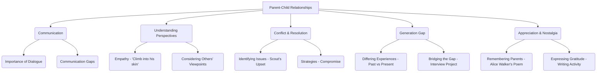

# Class 9 English - Word And Expression Chapter 103
**Language:** English

```markdown
# [Class 9] Word And Expression - Unit 3

## 🌟 Core Concepts

This unit revolves around the theme of **Parent-Child Relationships**, exploring communication, understanding, and changing dynamics across generations.


*   **Hierarchy:** The central theme branches into key aspects like communication challenges, the importance of empathy, methods for resolving disagreements (like compromise), the concept of the generation gap, and expressing appreciation.

## 📘 Key Learnings

This unit enhances various language and life skills through engaging texts and activities.

1.  **Reading Comprehension:**
    *   **Analyzing Narrative:** Understanding character motivations, conflicts, and resolutions in prose (Harper Lee's *To Kill a Mockingbird* extract featuring Scout and Atticus). Students learn to infer feelings and identify the steps taken to resolve a problem.
    *   **Interpreting Poetry:** Grasping themes of memory, nostalgia, and appreciation in poetry (Alice Walker's "Poem at Thirty-Nine"). Students analyze imagery and understand the emotional connection between the speaker and her father.
    *   **Identifying Main Ideas & Details:** Extracting specific information and understanding the central message from different text types.

2.  **Vocabulary Enrichment:**
    *   **Synonyms & Contextual Meaning:** Differentiating between and using synonyms effectively (e.g., *see, watch, look, view, observe, glimpse*). Understanding how context determines the meaning of words (e.g., *reinforce*, *disapprobation*).
    *   **Nuances in Word Usage:** Exploring different meanings of a single word based on context (e.g., *little* meaning small, young, short duration, insignificant).

3.  **Grammar in Use:**
    *   **Reporting Verbs:** Identifying and correctly using various reporting verbs (*advised, reminded, suggested, accused, apologised, confirmed, refused*, etc.) to report speech accurately.
    *   **Punctuation:** Applying rules for capital letters, full stops, commas, and inverted commas for clarity and correctness in writing (Editing exercise).
    *   **Sentence Structure:** Rearranging jumbled words to form grammatically correct and meaningful sentences.

4.  **Communication Skills (Listening, Speaking, Writing):**
    *   **Active Listening:** Comprehending song lyrics ("Que Sera, Sera") to understand questions, responses, and the underlying message about accepting the future.
    *   **Expressive Speaking:** Engaging in discussions about personal experiences with parents, future anxieties, and comfort levels in sharing concerns. Presenting ideas orally.
    *   **Structured Writing:** Composing a personal letter expressing appreciation to parents. Planning and writing an interview-based article, demonstrating organizational skills.

5.  **Critical Thinking & Empathy:**
    *   **Perspective Taking:** Applying Atticus's advice to "climb into his skin and walk around in it" – understanding situations from others' viewpoints.
    *   **Problem Solving:** Analyzing how compromise can be an effective tool for resolving disagreements ("An agreement reached by mutual concessions").
    *   **Reflection:** Connecting the texts and activities to personal life, reflecting on one's own relationships and communication patterns.

## 🧩 Active Learning

*   **Activity: Research-based Case Study Analysis 🔍**
    *   **Interview Project:** Students conduct structured interviews with their parents, researching generational differences in experiences, values, and perspectives (e.g., teenage activities, allowances, parental beliefs, worries). This involves preparing a questionnaire, conducting the interview, and analyzing the gathered information.
    *   **Output:** Presenting findings as a newspaper article, audio/video report, fostering research, writing, and presentation skills.

*   **Discussion: Critical Analysis of Real-world Impacts 🌍**
    *   **Bridging the Generation Gap:** Based on interview findings and text analysis (Scout's conflict, Alice Walker's reflections), students discuss practical ways to improve communication and understanding between generations within their families and society.
    *   **Analyzing Communication Styles:** Critically evaluating Atticus's patient and empathetic approach versus potential communication breakdowns. Discussing the impact of different communication styles in real-life parent-child interactions.

## 📝 Assessment Prep

*   **Case Studies & Text-Based Questions:**
    *   Analyzing the Scout-Atticus interaction: Questions focus on identifying the problem, Atticus's strategy (listening, empathy, compromise), Scout's feelings, and the resolution. Requires understanding character and plot. (Evaluating)
    *   Interpreting Alice Walker's poem: Questions assess comprehension of themes (nostalgia, influence), specific details (savings account, cooking), and figurative language. (Analyzing)
*   **Vocabulary & Grammar Application:**
    *   Exercises testing the correct usage of synonyms, contextual meanings, reporting verbs, punctuation, and sentence formation. (Applying)
*   **Writing Tasks:**
    *   Letter writing (expressing appreciation) assesses structure, tone, and expression. (Creating)
    *   Interview-based article assesses research, organization, and reporting skills. (Creating)
*   **Diagrams for Conceptual Clarity:** Use flowcharts to map conflict resolution (like Atticus's method) or mind maps to explore themes like 'Generation Gap'.

## 🌏 Bharatiya Context

*   **Family Dynamics:** The unit's themes resonate strongly within the Indian context, where family relationships and respect for elders are significant cultural values. Discussions can explore how traditional expectations and modern aspirations sometimes create communication challenges between parents and children in India.
*   **National Economic/Social Data (Exploration):** While the text doesn't provide specific data, the project encourages exploring generational shifts. Students can research (or be guided to) general trends in India regarding education choices, career paths, lifestyle changes (e.g., shift from joint to nuclear families), and how these impact parent-child understanding. For instance, comparing parental experiences of limited career options versus the diverse opportunities available today.
*   **India-Specific Examples:**
    1.  **George Abraham:** The sentence rearrangement exercise features George Abraham, the visually impaired social worker from Noida who was instrumental in promoting cricket for the blind in India, providing an inspiring local example of overcoming challenges.
    2.  **Educational Context:** The conflict between Scout's home learning and school expectations can be related to discussions in India about different teaching methodologies, parental involvement in education, and the pressures of the formal schooling system.
    3.  **Cultural Nuances:** The act of expressing appreciation through a letter can be discussed in the context of Indian cultural norms, where expressing emotions directly to parents might vary across families. The exercise encourages bridging this potential gap.
```