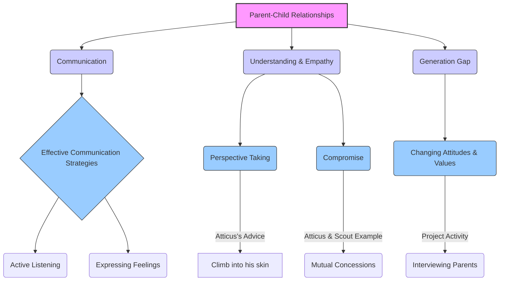

# Class 9 English - Word And Expression Chapter 103
**Language:** English

```markdown
# [Class 9] Word And Expression - Chapter 103

*(Note: This unit corresponds to Unit 3 in the NCERT Words and Expressions - 1 workbook.)*

## 🌟 Core Concepts

This unit delves into the complexities of parent-child relationships, emphasizing communication, empathy, and understanding across generations. It uses literary texts to explore these themes and builds associated language skills.


*Diagram 1: Concept Hierarchy for Unit 3 Themes*

## 📘 Key Learnings

1.  **Empathy in Communication:**
    *   **Concept:** Understanding and sharing the feelings of another person.
    *   **Atticus's Advice:** The unit highlights Atticus Finch's advice to Scout: *"You never really understand a person until you consider things from his point of view... until you climb into his skin and walk around in it."* This emphasizes the importance of perspective-taking for better relationships.
    *   **Application:** Applying empathy helps bridge communication gaps, resolve conflicts, and foster mutual respect, especially between parents and children who may have different viewpoints.

2.  **The Art of Compromise:**
    *   **Definition:** An agreement reached by mutual concessions, where both parties give up something to find a middle ground.
    *   **Example:** Atticus and Scout reach a compromise: Scout agrees to go to school, and Atticus agrees they will continue reading together secretly. This resolves Scout's immediate distress while upholding the necessity of schooling.
    *   **Process:** Compromise involves identifying the core issue, understanding each other's needs/fears, and finding a solution acceptable to both.

3.  **Understanding Generational Perspectives:**
    *   **Theme:** The unit explores how perspectives change over time and across generations, as seen in the introduction, the poem "Poem at Thirty-Nine," the song "Que Sera, Sera," and the project activity.
    *   **Reflection:** Alice Walker's poem shows an adult reflecting on her father's influence and personality, gaining a deeper appreciation with age. The song traces questions about the future across three generations.
    *   **Bridging Gaps:** Recognizing that parents and children grow up in different contexts helps foster understanding and patience.

4.  **Vocabulary Enhancement:**
    *   **Synonyms:** Differentiating between words with similar meanings, like `see`, `watch`, `look at`, `glance`, `gaze`, `stare`, `peep`, `observe`. Understanding the specific context determines the appropriate word choice.
    *   **Polysemy:** Recognizing that a single word, like `little`, can have multiple meanings (small, young, short duration, insignificant amount, etc.) depending on the context.

5.  **Grammar: Reporting Verbs:**
    *   **Function:** Reporting verbs (e.g., `said`, `told`, `asked`, `advised`, `warned`, `suggested`, `agreed`, `refused`, `apologised`, `confirmed`) are used to report what someone else has said or thought.
    *   **Nuance:** The choice of reporting verb conveys the speaker's tone, intention, or the nature of the speech act (e.g., `advised` implies guidance, `warned` implies caution, `accused` implies blame).

    ```mermaid
    graph LR
        subgraph Reporting Speech
            A(Direct Speech) --"Conversion"--> B(Indirect Speech);
        end
        subgraph Indirect Speech Components
            C(Reporting Clause) --> D(Reporting Verb);
            C --> E(Reported Clause);
        end
        D -- Examples --> F(Said);
        D -- Examples --> G(Told);
        D -- Examples --> H(Advised);
        D -- Examples --> I(Suggested);
        D -- Examples --> J(Warned);
        D -- Examples --> K(Agreed);
        D -- Examples --> L(Refused);
        D -- Examples --> M(Apologised);

        %% Styling
        style D fill:#f9d,stroke:#333,stroke-width:1px
    ```
    *Diagram 2: Role of Reporting Verbs in Indirect Speech*

## 🧩 Active Learning

1.  **Activity: Case Study Analysis - The Atticus & Scout Compromise** 🔍
    *   **Objective:** To analyze a real-text example of effective parent-child communication and conflict resolution.
    *   **Task:** Re-read the interaction between Atticus and Scout (Text I).
        *   Identify Scout's initial problem and feelings.
        *   Describe Atticus's listening approach (patience, silence, questioning).
        *   Analyze how Atticus introduces the concept of empathy ("climb into his skin").
        *   Evaluate the compromise reached: What did each person concede? Was it fair? Why was secrecy necessary?
    *   **Outcome:** Students practice critical reading and apply concepts of empathy and compromise to a specific scenario.

2.  **Discussion: Bridging the Generation Gap in the Indian Context** 🌍
    *   **Objective:** To critically analyze the relevance of the unit's themes in students' own lives and cultural context.
    *   **Prompts:**
        *   How does Atticus's calm, respectful approach compare or contrast with typical parent-child communication styles observed in Indian families?
        *   Discuss common areas of disagreement between teenagers and parents in India today (e.g., study habits, career choices, screen time, social life). How can empathy and compromise help resolve these?
        *   Reflect on the poem "Poem at Thirty-Nine". How do relationships with parents evolve as we grow older in the Indian family system (joint families, changing roles)?
        *   The song "Que Sera, Sera" presents a certain acceptance of the future. How does this align with or differ from common attitudes towards destiny and effort in Indian culture?
    *   **Outcome:** Encourages students to evaluate communication dynamics, apply concepts to their context, and develop self-awareness.

## 📝 Assessment Prep

1.  **Case Study Application:**
    *   **Scenario:** *Rohan (15) wants to go on an overnight trip with friends. His parents are hesitant due to safety concerns and feel he is too young. Rohan feels his parents don't trust him.*
    *   **Task:** Imagine you are advising Rohan or his parents. Using the principles of empathy (perspective-taking) and compromise discussed in the unit (like Atticus and Scout), outline steps they could take to discuss the issue and potentially reach a mutually agreeable solution. What specific reporting verbs might be used in their conversation (e.g., Rohan *explained*, parents *expressed* concern, they *suggested* alternatives, they finally *agreed* on...)?

2.  **Diagrammatic Representation:**
    *   **Task 1 (Vocabulary):** Create a visual map or scale showing the intensity or duration implied by different 'looking' verbs: `glance` (quickest) -> `peep` -> `look at` -> `see` -> `observe` -> `watch` -> `gaze` -> `stare` (most intense/fixed).
    *   **Task 2 (Grammar):** Draw a flowchart illustrating the steps Atticus took to resolve the conflict with Scout, highlighting the key communication strategies (Listening -> Empathy -> Defining Problem -> Proposing Compromise -> Agreement).

## 🌏 Bharatiya Context

1.  **Family Communication Styles:** While Atticus models patient, egalitarian communication, discussions can explore the nuances within Indian families, where respect for elders is paramount. How can open dialogue (as encouraged by Atticus) coexist with traditional values? For instance, discussing career choices often requires balancing parental expectations (often focused on security, e.g., engineering/medicine) with a child's passion, demanding empathy and compromise from both sides.

2.  **Understanding Generational Shifts:** The project activity (interviewing parents) is highly relevant in India, where societal changes (urbanization, technology, economic liberalization) have created significant differences between the experiences of parents and children. Topics like pocket money (comparing amounts and freedom of spending then and now), rules about going out, or views on education reflect these shifts. *Example: A parent might share how they had limited pocket money (e.g., ₹10 per month) primarily for bus fare, while today's teens might receive more but face different pressures.*

3.  **Empathy in Diverse Family Structures:** India's diverse family structures (nuclear, joint, extended) present unique communication dynamics. Applying Atticus's principle of "climbing into someone's skin" can be discussed in the context of understanding the perspectives of not just parents, but also grandparents, uncles, aunts, or cousins within a shared household, each potentially holding different values or expectations. *Example: Understanding why a grandparent living in a joint family might be stricter about traditional attire or timings compared to parents.*

4.  **Literature and Values:** While the texts are Western, the core values of empathy, respect, and understanding are universal and resonate with Indian ethos (e.g., 'Vasudhaiva Kutumbakam' - the world is one family, implying interconnectedness and understanding). The exercises encourage students to apply these universal values within their specific cultural framework.
```