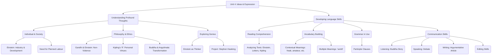

# Class 9 English - Word And Expression Chapter 104
**Language:** English

```markdown
# [Class 9] Word And Expression - Unit 4

## 🌟 Core Concepts

This unit explores profound ideas about life, society, and personal conduct through various texts and activities. Key concepts include:

1.  **Individual Development vs. Societal Pressures:**
    *   Impact of industrialization and technology (Einstein's view).
    *   Need for planned work and security for individual growth.
2.  **Philosophy of Non-Violence:**
    *   Success through non-violent means (Gandhi, admired by Einstein).
    *   Potential for international peace through non-violent principles.
3.  **Personal Virtues and Resilience (Kipling's "If—"):**
    *   Maintaining composure and self-belief amidst criticism.
    *   Balancing dreams/thoughts with reality.
    *   Treating success and failure equally (Triumph and Disaster as impostors).
    *   Perseverance and rebuilding after loss.
    *   Integrity, humility, and maintaining the 'common touch'.
    *   Making the most of time.
4.  **Transformation and Compassion:**
    *   The power of kindness and inner strength to change others (Buddha and Angulimala).
5.  **The Nature of Genius:**
    *   Exploring attributes of genius through figures like Einstein and Hawking.
6.  **Language and Communication:**
    *   Understanding nuanced meanings (Vocabulary exercises).
    *   Using grammar effectively (Participle Clauses).
    *   Developing listening, speaking (Debate), and writing (Argumentative Article) skills.

📊 **Concept Hierarchy:**



## 📘 Key Learnings

1.  **Einstein on Modern Society:** Industrialization, while advancing civilization, increases the struggle for existence, hindering free individual development. A planned division of labour is proposed as a solution, offering material security and spare time for personal growth.
2.  **Einstein & Gandhi - A Meeting of Minds:** Their letters reveal mutual admiration. Einstein lauded Gandhi for demonstrating the power of non-violence, hoping it would inspire international peace. Gandhi expressed consolation that his work found favour with Einstein and wished they could meet in India. Both shared a deep concern for humanity and peace.
3.  **Kipling's "If—" - A Guide to Manhood:** The poem advises maintaining equilibrium ("keep your head"), self-trust ("trust yourself"), patience, honesty ("don't deal in lies"), humility ("don't look too good, nor talk too wise"), resilience ("treat triumph and disaster just the same", "start again at your beginnings"), perseverance ("hold on"), integrity ("keep your virtue"), and empathy ("nor lose the common touch"). Fulfilling these conditions leads to mastering oneself and the world.

    📈 **Diagram: Key Virtues in Kipling's "If—"**
    ```mermaid
    mindmap
      root((If— : Path to Maturity))
        ::icon(fa fa-user)
        Stanza 1
          Composure
          Self-Trust
          Patience
          Honesty
          Humility
        Stanza 2
          Balanced Dreams/Thoughts
          Equanimity (Triumph/Disaster)
          Truthfulness
          Resilience (Rebuilding)
        Stanza 3
          Risk-Taking
          Handling Loss
          Perseverance (Willpower)
        Stanza 4
          Integrity with Crowds/Kings
          Maintaining Common Touch
          Impartiality
          Valuing Time
    ```

4.  **Participle Clauses:** These are used to combine sentences with the same subject more concisely, often indicating time, cause, or condition. The present participle (-ing form) is used when one action happens simultaneously with or just before another.
    *   *Example:* `He felt sleepy.` + `He went to bed.` → `Feeling sleepy, he went to bed.`

5.  **Vocabulary in Context:** Understanding words like `decadence` (decline), `detriment` (harm), `impostor` (deceiver), `knave` (dishonest person), `freak` (unusual person), `amateur` (non-professional), `tolerance` (respecting differences), `philistine` (indifferent to culture), `vocational` (job-related training). The word 'world' has various meanings: everything important (`means the world`), the planet (`sailed round the world`), a specific field (`world of fashion`), different spheres (`sporting and artistic worlds`), reality (`real world`).
6.  **Transformation through Compassion:** The story of Buddha and Angulimala illustrates that calm, fearless compassion and kind words can transform even a hardened criminal. Angulimala, moved by Buddha's presence, renounced violence and became a respected monk.

## 🧩 Active Learning

*   **Activity: Research-based Project 🔍:** Investigate the life and work of Stephen Hawking. Define 'genius', identify its attributes, analyze how Hawking exemplified genius despite physical challenges, list his major contributions and writings, and explore inspiring qualities mentioned in obituaries. This involves research, synthesis, and presentation of findings.
*   **Discussion: Critical Analysis & Debate 🌍:**
    *   **Quotes Analysis:** Discuss how quotes from personalities like Tagore, Einstein, Keller, and Bose reflect their character and ideas.
    *   **Debate:** Argue for or against the motion: "Our happiness in life depends entirely on our mental attitude." Requires structuring arguments, providing reasons, and engaging in formal debate etiquette.
    *   **Argumentative Writing:** Discuss and write an article on "New technology is common, New thinking is rare," presenting logical arguments for a chosen stance.

## 📝 Assessment Prep

*   **Comprehension:** Answering questions based on unseen passages (like Einstein's text, Gandhi-Einstein letters, Kipling's poem). Includes MCQs, short answers, and vocabulary-based questions (synonyms, antonyms, contextual meaning).
*   **Vocabulary:** Identifying meanings, opposites, and using words appropriately in context. Understanding multiple meanings of words.
*   **Grammar:** Applying knowledge of participle clauses to combine sentences correctly. Identifying and correcting grammatical errors in sentences (Editing).
*   **Writing & Speaking:** Evaluating skills through the argumentative article and debate participation, focusing on structure, logic, clarity, and language use.
*   **Project Work:** Assessing research, analytical, and presentation skills through the Stephen Hawking project.
*   **Case Studies & Diagrams:** Using the analysis of personalities (Einstein, Gandhi, Kipling, Buddha, Hawking) and diagrams (like the Kipling mind map or participle clause structure) to understand and explain concepts.

## 🌏 Bharatiya Context

1.  **Mahatma Gandhi:** His philosophy of non-violence (`Ahimsa`) and its success in India's freedom struggle are highlighted through Einstein's admiration. His wish to meet Einstein at his Ashram in India connects the discussion to a specific Indian setting.
2.  **Gautama Buddha:** The story of Buddha transforming the robber Angulimala is a significant narrative from Indian history and Buddhist tradition, illustrating core values of compassion, fearlessness, and the potential for inner change. This event is traditionally associated with the region of Kosala in ancient India.
3.  **Rabindranath Tagore & Subhas Chandra Bose:** The quotes at the beginning likely belong to these iconic Indian figures (Tagore: "Simple to be happy..."; Bose: "Individual may die for an idea..."), connecting the unit's themes to Indian thought leaders in philosophy, literature, and nationalism. (Note: While pictures are mentioned, specific names aren't explicitly confirmed in the provided text excerpt, but these are the standard attributions for these quotes in this context).
4.  **National Context:** While not explicitly economic data, the discussions touch upon societal well-being, individual development, and ethical leadership, relevant to India's social fabric and development goals. The emphasis on non-violence and compassion resonates deeply within the Indian cultural and historical landscape.

```