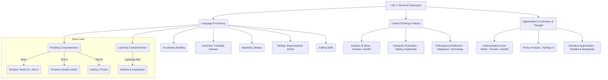

# Class 9 English - Word And Expression Chapter 104
**Language:** English

```markdown
# [Class 9] Word And Expression - Chapter 104

This unit focuses on enhancing reading comprehension, vocabulary, grammar, and communication skills through engagement with inspiring texts and personalities. It encourages critical thinking about societal issues, personal values, and the power of ideas.

## 🌟 Core Concepts

This unit explores several interconnected concepts:

1.  **Language Proficiency & Comprehension:**
    *   **Reading Comprehension:** Analysing expository texts (Einstein), correspondence (Einstein-Gandhi), poetry (Kipling), and narrative texts (Buddha-Angulimala). 📖
    *   **Vocabulary Development:** Understanding words in context (decadence, detriment, impostor, knave), identifying synonyms/antonyms, recognizing multiple meanings ('world'), and using prefixes (en-, un-). 💡
    *   **Grammar:** Understanding and applying Participle Clauses (specifically present participles) for concise expression. ⚙️
    *   **Listening Comprehension:** Extracting specific information and understanding the main theme from an orally presented story. 👂
    *   **Speaking & Writing:** Developing argumentative skills through debate and structured writing. 🗣️✍️
    *   **Editing:** Identifying and correcting grammatical errors in written text. ✔️

2.  **Critical Thinking & Values:**
    *   **Analysis of Ideas:** Evaluating Einstein's perspective on industrialization and individual development; understanding the principles behind non-violence (Gandhi). 🤔
    *   **Character Evaluation:** Interpreting the virtues advocated in Kipling's "If" (e.g., self-control, resilience, humility, integrity); analysing the transformation of Angulimala. ✨
    *   **Philosophical Reflection:** Considering the relationship between attitude and happiness, technology and thinking. 🧠

3.  **Appreciation of Great Minds & Literature:**
    *   Recognizing the contributions and ideas of global figures like Albert Einstein and Mahatma Gandhi.
    *   Understanding the structure, language, and message of poetry (Kipling's "If").
    *   Appreciating the narrative and moral lessons in stories (Buddha and Angulimala).

📊 **Concept Hierarchy:**



## 📘 Key Learnings

*   **Reading Analysis:** Learn to dissect complex texts. For instance, Einstein's view links industrial development directly to a more severe struggle for existence, potentially harming individual growth. He proposes a 'planned division of labour' as a solution for material security and individual development.
    *   📈 **Einstein's Argument Flow:**
        `Industrial/Machinery Development` -> `Increased Struggle for Existence` -> `Detriment to Individual Development`
        `Solution: Planned Division of Labour` -> `Material Security + Spare Time` -> `Further Individual Development` -> `Healthy Community`
*   **Correspondence Insights:** The Einstein-Gandhi letters reveal mutual respect between two influential figures. Einstein admired Gandhi's success with non-violence, hoping it would inspire international peace. Gandhi found Einstein's approval a "great consolation" and expressed a wish to meet in India.
*   **Poetic Virtues (Kipling's "If"):** The poem provides a blueprint for ideal conduct, emphasizing:
    *   **Equanimity:** Treating "Triumph and Disaster" as equals ("impostors").
    *   **Resilience:** Rebuilding after loss ("stoop and build ‘em up with wornout tools").
    *   **Integrity:** Maintaining virtue amidst crowds and humility with kings ("keep your virtue," "nor lose the common touch").
    *   **Perseverance:** Holding on through sheer will ("Hold on!").
*   **Grammar - Present Participle Clauses:** These clauses economize writing by combining sentences where the subject performs two actions, often simultaneously or sequentially. The first action is typically converted into a present participle (-ing form).
    *   Example: `He stood by the temple.` + `He asked people to go in.` -> `Standing by the temple, he asked people to go in.`
    *   📈 **Structure:** `[Present Participle Phrase (-ing)...], [Main Clause (Same Subject)]`
*   **Vocabulary in Context:** Understand that words derive meaning from their usage. 'Decadence' refers to moral/cultural decline in Einstein's text. 'World' can mean the planet, a specific field (fashion world), existence, or something highly valued ('means the world to me').
*   **Transformation through Compassion:** The story of Buddha and Angulimala illustrates that even a feared criminal can be transformed through encountering wisdom, calmness, and kindness, leading to redemption and respect.

## 🧩 Active Learning

*   **Activity: Research-based case study analysis 🔍**
    *   **Task:** Revisit the Class VIII text on Stephen Hawking and conduct further research (using reliable web resources) on his life, challenges, and contributions.
    *   **Focus:** Define 'genius'. Identify attributes like intellect, perseverance, creativity, and impact. Analyse how Hawking embodied these, particularly his resilience against physical limitations and his groundbreaking work in cosmology.
    *   **Output:** Prepare a short report or presentation evaluating Stephen Hawking as a 'genius', highlighting his most inspiring qualities and major achievements (e.g., his work on black holes, his book "A Brief History of Time").
*   **Discussion: Critical analysis of real-world impacts 🌍**
    *   **Topic 1 (Debate):** "Our happiness in life depends entirely on our mental attitude." Form two groups (For/Against). Prepare arguments using points from Kipling's poem, the Buddha story, and real-life examples. Structure your points logically (Introduction, Arguments with evidence, Conclusion).
    *   **Topic 2 (Discussion):** "New technology is common, New thinking is rare." Brainstorm the meaning of this statement. Discuss the pace of technological advancement versus genuine innovation in thought or solutions to societal problems. Relate to Einstein's views on machinery and society. Evaluate the statement's validity in today's world, citing examples.

## 📝 Assessment Prep

Prepare for assessments by focusing on:

*   **Comprehension Questions:** Practice answering questions based on the provided texts (Einstein, Einstein-Gandhi letters, Kipling's "If", Buddha-Angulimala). Focus on identifying main ideas, specific details, author's purpose, and inferential meanings.
*   **Vocabulary Exercises:** Be ready for tasks like finding contextual meanings, identifying synonyms/antonyms (e.g., opposites from Einstein's letter: possible/impossible, succeed/fail, war/peace, presence/absence, friend/enemy), and 'odd one out' questions.
*   **Grammar Application:** Practice identifying and correcting errors (Editing task) and combining sentences using present participle clauses.
    *   📈 **Participle Clause Check:** Ensure the subject of the participle phrase and the main clause is the same. *Example: Waiting for the doctor, **Dave** read a magazine.* (Correct: Dave was waiting and Dave read).
*   **Case Studies & Analysis:**
    *   **Einstein-Gandhi:** Analyse the significance of their exchange – what does it tell us about their values and hopes for the world? (Focus: Non-violence, Internationalism).
    *   **Buddha-Angulimala:** Evaluate the factors leading to Angulimala's transformation. What does the story teach about human nature and influence? (Focus: Compassion, Change, Fearlessness).
*   **Diagram Interpretation:** Understand diagrams explaining concepts like Einstein's argument or the structure of participle clauses.

## 🌏 Bharatiya Context

This unit connects significantly with Indian figures, philosophy, and values:

1.  **Mahatma Gandhi 🇮🇳:** Featured prominently through his correspondence with Albert Einstein. His philosophy of **Ahimsa (non-violence)** is acknowledged by Einstein as a powerful method capable of success even against violent opposition. Gandhi's wish to meet Einstein at his **Ashram in India** grounds their interaction in a specific Indian setting.
2.  **Gautama Buddha 🇮🇳:** The story of Buddha and Angulimala draws from ancient Indian narratives. It showcases core Buddhist principles originating in India – **compassion (Karuna)**, **fearlessness**, the potential for inner **transformation**, and the path from violence to **holiness (monkhood)**.
3.  **Rabindranath Tagore 🇮🇳:** Although not explicitly named in the main texts, the introductory quote, "It is very simple to be happy, but it is very difficult to be simple," is widely attributed to him, representing Indian philosophical thought on simplicity and happiness.
4.  **Subhas Chandra Bose 🇮🇳:** The quote, "One individual may die for an idea, but that idea will, after his death, incarnate itself in a thousand lives," resonates strongly with figures like Bose and other freedom fighters, reflecting the spirit of sacrifice for a larger cause prevalent in the Indian independence movement.
5.  **Values:** The themes explored – non-violence, resilience (Kipling's "If"), inner peace, the importance of individual development (Einstein), and transformation (Buddha) – resonate deeply with diverse philosophical and spiritual traditions within India.

*(Note: While the prompt mentioned 'Economic Data', the provided text focuses more on philosophical, biographical, and linguistic aspects within a broadly cultural context, particularly highlighting Indian figures and thought.)*
```