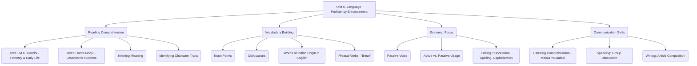
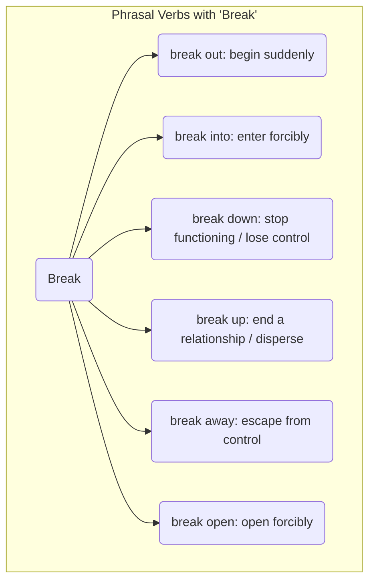

# Class 9 English - Word And Expression Chapter 106
**Language:** English

```markdown
# [Class 9] Word And Expression - Unit 6

## 🌟 Core Concepts

This unit enhances English language proficiency through engaging texts and activities, focusing on comprehension, vocabulary expansion, grammatical accuracy, and communication skills.


*Diagram: Concept Hierarchy of Unit 6*

## 📘 Key Learnings

**1. Reading Comprehension & Critical Evaluation:**
   - **Analyzing Autobiographical Texts (Gandhi):** Students learn to extract specific information, identify character traits (honesty, shyness, respect), and evaluate the significance of formative incidents (e.g., the 'kettle' spelling incident) from M.K. Gandhi's childhood. This involves understanding implied meanings and the author's perspective.
   - **Evaluating Persuasive Texts (Indra Nooyi):** Students analyze the structure and content of a speech, identifying key messages or lessons (lifelong learning, passion, helping others). They evaluate the relevance and applicability of these lessons in different contexts.

**2. Vocabulary Enrichment:**
   - **Word Formation (Nouns):** Understanding how nouns are formed from verbs (e.g., `know` -> `knowledge`, `achieve` -> `achievement`).
   - **Collocations:** Recognizing words that commonly occur together (e.g., `communal harmony`, `felt need`, `sound proof`).
   - **Etymology (Indian Origin Words):** Identifying English words borrowed from Indian languages (e.g., `chutney`, `karma`, `pucca`, `jungle`, `shampoo`).
   - **Phrasal Verbs (Focus: 'Break'):** Understanding how prepositions change the meaning of a base verb (`break out`, `break into`, `break down`, `break up`, `break away`, `break open`).


*Diagram: Meanings of Phrasal Verbs with 'Break'*

**3. Grammar: Passive Voice:**
   - **Structure and Formation:** Learning the structure: `Object + be (appropriate form) + Past Participle + (by + Subject/Agent)`.
   - **Usage:** Understanding when to use the passive voice, particularly when the action is more important than the doer, or when the doer is unknown or obvious (e.g., news headlines, process descriptions).

```mermaid
graph LR
    A[Active: Subject + Verb + Object] --> B(Identify S, V, O);
    B --> C{Object becomes New Subject};
    C --> D{Use 'be' verb (matching tense) + Past Participle of Main Verb};
    D --> E[Optional: Add 'by + Original Subject (Agent)'];
    E --> F[Passive Sentence];

    subgraph Example
        G(Active: The teacher set five words.) --> H(Passive: Five words were set by the teacher.);
    end
```
*Diagram: Active to Passive Voice Conversion Process*

**4. Editing Skills:**
   - Applying rules of punctuation (full stops, commas, inverted commas), capitalization, and correcting common spelling errors within a given text. This enhances proofreading ability and attention to detail.

**5. Integrated Communication Skills:**
   - **Listening:** Comprehending spoken English (Malala's speech), identifying main ideas, specific details, and the speaker's purpose and tone.
   - **Speaking:** Participating in group discussions, articulating thoughts clearly, and collaborating to present ideas on given themes (ancestral house, secure childhood, etc.).
   - **Writing:** Composing a structured article on a given topic (Importance of Youth), using appropriate vocabulary and grammatical structures, and adhering to word limits.

## 🧩 Active Learning

**1. Activity: Comparative Case Study Analysis 🔍**
   - **Task:** Form groups. Each group selects two personalities featured in the unit (Gandhi, Nooyi, Malala, Kalam). Research (using the provided texts as primary sources) and compare their core messages regarding personal values, success, and social responsibility.
   - **Evaluation:** Evaluate the applicability of their philosophies in the context of a Class 9 student's life in contemporary India. Which principles resonate most, and why?
   - **Creation:** Create a short presentation (3-5 slides or a chart paper summary) highlighting the key comparisons and your group's evaluation. Present findings to the class.
   *Bloom's Level: Evaluating, Creating*

**2. Discussion: Critical Analysis of Real-World Impacts 🌍**
   - **Topic:** "Greatness comes not from a position, but from helping build a future." (Indra Nooyi). Discuss this statement in the context of the examples provided (Gandhi, Nooyi, Malala, Kalam) and other known Indian figures (e.g., social reformers, scientists, artists).
   - **Analysis:** Critically analyze how individuals, even without formal positions of power, can contribute to societal progress in India. Consider challenges and opportunities. How does education (a key theme in Malala's and Kalam's context) empower individuals to 'help others rise'?
   - **Evaluation:** Evaluate the role of individual responsibility versus systemic change in building a better future for the nation.
   *Bloom's Level: Analyzing, Evaluating*

## 📝 Assessment Prep

**1. Case Study Application:**
   - **Scenario:** Read the following excerpt about Sudha Murty, an Indian engineering teacher, author, and philanthropist: "Sudha Murty often writes about challenging social norms and the importance of simple living and compassion. In one instance, she wrote a postcard to J.R.D. Tata complaining about the 'men only' policy at Telco, which led to her becoming the company's first female engineer. She believes in using her wealth and influence to uplift the underprivileged, particularly through education."
   - **Task:**
     - Identify two character traits of Sudha Murty evident from the description. (Understanding)
     - Compare her approach to challenging norms with Gandhi's approach to injustice as hinted in the 'kettle' incident. (Analyzing)
     - Evaluate how her actions align with Indra Nooyi's lesson to "help others rise". (Evaluating)

**2. Grammar Transformation & Application:**
   - **Task 1 (Passive Voice):** Rewrite the following sentences about India's achievements into the passive voice, focusing on the achievement itself.
     - India launched the Chandrayaan-3 mission successfully.
     - The government has implemented several digital literacy programs.
     - ISRO develops advanced satellite technology.
   - **Task 2 (Phrasal Verbs):** Fill in the blanks with the correct form of a phrasal verb using 'break' (break out, break into, break down, break up, break away, break open).
     - The thieves ______ the jewellery store last night.
     - Discussions between the two groups ______ without any agreement.
     - A fire ______ in the market complex due to a short circuit.
     - The old car ______ on the highway.

**3. Diagram-Based Explanation:**
   - **Task:** Create a flowchart illustrating the steps involved in implementing Indra Nooyi's first lesson: "Be a lifelong student." Start with 'Develop Curiosity' and include at least 4 subsequent steps based on the text's implication. (Creating)

## 🌏 Bharatiya Context

This unit connects learning to the Indian context through various elements:

1.  **Iconic Indian Figures:**
    *   **Mahatma Gandhi:** Extracts from his autobiography provide insights into the formative years of the 'Father of the Nation', highlighting values like honesty and respect deeply ingrained in Indian culture.
    *   **Dr. A.P.J. Abdul Kalam:** Referenced in the writing prompt, his birthday (Oct 15th) being declared World Students' Day by the UN underscores India's contribution to global thought leadership and the emphasis on youth and education. The chapter 'My Childhood' (referenced in the unit) is about him.
    *   **Indra Nooyi:** An example of a globally successful leader of Indian origin, acknowledging her Indian upbringing as foundational to her success. Her speech was delivered at the Rashtrapati Bhawan, the official residence of the President of India.
    *   **Presidents of India:** The introductory activity focuses on identifying the Presidents, reinforcing knowledge about India's Head of State and its democratic structure.

2.  **Cultural & Social Themes:**
    *   **Shravana Pitribhakti Nataka:** The story of Shravana Kumar, known for his devotion to his parents, is a significant cultural reference highlighting the value placed on filial piety in India.
    *   **Communal Harmony & Social Barriers:** These terms, used in the Speaking activity prompts, relate directly to the social fabric and challenges within India, encouraging discussion on national integration and equality.
    *   **Education:** Malala Yousafzai's struggle (Listening task), though originating in Pakistan, resonates strongly with the importance placed on the Right to Education in India and ongoing efforts to ensure access for all children.

3.  **Language:**
    *   **Indian English:** The vocabulary section explicitly asks students to find English words of Indian origin, acknowledging the contribution of Indian languages to the global English lexicon. Examples like `chutney`, `karma`, `pucca` are part of everyday vocabulary for many Indians.

These references provide relatable contexts for students, linking language learning with national identity, cultural values, and contemporary social awareness. The unit implicitly celebrates Indian leadership, values, and cultural richness while developing essential English skills.
```