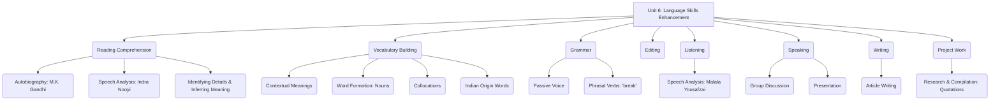

# Class 9 English - Word And Expression Chapter 106
**Language:** English

```markdown
# [Class 9] Word And Expression - Unit 6

## 🌟 Core Concepts

This unit focuses on enhancing various English language skills through engaging texts and activities.

1.  **Reading Comprehension:**
    *   Understanding autobiographical narratives (M.K. Gandhi).
    *   Analyzing motivational speeches (Indra Nooyi).
    *   Identifying main ideas, specific details, and author's purpose.
    *   Inferring meaning and character traits.
2.  **Vocabulary Enrichment:**
    *   Understanding word meanings in context (e.g., *mediocre, prompt, indelible, atrophy, meritocracy*).
    *   Forming nouns from verbs (e.g., *know -> knowledge*).
    *   Recognizing collocations (words that go together, e.g., *communal harmony*).
    *   Identifying English words of Indian origin (e.g., *chutney, karma, pucca*).
3.  **Grammar Focus:**
    *   **Passive Voice:** Understanding its structure and usage, especially in descriptive processes and news headlines.
    *   **Phrasal Verbs:** Recognizing verbs combined with prepositions (e.g., *break out, break down*) and understanding their specific meanings.
4.  **Editing Skills:**
    *   Correcting errors in punctuation (capital letters, full stops, commas, inverted commas).
    *   Identifying and correcting spelling mistakes.
5.  **Listening Comprehension:**
    *   Understanding speeches on significant themes (Malala Yousafzai on education and peace).
    *   Extracting specific information and identifying key messages.
6.  **Speaking Skills:**
    *   Participating in group discussions on given themes.
    *   Presenting ideas coherently.
7.  **Writing Skills:**
    *   Writing articles on relevant social themes (e.g., role of youth).
8.  **Project Work:**
    *   Researching and compiling information (e.g., quotations).
    *   Creative presentation (e.g., collage).

📊 **Concept Hierarchy:**



## 📘 Key Learnings

1.  **Reading Comprehension Strategies:**
    *   **Skimming:** Quickly reading to get the main idea (e.g., understanding Gandhi's text is about his school days).
    *   **Scanning:** Looking for specific information (e.g., finding the word Gandhi misspelt - 'Kettle').
    *   **Inferential Reading:** Understanding implied meanings (e.g., inferring Gandhi's honesty from the 'copying' incident).
    *   **Analyzing Tone & Purpose:** Recognizing the inspirational tone in Indra Nooyi's speech and its purpose to motivate.

2.  **Vocabulary Development Techniques:**
    *   **Context Clues:** Guessing word meanings from surrounding sentences (e.g., understanding *atrophy* means decline due to underuse from the context of losing curiosity).
    *   **Word Formation:** Adding suffixes to change word class (e.g., *achieve* (verb) -> *achievement* (noun)).
    *   **Collocations:** Learning words that naturally pair together enhances fluency (e.g., *lifelong student*, *throw yourself into*, *communal harmony*).

3.  **Grammar - Passive Voice:**
    *   Used when the action is more important than the doer, or the doer is unknown/obvious.
    *   **Structure:** Object + `be` verb (correct tense) + Past Participle (V3) + (by + Subject).
    *   **Example (Washing Machine):** "Dirty clothes **are taken** for washing." (Focus on the clothes and the action, not who takes them).
    *   **Example (News Headline):** "Bank robbed" -> "A bank **was robbed** in broad daylight." (Focus on the event).

    📈 **Diagram: Active to Passive Transformation**
    ```mermaid
    graph LR
        A[Active: Subject + Verb + Object] --> B(Passive: Object + be + V3 + [by Subject]);
        C[Example: The teacher set five words.] --> D[Example: Five words were set by the teacher.];
    ```

4.  **Grammar - Phrasal Verbs:**
    *   A verb combined with a preposition or adverb, creating a meaning different from the original verb.
    *   **Example ('break'):**
        *   `break out`: begin suddenly (e.g., The Second World War *broke out*...)
        *   `break down`: stop functioning (e.g., The bus *broke down*.)
        *   `break into`: enter forcibly (e.g., The burglar *broke into* the house.)
        *   `break up`: end a relationship (e.g., Neha's relationship *broke up*.)
        *   `break away`: escape from control (e.g., The child tried to *break away*.)

    📈 **Diagram: Phrasal Verb Structure**
    ```mermaid
    graph TD
        P[Phrasal Verb] --> V(Verb);
        P --> R(Preposition/Adverb);
        V -- + --> R;
        R -- = --> M(New Meaning);
        subgraph Example
            V1(break) -- + --> R1(down);
            R1 -- = --> M1(stop functioning);
        end
    ```

5.  **Editing:** Applying rules of punctuation (capitalization, commas, full stops, quotation marks) and spelling to ensure clarity and correctness. Example: Correcting "once the Fairies..." to "Once, the fairies..."

## 🧩 Active Learning

*   **Activity: Research-based Case Study Analysis 🔍**
    *   **Task:** Research the lives and contributions of the Presidents of India listed chronologically at the beginning of the unit. Create a brief profile for two presidents, focusing on their background and key achievements during their term. (Connects to identifying figures, research skills).
    *   **Extension:** Find English words of Indian origin beyond the examples given. Research their etymology (origin and history). (Connects to Vocabulary).

*   **Discussion: Critical Analysis of Real-world Impacts 🌍**
    *   **Topic 1 (Based on Indra Nooyi):** Discuss the three lessons shared by Indra Nooyi. How relevant are they for students in India today? Evaluate the concept of 'meritocracy' in the Indian context.
    *   **Topic 2 (Based on Malala):** Analyze the importance of the rights Malala speaks about (peace, dignity, equality, education) in contemporary India. Discuss the challenges and progress related to girls' education in different parts of the country.
    *   **Topic 3 (Based on Gandhi):** Evaluate the significance of honesty and integrity, as exemplified by young Gandhi's refusal to copy. How can these values be cultivated in school environments?

## 📝 Assessment Prep

*   **Case Studies & Comprehension:** Be prepared to answer questions based on unseen passages, similar to the texts on Gandhi and Indra Nooyi. Focus on identifying facts, inferring meanings, understanding vocabulary in context, and recognizing character traits or key messages.
*   **Grammar Application:**
    *   Transform sentences from Active to Passive voice and vice-versa.
    *   Fill in blanks using the correct form of the passive voice (like the washing machine exercise).
    *   Use appropriate phrasal verbs (especially those with 'break') to replace underlined words or complete sentences.
*   **Vocabulary Tasks:** Questions on synonyms, noun forms, collocations, and identifying words of Indian origin.
*   **Editing:** Correcting passages for punctuation and spelling errors.
*   **Writing:** Practice writing short articles (120-150 words) on given themes, ensuring logical structure and correct grammar.
*   **Diagrams:** Understand and potentially replicate simple diagrams explaining grammar concepts like Passive Voice structure or Phrasal Verb formation (as shown in Key Learnings).

## 🌏 Bharatiya Context

This unit strongly integrates Indian context and figures:

1.  **National Leaders & Icons:**
    *   Features **Presidents of India**, prompting identification and understanding of their role as the 'First Citizen'.
    *   Includes an excerpt from the autobiography of **Mahatma Gandhi**, highlighting his formative years and values.
    *   Presents a speech by **Indra Nooyi**, a prominent Indian-American business leader, delivered at the **Rashtrapati Bhawan** and referencing her Indian upbringing.
    *   Mentions **Dr. A.P.J. Abdul Kalam**, whose birthday is celebrated as World Students' Day, linking him to the youth of **New India**.
    *   References **Shravana Pitribhakti Nataka**, a story from Indian epics that influenced Gandhi.
    *   Malala Yousafzai's speech references **Mahatma Gandhi**, **Bacha Khan**, and **Mother Teresa** as sources of inspiration for non-violence and compassion.
2.  **Social & Cultural References:**
    *   Uses terms like **'pucca'** (from 'My Childhood' chapter reference) and encourages finding more English words of **Indian origin** (*chutney, karma, guru, pundit, avatar, jungle, loot, bungalow* etc.).
    *   Discusses themes relevant to India like **communal harmony**, **social barriers**, and the importance of education.
3.  **Data & Institutions:**
    *   Refers to the **Rajasthanik Court** where Gandhi's father worked.
    *   Mentions the **NDTV** award conferred upon Indra Nooyi.
    *   Uses **Rashtrapati Bhawan** as the setting for Indra Nooyi's speech.

This integration helps students connect language learning with their national heritage, prominent personalities, and social realities.
```