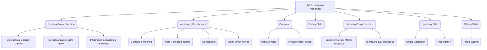

# Class 9 English - Word And Expression Chapter 106
**Language:** English

```markdown
# [Class 9] Word And Expression - Unit 6

## 🌟 Core Concepts

This unit focuses on enhancing English language proficiency through engaging texts and structured exercises. Key areas include:

1.  **Reading Comprehension:**
    *   Understanding biographical excerpts (M.K. Gandhi).
    *   Analyzing speeches (Indra Nooyi).
    *   Extracting specific information and identifying main ideas.
    *   Inferring character traits and author's purpose.
2.  **Vocabulary Development:**
    *   Understanding words in context.
    *   Word formation (specifically noun forms).
    *   Identifying and using collocations (words that go together).
    *   Recognizing English words of Indian origin.
3.  **Grammar:**
    *   **Passive Voice:** Understanding its structure and usage, particularly in process descriptions and news headlines.
    *   **Phrasal Verbs:** Recognizing verbs combined with prepositions (e.g., 'break out', 'break down') and understanding their distinct meanings.
4.  **Editing Skills:**
    *   Correcting errors in punctuation (capital letters, full stops, commas, inverted commas).
    *   Identifying and correcting spelling mistakes.
5.  **Listening Comprehension:**
    *   Understanding a speech excerpt (Malala Yousafzai).
    *   Identifying key messages, specific details, and speaker's purpose.
6.  **Speaking Skills:**
    *   Participating in group discussions on given themes.
    *   Presenting ideas coherently.
7.  **Writing Skills:**
    *   Writing articles on relevant topics (e.g., role of youth).
    *   Structuring ideas logically within a word limit.

📊 **Concept Hierarchy:**



## 📘 Key Learnings

1.  **Reading Comprehension Strategies:**
    *   **Scanning:** Quickly finding specific details (e.g., names, dates, places like Porbandar, Rajkot).
    *   **Skimming:** Getting the general idea of a passage (e.g., Gandhi's school days, Nooyi's life lessons).
    *   **Inferential Reading:** Understanding implied meanings (e.g., Gandhi's honesty from the 'kettle' incident, Nooyi's emphasis on continuous learning).
    *   **Identifying Tone and Purpose:** Recognizing the reflective tone in Gandhi's writing and the motivational tone in Nooyi's speech.

2.  **Vocabulary Enrichment:**
    *   **Noun Formation:** Learn how verbs or adjectives change form to become nouns (e.g., `know` -> `knowledge`, `accept` -> `acceptance`, `oblige` -> `obligation`).
    *   **Collocations:** Understand that certain words naturally pair together (e.g., `lifelong student`, `tremendous success`, `communal harmony`, `felt-tip pen`).
    *   **Indianisms in English:** Recognize words borrowed from Indian languages (e.g., `Chutney`, `Karma`, `Pucca`, `Guru`, `Yoga`, `Avatar`, `Jungle`, `Pundit`, `Shampoo`, `Bungalow`).

3.  **Grammar - Passive Voice:**
    *   **Structure:** `Object + be (is/am/are/was/were/been/being) + Past Participle (V3) + [by + Subject]`
    *   **Usage:**
        *   When the action is more important than the doer.
        *   When the doer is unknown or obvious.
        *   In formal/scientific writing and news reports.
    *   **Example (Process):** "Dirty clothes **are taken** for washing." -> Focus is on the clothes and the action.
    *   **Example (News):** "Bank **robbed** in broad daylight." -> Expanded: "A bank **was robbed** by unknown persons..."

    📈 **Diagram: Passive Voice Transformation**
    *   Active: Subject (Doer) -> Verb -> Object (Receiver)
        *   *Example:* The teacher **set** five words.
    *   Passive: Object (Receiver) -> `be` + Past Participle -> [by + Subject (Doer)]
        *   *Example:* Five words **were set** by the teacher.

4.  **Grammar - Phrasal Verbs (with 'break'):**
    *   Understand that combining 'break' with different prepositions creates new meanings:
        *   `break out`: to begin suddenly (war, fire, disease). *As used in 'My Childhood'*.
        *   `break down`: stop functioning (machine); lose control emotionally.
        *   `break into`: enter forcibly (burglary).
        *   `break away`: escape from control.
        *   `break up`: end a relationship; disintegrate.
        *   `break open`: open forcibly.

5.  **Editing:** Focus on applying rules of punctuation (capitalization for proper nouns, start of sentences; full stops at sentence ends; commas for lists, clauses; inverted commas for direct speech/quotes) and correct spelling (common errors like `accomodate` vs `accommodate`, `recieve` vs `receive`).

6.  **Listening & Speaking:** Develop active listening skills to grasp details and main points from speeches. Practice articulating thoughts clearly in discussions and presentations, using appropriate vocabulary related to the themes (childhood, education, leadership, social harmony).

7.  **Writing:** Structure an article with an introduction, body paragraphs developing the main points, and a conclusion. Use formal language and maintain coherence.

## 🧩 Active Learning

*   **Activity: Research-based Case Study Analysis 🔍**
    *   **Task:** Select one personality mentioned (Gandhi, Nooyi, Malala, Kalam). Research their life beyond the text provided. Analyze a specific event or contribution in detail.
    *   **Focus:** Evaluate the challenges they faced, the values they demonstrated, and their impact. For instance, analyze Gandhi's 'kettle' incident – evaluate its significance in shaping his character. Analyze Indra Nooyi's three lessons – evaluate their applicability to a student's life in India. Research the context of Malala's shooting and evaluate the significance of her UN speech.
    *   **Outcome:** Create a short presentation or report evaluating the chosen personality's actions and legacy based on your research.

*   **Discussion: Critical Analysis of Real-World Impacts 🌍**
    *   **Topic 1:** Discuss Indra Nooyi's third lesson: "Help others rise." How can students apply this principle in their school environment and community in India? Evaluate the potential impact of such actions.
    *   **Topic 2:** Malala Yousafzai advocates for the "right to be educated." Critically analyze the challenges to ensuring quality education for all children in different parts of India. Evaluate potential solutions.
    *   **Topic 3:** Reflect on Gandhi's principle of honesty and his aversion to copying. Discuss the prevalence and ethics of cheating in examinations today. Evaluate the long-term consequences.

## 📝 Assessment Prep

*   **Case Studies & Comprehension:**
    *   Practice analyzing unseen passages (biographical sketches, speeches, articles) focusing on identifying main ideas, specific details, vocabulary in context, and inferential questions.
    *   **Case Study Example:** Compare and contrast the key messages delivered by Indra Nooyi and Malala Yousafzai in their respective speeches. Evaluate which message resonates most with the challenges faced by young people in India today.
*   **Grammar Application:**
    *   Exercises involving converting sentences/paragraphs from active to passive voice, especially describing processes or rewriting news headlines.
    *   Fill-in-the-blanks or sentence completion tasks using appropriate phrasal verbs (especially those with 'break').
*   **Editing Practice:** Given passages with deliberate errors in punctuation and spelling for correction.
*   **Diagrams for Understanding:**
    *   Create flowcharts for processes described using passive voice (e.g., the washing machine process).
    *   Mind maps illustrating the different meanings of phrasal verbs starting with 'break'.

    📝 **Example Diagram: Washing Process (Passive Voice)**

    ```mermaid
    graph TD
        A[Dirty clothes ARE TAKEN] --> B(Clothes ARE SEPARATED);
        B --> C(Piles ARE MADE);
        C --> D(Each pile IS PUT in machine);
        D --> E(Detergent IS ADDED);
        E --> F(Programme IS SET);
        F --> G(Clothes ARE REMOVED);
        G --> H(Clothes ARE HUNG for drying);
    ```

## 🌏 Bharatiya Context

This unit is rich with references relevant to the Indian context and values:

1.  **Eminent Indian Personalities:**
    *   **Mahatma Gandhi:** Excerpt from his autobiography provides insights into his formative years and core values like honesty and respect for elders, deeply influential in India's history.
    *   **Presidents of India:** The introductory activity focuses on recognizing the Heads of State of the Republic of India.
    *   **Indra Nooyi:** A prominent person of Indian origin achieving global success, delivering a speech at the Rashtrapati Bhawan, referencing her Indian upbringing.
    *   **Dr. A.P.J. Abdul Kalam:** Celebrated former President and scientist, whose birthday is recognized as World Students' Day, emphasizing the role of youth in nation-building ("New India").
    *   **Other Figures:** References to Mother Teresa, Lal Bahadur Shastri, J. Krishnamurti, Mohammed Ali Jinnah, Bacha Khan connect the lessons to broader social, political, and spiritual contexts relevant to India and the subcontinent.
2.  **Cultural & Literary References:**
    *   **Shravana Pitribhakti Nataka:** A story from Hindu epics emphasizing filial piety, highlighting traditional Indian values that influenced Gandhi.
    *   **Indian Origin Words:** Acknowledges the contribution of Indian languages to the English vocabulary (e.g., `Karma`, `Chutney`, `Pucca`).
3.  **Social Themes:**
    *   **Communal Harmony:** Mentioned explicitly as a discussion topic and implicitly relevant through figures like Gandhi and Kalam who championed unity.
    *   **Education:** Malala's struggle and Kalam's association with World Students' Day highlight the importance of education in the Indian context.
    *   **Values:** Themes of honesty (Gandhi), lifelong learning, perseverance, helping others (Nooyi), non-violence, compassion, and forgiveness (Malala, citing Gandhi) resonate with Indian philosophical traditions.
4.  **National Symbols/Places:**
    *   **Rashtrapati Bhawan:** The official residence of the President of India, serving as the venue for Indra Nooyi's award ceremony.

📊 The unit uses these numerous India-specific examples not just as context but as primary sources for language learning, connecting grammar and vocabulary exercises directly to figures and values significant within the Bharatiya cultural landscape.
```