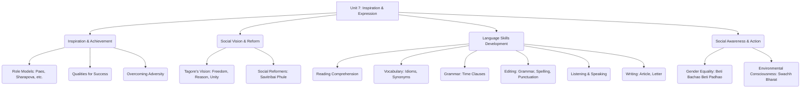

# Class 9 English - Word And Expression Chapter 107
**Language:** English

```markdown
# [Class 9] Word And Expression - Chapter 107

*(Note: This chapter corresponds to Unit 7 in the NCERT "Words and Expressions - 1" workbook for Class 9.)*

## 🌟 Core Concepts

This unit revolves around themes of inspiration, determination, social consciousness, and language development, explored through various texts and activities.

1.  **Inspiration & Achievement:**
    *   Drawing motivation from real-life icons (Santosh Yadav, Poorna, Maria Sharapova, Leander Paes, Hugh Herr, Saina Nehwal, Sania Mirza).
    *   Understanding qualities for success: Determination, Hard Work, Passion, Mental Strength, Patriotism, Resilience.
    *   Overcoming obstacles and challenges.
2.  **Social Vision & Reform:**
    *   Rabindranath Tagore's vision for a free and enlightened India ("Where the Mind is Without Fear").
        *   Ideals: Fearlessness, Free Knowledge, Unity, Truth, Reason, Progress.
    *   Recognising contributions of social reformers like Savitribai Phule towards education, especially for girls and marginalised sections.
3.  **Language Skills Development:**
    *   **Reading Comprehension:** Analysing texts for main ideas, specific details, and inferential meaning.
    *   **Vocabulary Building:**
        *   Learning new words in context.
        *   Understanding synonyms and word usage.
        *   Recognising and using idiomatic expressions.
    *   **Grammar:** Using conjunctions of time (when, while, before, after, until) to connect clauses accurately.
    *   **Editing:** Identifying and correcting grammatical errors (articles, prepositions, verb forms) and errors in spelling and punctuation.
    *   **Listening Comprehension:** Understanding spoken text for specific information and overall meaning.
    *   **Speaking Skills:** Expressing personal interests, engaging in dialogue, and practicing persuasive conversation (role-play).
    *   **Writing Skills:**
        *   Composing motivational articles.
        *   Writing formal letters (Letter to the Editor) on social/environmental issues.
4.  **Social Awareness & Action:**
    *   Gender Equality: Challenges faced by girls in education and sports; promoting initiatives like 'Beti Bachao, Beti Padhao'.
    *   Environmental Responsibility: Awareness of pollution and the importance of cleanliness (linking to 'Swachh Bharat Abhiyan').

📊 **Concept Hierarchy:**



## 📘 Key Learnings

1.  **Reading Comprehension Insights:**
    *   **Leander Paes (Text I):** Understand the significance of his 1996 individual Olympic medal for India after 44 years. Analyse his key attributes: patriotism ("When I am playing for my country I don’t expect anything"), determination, swift reflexes, mental strength, and gratitude towards his support system (coach, teammate). Evaluate the difference between individual and team achievements in sports.
    *   **"Where the Mind is Without Fear" (Text II):** Interpret Rabindranath Tagore's profound vision for India. Analyse the metaphors used (e.g., "narrow domestic walls," "dreary desert sand of dead habit," "clear stream of reason"). Evaluate the poem's relevance both in the pre-independence era and contemporary times.

    *Mind Map for Tagore's Vision:*
    ```mermaid
    mindmap
      root((Tagore's Vision for India))
        Fearlessness & Dignity ("head is held high")
        Universal Access to Knowledge ("knowledge is free")
        Unity ("world has not been broken up...")
        Truthfulness ("words come out from the depth of truth")
        Perfection through Effort ("tireless striving...")
        Rationality over Blind Custom ("clear stream of reason...")
        Progressive Thought & Action ("ever-widening thought and action")
        Ultimate Goal: "Heaven of Freedom"
    ```

2.  **Vocabulary Enhancement:**
    *   Learn words related to achievement, character, and social contexts (e.g., *gusto, prodigy, expatriate, culmination, affluent, prevails, expedition, resilience, affirmative*).
    *   Master idiomatic expressions and their figurative meanings (e.g., *pigeon-holed, eager beaver, cash cow, kangaroo court, bull in a china shop, hold your horses*).

3.  **Grammar - Time Clauses:**
    *   Learn to connect two actions or events in time using conjunctions like *when, while, before, after, until*.
    *   Understand that these conjunctions introduce subordinate clauses that specify the time frame of the main clause.
    *   *Example Flow:*
        `[Action 1] + [Time Conjunction] + [Action 2]`
        `I will phone you + when + I go to the clinic.`
        `Let's go home + before + it gets dark.`
        `The salesman came + while + Rita was eating her breakfast.`

4.  **Editing Proficiency:**
    *   Develop the ability to spot and correct common errors in sentence structure, word choice (articles, prepositions), verb forms, spelling (e.g., *possession, receive, separate, supersede, threshold, unforeseen, calibre, underestimated, orthodox, government, education*), and punctuation.

## 🧩 Active Learning

1.  **Activity: Research-based Case Study Analysis 🔍**
    *   **Task:** Choose one of the "First Ladies" mentioned in the Project section (or another inspiring Indian woman like Kalpana Chawla, Kiran Bedi, Mary Kom). Research her life, struggles, achievements, and the societal context she operated in.
    *   **Analysis:** Evaluate the key factors contributing to her success. What obstacles did she overcome? How did her achievements impact society or inspire others? Present your findings as a short report or presentation, critically analysing her journey.

2.  **Discussion: Critical Analysis of Real-world Impacts 🌍**
    *   **Topic 1:** Discuss Tagore's vision in "Where the Mind is Without Fear." To what extent has India achieved these ideals? Evaluate the persistent challenges (e.g., divisions based on caste/religion, lack of access to quality education, prevalence of irrational beliefs). What steps can citizens take towards realising this vision?
    *   **Topic 2:** Debate the challenges girls still face in pursuing education and non-traditional careers (like sports) in various parts of India. Evaluate the effectiveness of initiatives like 'Beti Bachao, Beti Padhao'. What more needs to be done at individual, community, and government levels?

## 📝 Assessment Prep

*   **Case Studies & Comprehension:** Practice analysing passages about achievers (like Leander Paes or Hugh Herr) or socially relevant texts (like Tagore's poem or the paragraph on Savitribai Phule). Focus on identifying main ideas, specific details, author's purpose, tone, and inferring meaning. Be prepared to evaluate characters' qualities or the significance of events/ideas.
*   **Diagrams & Application:** Use mind maps or flowcharts to summarise key concepts (like Tagore's ideals or grammar rules). Practice applying grammar rules, especially combining sentences using time conjunctions (*when, while, before, after, until*).
*   **Vocabulary & Idioms:** Revise vocabulary words and idiomatic expressions from the unit. Practice using them correctly in sentences. Expect questions involving synonyms, antonyms, fill-in-the-blanks, and matching idioms to meanings.
*   **Editing Tasks:** Be prepared to identify and correct errors in grammar, spelling, and punctuation within given sentences or paragraphs. Pay attention to common errors highlighted in the unit.
*   **Writing Tasks:** Practice writing structured articles (e.g., motivational pieces on sports encouraging girls) and formal letters (e.g., Letter to the Editor on social/environmental issues like pollution at tourist spots). Focus on clear organisation, appropriate tone, and correct language.

## 🌏 Bharatiya Context

This unit is rich with Indian context, highlighting national figures, social issues, and initiatives:

1.  **Inspiring Indian Personalities:**
    *   **Sports:** Leander Paes (Tennis), Santosh Yadav (Mountaineering), Poorna Malavath (Mountaineering), Saina Nehwal (Badminton), Sania Mirza (Tennis). Their stories showcase determination and bring national pride.
    *   **Literature & Social Vision:** Rabindranath Tagore's poem reflects aspirations for the nation.
    *   **Social Reform:** Savitribai Phule's pioneering work in women's education in 19th century Maharashtra is highlighted, emphasizing the historical struggle for gender equality and education for the marginalised.
    *   **"First Ladies" Project:** Focuses on contemporary Indian women who are pioneers in various fields, showcasing female achievement and leadership in modern India.

2.  **National Initiatives & Social Issues:**
    *   **Beti Bachao, Beti Padhao:** The project section directly engages with this crucial Government of India scheme aimed at addressing the declining Child Sex Ratio (CSR) and promoting girls' education and empowerment. Students are encouraged to contribute to awareness.
    *   **Swachh Bharat Abhiyan:** The writing task on environmental pollution connects Santosh Yadav's act of cleaning the Himalayas to the broader national cleanliness drive, encouraging civic responsibility.
    *   **Social Divisions:** Tagore's reference to "narrow domestic walls" and the mention of Savitribai Phule's struggle against caste-based discrimination touch upon deep-rooted social issues in India.

3.  **Cultural References:**
    *   Davis Cup (Tennis), specific locations (Hisar, Hyderabad, Mumbai), references to Indian coaching systems, and the context of pre-independence India provide a distinctly Indian backdrop.

📊 This unit uses Indian examples not just for context but to discuss universal themes like perseverance, social justice, and national progress, encouraging students to reflect on their own roles as responsible citizens.
```