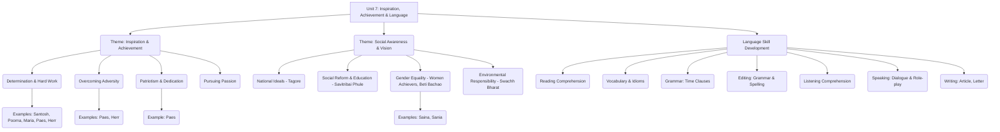
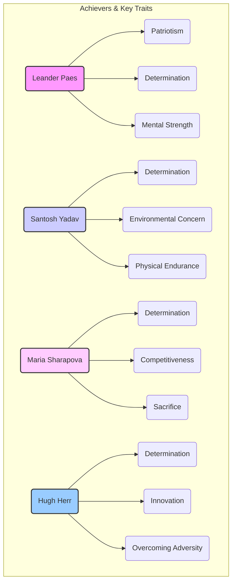

# Class 9 English - Word And Expression Chapter 107
**Language:** English

```markdown
# [Class 9] Word And Expression - Unit 7

*(Note: The original request specified Chapter 107, which seems incorrect based on NCERT structure. This summary covers Unit 7 of the Class 9 English Supplementary Reader "Words and Expressions", based on the provided text content.)*

## 🌟 Core Concepts

This unit revolves around themes of **Inspiration, Achievement, and Social Awareness**, integrated with **Language Skill Development**.

1.  **Inspiration & Achievement:**
    *   **Determination & Hard Work:** Achieving goals through perseverance (Santosh Yadav, Poorna, Maria Sharapova, Leander Paes, Hugh Herr).
    *   **Overcoming Adversity:** Facing challenges and succeeding despite obstacles (Leander Paes playing away from home, Hugh Herr's amputation).
    *   **Patriotism & Dedication:** Playing for the country's honour (Leander Paes).
    *   **Pursuing Passion:** Importance of following interests beyond academics (Introduction, Speaking activity).
2.  **Social Awareness & Vision:**
    *   **National Ideals:** Tagore's vision for a free, fearless, rational, and united India ("Where the Mind is Without Fear").
    *   **Social Reform & Education:** Recognizing contributions to education and upliftment, especially for girls (Savitribai Phule).
    *   **Gender Equality:** Celebrating women achievers and addressing challenges faced by girls (Santosh Yadav, Maria Sharapova, Saina Nehwal, Sania Mirza, Savitribai Phule, "Beti Bachao, Beti Padhao").
    *   **Environmental Responsibility:** Awareness of pollution and the need for cleanliness (Santosh Yadav's garbage collection, Letter writing task).
3.  **Language Development:**
    *   **Vocabulary Enrichment:** Understanding and using new words, synonyms, and idiomatic expressions from context.
    *   **Grammar in Context:** Understanding and using clauses of time (using *when, while, before, after, until*).
    *   **Reading Comprehension:** Analyzing passages and poems to extract information and infer meaning.
    *   **Writing Skills:** Composing motivational articles, formal letters (Letter to Editor), and dialogues.
    *   **Editing Skills:** Identifying and correcting grammatical and spelling errors.
    *   **Listening & Speaking Skills:** Comprehending spoken text and participating in discussions and role-plays.

📊 **Concept Hierarchy:**



## 📘 Key Learnings

1.  **Appreciating Determination:** Understand how individuals like Leander Paes achieved success through qualities like determination, willingness to take chances, swift reflexes, mental strength, and patriotism, even without home advantages (as seen in his 1996 Atlanta Olympics victory).
2.  **Understanding Tagore's Vision:** Analyze Rabindranath Tagore's poem "Where the Mind is Without Fear" to grasp his aspirations for India: a nation free from fear, where knowledge is accessible to all, society is united (not fragmented by "narrow domestic walls"), people are truthful, rational, progressive, and guided towards broad-minded thought and action.
3.  **Mastering Time Clauses:** Learn to connect ideas using clauses that specify *when* an action occurs, using conjunctions like *when, while, before, after, until*.
    *   **Structure:** Main Clause + Conjunction + Time Clause (or vice-versa)
    *   *Example:* `Leander Paes became the first Indian to win an individual medal` (Main Clause) + `when` (Conjunction) + `he defeated Fernando Meligeni` (Time Clause).
    *   📈 **Diagram:**
        ```mermaid
        graph LR
            subgraph Sentence
                MC[Main Clause: Independent Idea]
                CONJ[Conjunction: when, while, after, before, until]
                TC[Time Clause: Dependent Idea, specifies time]
            end
            MC -- connects via --> CONJ -- introduces --> TC
            TC -- modifies --> MC
        ```
4.  **Expanding Vocabulary:** Learn new words (e.g., *gusto, prodigy, expatriate, culmination, affluent*) and understand idiomatic expressions (e.g., *pigeon-holed, eager beaver, cash cow, bull in a china shop, hold your horses, kangaroo court*) where the meaning differs from the literal words.
5.  **Developing Editing Skills:** Practice identifying and correcting errors in grammar (e.g., verb forms, articles, prepositions) and spelling/punctuation, as demonstrated in the exercises on Maria Sharapova and Savitribai Phule.

## 🧩 Active Learning

*   **Activity: Research-based Case Study 🔍**
    *   **Task 1:** Investigate the achievements of India's "First Ladies" (Project 1). Analyze their struggles, societal context, sources of inspiration, and impact. Present findings via a class board, collage, or PowerPoint presentation. *(Bloom's: Analysis, Creation)*
    *   **Task 2:** Research the "Beti Bachao, Beti Padhao" initiative (Project 2). Design posters, slogans, or charts to create awareness about the importance of educating and safeguarding girls. *(Bloom's: Understanding, Application, Creation)*
*   **Discussion: Critical Analysis of Real-World Impacts 🌍**
    *   **Topic 1:** Evaluate the qualities required for success, drawing parallels between figures like Leander Paes, Santosh Yadav, and Maria Sharapova. Discuss the role of determination, mentorship, and patriotism. *(Bloom's: Analysis, Evaluation)*
    *   **Topic 2:** Analyze the relevance of Rabindranath Tagore's vision in "Where the Mind is Without Fear" in contemporary India. Discuss challenges like 'narrow domestic walls' or 'dead habits' today. *(Bloom's: Analysis, Evaluation)*
    *   **Topic 3:** Discuss the issue of environmental pollution at tourist spots and evaluate the effectiveness of initiatives like 'Swachh Bharat Abhiyan' in promoting cleanliness and citizen responsibility (linked to Writing Task 3). *(Bloom's: Analysis, Evaluation)*
*   **Role-Play Activity:** Engage in the dialogue between Sunita and her father (Speaking Task 2), arguing for/against joining Karate classes. This helps practice persuasive speaking and understanding different perspectives. *(Bloom's: Application, Creation)*

## 📝 Assessment Prep

Prepare for assessments by focusing on:

1.  **Comprehension Case Studies:**
    *   Analyze the passage on Leander Paes: Understand the significance of his victory, compare it to his father's, identify his key qualities, and factors contributing to his wins.
    *   Interpret Tagore's Poem: Match lines with specific ideas (fearlessness, free knowledge, unity, truth, reason) and explain its historical significance.
    *   Analyze the Listening Passage (Hugh Herr): Understand the challenges faced by amputees and the role of determination and education in innovation.
2.  **Grammar Application:** Practice combining sentences and filling blanks using time clauses (*when, while, before, after, until*).
3.  **Vocabulary Usage:** Use words learned from the unit (e.g., *prevails, affluent, culmination*) and idiomatic expressions correctly in sentences.
4.  **Editing Practice:** Correct grammatical errors and spelling/punctuation mistakes in given sentences or paragraphs.
5.  **Composition Tasks:**
    *   Write a motivational article on Indian sportswomen like Saina Nehwal and Sania Mirza, using provided details and further research. 📝
    *   Draft a formal Letter to the Editor highlighting environmental pollution at tourist spots and suggesting awareness measures. 📝

📈 **Diagrammatic Representation (Example for Assessment):** Compare Achievers


*(Use such comparisons to analyze common traits and unique contributions for essay/short answer questions.)*

## 🌏 Bharatiya Context

This unit is rich in Indian context, drawing heavily on national figures, achievements, and social initiatives:

1.  **Indian Achievers:** Celebrates the accomplishments of Indians in sports and other fields:
    *   **Santosh Yadav:** Mountaineer, first woman to climb Everest twice.
    *   **Poorna Malavath:** Youngest girl to climb Everest (at the time).
    *   **Leander Paes:** Tennis player, Olympic medalist, Davis Cup hero. 🇮🇳
    *   **Rabindranath Tagore:** Poet, Nobel laureate, visionary thinker. 🇮🇳
    *   **Savitribai Phule:** Pioneer of women's education in India. 🇮🇳
    *   **Saina Nehwal & Sania Mirza:** Badminton and Tennis icons, inspiring girls in sports. 🇮🇳
2.  **Social Issues & Initiatives:** Addresses themes relevant to Indian society:
    *   **Tagore's Vision:** Reflects aspirations during India's freedom struggle and remains relevant for national progress.
    *   **Gender Equality:** Highlights the struggles and successes of Indian women, linking to the **Beti Bachao, Beti Padhao** campaign. 📊
    *   **Environmental Consciousness:** Connects Santosh Yadav's act of cleaning the Himalayas to the broader national campaign of **Swachh Bharat Abhiyan**. 📊
3.  **Cultural References:** Mentions Indian contexts like Davis Cup matches played in India, family support systems, and specific locations (Hisar, Hyderabad).

This focus helps students connect the lessons on determination, social responsibility, and language skills to their own national identity and contemporary issues.
```