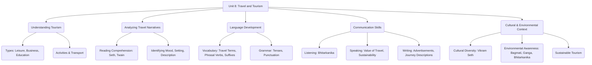

# Class 9 English - Word And Expression Chapter 108
**Language:** English

```markdown
# [Class 9] Word And Expression - Unit 8: Travel and Tourism

## 🌟 Core Concepts

This unit explores the theme of **Travel and Tourism** through various texts and activities.

1.  **Defining Tourism:**
    *   **Leisure Travel:** Visiting places for sightseeing, meeting friends/relatives, vacation, relaxation, sports, cultural experiences.
    *   **Business/Professional Travel:** Attending conventions, conferences, or professional activities.
    *   **Educational Travel:** Study tours, scientific research.
    *   **Modes of Transport:** Diverse methods used by tourists (hiking, jet, car, cruise ship, train, bicycle, etc.).
    *   **Activities:** Engaging in sports, sunbathing, talking, singing, taking rides, touring, reading, etc.

2.  **Travel Narratives (Travelogues):**
    *   Understanding personal accounts of journeys (e.g., Vikram Seth's 'Kathmandu', Mark Twain's 'The Innocents Abroad').
    *   Analyzing descriptions of places, cultures, people, and the traveller's experiences/moods.
    *   Identifying literary elements like setting, tone, and imagery.

3.  **Vocabulary Expansion:**
    *   Learning travel-specific terms (e.g., *pier, deck, valise, mast, cruise ship, excursionist, itinerary, jetlag*).
    *   Understanding and using phrasal verbs related to searching, respecting, and anticipating (e.g., *look for, look up to, look forward to, look up*).
    *   Word formation using suffixes (e.g., removing *-age*, adding *-ful*).

4.  **Grammar in Context:**
    *   **Tenses:** Identifying and understanding the usage of various tenses (Simple Present, Simple Past, Present Continuous, Past Perfect, etc.) within descriptive or narrative passages.
    *   **Punctuation:** Correctly using punctuation marks (commas, periods, etc.) for clarity and structure in descriptive writing.

5.  **Communication Skills:**
    *   **Listening Comprehension:** Extracting specific information and understanding the overall mood and description from an audio passage about travel (e.g., Bhitarkanika).
    *   **Speaking:** Articulating thoughts on the value and impact of travel, discussing sustainable tourism practices.
    *   **Writing:** Crafting persuasive tourism advertisements and descriptive paragraphs about journeys.

6.  **Cultural and Environmental Awareness:**
    *   Appreciating cultural diversity observed during travel (as described by Vikram Seth).
    *   Understanding environmental issues related to travel and the concept of sustainable tourism.
    *   Recognizing the significance of natural sites (e.g., rivers, wildlife sanctuaries) and efforts towards their conservation (e.g., legal status for rivers).

📊 **Concept Hierarchy:**



## 📘 Key Learnings

*   **Reading Comprehension:** Students learn to differentiate between various purposes of tourism (leisure, business, study) as outlined in Text I. They practice analyzing descriptive travel writing, identifying the author's tone, mood, and specific details about the setting and people, as seen in Mark Twain's vivid description of the chaotic pier (Text II).
    *   *Diagram Example (Conceptual):*
        ```mermaid
        graph LR
            subgraph Tourism Spectrum
                Leisure --> Sightseeing;
                Leisure --> Relaxation;
                Business --> Conferences;
                Study --> Research;
            end
            subgraph Travel Narrative Analysis
                Text --> Setting(Where/When);
                Text --> Mood(Author's/People's Feelings);
                Text --> Description(Sensory Details);
            end
        ```
*   **Vocabulary Building:** The unit introduces essential travel vocabulary (*pier, deck, carriage, valise, mast, creek, plumage*) and common idioms/phrases used by travellers (*itchy feet, hit the road, travel light*). Students practice using phrasal verbs (*look for, look up to, look forward to, look up*) and understand word formation through suffixes (*-age, -ful*).
*   **Grammar Application:** Focus is on identifying different **tenses** within a context (e.g., the passage on the horticulture event) and understanding their function in describing events happening at different times (past, present, future reference). Emphasis is also placed on correct **punctuation** to structure descriptive passages effectively, using the excerpt from 'Kathmandu' as a practice text.
*   **Listening and Speaking Skills:** Through the listening passage on **Bhitarkanika Wildlife Sanctuary (Odisha)**, students enhance their ability to grasp details about a place, its wildlife, and the atmosphere described. Speaking activities encourage students to articulate the profound impact of travel, referencing quotes by Ibn Batuta and Mark Twain, and to discuss the crucial concept of **sustainable tourism**.
*   **Writing Creatively:** Students apply their learning by creating a **tourism advertisement** for their own city/state, promoting its unique attractions. They also practice descriptive writing by composing a paragraph about a real or imaginary journey, incorporating newly learned travel vocabulary and expressions.
*   **Cultural and Environmental Sensitivity:** The unit subtly introduces environmental concerns through the mention of the **Bagmati river's** condition in Kathmandu and the unique legal status granted to the Whanganui River (and prompting discussion on the **River Ganga**). It also highlights cultural exploration through Vikram Seth's experiences and the project on diverse musical traditions.

## 🧩 Active Learning

*   **Activity: Research-based Case Study Analysis 🔍**
    *   **Project 1:** Students form groups to create a class magazine on "Music and Artists." This involves researching musical instruments used in various Indian and global genres (Indian classical, Ghazal, Folk, Jazz, dance forms like Bharatnatayam, Chau, Kathak), collecting images, and writing biographical sketches of artists. This requires information gathering from diverse sources (books, internet, interviews).
    *   **Project 2:** Plan a hypothetical road trip to the **North-east region of India**. Students research routes, modes of transport, potential stopovers, attractions, and create a travel map and itinerary. This involves practical application of planning and geographical knowledge.
    *   **Writing Task 1:** Analyze successful tourism advertisements (like the Kerala Tourism film mentioned) and then create an original advertisement, applying persuasive language and visual concepts (even if just described).

*   **Discussion: Critical Analysis of Real-World Impacts 🌍**
    *   **River Conservation:** Discuss the significance and implications of granting legal personhood to rivers like Whanganui in New Zealand. Research and debate similar initiatives or lack thereof concerning the **River Ganga** in India. Analyze the description of the Bagmati river in 'Kathmandu' and discuss pollution issues.
    *   **Value of Travel:** Critically analyze the provided quotes by Ibn Batuta and Mark Twain. Discuss personal experiences or views on how travel broadens perspectives, combats prejudice, and enriches life.
    *   **Sustainable Tourism:** Debate how the tourism sector can be aligned with sustainable development goals. Discuss potential negative impacts of tourism (environmental degradation, cultural disruption) and propose solutions or best practices, perhaps using examples from Indian tourist destinations like Shimla, Goa, or Ladakh.

## 📝 Assessment Prep

*   **Case Studies & Comprehension:** Practice answering comprehension questions based on travelogue excerpts (like Text I and Text II) and listening passages (Bhitarkanika). Focus on identifying main ideas, specific details, author's purpose, tone, and vocabulary in context.
*   **Vocabulary & Grammar Application:** Use exercises on phrasal verbs, suffixes, and travel terminology. Practice identifying tenses in paragraphs and applying correct punctuation to descriptive passages (like the Kathmandu example).
*   **Diagram Interpretation/Creation:** Understand and potentially create simple diagrams illustrating concepts like types of tourism or elements of a travel narrative. Match vocabulary words (pier, deck, mast) with corresponding images.
*   **Writing Tasks:** Prepare for writing tasks like composing descriptive paragraphs about journeys or creating tourism advertisements, ensuring correct use of language, structure, and relevant vocabulary.
*   **Speaking Evaluation:** Practice delivering short speeches on given topics related to travel, focusing on clarity, coherence, and expressing informed opinions (e.g., on sustainable tourism).

## 🌏 Bharatiya Context

*   **Vikram Seth's Journey:** The unit references 'Kathmandu', part of Vikram Seth's travelogue detailing his journey from China through Tibet and Nepal to **India**.
*   **River Ganga:** Students are prompted to research and discuss conservation efforts and legal contexts surrounding the **River Ganga**, drawing parallels with international examples.
*   **Bhitarkanika Wildlife Sanctuary, Odisha:** The listening passage provides a detailed description of this important mangrove ecosystem and wildlife sanctuary in **Odisha**, familiarizing students with India's natural heritage.
*   **North-East India Exploration:** Project 2 specifically directs students to plan a trip to the **North-east region of India**, encouraging exploration and awareness of this diverse part of the country.
*   **Indian Music and Culture:** Project 1 involves researching musical instruments and artists associated with various **Indian** traditions like classical music, Ghazal singing, folk music, and classical dance forms (Bharatnatayam, Chau, Kathak).
*   **Tourism in India:** Writing Task 1 (creating an advertisement for one's city/state) and the discussion on sustainable tourism directly relate to the context of tourism development and its impacts within **India**.
```