# Class 9 English - Word And Expression Chapter 108
**Language:** English

```markdown
# [Class 9] Word And Expression - Unit 8

## 🌟 Core Concepts

This unit revolves around the theme of **Travel and Tourism**, exploring its various facets through reading comprehension, vocabulary building, grammar practice, and creative expression.

1.  **Understanding Tourism:**
    *   Definition: Visiting places for sightseeing, leisure, business, study, or professional activities.
    *   Scope: Includes diverse activities (sports, relaxation, touring, research) and modes of transport (hiking, flying, cruise ships, cars, trains, etc.).
    *   Purpose: Enjoyment, business, education, research.

2.  **Travel Writing (Travelogues):**
    *   Nature: Personal accounts of journeys, describing landscapes, cultures, and experiences.
    *   Examples: Vikram Seth's 'Heaven Lake' (excerpt 'Kathmandu') and Mark Twain's 'The Innocents Abroad'.
    *   Elements: Descriptive language, capturing atmosphere, personal reflections, cultural observations.

3.  **Environmental Awareness & Legal Rights:**
    *   Concept: Recognizing natural entities (like rivers) as living entities with legal rights.
    *   Example: Whanganui River (New Zealand) granted legal personhood.
    *   Application: Discussion point for similar contexts, e.g., River Ganga in India.

4.  **Language Skills Development:**
    *   Vocabulary: Phrasal verbs, suffixes ('-age', '-ful').
    *   Grammar: Identification and usage of Tenses (Present, Past).
    *   Punctuation: Correct application in descriptive passages.
    *   Comprehension: Reading, Listening.
    *   Expression: Speaking, Writing (advertisements, travel descriptions), Project Work (research, planning).

📊 **Concept Hierarchy:**

```mermaid
graph TD
    A[Unit 8: Travel & Tourism] --> B(Understanding Tourism);
    A --> C(Travel Writing);
    A --> D(Environmental Awareness);
    A --> E(Language Skills);

    B --> B1(Definition & Scope);
    B --> B2(Activities & Transport);
    B --> B3(Purposes: Leisure, Business, Study);

    C --> C1(Nature of Travelogues);
    C --> C2(Examples: Seth, Twain);
    C --> C3(Key Elements: Description, Tone);

    D --> D1(River Personhood Concept);
    D --> D2(Whanganui River Example);
    D --> D3(Indian Context: Ganga);

    E --> E1(Reading Comprehension);
    E --> E2(Vocabulary: Phrasal Verbs, Suffixes);
    E --> E3(Grammar: Tenses);
    E --> E4(Editing: Punctuation);
    E --> E5(Listening Comprehension);
    E --> E6(Speaking: Speeches);
    E --> E7(Writing: Ads, Descriptions);
    E --> E8(Project Work: Research, Planning);
```



## 📘 Key Learnings

1.  **Defining Tourism:** Tourism encompasses travel for various reasons beyond just leisure, including business conferences, study tours, and research. It involves diverse activities and utilizes all forms of transportation.
    *   📈 **Diagram: Facets of Tourism**
        ```mermaid
        mindmap
          root((Tourism))
            ::icon(fa fa-plane)
            (Purpose)
              ::icon(fa fa-bullseye)
              Leisure/Vacation
              Business/Conference
              Study/Research
              Visiting Friends/Relatives
            (Activities)
              ::icon(fa fa-person-running)
              Sightseeing
              Sports
              Relaxation
              Cultural Engagement
              Professional Activities
            (Transport)
              ::icon(fa fa-car)
              Air (Jet)
              Land (Car, Train, Bike, Hike)
              Water (Cruise Ship)
              Mountain (Chairlift)
        ```

2.  **Analyzing Travel Writing:** Travelogues like those by Vikram Seth and Mark Twain use vivid descriptions to convey the atmosphere, mood, and details of a place or journey. Mark Twain's excerpt depicts the chaotic and somewhat gloomy start of a pleasure excursion.
    *   📈 **Diagram: Travelogue Analysis Steps**
        ```mermaid
        graph LR
            A[Read Excerpt] --> B(Identify Context: Who, What, Where, When?);
            B --> C(Analyze Tone & Mood: e.g., Bustle, Confusion, Gloomy);
            C --> D(Note Descriptive Language: e.g., 'encumbered trunks', 'droopy excursionists', 'limp flag');
            D --> E(Understand Author's Perspective/Feelings);
            E --> F(Extract Key Details & Vocabulary);
        ```

3.  **Vocabulary Expansion:**
    *   **Phrasal Verbs:** Understanding verbs combined with prepositions/adverbs (e.g., `Look for` - search, `Look up to` - respect, `Look forward to` - await eagerly, `Look up` - find information).
    *   **Suffixes:** Recognizing and manipulating suffixes like `-age` (e.g., carriage -> carry) and `-ful` (e.g., beauty -> beautiful).

4.  **Grammar - Tenses:** Identifying different tenses (Simple Present, Simple Past, Present Continuous, Past Perfect etc.) used in passages to understand when actions occur (e.g., describing an ongoing event, reporting past findings). The passage on the horticulture event uses various tenses to describe the event, its features, and related facts (like the NASA study).

5.  **Punctuation:** Mastering the use of commas, periods, question marks, etc., is crucial for clarity, especially in descriptive writing like the passage about Kathmandu, which lists many sights and sounds.

6.  **Environmental Consciousness:** The unit introduces the progressive concept of granting legal rights to natural entities like rivers, prompting reflection on environmental protection efforts in India.

## 🧩 Active Learning

*   **Activity: Research-based Case Study Analysis 🔍**
    *   **Case:** The legal personhood granted to the Whanganui River in New Zealand.
    *   **Task:** Research similar legal discussions or judgments concerning the **River Ganga** in India. Analyze the motivations, legal frameworks, challenges, and potential impacts of granting such status. Compare the Indian context with the New Zealand example. *(Connects to Evaluating Bloom's Level)*

*   **Discussion: Critical Analysis of Real-world Impacts 🌍**
    *   **Topic 1:** Based on Vikram Seth's description (mentioned in the introduction, though the full text isn't provided here, students refer to their main textbook 'Beehive'), discuss the environmental and social conditions of the **Bagmati River** in Kathmandu. What issues are highlighted? How does this relate to river health in other urban centres, including those in India?
    *   **Topic 2:** Analyze the potential positive and negative impacts of tourism as described in Text I. How can tourism be aligned with **Sustainable Development Goals (SDGs)**, particularly in the Indian context (e.g., promoting local culture, ensuring environmental protection, equitable economic benefits)? *(Connects to Evaluating/Creating Bloom's Level)*

## 📝 Assessment Prep

*   **Case Studies & Comprehension:**
    *   **Case 1 (Text I):** Analyze the definition and scope of tourism. Answer questions requiring identification of details, inference (meaning of 'hiking in wilderness'), and understanding vocabulary (cruise ship).
    *   **Case 2 (Text II):** Analyze Mark Twain's description of boarding a ship. Answer questions focusing on context ('distinguished Saturday'), vocabulary ('excursionists'), inferring mood, and identifying the author's expectations.
    *   **Case 3 (Listening Text):** Analyze the description of a visit to **Bhitarkanika Wildlife Sanctuary, Odisha**. Answer questions about the journey, wildlife sightings (crocodiles, kingfishers, deer, boar), and the author's feelings ('magnificence of nature').

*   **Diagrams for Revision:** Use the diagrams provided in "Key Learnings" (Facets of Tourism, Travelogue Analysis Steps) to structure understanding and revision. Create similar diagrams for vocabulary (e.g., mind map for phrasal verbs) or grammar (e.g., timeline for tenses).

*   **Practice Exercises:** Complete exercises on:
    *   Vocabulary: Matching phrasal verbs, removing/adding suffixes.
    *   Grammar: Identifying tenses in the provided passage about the horticulture event.
    *   Editing: Punctuating the descriptive passage about Kathmandu.

## 🌏 Bharatiya Context

1.  **River Ganga:** The unit prompts research and discussion on legal initiatives concerning the **River Ganga**, comparing them to international examples and highlighting national environmental concerns.
2.  **Bhitarkanika Wildlife Sanctuary, Odisha:** The listening comprehension passage provides a vivid description of this important mangrove ecosystem in India, showcasing its biodiversity (crocodiles, birds, deer, boar) and the experience of ecotourism.
3.  **Indian Music & Culture:** The project work encourages research into various forms of Indian music (Classical, Ghazal, Folk) and dance (Bharatnatayam, Chau, Kathak), their associated instruments (Santoor, Rubab mentioned alongside Ney), and prominent artists, fostering appreciation for India's rich cultural heritage.
4.  **North-East India Tourism:** The project suggests planning a road trip to the North-East region, encouraging exploration and understanding of this diverse part of India.
5.  **Horticulture & Environment:** The grammar passage discusses a horticulture event possibly in North India, highlighting interest in pollution control plants, connecting to contemporary environmental issues like air quality relevant across many Indian cities.
```