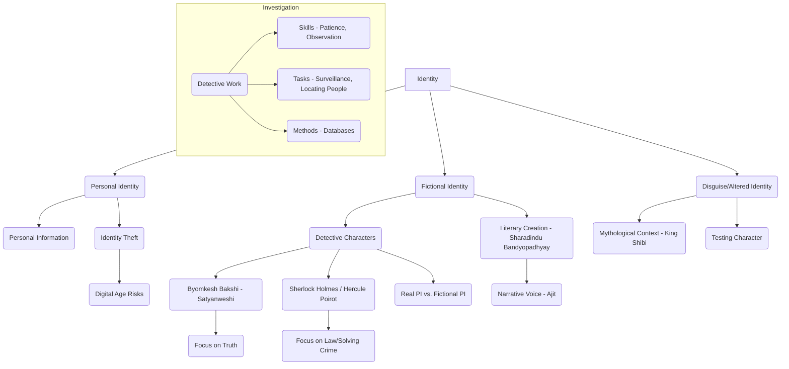

# Class 9 English - Word And Expression Chapter 109
**Language:** English

```markdown
# [Class 9] Word And Expression - Unit 9

## 🌟 Core Concepts

This unit revolves around the theme of **Identity**, exploring its various facets:

1.  **Personal Identity & Security:**
    *   Importance of safeguarding personal information (address, DOB, phone number).
    *   Concept of **Identity Theft**: Misusing someone's personal details for fraudulent purposes.
    *   Risks in the Digital Age: Increased vulnerability to online identity theft.
2.  **Detective Work & Investigation:**
    *   **Real-world Private Investigation (PI):**
        *   Tasks: Surveillance, locating missing persons.
        *   Essential Skills: Patience, attention to detail, planning, sacrifice.
        *   Methods: Utilizing databases with specific information (Name, DOB, Address).
        *   Realities vs. Fiction: Less glamorous, slower-paced than portrayed in media.
    *   **Fictional Detectives:**
        *   Comparing different detective archetypes (e.g., Byomkesh Bakshi, Sherlock Holmes, Hercule Poirot).
        *   Focus on Truth vs. Law: Byomkesh Bakshi as 'Satyanweshi' (Truth Seeker).
3.  **Narrative & Literary Devices:**
    *   Role of the narrator (e.g., Ajit Bandhopadhyay in Byomkesh stories).
    *   Understanding literary forms (novels, short stories, plays, screenplays).
4.  **Mythology & Disguise:**
    *   Exploring themes of testing righteousness through disguise (Story of King Shibi).

📊 **Concept Hierarchy:**



## 📘 Key Learnings

**1. Understanding Identity Theft:**
*   **Definition:** Using someone else's unique personal details (name, Aadhaar number, PAN card, bank details, DOB) without permission for fraud.
*   **Context:** Introduced through the play 'If I Were You', where the intruder aimed to steal Gerrard's identity.
*   **Relevance:** High risk in the digital age due to easy sharing and potential misuse of online information.

**2. Insights into Private Investigation (Based on Text I):**
*   **Primary Roles:** Surveillance (observing subjects, often for insurance claims like verifying workers' compensation) and locating people (e.g., reuniting family members).
*   **Essential Qualities:**
    *   **Patience:** Crucial for long hours of observation.
    *   **Attention to Detail:** Necessary for effective surveillance and information gathering.
    *   **Planning & Sacrifice:** Required for successful operations.
*   **Information Required:** To locate someone, a PI typically needs the exact name, Date of Birth (DOB), a unique identifier (like Social Security Number in the US context; potentially Aadhaar or PAN in India), and a last known official address.
*   **Myths Debunked:**
    *   Close relationship with police is largely a myth due to legal restrictions.
    *   Most PIs do not carry guns; their role is helping, not harming.
    *   Films dramatize and condense events that might span years in reality.

📈 **Real PI Work vs. Fictional Portrayal:**

| Feature         | Real PI (Text I)                     | Fictional PI (Films/TV)         |
| :-------------- | :----------------------------------- | :------------------------------ |
| **Pace**        | Often slow, requires immense patience | Fast-paced, action-packed       |
| **Glamour**     | Generally low                        | Often high                      |
| **Gun Use**     | Uncommon                             | Frequent                        |
| **Police Link** | Limited/Mythical                     | Often close collaboration       |
| **Timeline**    | Years of experience for key events   | Adventure condensed into episodes |

**3. Exploring Fictional Detectives: Byomkesh Bakshi (Based on Text II):**
*   **Creator:** Sharadindu Bandyopadhyay, a versatile Bengali writer.
*   **Identity:** Byomkesh identifies as 'Satyanweshi' (Truth Seeker) rather than just a detective.
*   **Motivation:** More concerned with uncovering the truth than strictly adhering to or enforcing the law. This distinguishes him from detectives like Sherlock Holmes or Hercule Poirot who often work closely within legal frameworks.
*   **Narrative Style:** Stories often narrated by his companion, Ajit Bandhopadhyay, who sometimes investigates.
*   **Scope:** Solves a wide range of cases, from international rackets to domestic mysteries.
*   **Language:** Originally written in traditional Bengali, now translated.

**4. Vocabulary Enhancement:**
*   Understanding words like `surveillance`, `database`, `violation`, `insurance`, `ambiguous`, `forte`, `engrossing`, `magnanimous`, `benevolence` in context.
*   Recognizing multiple meanings of words like `sanctuary` (shelter, refuge, holy place, protected area like Bhadra Wildlife Sanctuary).

**5. Grammar Skills:**
*   **Affirmative to Negative Transformation:** Changing sentence structure from positive to negative without altering the core meaning (e.g., "All liked it" -> "None disliked it").
*   **Using Infinitives:** Recognizing and using the 'to + verb' form (e.g., "I want *to go*", "Be willing *to make* sacrifices").

**6. Listening Comprehension: The Story of King Shibi:**
*   **Theme:** Testing righteousness and justice.
*   **Plot:** Gods Indra (as eagle) and Agni (as dove) test King Shibi's commitment to protecting the weak (dove) and fulfilling his duty (providing food for the eagle).
*   **Climax:** Shibi offers his own flesh, demonstrating immense sacrifice and magnanimity.
*   **Outcome:** The gods reveal themselves and bless Shibi for his benevolence.

## 🧩 Active Learning

*   **Activity: Research on Identity Theft Cases 🔍**
    *   Collect recent news reports or case studies (at least 2-3) of online identity theft in India (e.g., phishing scams, Aadhaar data misuse, credit card fraud).
    *   Analyze: How was the information stolen? What was the impact on the victim? What preventive measures could have been taken?
    *   Share findings in class, focusing on patterns and common vulnerabilities.
*   **Discussion: Impact of Digitalization & Security 🌍**
    *   Critically analyze the pros and cons of sharing personal information online in India (e.g., for government services via DigiLocker, online shopping, social media).
    *   Discuss the effectiveness of current security measures (like OTPs, CAPTCHAs) and cyber laws in India.
    *   Brainstorm individual and collective strategies to enhance online safety and prevent identity theft.

## 📝 Assessment Prep

*   **Case Study Analysis:** Given a short scenario describing a potential identity theft or a detective's challenge, identify the key issues, required skills/information, and potential outcomes.
    *   *Example:* "Rohan received an email claiming he won a lottery, asking for his bank details and Aadhaar number to transfer the prize. Analyze the risks and advise Rohan."
*   **Diagram Interpretation/Creation:**
    *   Interpret the Concept Hierarchy diagram provided above.
    *   Create a simple flowchart showing the steps a PI might take to locate a missing person based on Text I.
    *   Create a Venn diagram comparing Byomkesh Bakshi and Sherlock Holmes.
*   **Grammar Practice:**
    *   Transform given affirmative sentences into negative ones without changing meaning.
    *   Fill in blanks using appropriate infinitive forms of verbs.
    *   Complete the editing passage provided in the textbook, focusing on articles, prepositions, conjunctions, and punctuation.
*   **Vocabulary Application:** Use the vocabulary words (e.g., `surveillance`, `violation`, `ambiguous`) in new sentences relevant to the chapter's themes.

## 🌏 Bharatiya Context

*   **Literary Heritage:** Focus on Sharadindu Bandyopadhyay and his creation, **Byomkesh Bakshi**, a significant figure in Indian detective fiction, highlighting his unique 'Satyanweshi' approach.
*   **Mythology & Values:** The story of **King Shibi** from Indian mythology illustrates deep-rooted cultural values of justice (`dharma`), sacrifice (`tyaga`), and protection (`raksha`).
*   **Contemporary Issues:**
    *   **Digital India Initiative:** Discuss the government's push for digitalization and its implications for data security and identity management. Research the objectives and impact of this programme.
    *   **ATM Fraud:** The project work involves creating a street play (`nukkad natak`) about ATM fraud, a common issue in India, emphasizing awareness and precautions suggested by banks (e.g., covering the keypad, not sharing PIN, checking for skimming devices).
    *   **Aadhaar & Data Privacy:** Relate the discussion on identity theft to the context of unique identification systems like Aadhaar in India and associated privacy concerns.
```