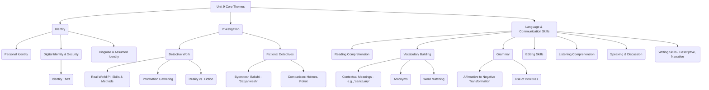

# Class 9 English - Word And Expression Chapter 109
**Language:** English

```markdown
# [Class 9] Word And Expression - Unit 9

## 🌟 Core Concepts

This unit delves into themes of identity, investigation, and the nuances of language. Key concepts are structured hierarchically:



**📊 Concept Hierarchy Explained:**

1.  **Identity:** Explores personal identity, the risks associated with digital identity (like identity theft, introduced via the link to 'If I Were You'), and the concept of changing identity through disguise (King Shibi story).
2.  **Investigation:** Contrasts the real work of Private Investigators (PIs) focusing on skills like patience and surveillance (Text I) with famous fictional detectives, particularly introducing the Indian detective Byomkesh Bakshi (Text II).
3.  **Language & Communication Skills:** Integrates various language skills through exercises focusing on reading comprehension, expanding vocabulary (understanding words like *surveillance, ambiguous, forte, Satyanweshi*), applying grammar rules (sentence transformation, infinitives), editing, listening, speaking, and writing.

## 📘 Key Learnings

**1. Understanding Identity and Its Vulnerability:**
*   **Identity Theft:** Recognizing that sharing personal information (name, DOB, address, phone number) carelessly, especially online, can lead to identity theft – where someone misuses your details for criminal purposes. This builds upon the theme of assumed identity from the play 'If I Were You'.
*   **Digital Age Risks:** The increasing prevalence of online identity theft necessitates caution in the digital world.
    *   *Diagram: The Path to Identity Theft*
        `Personal Data (Name, DOB, Aadhaar, etc.) --> Unsecured Sharing (Phishing, Weak Passwords, Public Wi-Fi) --> Data Access by Criminals --> Misuse (Financial Fraud, Impersonation, Other Crimes) --> Victim Suffers Loss/Damage`

**2. The Reality of Detective Work (Private Investigators):**
*   **Core Tasks:** PIs primarily engage in surveillance (observing people/places) and locating missing persons.
*   **Essential Skills:** Patience, keen observation, attention to detail, planning, and willingness to make sacrifices are crucial, contrasting with the often-glamorized media portrayal.
*   **Information Needs:** To locate someone, PIs typically require precise information: Full Name (correct spelling), Date of Birth (DOB), Social Security Number (or equivalent identifier like Aadhaar in India), and a Last Known Official Address.
*   **Reality vs. Fiction:** Real detective work involves long periods of uneventful observation, unlike the condensed action seen in films. Carrying guns is not standard practice for most PIs.
    *   *Diagram: PI Skill Set Mind Map*
        *   **Central Idea:** Private Investigator Skills & Tasks
            *   **Branch 1: Skills:** Patience, Observation, Attention to Detail, Planning, Sacrifice
            *   **Branch 2: Tasks:** Surveillance, Locating People, Background Checks (implied)
            *   **Branch 3: Tools:** Databases, Observation Equipment (implied), NOT typically guns
            *   **Branch 4: Reality:** Less Action-Packed, More Tedious than Fiction

**3. Appreciating Fictional Detectives: Byomkesh Bakshi:**
*   **Creator & Character:** Sharadindu Bandyopadhyay created the iconic Bengali detective Byomkesh Bakshi. Byomkesh identifies as 'Satyanweshi' (Truth Seeker), highlighting his primary motivation.
*   **Narrative Style:** Stories are often narrated by his companion, Ajit Bandhopadhyay, who sometimes investigates.
*   **Unique Approach:** Unlike detectives like Sherlock Holmes or Hercule Poirot who often focus strictly on clues and legality, Byomkesh prioritizes uncovering the truth, even if it operates outside the strict confines of the law.
    *   *Diagram: Byomkesh vs. Western Detectives (Venn Diagram Concept)*
        *   **Byomkesh Circle:** Satyanweshi (Truth Seeker), Focus on Truth > Law, Indian Context (Bengali), Narrator Ajit.
        *   **Holmes/Poirot Circle:** Focus on Clues/Logic/Law, Western Context, Often independent or police-affiliated.
        *   **Overlap:** Fictional Detective, Solves Complex Crimes, High Intelligence, Observational Skills.

**4. Enhancing Vocabulary:**
*   Understanding words through context (e.g., 'sanctuary' meaning 'shade' in Text I vs. 'refuge' or 'protected area' in other contexts).
*   Learning specific terms related to investigation and description (*surveillance, ambiguous, database, violation, forte, engrossing, sinister*).
*   Recognizing and using antonyms (e.g., *natural/supernatural, fact/fiction, presence/absence*).

**5. Mastering Grammar Concepts:**
*   **Affirmative to Negative Transformation:** Learning to rewrite affirmative sentences as negative ones without changing the core meaning, often by using antonyms or negative structures (e.g., "All members liked the programme" becomes "No members disliked the programme").
*   **Infinitives:** Understanding and using the infinitive form of verbs (to + verb) to express purpose, intention, or as a complement to another verb (e.g., "I need *to find* someone," "Be willing *to make* sacrifices").

**6. Developing Communication Skills:**
*   **Editing:** Identifying and correcting errors in passages, specifically focusing on missing words (articles, prepositions, conjunctions) and punctuation.
*   **Listening:** Comprehending spoken narratives, like the story of King Shibi, and identifying key details and themes (justice, sacrifice, disguise).
*   **Speaking:** Discussing relevant issues like digital safety and identity theft.
*   **Writing:** Expressing oneself descriptively (about identity) and narratively (completing a story).

## 🧩 Active Learning

*   **Activity: Research-based Case Study Analysis 🔍**
    *   **Task:** Research a recent case of online identity theft or ATM fraud reported in India (e.g., a phishing scam targeting bank customers, SIM swap fraud, Aadhaar data misuse concerns).
    *   **Analysis:** Prepare a brief report (or presentation) detailing:
        1.  How the victim's information was compromised.
        2.  How the identity/money was misused.
        3.  The impact on the victim.
        4.  What preventive measures could have been taken (by the individual, bank, or authorities)?
        5.  Connect this to the concept of needing to be cautious, as highlighted in the unit's introduction.
    *   **Bloom's Level:** Analysis, Evaluation.

*   **Discussion: Critical Analysis of Real-World Impacts 🌍**
    *   **Prompt 1 (Ethics & Privacy):** Based on the PI's work (surveillance), discuss the ethical line between necessary investigation and invasion of privacy. In the digital age, how much surveillance (by companies or government) is acceptable for security? Where do you draw the line?
    *   **Prompt 2 (Truth vs. Law):** Byomkesh Bakshi prioritizes 'truth' over 'law'. Discuss scenarios where these might conflict. Is it ever justifiable to bend the law to uncover a deeper truth or achieve justice? Evaluate the potential consequences.
    *   **Prompt 3 (Media Portrayal):** How does the media (films, TV shows) portrayal of detectives influence public perception of crime and investigation? Analyze the potential positive and negative impacts of these portrayals compared to the reality described in Text I.
    *   **Bloom's Level:** Evaluation, Creation (of arguments).

## 📝 Assessment Prep

*   **Case Studies & Scenarios:**
    *   **Scenario 1:** "A college student reports their social media account hacked and used to send fraudulent messages asking for money from friends. Their profile picture and personal details were used. Briefly outline the steps a cyber-crime unit might take, and what immediate advice you would give the student." (Tests understanding of digital identity theft).
    *   **Scenario 2:** "Imagine you are a PI hired to find a person who disappeared 5 years ago. Using the information requirements mentioned by the detective in Text I (Name, DOB, Last Known Address), explain *why* each piece of information is crucial for starting the search using databases." (Tests comprehension of Text I and application).
    *   *Diagram for Revision:* Review the 'Path to Identity Theft' flowchart and the 'PI Skill Set Mind Map' provided in Key Learnings.

*   **Practice Questions:**
    1.  Transform the sentence into the negative without changing meaning: "He is always careful when sharing details online."
    2.  Fill in the blank with the correct infinitive form: "The detective decided ______ (follow) the suspect."
    3.  What is the key difference between Byomkesh Bakshi's approach and that of Sherlock Holmes, according to Text II?
    4.  Explain the meaning of 'surveillance' and 'ambiguous' as used in Text I.

## 🌏 Bharatiya Context

*   **Byomkesh Bakshi ('Satyanweshi'):** This unit introduces a significant figure from Indian literature. Byomkesh Bakshi, the Bengali 'Truth Seeker', represents a unique Indian perspective on the detective genre, contrasting with Western counterparts and reflecting cultural nuances. His focus on truth aligns with philosophical concepts often explored in Indian thought.
*   **King Shibi Story:** The listening activity draws from Indian mythology (often linked to the Mahabharata). The story of King Shibi exemplifies the Indian cultural values of *Dharma* (righteousness, duty), justice, self-sacrifice (*tyaga*), and compassion (*daya*), tested through divine disguise.
*   **Digital India & Online Security:** The discussion on identity theft is highly relevant in modern India, with the push for 'Digital India'. While promoting ease of transactions (UPI, online banking) and digital identity (Aadhaar), it also increases vulnerability to cybercrime. Understanding risks like phishing, vishing, and ATM fraud (as mentioned in the project idea) is crucial for citizens. Data from the National Crime Records Bureau (NCRB) often indicates a rise in cybercrime cases, emphasizing the need for awareness.
*   **Nukkad Natak (Street Play):** The project suggestion to create a *Nukkad Natak* on ATM fraud utilizes a traditional Indian folk theatre form. These plays are effective tools for social awareness campaigns in communities, making complex issues like financial fraud accessible and understandable to a wider audience.
```