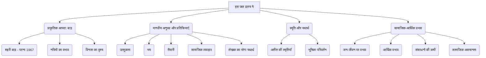
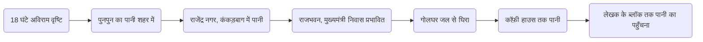

# Class 9 Hindi - Kritika Chapter 101
**Language:** हिंदी

```markdown
# [कक्षा 9] कृतिका - पाठ 1: इस जल प्रलय में

## 🌟 मुख्य अवधारणाएँ (Core Concepts)

1.  **प्राकृतिक आपदा: बाढ़** (Natural Disaster: Flood)
    *   बाढ़ का स्वरूप और विनाशलीला (Nature and destruction of floods)
    *   नदियों का रौद्र रूप (Punpun, Ganga, Kosi, Mahananda)
    *   शहरी बाढ़ का अनुभव (Experience of urban flooding - Patna 1967)
2.  **मानवीय अनुभव और प्रतिक्रियाएँ** (Human Experience and Reactions)
    *   बाढ़ के प्रति उत्सुकता और कौतूहल (Curiosity about the flood)
    *   भय और आतंक का अनुभव (Experience of fear and terror)
    *   संकट में आम लोगों का व्यवहार (Behavior of common people in crisis)
        *   तैयारी और बचाव के उपाय (Preparations and safety measures)
        *   उदासीनता और हंसी-मजाक (Indifference and humor)
        *   सामाजिक टिप्पणी और वर्ग भेद (Social commentary and class differences)
    *   लेखक का व्यक्तिगत अनुभव ('भोगा हुआ यथार्थ') (Author's personal experience)
3.  **स्मृति और यथार्थ** (Memory and Reality)
    *   वर्तमान संकट में अतीत की बाढ़ की स्मृतियाँ (Memories of past floods during the current crisis - 1947, 1949, 1937)
    *   राहत कार्यकर्ता से बाढ़ पीड़ित बनने का अनुभव (Experience of shifting from relief worker to flood victim)
4.  **सामाजिक-आर्थिक प्रभाव** (Socio-Economic Impact)
    *   जन-जीवन का अस्त-व्यस्त होना (Disruption of daily life)
    *   आर्थिक गतिविधियों का रुकना (Stoppage of economic activities - खरीद-बिक्री बंद)
    *   संसाधनों की आवश्यकता (Need for resources - ईंधन, भोजन, दवा)
    *   विभिन्न वर्गों पर प्रभाव (Impact on different classes)

📊 **अवधारणा पदानुक्रम (Concept Hierarchy):**



## 📘 मुख्य सीख (Key Learnings)

1.  **बाढ़ का प्रत्यक्ष अनुभव:** लेखक फणीश्वर नाथ 'रेणु' ने 1967 में पटना में आई विनाशकारी बाढ़ का आँखों देखा और भोगा हुआ वर्णन किया है। उन्होंने बताया कि कैसे पुनपुन नदी का पानी राजेन्द्र नगर, कंकड़बाग जैसे निचले इलाकों में घुस आया और शहर जलमग्न हो गया।
2.  **लोगों की मिश्रित प्रतिक्रियाएँ:**
    *   **उत्सुकता:** बाढ़ का पानी कहाँ तक आया, यह देखने के लिए लोगों का हुजूम (मोटर, स्कूटर, पैदल) उमड़ पड़ता है।
    *   **तैयारी:** लेखक और अन्य लोगों द्वारा घर में ईंधन, आलू, मोमबत्ती, दियासलाई, पीने का पानी, कम्पोज की गोलियाँ जमा करना।
    *   **भय:** लेखक को पानी के बढ़ते स्तर और 'मृत्यु के तरल दूत' को देखकर डर लगता है। आकाशवाणी की घोषणा दिल दहला देती है।
    *   **निश्चिंतता/उत्साह:** कुछ लोग संकट की घड़ी में भी सामान्य दिनों की तरह हंस-बोल रहे थे, बल्कि अधिक उत्साहित थे। पान की बिक्री बढ़ जाना इसका उदाहरण है।
    *   **सामाजिक कटाक्ष:** दानपुर डूबने पर पटना के लोगों की उदासीनता पर एक आम आदमी द्वारा टिप्पणी करना शहरी और ग्रामीण मानसिकता के अंतर को दर्शाता है।
3.  **लेखक की बदलती भूमिका:** लेखक ने पहले कई बार बाढ़ पीड़ित क्षेत्रों में स्वयंसेवक, राहत कार्यकर्ता के रूप में काम किया था, लेकिन पटना की बाढ़ में वे स्वयं एक शहरी व्यक्ति की हैसियत से बाढ़ को भोग रहे थे।
4.  **स्मृतियों का प्रभाव:** बाढ़ की प्रतीक्षा करते हुए लेखक को पुरानी बाढ़ (1947 मनिहारी, 1949 महानंदा, 1937 सिमरवनी-शंकरपुर) और उनसे जुड़े अनुभव (गुरुजी की सीख, डॉक्टर का कुत्ते से डरना, मुसहरी में बलवाही नाच, नाव पर पिकनिक मनाते युवक-युवती) याद आते हैं।
5.  **बाढ़ का दृश्य और ध्वनि:** लेखक ने पानी के रंग (गेरुआ-झाग फेन), उसकी गति, शहर के डूबते दृश्य (गोलघर, बिजली के खंभे, पेड़), और कोलाहल, चीख-पुकार, पानी की कलकल ध्वनि का सजीव चित्रण किया है।

📈 **पटना में बाढ़ का बढ़ता स्तर (उदाहरण):**


*(यह रेखाचित्र बाढ़ के क्रमिक फैलाव को दर्शाता है जैसा पाठ में वर्णित है)*

## 🧩 सक्रिय अधिगम (Active Learning)

*   **गतिविधि: शोध-आधारित केस स्टडी विश्लेषण 🔍**
    *   छात्र हाल के वर्षों में भारत में आई किसी बड़ी बाढ़ (जैसे - 2018 केरल बाढ़, असम में वार्षिक बाढ़, बिहार में कोसी की बाढ़) पर जानकारी एकत्र करें।
    *   सरकारी प्रतिक्रिया, मीडिया कवरेज, स्थानीय लोगों के अनुभव, और सामाजिक-आर्थिक प्रभावों का अध्ययन करें।
    *   इस अध्ययन की तुलना 'इस जल प्रलय में' पाठ में वर्णित 1967 की पटना बाढ़ के अनुभवों और प्रतिक्रियाओं से करें। समानताएँ और अंतर बताएँ। (Bloom's: Evaluating/Creating)
*   **चर्चा: वास्तविक दुनिया के प्रभावों का आलोचनात्मक विश्लेषण 🌍**
    *   पाठ में वर्णित लोगों की विभिन्न प्रतिक्रियाओं (जिज्ञासा, भय, उदासीनता, तैयारी, सामाजिक टिप्पणी) पर कक्षा में चर्चा करें।
    *   लोग आपदा के समय अलग-अलग व्यवहार क्यों करते हैं? क्या सामाजिक और आर्थिक स्थिति व्यवहार को प्रभावित करती है?
    *   'आम आदमी' वाली टिप्पणी (दानपुर वाली घटना) के संदर्भ में शहरी बनाम ग्रामीण दृष्टिकोण और आपदा के समय उभरने वाली सामाजिक दरारों पर विचार-विमर्श करें। (Bloom's: Analyzing/Evaluating)

## 📝 मूल्यांकन तैयारी (Assessment Prep)

*   **केस स्टडी (परिस्थिति-आधारित प्रश्न):**
    *   "यदि आप लेखक की जगह राजेन्द्र नगर में होते और आकाशवाणी से बाढ़ की चेतावनी सुनते, तो आप क्या-क्या तैयारियाँ करते और क्यों?"
    *   "पाठ में वर्णित नाव पर पिकनिक मना रहे युवक-युवतियों के व्यवहार पर टिप्पणी करें। आपदा के समय ऐसा व्यवहार कितना उचित है?"
*   **रेखाचित्र/फ्लोचार्ट:**
    *   लेखक द्वारा अनुभव किए गए बाढ़ के विभिन्न चरणों (पानी देखने जाने से लेकर फ्लैट में पानी घुसने तक) का क्रमबद्ध रेखाचित्र बनाएँ।
    *   बाढ़ की खबर सुनने से लेकर पानी आने तक लेखक की बदलती मानसिक स्थिति को दर्शाने वाला फ्लोचार्ट बनाएँ।
*   **विश्लेषणात्मक प्रश्न:**
    *   'मृत्यु का तरल दूत' किसे कहा गया है और क्यों? लेखक पर इसका क्या प्रभाव पड़ा?
    *   पाठ के आधार पर बाढ़ पीड़ित क्षेत्रों में फैलने वाली संभावित समस्याओं (जैसे बीमारियाँ, भोजन-पानी की कमी) की सूची बनाएँ।
    *   लेखक अंत में क्यों कहता है - "अच्छा है, कुछ भी नहीं मेरे पास"? (कैमरा, टेप रिकॉर्डर न होने के संदर्भ में)

## 🌏 भारतीय संदर्भ (Bharatiya Context)

1.  **भारत में बाढ़ प्रवण क्षेत्र:** भारत एक विशाल देश है जहाँ गंगा, ब्रह्मपुत्र, कोसी (बिहार का शोक), महानदी, गोदावरी, कृष्णा जैसी बड़ी नदियाँ हैं। इनके बेसिन में हर साल मानसून के दौरान बाढ़ आना एक आम बात है। पाठ में कोसी, पनार, महानंदा और गंगा का उल्लेख बिहार और आसपास के क्षेत्रों की बाढ़ की भेद्यता को दर्शाता है।
    *   **आंकड़े (उदाहरण):** राष्ट्रीय आपदा प्रबंधन प्राधिकरण (NDMA) के अनुसार, भारत का लगभग 12% भू-भाग बाढ़ प्रवण है, जिससे करोड़ों लोग और व्यापक कृषि भूमि प्रभावित होती है।
2.  **सामाजिक-आर्थिक प्रभाव:** बाढ़ का सबसे बुरा असर गरीबों, किसानों और निचले इलाकों में रहने वाले लोगों पर पड़ता है। उनके घर, फसलें और आजीविका नष्ट हो जाती है। पाठ में 'मुसहरी' (दलित बस्ती) का उल्लेख और राहत सामग्री की आवश्यकता इस पहलू को उजागर करती है। विस्थापन और पुनर्वास एक बड़ी चुनौती बन जाते हैं।
3.  **आपदा प्रबंधन:** 1967 की तुलना में आज भारत में आपदा प्रबंधन प्रणाली (NDMA, राज्य DMA, NDRF) अधिक संगठित है। मौसम पूर्वानुमान, चेतावनी प्रणाली और बचाव कार्यों में सुधार हुआ है। हालांकि, शहरी नियोजन की कमियाँ (जैसे पटना के निचले इलाके) और जलवायु परिवर्तन शहरी बाढ़ के खतरे को बढ़ा रहे हैं। लेखक द्वारा ईंधन, भोजन आदि जमा करना व्यक्तिगत स्तर पर आपदा तैयारी का उदाहरण है।
4.  **सांस्कृतिक प्रतिक्रिया:** पाठ में संकट के समय भी 'बलवाही नाच' जैसे लोक आयोजनों का उल्लेख भारतीय समाज की जिजीविषा और सांस्कृतिक लचीलेपन को दर्शाता है। लोग कठिन परिस्थितियों में भी मनोरंजन और सामूहिकता के क्षण ढूंढ लेते हैं।

```markdown