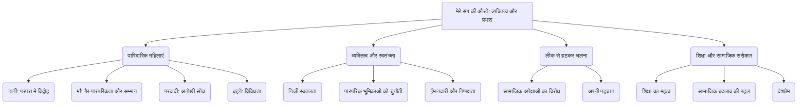

# Class 9 Hindi - Kritika Chapter 102
**Language:** हिंदी

```markdown
# [कक्षा 9] कृतिका - अध्याय 102 - मेरे संग की औरतें

## 🌟 मुख्य अवधारणाएँ (Core Concepts)

यह पाठ लेखिका मृदुला गर्ग के जीवन पर उनके परिवार की महिलाओं, विशेषकर उनकी नानी, माँ, परदादी और बहनों के असाधारण व्यक्तित्वों के प्रभाव को दर्शाता है।

1.  **पारिवारिक महिलाएँ और उनका प्रभाव** 👨‍👩‍👧‍👧
    *   नानी: पारंपरिक होते हुए भी दृढ़ निश्चयी और देशभक्त।
    *   माँ: सुंदर, नाज़ुक, गैर-पारंपरिक, ईमानदार और निष्पक्ष; किताबों में रुचि।
    *   परदादी: लीक से हटकर चलने वाली, अपरिग्रही, मन्नत से बेटी चाहने वाली।
    *   बहनें: अलग-अलग व्यक्तित्व, कुछ लेखिका, कुछ गैर-लेखिका, सभी अपनी शर्तों पर जीने वाली।
2.  **व्यक्तित्व और स्वतंत्रता** ✨
    *   निजी स्वतंत्रता का महत्व (माँ, नानी)।
    *   पारंपरिक भूमिकाओं को चुनौती देना (माँ, परदादी, रेणु)।
    *   ईमानदारी और निष्पक्षता का सम्मान (माँ)।
3.  **लीक से हटकर चलना (Non-conformity)** 🚶‍♀️➡️🚶‍♂️
    *   सामाजिक अपेक्षाओं के विरुद्ध जाकर निर्णय लेना (नानी का वर चुनना, परदादी की मन्नत, रेणु का स्कूल पैदल जाना, लेखिका का स्कूल खोलना)।
    *   अपनी पहचान बनाए रखना।
4.  **शिक्षा और सामाजिक सरोकार** 📚🌍
    *   शिक्षा का महत्व और उसके लिए प्रयास (लेखिका का स्कूल खोलना)।
    *   सामाजिक बदलाव की कोशिश (लेखिका का डालमियानगर में नाटक)।
    *   देश की आज़ादी का जुनून (नानी, पिता)।

**अवधारणा पदानुक्रम:**



## 📘 प्रमुख सीख (Key Learnings)

1.  **नानी का दोहरा व्यक्तित्व:**
    *   **बाहरी रूप:** पारंपरिक, अनपढ़, पर्दानशीं औरत।
    *   **आंतरिक शक्ति:** जीवन के अंतिम क्षणों में पति (जो विलायती रंग में रंगे थे) की इच्छा के विरुद्ध, अपनी बेटी का विवाह एक स्वतंत्रता सेनानी (प्यारेलाल शर्मा के माध्यम से) से करवाने का दृढ़ निश्चय।
    *   **सीख:** व्यक्ति का बाहरी आचरण हमेशा उसकी आंतरिक सोच का परिचायक नहीं होता। सच्ची स्वतंत्रता निजी जीवन के निर्णयों में भी झलकती है।
    *   **चित्रण:** पारंपरिक पर्दा ➡️ दृढ़ इच्छाशक्ति (बेटी का भविष्य) ➡️ स्वतंत्रता सेनानी वर का चयन।

2.  **माँ का अनूठा स्थान:**
    *   **विशेषताएँ:** बेहद सुंदर, नाज़ुक, गैर-दुनियादार, घर के कामों में अरुचि, अधिकांश समय किताबें पढ़ने, साहित्य चर्चा या संगीत सुनने में व्यतीत करना।
    *   **सम्मान का कारण:** कभी झूठ न बोलना और एक की गोपनीय बात दूसरे पर ज़ाहिर न करना। इन्हीं गुणों के कारण परिवार और बाहर के लोगों में सम्माननीय और विश्वसनीय थीं।
    *   **सीख:** पारंपरिक पत्नी, माँ या बहू की भूमिका न निभाते हुए भी ईमानदारी, निष्पक्षता और व्यक्तित्व के बल पर सम्मान पाया जा सकता है।
    *   **चित्रण:** पारंपरिक भूमिका (खाना पकाना, घर संभालना) <0xE2><0x9D><0x8C> माँ का व्यक्तित्व (ईमानदारी + गोपनीयता + बौद्धिकता) ➡️ सबका सम्मान ✅।

3.  **परदादी की लीक से हटकर सोच:**
    *   **अपरिग्रह:** दो से अधिक धोतियाँ न रखने का व्रत (जैन समाज में सामान्य)।
    *   **अनोखी मन्नत:** पतोहू के लिए पहले बच्चे के रूप में बेटी पैदा होने की मन्नत मांगना और उसे सरेआम घोषित करना (उस समय के समाज में जहाँ बेटे की चाह प्रबल थी)।
    *   **चोर का हृदय परिवर्तन:** घर में घुसे चोर से सहजता से बात करना, उसे पानी पिलाना और उसे बेटा मानकर चोरी छोड़ खेती करने की राह दिखाना।
    *   **सीख:** दृढ़ विश्वास और सहजता से किसी को भी सही राह पर लाया जा सकता है। सामाजिक मान्यताओं को चुनौती देने का साहस रखना।
    *   **चित्रण:** परदादी का विश्वास (भगवान से सीधा तार) ➡️ गैर-पारंपरिक मन्नत (बेटी की चाह) + चोर से सहज व्यवहार ➡️ सकारात्मक परिणाम (5 बेटियाँ + चोर का सुधरना)।

4.  **बहनों की विविधता और स्वतंत्रता:**
    *   सभी बहनें (मंजुल, मृदुला, चित्रा, रेणु, अचला) अपनी शर्तों पर जीती थीं, भले ही उनके रास्ते अलग थे।
    *   **रेणु का हठ:** गाड़ी में स्कूल न जाना (सामंतशाही का प्रतीक मानकर), बी.ए. करने का तर्क पूछना, सच बोलना।
    *   **चित्रा की निर्णायकता:** खुद पढ़ने से ज़्यादा दूसरों को पढ़ाना, अपनी पसंद के लड़के से शादी का ऐलान।
    *   **लेखिका का प्रयास:** डालमियानगर में सामाजिक बंधन तोड़कर नाटक करना, बागलकोट में स्कूल खोलना।
    *   **सीख:** हर व्यक्ति का अपना विशिष्ट व्यक्तित्व होता है और उसे अपनी राह चुनने की स्वतंत्रता होनी चाहिए।

5.  **शिक्षा का अधिकार और लेखिका के प्रयास:**
    *   कर्नाटक के बागलकोट कस्बे में बच्चों के लिए ढंग का स्कूल न होने पर लेखिका ने कैथोलिक बिशप से स्कूल खोलने का अनुरोध किया।
    *   बिशप के इनकार (कम क्रिश्चियन आबादी, 100 साल चलने की गारंटी) के बाद लेखिका ने खुद कन्नड़, हिंदी, अंग्रेजी सिखाने वाला प्राइमरी स्कूल खोला और उसे सरकारी मान्यता दिलवाई।
    *   **सीख:** शिक्षा बच्चों का जन्मसिद्ध अधिकार है और इसके लिए व्यक्तिगत स्तर पर भी प्रयास किए जा सकते हैं और करने चाहिए।

## 🧩 सक्रिय अधिगम (Active Learning)

*   **गतिविधि: शोध-आधारित केस स्टडी विश्लेषण 🔍**
    *   समूहों में बंटकर पाठ में वर्णित किसी एक महिला (नानी, माँ, परदादी, रेणु) को चुनें।
    *   उनके चरित्र की विशेषताओं, उनके द्वारा लिए गए लीक से हटकर निर्णयों और उनके प्रभावों का विश्लेषण करें।
    *   इंटरनेट या पुस्तकालय की सहायता से उनके समय (जैसे, स्वतंत्रता पूर्व भारत, 1950 का दशक) की सामाजिक मान्यताओं, महिलाओं की स्थिति आदि पर शोध करें और बताएं कि उस संदर्भ में उनके कार्य कितने चुनौतीपूर्ण थे।
    *   अपनी केस स्टडी प्रस्तुत करें।

*   **चर्चा: वास्तविक दुनिया के प्रभावों का आलोचनात्मक विश्लेषण 🌍**
    *   इस बात पर कक्षा में चर्चा करें कि लेखिका की माँ की तरह पारंपरिक घरेलू भूमिकाओं से अलग जीवन जीने वाली महिलाओं का परिवार और समाज पर क्या प्रभाव पड़ता है?
    *   क्या आज के भारतीय समाज में ऐसी महिलाओं को आसानी से स्वीकार किया जाता है?
    *   अपने आसपास या मीडिया से ऐसे उदाहरण दें जहाँ महिलाओं ने पारंपरिक अपेक्षाओं को चुनौती दी हो और समाज पर सकारात्मक या नकारात्मक प्रभाव डाला हो। उनके संघर्षों और सफलताओं पर विचार-विमर्श करें।

## 📝 मूल्यांकन तैयारी (Assessment Prep)

*   **केस स्टडी आधारित प्रश्न:**
    1.  परदादी ने अपनी पतोहू के लिए पहली संतान के रूप में बेटी की मन्नत क्यों माँगी होगी? उनके इस कदम के पीछे संभावित कारणों और तत्कालीन समाज पर इसके संदेश का विश्लेषण करें। (Bloom's: Analyzing/Evaluating)
    2.  लेखिका की माँ परिवार में पारंपरिक भूमिकाएँ न निभाते हुए भी सबकी प्रिय और सम्मानित क्यों थीं? उनके व्यक्तित्व के कौन से गुण इसमें सहायक थे? विस्तार से समझाएँ। (Bloom's: Understanding/Analyzing)
    3.  रेणु का गाड़ी में स्कूल न जाना और बी.ए. की परीक्षा देने से पहले उसके उद्देश्य पर सवाल उठाना, उसके व्यक्तित्व के बारे में क्या दर्शाता है? क्या आप उसके तर्कों से सहमत हैं? कारण सहित उत्तर दें। (Bloom's: Analyzing/Evaluating)
    4.  नानी ने अपने जीवन के अंतिम समय में जो निर्णय लिया, वह उनके पूरे जीवन के आचरण से किस प्रकार भिन्न था? इस निर्णय से उनके चरित्र की कौन सी छिपी हुई विशेषता उजागर होती है? (Bloom's: Analyzing)

*   **रेखाचित्र/तुलना:**
    1.  पाठ के आधार पर लेखिका के परिवार की महिलाओं (नानी, माँ, परदादी) से मिली प्रेरणाओं को दर्शाने वाला एक प्रवाह चार्ट (flowchart) बनाएँ जो लेखिका और उनकी बहनों तक पहुँचता है। (Bloom's: Creating)
    2.  लेखिका की बहनों - रेणु और चित्रा - के व्यक्तित्वों की तुलना करते हुए एक वेन डायग्राम या तालिका बनाएँ, जिसमें उनकी समानताएँ और असमानताएँ स्पष्ट हों। (Bloom's: Analyzing/Creating)

## 🌏 भारतीय संदर्भ (Bharatiya Context)

1.  **स्वतंत्रता आंदोलन का प्रभाव:** पाठ में नानी द्वारा अपनी बेटी के लिए 'साहब' के बजाय 'आज़ादी के सिपाही' को वर के रूप में चुनने की इच्छा और लेखिका के पिता का स्वतंत्रता आंदोलन में भाग लेने के कारण आई.सी.एस. परीक्षा से वंचित होना, उस दौर में भारतीय समाज पर स्वतंत्रता संग्राम के गहरे प्रभाव को दर्शाता है। 🇮🇳
2.  **गांधीवादी आदर्श:** लेखिका की माँ का सादा जीवन और ऊँचे विचार रखना, खादी की साड़ी पहनना (भले ही कठिनाई से) गांधीजी के सिद्धांतों के प्रभाव को दिखाता है, जो उस समय कई परिवारों में व्याप्त था।
3.  **सामाजिक मान्यताएँ और बदलाव:**
    *   **पर्दा प्रथा:** नानी का 'पर्दानशीं' होना और फिर पर्दा त्यागकर प्यारेलाल शर्मा से मिलना, उस समय की सामाजिक रूढ़ियों और उनमें आते बदलाव को इंगित करता है।
    *   **'साहब' संस्कृति:** नाना और ससुर का 'साहब' होना और समाज में उनका रुतबा, ब्रिटिश शासन के प्रभाव और भारतीय समाज में व्याप्त मानसिकता को दर्शाता है।
    *   **लिंग भेद:** परदादी द्वारा बेटे की बजाय बेटी की मन्नत मांगना, उस समय के समाज में प्रचलित पुत्र-मोह की धारणा को सीधी चुनौती थी। यह दर्शाता है कि व्यक्तिगत स्तर पर ही सही, इन मान्यताओं को तोड़ा जा रहा था।
    *   **संयुक्त परिवार:** लेखिका का बड़े परिवार (दादा-दादी, सास-ससुर, बच्चे) में रहना और फिर भी 'निजत्व' बनाए रखने की छूट मिलना, भारतीय संयुक्त परिवार प्रणाली के एक सकारात्मक पहलू को उजागर करता है।
4.  **शिक्षा की स्थिति:** कर्नाटक के छोटे कस्बे बागलकोट में अच्छे स्कूल का अभाव और लेखिका द्वारा स्कूल खोलने का प्रयास, आज़ादी के बाद भी देश के कई हिस्सों में शिक्षा, विशेषकर गुणवत्तापूर्ण शिक्षा की पहुँच की चुनौती को दर्शाता है। 📊 (उदाहरण के लिए, उस समय की महिला साक्षरता दर आज की तुलना में काफी कम थी, और छोटे कस्बों में अच्छे स्कूलों की कमी एक आम समस्या थी)।

यह पाठ भारतीय समाज, उसके बदलते मूल्यों, स्वतंत्रता आंदोलन के प्रभाव और व्यक्तिगत स्वतंत्रता के महत्व को लेखिका के अपने परिवार की महिलाओं के जीवन के माध्यम से अत्यंत सजीव ढंग से प्रस्तुत करता है।
```