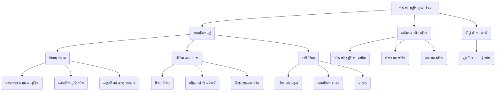

# Class 9 Hindi - Kritika Chapter 103
**Language:** हिंदी

```markdown
# [कक्षा 9] कृतिका - अध्याय 3: रीढ़ की हड्डी

## 🌟 मुख्य अवधारणाएँ (Core Concepts)

यह एकांकी (नाटक का एक अंक) सामाजिक मुद्दों, विशेषकर विवाह और स्त्री शिक्षा के प्रति समाज के दृष्टिकोण पर केंद्रित है।

1.  **विवाह संस्था का बदलता स्वरूप:**
    *   परंपरागत मूल्य बनाम आधुनिक सोच
    *   विवाह का 'बिजनेस' (व्यापार) के रूप में देखा जाना (गोपाल प्रसाद का दृष्टिकोण)
    *   लड़की को वस्तु समझना (देख-परख कर खरीदना)

2.  **लैंगिक असमानता और पितृसत्तात्मक सोच:**
    *   लड़कों और लड़कियों की शिक्षा में भेद (गोपाल प्रसाद की दलीलें)
    *   महिलाओं से अपेक्षाएँ (कम पढ़ी-लिखी, घरेलू, पति की आज्ञा मानने वाली)
    *   पुरुषों का वर्चस्व और महिलाओं का दमन

3.  **स्त्री शिक्षा का महत्व और उससे जुड़ी सामाजिक समस्याएँ:**
    *   शिक्षा का व्यक्ति के आत्मविश्वास और व्यक्तित्व पर प्रभाव (उमा का उदाहरण)
    *   शिक्षित लड़की के विवाह में आने वाली बाधाएँ (रामस्वरूप का डर)
    *   समाज का पाखंड (स्वयं पढ़े-लिखे होकर कम पढ़ी-लिखी बहू चाहना)

4.  **व्यक्तित्व और चरित्र की दृढ़ता:**
    *   'रीढ़ की हड्डी' का प्रतीकात्मक अर्थ (आत्मसम्मान, चरित्र, स्वतंत्र सोच)
    *   शंकर का चरित्रहीन और व्यक्तित्वहीन होना (शारीरिक और चारित्रिक रूप से)
    *   उमा का आत्मविश्वासी और मुखर होना

5.  **पीढ़ियों का संघर्ष:**
    *   पुरानी पीढ़ी (गोपाल प्रसाद) की रूढ़िवादी सोच
    *   नई पीढ़ी (उमा) का आधुनिक और तार्किक दृष्टिकोण
    *   मध्यम मार्ग (रामस्वरूप) का द्वंद्व और मजबूरी

📊 **अवधारणा पदानुक्रम (Concept Hierarchy):**



## 📘 प्रमुख सीखें (Key Learnings)

1.  **पाखंडी सामाजिक मानसिकता का पर्दाफाश:** एकांकी समाज के उस दोहरे चरित्र को उजागर करती है जहाँ लोग स्वयं आधुनिक होते हुए भी, खासकर बहू के मामले में, पिछड़ी सोच रखते हैं। गोपाल प्रसाद वकील होकर भी कम पढ़ी-लिखी बहू चाहते हैं।
2.  **स्त्री शिक्षा का महत्व:** उमा का चरित्र दर्शाता है कि शिक्षा केवल डिग्री नहीं, बल्कि आत्मविश्वास, तर्क क्षमता और अन्याय के विरुद्ध आवाज़ उठाने का साहस देती है।
3.  **आत्मसम्मान सर्वोपरि:** उमा अंत में अपने आत्मसम्मान के लिए खड़ी होती है और रिश्ते से इनकार कर देती है। यह सीख देता है कि किसी भी रिश्ते से बढ़कर व्यक्ति का स्वाभिमान होता है।
4.  **चरित्रहीनता पर व्यंग्य:** शंकर का झुका हुआ शरीर और लड़कियों के हॉस्टल के चक्कर काटने की घटना उसकी चारित्रिक कमजोरी ('रीढ़ की हड्डी' न होना) को दर्शाती है। समाज को ऐसे व्यक्तित्व की आवश्यकता नहीं है।
5.  **सामाजिक दबाव और मजबूरी:** रामस्वरूप अपनी बेटी को उच्च शिक्षा दिलाते हैं, लेकिन समाज के डर से उसे छिपाते हैं। यह दर्शाता है कि अच्छे लोग भी कभी-कभी सामाजिक दबाव में गलत कदम उठाने को मजबूर हो जाते हैं।
6.  **विवाह कोई व्यापार नहीं:** एकांकी इस बात पर जोर देती है कि विवाह दो व्यक्तियों के बीच का पवित्र बंधन है, न कि कोई सौदा जहाँ लड़की को सामान की तरह परखा जाए।

📈 **चित्र (Diagram): पात्रों के दृष्टिकोण का तुलनात्मक विश्लेषण**

| पात्र         | शिक्षा पर विचार                                  | विवाह पर विचार                               | व्यक्तित्व        |
| :----------- | :----------------------------------------------- | :------------------------------------------- | :---------------- |
| **गोपाल प्रसाद** | लड़कियों के लिए कम शिक्षा (मैट्रिक तक), लड़कों के लिए उच्च शिक्षा | 'बिजनेस', कम पढ़ी-लिखी, घरेलू बहू चाहिए | चालाक, रूढ़िवादी |
| **शंकर**      | पिता के विचारों से सहमत, स्वयं B.Sc. के बाद मेडिकल | पिता पर निर्भर, कोई स्पष्ट विचार नहीं         | कमजोर, चरित्रहीन |
| **रामस्वरूप**  | बेटी को B.A. तक पढ़ाया (प्रगतिशील)              | सामाजिक दबाव में बेटी की शिक्षा छिपाना (मजबूर) | विवश, समझौतावादी |
| **उमा**        | शिक्षा को महत्व देती है, B.A. पास              | आत्मसम्मान महत्वपूर्ण, बराबरी का रिश्ता चाहती है | आत्मविश्वासी, मुखर |

## 🧩 सक्रिय अधिगम (Active Learning)

*   **गतिविधि: शोध-आधारित केस स्टडी विश्लेषण 🔍**
    *   **विषय:** भारत में विवाह के बदलते स्वरूप और स्त्री शिक्षा पर सामाजिक दृष्टिकोण।
    *   **कार्य:** समाचार पत्रों, पत्रिकाओं या विश्वसनीय वेबसाइटों से हाल के वर्षों की कम से कम दो ऐसी वास्तविक घटनाओं/केस स्टडीज का पता लगाएं जहाँ:
        1.  लड़की की उच्च शिक्षा के कारण विवाह में समस्या आई हो।
        2.  किसी लड़की/महिला ने विवाह में असमान शर्तों या अपमानजनक व्यवहार का विरोध किया हो।
    *   **विश्लेषण:** इन मामलों के मुख्य कारण क्या थे? समाज की क्या प्रतिक्रिया रही? इनका क्या परिणाम निकला? आज के संदर्भ में 'रीढ़ की हड्डी' एकांकी की प्रासंगिकता पर अपने विचार लिखें।
*   **चर्चा: वास्तविक दुनिया के प्रभावों का आलोचनात्मक विश्लेषण 🌍**
    *   कक्षा में समूह बनाकर चर्चा करें:
        *   गोपाल प्रसाद और शंकर जैसी मानसिकता आज भी भारतीय समाज में कहाँ-कहाँ दिखाई देती है? (उदाहरण: कार्यस्थल, परिवार, राजनीति)
        *   इस मानसिकता का महिलाओं की शिक्षा, करियर और व्यक्तिगत जीवन पर क्या प्रभाव पड़ता है?
        *   उमा जैसी लड़कियों का समाज में क्या महत्व है? क्या समाज उन्हें आसानी से स्वीकार करता है?
        *   'रीढ़ की हड्डी' न होने का मतलब सिर्फ शारीरिक कमजोरी है या चारित्रिक कमजोरी भी? समाज को कैसे व्यक्तित्व की आवश्यकता है?

## 📝 मूल्यांकन तैयारी (Assessment Prep)

*   **केस स्टडी आधारित प्रश्न:** आपको एक काल्पनिक स्थिति दी जा सकती है (जैसे, एक शिक्षित लड़की का रिश्ता तय हो रहा है और लड़के वाले अजीब शर्तें रख रहे हैं)। आपसे पूछा जा सकता है कि 'रीढ़ की हड्डी' के आधार पर लड़की को क्या करना चाहिए और क्यों।
*   **चरित्र-चित्रण:** उमा, गोपाल प्रसाद, शंकर और रामस्वरूप का चरित्र-चित्रण (उनकी सोच, व्यवहार, गुण-दोष)।
*   **संवादों का महत्व:** "विवाह एक बिजनेस है", "हमारी बेइज्जती नहीं होती...", "आपकी लाडले बेटे की रीढ़ की हड्डी भी है या नहीं" - इन संवादों का संदर्भ सहित आशय स्पष्ट करना।
*   **शीर्षक की सार्थकता:** 'रीढ़ की हड्डी' शीर्षक क्यों उपयुक्त है? विस्तार से समझाएं।
*   **एकांकी का उद्देश्य:** लेखक इस एकांकी के माध्यम से क्या संदेश देना चाहता है?
*   **चित्र/आरेख:** पात्रों के बीच संबंधों, उनके विचारों के टकराव या एकांकी के घटनाक्रम को दर्शाने वाले सरल आरेख बनाने का अभ्यास करें (जैसे ऊपर दिया गया तालिका या पदानुक्रम)।

## 🌏 भारतीय संदर्भ (Bharatiya Context)

यह एकांकी आज भी भारतीय समाज के कई पहलुओं से गहराई से जुड़ी हुई है:

1.  **शिक्षा में लैंगिक अंतर:** यद्यपि भारत में महिला साक्षरता दर बढ़ी है (राष्ट्रीय परिवार स्वास्थ्य सर्वेक्षण - NFHS के अनुसार), उच्च शिक्षा और व्यावसायिक पाठ्यक्रमों में अभी भी लैंगिक अंतर मौजूद है। कई परिवारों में आज भी लड़कियों की शिक्षा से ज्यादा उनकी शादी को प्राथमिकता दी जाती है। 'बेटी बचाओ, बेटी पढ़ाओ' जैसी सरकारी योजनाएँ इसी असमानता को दूर करने का प्रयास हैं।
2.  **विवाह बाजार:** भारत में आज भी अरेंज मैरिज (arranged marriage) का प्रचलन है, जहाँ कई बार लड़कियों को इसी तरह 'दिखाने' की प्रक्रिया से गुजरना पड़ता है। दहेज प्रथा (कानूनी रूप से प्रतिबंधित होने के बावजूद) और लड़की के रूप-रंग, शिक्षा, घरेलू कामकाज की क्षमता को अत्यधिक महत्व देना गोपाल प्रसाद की मानसिकता का ही प्रतिबिंब है।
3.  **बदलती महिलाएँ, स्थिर समाज?:** उमा जैसी शिक्षित और मुखर महिलाएँ आज भारत के हर क्षेत्र में आगे बढ़ रही हैं। लेकिन सामाजिक सोच उतनी तेजी से नहीं बदली है। महिलाओं से अपेक्षा की जाती है कि वे करियर और घर दोनों को 'संतुलित' करें, जबकि पुरुषों से ऐसी उम्मीद कम होती है। कार्यस्थल पर लैंगिक भेदभाव और घरेलू हिंसा जैसी समस्याएँ भी मौजूद हैं।
4.  **समाज सुधारक:** भारत का इतिहास राजा राममोहन राय, ईश्वर चंद्र विद्यासागर, सावित्रीबाई फुले जैसे समाज सुधारकों से भरा है जिन्होंने स्त्री शिक्षा और विधवा पुनर्विवाह जैसे मुद्दों पर जोर दिया। यह एकांकी उन्हीं सुधारवादी विचारों को आगे बढ़ाती है।

यह एकांकी छात्रों को भारतीय समाज में व्याप्त लैंगिक असमानता, शिक्षा के महत्व और व्यक्तिगत स्वाभिमान जैसे मुद्दों पर सोचने और आलोचनात्मक दृष्टिकोण विकसित करने के लिए प्रेरित करती है।
```