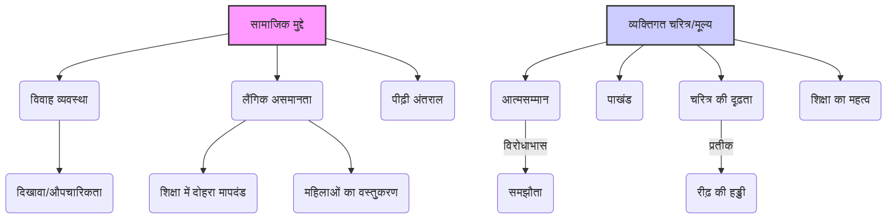

# Class 9 Hindi - Kritika Chapter 103
**Language:** हिंदी

```markdown
# [कक्षा 9] कृतिका - अध्याय 103 (रीढ़ की हड्डी)

*(**नोट:** सामान्यतः यह एकांकी कृतिका भाग 1 में अध्याय 3 के रूप में शामिल है। यहाँ दिए गए अध्याय क्रमांक 103 का अनुसरण किया जा रहा है।)*

## 🌟 मुख्य अवधारणाएँ (Core Concepts)

इस एकांकी की मुख्य अवधारणाओं को निम्नलिखित पदानुक्रम में समझा जा सकता है:

1.  **सामाजिक मुद्दे (Social Issues)**
    *   विवाह व्यवस्था (Marriage System)
        *   दहेज प्रथा (Dowry System - अप्रत्यक्ष संकेत)
        *   दिखावा और औपचारिकता (Pretense and Formality)
    *   लैंगिक असमानता (Gender Inequality)
        *   महिलाओं की शिक्षा के प्रति दोहरा मापदंड (Double Standards towards Women's Education)
        *   महिलाओं को वस्तु समझना (Objectification of Women)
    *   पीढ़ी अंतराल (Generation Gap)
        *   पुरानी बनाम नई सोच (Old vs. New Thinking)

2.  **व्यक्तिगत चरित्र और मूल्य (Individual Character and Values)**
    *   आत्मसम्मान बनाम समझौता (Self-respect vs. Compromise)
    *   पाखंड और दोगलापन (Hypocrisy and Duplicity)
    *   चरित्र की दृढ़ता ('रीढ़ की हड्डी') (Strength of Character - 'Backbone')
    *   शिक्षा का महत्व और प्रभाव (Importance and Impact of Education)

📊 **अवधारणा पदानुक्रम चार्ट:**



## 📘 मुख्य सीखें (Key Learnings)

इस एकांकी से हमें समाज और व्यक्ति के व्यवहार से जुड़ी कई महत्वपूर्ण बातें सीखने को मिलती हैं:

1.  **समाज का दोहरा चरित्र:** गोपाल प्रसाद जैसे लोग समाज में प्रतिष्ठित और पढ़े-लिखे होने का दिखावा करते हैं, लेकिन बहू के मामले में उनकी सोच अत्यंत पिछड़ी और संकीर्ण होती है। वे अपने बेटे (शंकर) को उच्च शिक्षा (बी.एस.सी., मेडिकल) दिलाते हैं, पर बहू दसवीं पास से ज़्यादा नहीं चाहते। यह समाज के पाखंड को उजागर करता है।
    *   *उदाहरण:* गोपाल प्रसाद का कहना, "हमें ज़्यादा पढ़ी-लिखी लड़की नहीं चाहिए... कौन भुगतेगा उनके नखरों को।"

2.  **महिलाओं की शिक्षा का प्रश्न:** एकांकी उस दौर की सामाजिक मानसिकता पर चोट करती है जहाँ लड़कियों को पढ़ाना-लिखाना तो जाता था, पर शादी के समय उनकी शिक्षा को छिपाना पड़ता था या कम करके बताना पड़ता था, क्योंकि ज़्यादा पढ़ी-लिखी लड़की को 'समस्या' माना जाता था।
    *   *रामस्वरूप की विवशता:* अपनी बेटी उमा की बी.ए. तक की शिक्षा को छिपाना उनकी मजबूरी बन जाती है।

3.  **'रीढ़ की हड्डी' का प्रतीकात्मक अर्थ:** यह शीर्षक केवल शंकर की शारीरिक कमजोरी (झुककर बैठना) का ही प्रतीक नहीं है, बल्कि चारित्रिक कमजोरी, आत्मविश्वास की कमी और अपनी बात पर टिक न पाने का भी प्रतीक है। इसके विपरीत, उमा अपनी बातों और सिद्धांतों पर अडिग रहकर 'रीढ़ की हड्डी' वाली चरित्रवान लड़की साबित होती है।
    *   📈 **तुलना:**
        *   **शंकर:** शारीरिक रूप से झुका हुआ, पिता पर निर्भर, चरित्रहीन (हॉस्टल कांड), आत्मविश्वास रहित। (बिना रीढ़ की हड्डी)
        *   **उमा:** सीधी बात कहने वाली, शिक्षित, आत्मसम्मानी, चरित्रवान, अन्याय का विरोध करने वाली। (मजबूत रीढ़ की हड्डी)

4.  **विवाह एक 'बिजनेस' नहीं:** गोपाल प्रसाद विवाह को दो परिवारों का पवित्र बंधन न मानकर एक 'बिजनेस' (व्यापार) की तरह देखते हैं, जहाँ लड़की को वस्तु की तरह 'जाँचा-परखा' जाता है। उमा इस मानसिकता का कड़ा विरोध करती है।
    *   *उमा का कथन:* "जब कुर्सी-मेज़ बिकती है तब दुकानदार कुर्सी-मेज़ से कुछ नहीं पूछता, सिर्फ़ खरीदार को दिखला देता है।"

5.  **आत्मसम्मान का महत्व:** उमा का चरित्र यह सिखाता है कि किसी भी परिस्थिति में, विशेषकर जब आपके अस्तित्व और सम्मान पर प्रश्न उठाया जाए, तो चुप रहना या समझौता करना सही नहीं है। अपनी योग्यता और विचारों को स्पष्टता से रखना ज़रूरी है।

## 🧩 सक्रिय शिक्षण (Active Learning)

1.  **गतिविधि: शोध-आधारित केस स्टडी विश्लेषण 🔍**
    *   **विषय:** "वर्तमान भारतीय समाज में विवाह हेतु लड़कियों की शिक्षा का महत्व: बदलती और स्थिर धारणाएँ"
    *   **कार्य:** छात्र छोटे समूहों में बँटकर इंटरनेट, पत्रिकाओं या अपने आसपास के लोगों से बातचीत करके जानकारी एकत्र करें कि आजकल विवाह के लिए लड़की की शिक्षा को कितना महत्व दिया जाता है। क्या गोपाल प्रसाद जैसी सोच आज भी मौजूद है? क्या उच्च शिक्षित लड़कियों को विवाह में कठिनाइयाँ आती हैं? अपने शोध के निष्कर्षों को कक्षा में प्रस्तुत करें और एकांकी के संदर्भ से तुलना करें।

2.  **चर्चा: वास्तविक दुनिया के प्रभावों का आलोचनात्मक विश्लेषण 🌍**
    *   **प्रश्न:**
        *   गोपाल प्रसाद और रामस्वरूप, दोनों में से कौन अधिक दोषी है और क्यों? क्या दोनों समान रूप से अपराधी हैं?
        *   क्या उमा का अंत में मुखर होकर सच बोलना उचित था? इसके क्या परिणाम हो सकते थे?
        *   'रीढ़ की हड्डी' न होने का समाज और व्यक्ति पर क्या प्रभाव पड़ता है? शंकर जैसे व्यक्तित्व समाज के लिए क्यों हानिकारक हो सकते हैं?
        *   आज के भारत में महिलाओं को शिक्षा और विवाह के संदर्भ में किन चुनौतियों का सामना करना पड़ता है?

## 📝 मूल्यांकन तैयारी (Assessment Prep)

*   **केस स्टडी:** एक आधुनिक स्थिति प्रस्तुत की जा सकती है जहाँ एक शिक्षित लड़की को विवाह के लिए अपनी नौकरी या आकांक्षाओं को छोड़ने का दबाव डाला जा रहा हो। छात्रों से पात्रों के व्यवहार का मूल्यांकन करने और उमा के दृष्टिकोण से समाधान सुझाने के लिए कहा जा सकता है।
*   **चरित्र-चित्रण:** उमा, गोपाल प्रसाद, शंकर और रामस्वरूप की चारित्रिक विशेषताओं का उदाहरण सहित वर्णन करने को कहा जा सकता है।
*   **मूल्य-आधारित प्रश्न:** एकांकी के शीर्षक की सार्थकता, एकांकी का उद्देश्य, लैंगिक समानता और शिक्षा के महत्व पर प्रश्न पूछे जा सकते हैं।
*   **आरेख/चित्र:**
    *   छात्रों को एकांकी के मुख्य पात्रों के बीच संबंधों और तनावों को दर्शाने वाला एक संबंध-आरेख (Relationship Map) बनाने के लिए कहा जा सकता है।
    *   गोपाल प्रसाद की अपेक्षाओं और उमा की वास्तविकता के बीच विरोधाभास को दर्शाने वाला एक तुलनात्मक चार्ट (Comparison Chart) बनाने को दिया जा सकता है।

    📝 **उदाहरण चार्ट:**

    | विशेषता        | गोपाल प्रसाद की अपेक्षा (बहू के लिए) | उमा की वास्तविकता        |
    | -------------- | ----------------------------------- | ----------------------- |
    | शिक्षा         | मैट्रिक (दसवीं) पास                 | बी.ए. पास              |
    | व्यक्तित्व     | कम बोलने वाली, आज्ञाकारी            | स्पष्टवादी, आत्मसम्मानी |
    | बाहरी रूप      | सुन्दर (पाउडर आदि से भी)           | सादगी पसंद, चश्मा लगाती है |
    | अन्य योग्यताएँ | सिलाई, गाना-बजाना (दिखावे हेतु)    | पेंटिंग, गाना-बजाना (वास्तविक ज्ञान) |
    | सोच           | दकियानूसी, घरेलू                   | आधुनिक, तार्किक         |

## 🌏 भारतीय संदर्भ (Bharatiya Context)

यह एकांकी आजादी के बाद के भारतीय समाज की तस्वीर पेश करती है, लेकिन इसके मुद्दे आज भी प्रासंगिक हैं।

1.  **महिला साक्षरता और शिक्षा:**
    *   **राष्ट्रीय आँकड़े:** भारत में महिला साक्षरता दर में लगातार वृद्धि हुई है (जनगणना 2011 के अनुसार लगभग 65.46%, और नवीनतम राष्ट्रीय परिवार स्वास्थ्य सर्वेक्षण (NFHS) के अनुसार यह और बढ़ी है)। उच्च शिक्षा में भी लड़कियों की भागीदारी बढ़ी है। इसके बावजूद, गोपाल प्रसाद जैसी मानसिकता कहीं न कहीं आज भी मौजूद है जो उच्च शिक्षित बहू को स्वीकार करने में हिचकती है।
    *   **सरकारी पहल:** 'बेटी बचाओ, बेटी पढ़ाओ' जैसी योजनाएँ लड़कियों की शिक्षा को बढ़ावा देने और लैंगिक समानता लाने का प्रयास कर रही हैं।

2.  **विवाह बाज़ार में विरोधाभास:**
    *   आज भी कई समुदायों में यह विरोधाभास देखने को मिलता है कि लड़के के लिए उच्च शिक्षित और कामकाजी पत्नी की तलाश होती है, लेकिन साथ ही उससे पारंपरिक बहू की भूमिका निभाने की उम्मीद भी की जाती है।
    *   **उदाहरण:** मैट्रिमोनियल विज्ञापनों या पोर्टल्स पर अक्सर 'शिक्षित, घरेलू' लड़की की मांग देखी जा सकती है, जो इस विरोधाभास को दर्शाता है।

3.  **सामाजिक दबाव:**
    *   रामस्वरूप जैसे माता-पिता आज भी सामाजिक दबाव में आकर अपनी बेटियों की योग्यता या विचारों को छिपाने या कमतर बताने को मजबूर हो सकते हैं, ताकि उनका 'सही घर' में रिश्ता हो सके। यह दिखाता है कि व्यक्तिगत इच्छाओं पर सामाजिक मान्यताएँ कितनी हावी हो सकती हैं।

यह एकांकी हमें भारतीय समाज में शिक्षा, लैंगिक समानता और व्यक्तिगत मूल्यों के महत्व पर गहराई से सोचने पर मजबूर करती है।
```