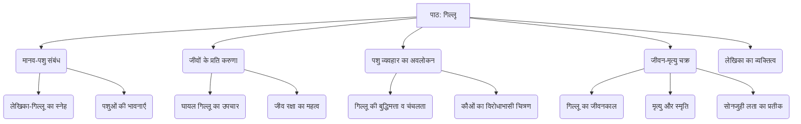

# Class 9 Hindi - Sanchyan Chapter 101
**Language:** हिंदी

```markdown
# [कक्षा 9] संचयन - पाठ 101: गिल्लू (महादेवी वर्मा)

## 🌟 मुख्य अवधारणाएँ (Core Concepts)

इस पाठ की मुख्य अवधारणाओं को निम्नलिखित पदानुक्रम में समझा जा सकता है:

1.  **मानव-पशु संबंध:**
    *   लेखिका और गिलहरी (गिल्लू) के बीच गहरा और आत्मीय लगाव।
    *   पशुओं के प्रति मानवीय संवेदनाएँ (दया, स्नेह, देखभाल)।
2.  **जीवों के प्रति करुणा:**
    *   घायल गिलहरी के बच्चे को बचाने और उसकी सेवा करने का भाव।
    *   दूसरों की सलाह के विपरीत जाकर जीव रक्षा का निर्णय।
3.  **पशु व्यवहार का सूक्ष्म अवलोकन:**
    *   गिल्लू की चंचलता, बुद्धिमत्ता और भावनाओं का विस्तृत वर्णन।
    *   गिलहरियों के प्राकृतिक जीवन और व्यवहार की झलक।
    *   कौओं के व्यवहार का विरोधाभासी चित्रण (समादरित और अनादरित)।
4.  **जीवन और मृत्यु का चक्र:**
    *   गिल्लू का जन्म (प्रतीकात्मक रूप से बचाव), जीवन और मृत्यु का चित्रण।
    *   मृत्यु के बाद भी स्मृति और विश्वास का बना रहना (सोनजुही लता)।
5.  **लेखिका का व्यक्तित्व:**
    *   प्रकृति और जीवों के प्रति गहरा प्रेम और संवेदनशीलता।
    *   सूक्ष्म निरीक्षण शक्ति और भावनात्मक अभिव्यक्ति।

📊 **अवधारणा पदानुक्रम:**



## 📘 मुख्य शिक्षाएँ (Key Learnings)

इस पाठ से हमें कई महत्वपूर्ण बातें सीखने को मिलती हैं:

1.  **करुणा और देखभाल का महत्व:**
    *   लेखिका ने कौओं द्वारा घायल किए गए गिलहरी के नन्हे बच्चे ('लघु प्राण') को मरणासन्न स्थिति में पाया। लोगों के यह कहने पर भी कि कौए की चोंच का घाव लगने के बाद वह बच नहीं सकता, लेखिका का मन नहीं माना।
    *   उन्होंने गिल्लू को उठाया, रुई से रक्त पोंछा, घावों पर पेंसिलिन का मरहम लगाया और दूध पिलाने का प्रयत्न किया। कई घंटों के उपचार के बाद उसके मुँह में पानी टपकाया जा सका। यह घटना जीवों के प्रति गहरी करुणा और देखभाल की आवश्यकता सिखाती है।
    *   📈 **उपचार प्रक्रिया:** घायल अवस्था -> लेखिका द्वारा बचाव -> प्राथमिक उपचार (रक्त पोंछना, मरहम लगाना) -> पोषण का प्रयास (दूध/पानी) -> स्वास्थ्य लाभ।

2.  **मानव और पशु के बीच गहरा संबंध बन सकता है:**
    *   स्वस्थ होने पर गिल्लू लेखिका से बहुत घुलमिल गया। वह लेखिका का ध्यान आकर्षित करने के लिए पर्दे पर चढ़ता-उतरता, उनके खाने की थाली के पास बैठकर सफाई से चावल खाता।
    *   लेखिका की अनुपस्थिति में गिल्लू उदास रहता था, यहाँ तक कि उसने अपना प्रिय खाद्य 'काजू' खाना भी कम कर दिया था। लेखिका की अस्वस्थता में वह उनके सिरहाने बैठकर नन्हे पंजों से उनके बाल सहलाता, जैसे कोई 'परिचारिका' हो। यह दर्शाता है कि पशु भी स्नेह और अपनेपन को महसूस करते हैं और व्यक्त करते हैं।
    *   गिल्लू का लेखिका की थाली में खाने की हिम्मत करना एक 'अपवाद' था, जो उनके बीच के असाधारण संबंध को दर्शाता है।

3.  **पशुओं का अपना व्यक्तित्व और बुद्धिमत्ता होती है:**
    *   गिल्लू केवल एक साधारण गिलहरी नहीं था, उसका अपना विशिष्ट व्यक्तित्व था। उसका लेखिका का ध्यान खींचने के तरीके खोजना, लिफाफे में छिपना, गर्मी से बचने के लिए सुराही पर लेट जाना उसकी समझदारी और अनुकूलन क्षमता को दिखाता है।
    *   उसका बाहर जाकर अन्य गिलहरियों के झुंड का नेता बनना और ठीक समय पर वापस अपने झूले में आ जाना उसकी दिनचर्या और सामाजिक व्यवहार को दर्शाता है।

4.  **प्रकृति के प्रति सम्मान और अवलोकन:**
    *   लेखिका कौओं के विरोधाभासी स्वभाव का वर्णन करती हैं – कैसे वे पितृपक्ष में 'समादरित' होते हैं जब पुरखे उनके रूप में आते माने जाते हैं, और कैसे अपनी कर्कश ध्वनि और हरकतों के कारण 'अनादरित' भी होते हैं।
    *   सोनजुही लता का वर्णन, उसमें खिली पीली कली और उसके नीचे गिल्लू की 'समाधि' बनाना प्रकृति के चक्र और उसमें जीवन की निरंतरता के प्रति लेखिका के विश्वास को प्रकट करता है।

5.  **जीवन की नश्वरता और स्मृति का महत्व:**
    *   गिलहरियों का जीवनकाल लगभग दो वर्ष का होता है। गिल्लू का अंत समय आने पर उसका लेखिका के पास आना, उसी उंगली को पकड़ना जिसे उसने मरणासन्न बचपन में पकड़ा था, जीवन चक्र के पूरा होने का मार्मिक चित्रण है।
    *   गिल्लू की मृत्यु के बाद भी लेखिका उसे सोनजुही की लता में पीले फूल ('पिताभ फूल') के रूप में खिल जाने के विश्वास के साथ याद करती हैं। यह मृत्यु के बाद भी जीवन और सौंदर्य की निरंतरता में उनके विश्वास को दर्शाता है।

## 🧩 सक्रिय अधिगम (Active Learning)

*   **गतिविधि: शोध-आधारित केस स्टडी विश्लेषण 🔍**
    *   **विषय:** "गिल्लू" के व्यवहार का अध्ययन।
    *   **कार्य:** विद्यार्थी समूहों में बंटकर गिलहरियों के सामान्य व्यवहार (जैसे खान-पान, रहने का तरीका, सामाजिकता, जीवनकाल) पर शोध करें। फिर, पाठ में वर्णित गिल्लू के व्यवहार (जैसे लेखिका की थाली से खाना, सुराही पर लेटना, परिचारिका की तरह व्यवहार करना) की तुलना सामान्य गिलहरी के व्यवहार से करें।
    *   **विश्लेषण:** क्या गिल्लू का व्यवहार केवल गिलहरी प्रजाति का सामान्य व्यवहार था या लेखिका के साथ उसके विशेष संबंध का परिणाम? अपने निष्कर्षों को कक्षा में प्रस्तुत करें। इस केस स्टडी से मानव-पशु अंतःक्रिया के प्रभावों पर चर्चा करें।

*   **चर्चा: वास्तविक दुनिया के प्रभावों का आलोचनात्मक विश्लेषण 🌍**
    *   **विषय:** वन्य जीवों को पालने के नैतिक और व्यावहारिक पहलू।
    *   **प्रश्न:**
        *   लेखिका ने गिल्लू को बचाया और पाला। क्या घायल वन्य जीवों को बचाना और पालना हमेशा सही होता है? इसके क्या फायदे और नुकसान हो सकते हैं?
        *   लेखिका ने गिल्लू को बाहर जाने की स्वतंत्रता दी ('जाली का कोना खोल दिया')। यह क्यों महत्वपूर्ण था?
        *   "गिल्लू" जैसी कहानियाँ समाज में पशुओं के प्रति दृष्टिकोण को कैसे प्रभावित कर सकती हैं? क्या यह हमें अधिक संवेदनशील बनाती हैं?
        *   पाठ में कौओं के प्रति व्यक्त दोहरे दृष्टिकोण (समादरित/अनादरित) पर चर्चा करें। क्या समाज में अन्य जीवों के प्रति भी ऐसे विरोधाभासी रवैये दिखते हैं?

## 📝 मूल्यांकन तैयारी (Assessment Prep)

*   **केस स्टडी आधारित प्रश्न:**
    *   यदि आपको सड़क पर एक घायल पक्षी मिलता है, तो "गिल्लू" पाठ से प्रेरणा लेते हुए आप क्या कदम उठाएंगे? अपने कदमों का औचित्य सिद्ध करें। (मूल्यांकन कौशल)
    *   गिल्लू के उन व्यवहारों का वर्णन करें जो उसकी बुद्धिमत्ता और लेखिका के प्रति उसके गहरे लगाव को दर्शाते हैं। पाठ से उदाहरण दें। (विश्लेषण कौशल)
    *   लेखिका ने गिल्लू को सोनजुही लता के नीचे क्यों दफनाया? उनके इस विश्वास का क्या महत्व है कि वह फूल के रूप में खिलेगा? (समझ और व्याख्या कौशल)

*   **रेखाचित्र/आरेख:**
    *   एक प्रवाह चार्ट बनाएं जो गिल्लू के जीवन की मुख्य घटनाओं को दर्शाता हो (मिलने से लेकर मृत्यु तक)।
    *   एक वेन आरेख बनाएं जिसमें कौओं के 'समादरित' और 'अनादरित' पहलुओं को दर्शाया गया हो।

*   **उच्च स्तरीय चिंतन प्रश्न (Evaluating/Creating):**
    *   "मेरे पास बहुत से पशु-पक्षी हैं... परंतु उनमें से किसी को मेरे साथ मेरी थाली में खाने की हिम्मत हुई हो, ऐसा मुझे स्मरण नहीं आता।" इस कथन के आधार पर गिल्लू के अद्वितीय स्थान का मूल्यांकन करें।
    *   कल्पना कीजिए कि आप गिल्लू हैं। लेखिका के अस्पताल से लौटने पर अपनी भावनाओं और व्यवहार का वर्णन करें। (सृजनात्मक लेखन)
    *   क्या आप मानते हैं कि लेखिका का गिल्लू के प्रति व्यवहार अत्यधिक मानवीकरण (anthropomorphism) था? अपने उत्तर के पक्ष या विपक्ष में तर्क दें। (मूल्यांकन कौशल)

## 🌏 भारतीय संदर्भ (Bharatiya Context)

1.  **पितृपक्ष और कौए:** पाठ में कौओं का उल्लेख करते हुए 'पितृपक्ष' का संदर्भ आता है। यह हिंदू धर्म की एक महत्वपूर्ण अवधि है जब लोग अपने पूर्वजों (पितरों) को श्रद्धांजलि देते हैं। ऐसी मान्यता है कि इस दौरान पूर्वज कौओं के रूप में आकर भोजन ग्रहण करते हैं, इसलिए कौओं को आदरपूर्वक भोजन कराया जाता है ('समादरित')। यह भारतीय सांस्कृतिक मान्यताओं का एक विशिष्ट उदाहरण है।
2.  **जीव दया का मूल्य:** भारतीय संस्कृति और विभिन्न धर्मों (जैसे जैन, बौद्ध, हिंदू धर्म) में 'अहिंसा' और 'जीव दया' का गहरा महत्व है। सभी प्राणियों के प्रति करुणा का भाव रखना एक महत्वपूर्ण नैतिक मूल्य माना जाता है। लेखिका का घायल गिल्लू के प्रति व्यवहार इसी भारतीय मूल्य का साहित्यिक प्रतिबिंब है।
3.  **महादेवी वर्मा का पशु प्रेम:** महादेवी वर्मा (1907-1987) हिंदी साहित्य की एक प्रमुख कवयित्री और लेखिका थीं, जिन्हें 'आधुनिक मीरा' भी कहा जाता है। वे अपने पशु प्रेम के लिए जानी जाती थीं। उनके घर में अनेक पशु-पक्षी पलते थे, जिनका उनकी रचनाओं, जैसे 'मेरा परिवार', में मार्मिक और सजीव चित्रण मिलता है। "गिल्लू" उनके इसी पशु प्रेम और गहरी संवेदनशीलता का एक उत्कृष्ट उदाहरण है, जो भारतीय साहित्य की परंपरा से जुड़ा है।

```