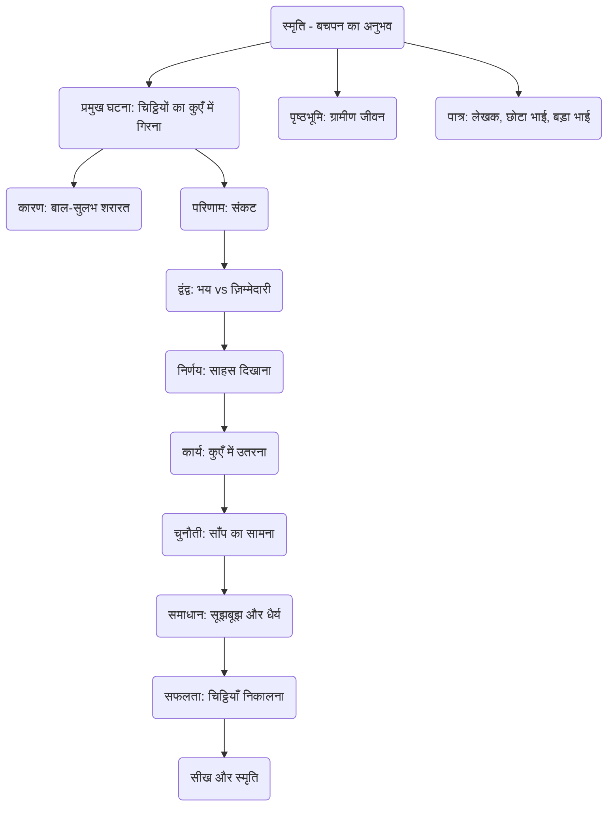

# Class 9 Hindi - Sanchyan Chapter 102
**Language:** हिंदी

```markdown
# [Class 9] Sanchyan - Chapter 102 - स्मृति (Smriti)

## 🌟 Core Concepts

यह पाठ लेखक श्रीराम शर्मा जी की बचपन की एक रोमांचक और अविस्मरणीय घटना का वर्णन है। मुख्य अवधारणाएँ इस प्रकार हैं:

1.  **बाल-सुलभ जिज्ञासा और शरारतें:**
    *   बच्चों का प्राकृतिक स्वभाव (कुएँ में ढेले फेंकना, बेर तोड़ना)।
    *   अनजाने खतरों के प्रति लापरवाही।
2.  **ज़िम्मेदारी का बोध:**
    *   बड़े भाई द्वारा सौंपे गए कार्य (चिट्ठियाँ डाक में डालना) का महत्व।
    *   गलती हो जाने पर ज़िम्मेदारी का अहसास।
3.  **भय और साहस का द्वंद्व:**
    *   भाई की मार का डर।
    *   साँप का डर (जान जाने का खतरा)।
    *   डर पर विजय पाकर साहसपूर्ण निर्णय लेना (कुएँ में उतरना)।
4.  **संकट में सूझबूझ और धैर्य:**
    *   अचानक आई विपत्ति (चिट्ठियों का कुएँ में गिरना)।
    *   धैर्य रखकर समस्या का समाधान खोजना (धोतियों से रस्सी बनाना, साँप से निपटने की योजना)।
    *   तत्काल बुद्धि का प्रयोग (साँप का ध्यान बँटाना, सही समय पर चिट्ठियाँ उठाना)।
5.  **ग्रामीण परिवेश और जीवन:**
    *   तत्कालीन गाँव का चित्रण (कच्चा कुआँ, खेत, पेड़, साधारण खेल)।
    *   साधनों का अभाव और जुगाड़ (धोती को रस्सी बनाना, डंडे का महत्व)।
6.  **स्मृति का महत्व:**
    *   बचपन की घटनाओं का जीवन पर गहरा प्रभाव।
    *   साधारण लगने वाली वस्तुओं (डंडा) से गहरा लगाव।

📊 **अवधारणा पदानुक्रम (Concept Hierarchy):**



## 📘 Key Learnings

इस पाठ से हम सीखते हैं कि बचपन की शरारतें कभी-कभी गंभीर संकट पैदा कर सकती हैं। लेखक और उनके छोटे भाई को बड़े भाई ने ज़रूरी चिट्ठियाँ मक्खनपुर डाकखाने में डालने भेजा। रास्ते में, शरारतवश कुएँ में ढेला फेंकते समय लेखक की टोपी में रखी चिट्ठियाँ कुएँ में गिर गईं, जिसमें एक ज़हरीला साँप रहता था।

*   **संकट की पहचान:** लेखक ने तुरंत समझ लिया कि चिट्ठियाँ न पहुँचने पर बड़े भाई की मार पड़ेगी और ज़िम्मेदारी भी उन्हीं की होगी।
*   **साहसपूर्ण निर्णय:** डर के बावजूद, लेखक ने ज़िम्मेदारी का अहसास करते हुए कुएँ में उतरकर चिट्ठियाँ निकालने का निश्चय किया। यह निर्णय अत्यंत खतरनाक था।
*   **साधनों का उपयोग:** लेखक ने उपलब्ध साधनों (5 धोतियाँ, डंडा) का प्रयोग कर कुएँ में उतरने की योजना बनाई। धोतियों को जोड़कर रस्सी बनाई गई।
    *   📈 **चित्र (Diagram Conceptualization):**
        *   *कुएँ का चित्र:* कच्चा, सँकरा, 36 फुट गहरा, नीचे बैठा साँप।
        *   *धोती-रस्सी:* 5 धोतियों को गाँठ लगाकर बनाई गई लम्बी रस्सी, एक सिरा डेंग से बंधा, दूसरा लेखक के साथ नीचे।
*   **साँप का सामना:** कुएँ में उतरने पर लेखक का सामना फन फैलाए बैठे साँप से हुआ। जगह बहुत कम थी और सीधा हमला संभव नहीं था।
*   **सूझबूझ का प्रदर्शन:**
    1.  **स्थिति का आकलन:** लेखक ने समझा कि साँप को मारना या डंडे से दबाना खतरनाक हो सकता है।
    2.  **ध्यान बँटाना:** डंडे से चिट्ठियों को अपनी ओर खिसकाने का प्रयास किया। साँप ने डंडे पर कई बार हमला किया, जिससे विष डंडे पर लग गया।
    3.  **त्वरित क्रिया:** साँप के हमले और डंडे से लिपटने के दौरान भी लेखक ने हिम्मत नहीं हारी। मिट्टी फेंककर साँप का ध्यान बँटाया और चिट्ठियाँ उठा लीं।
*   **शारीरिक और मानसिक बल:** 36 फुट गहरे कुएँ से केवल भुजाओं के बल पर ऊपर चढ़ना लेखक के असाधारण शारीरिक बल और दृढ़ इच्छाशक्ति को दर्शाता है।
*   **स्मृति का प्रभाव:** यह घटना लेखक के मन पर इतनी गहरी छाप छोड़ गई कि बड़े होने पर भी उन्हें यह स्पष्ट रूप से याद रही और उन्होंने इसे अपनी माँ के साथ साझा किया। यह अनुभव राइफल के शिकार से भी अधिक रोमांचक लगा।

## 🧩 Active Learning

*   **Activity: Research-based case study analysis 🔍**
    *   **विषय:** "बाल्यावस्था में संकट का सामना: स्मृति पाठ के लेखक और आज के किशोर"।
    *   **कार्य:** विद्यार्थी समूह में बँटकर श्रीराम शर्मा जी द्वारा कुएँ में उतरने के निर्णय और कार्यप्रणाली का विश्लेषण करें। फिर, इंटरनेट या समाचार पत्रों से ऐसे आधुनिक किशोरों के उदाहरण खोजें जिन्होंने किसी संकट (जैसे आग, डूबना, दुर्घटना) में असाधारण साहस और सूझबूझ का परिचय दिया हो। दोनों स्थितियों की तुलना करें (उपलब्ध साधन, सामाजिक संदर्भ, निर्णय लेने की प्रक्रिया, परिणाम)। एक संक्षिप्त रिपोर्ट प्रस्तुत करें। (Bloom's: Evaluating/Creating)
*   **Discussion: Critical analysis of real-world impacts 🌍**
    *   **चर्चा के बिंदु:**
        1.  लेखक का कुएँ में उतरने का निर्णय कितना उचित था? क्या इसे केवल साहस कहा जा सकता है या यह मूर्खतापूर्ण जोखिम था? अपने तर्कों का मूल्यांकन करें।
        2.  क्या बच्चों की शरारतों और जिज्ञासा की कोई सीमा होनी चाहिए? इस कहानी के संदर्भ में विश्लेषण करें।
        3.  ज़िम्मेदारी का बोध व्यक्ति को खतरनाक कदम उठाने के लिए प्रेरित कर सकता है। क्या आप इससे सहमत हैं? वास्तविक जीवन से उदाहरण देकर चर्चा करें।
        4.  लेखक ने साँप को छेड़ने की आदत क्यों बना ली थी? इस व्यवहार का मनोवैज्ञानिक विश्लेषण करें। (Bloom's: Evaluating)

## 📝 Assessment Prep

*   **Case Studies & Diagrams 📝**
    1.  **स्थिति:** कल्पना कीजिए कि आप लेखक की जगह होते और चिट्ठियाँ कुएँ में गिर जातीं। आप क्या करते? कुएँ में उतरने के अलावा क्या कोई और विकल्प हो सकता था? अपने निर्णय के पक्ष और विपक्ष में तर्क दें। (Bloom's: Evaluating/Creating)
    2.  **चित्र विश्लेषण:** कुएँ के अंदर लेखक और साँप की स्थिति का चित्र बनाएँ (या दिए गए चित्र का विश्लेषण करें)। लेखक के पास हिलने-डुलने की कितनी जगह थी? साँप की मुद्रा (आसन) क्या दर्शाती है? लेखक ने अपनी स्थिति का लाभ कैसे उठाया?
        ```mermaid
        graph TD
            subgraph कुआँ (गहराई 36 फुट)
                A(लेखक - धोती से लटका हुआ) -- थोड़ी दूरी --> B(फन फैलाए साँप);
                B -- पास में --> C(चिट्ठियाँ);
                A -- पास में --> D(डंडा);
                A -- सीमित जगह --> E(कुएँ की दीवार);
            end
        ```
    3.  **घटना क्रम:** लेखक द्वारा साँप का ध्यान बँटाने और चिट्ठियाँ उठाने के क्रम को चरणबद्ध तरीके से लिखें। प्रत्येक चरण में लेखक की मानसिक स्थिति (डर, एकाग्रता, हिम्मत) का अनुमान लगाएँ।

## 🌏 Bharatiya Context

यह पाठ 20वीं सदी की शुरुआत के भारतीय ग्रामीण जीवन की झलक प्रस्तुत करता है।

*   **ग्रामीण परिवेश:**
    *   कच्चे कुएँ, झरबेरी के बेर, आम के पेड़, बबूल के डंडे - ये सब तत्कालीन भारतीय गाँवों के सहज अंग थे।
    *   डाक व्यवस्था का महत्व: चिट्ठियाँ संचार का प्रमुख साधन थीं और उन्हें समय पर पहुँचाना ज़रूरी समझा जाता था। मक्खनपुर जैसे छोटे कस्बे में डाकखाना होना आम था।
*   **सामाजिक संरचना और मूल्य:**
    *   **पारिवारिक पदानुक्रम:** बड़े भाई का सम्मान और डर स्पष्ट झलकता है।
    *   **भाईचारा:** संकट के समय छोटे भाई की चिंता और लेखक का उसे आश्वासन देना।
    *   **साधन संपन्नता:** सीमित संसाधनों (धोती, डंडा) का बहुउपयोगी होना। धोती पहनने के अलावा रस्सी बनाने जैसे काम आना भारतीय जुगाड़ प्रवृत्ति का उदाहरण है। डंडा केवल सहारे या खेलने के लिए नहीं, बल्कि आत्मरक्षा (साँपों को मारने) का भी साधन था।
*   **आर्थिक स्थिति:** बच्चों के कुर्ते में जेब न होना, माँ द्वारा भुनाने के लिए थोड़े चने देना, साधारण जीवन शैली की ओर संकेत करता है।
*   **लोक विश्वास:** साँप को 'चक्षु:श्रवा' (आँखों से सुनने वाला) कहना तत्कालीन लोक मान्यताओं को दर्शाता है।

यह पाठ उस समय के बच्चों के जीवन, उनके खेल, उनके डर, और उनकी हिम्मत का सजीव चित्रण है, जो भारतीय सामाजिक-सांस्कृतिक संदर्भ में रचा-बसा है।
```