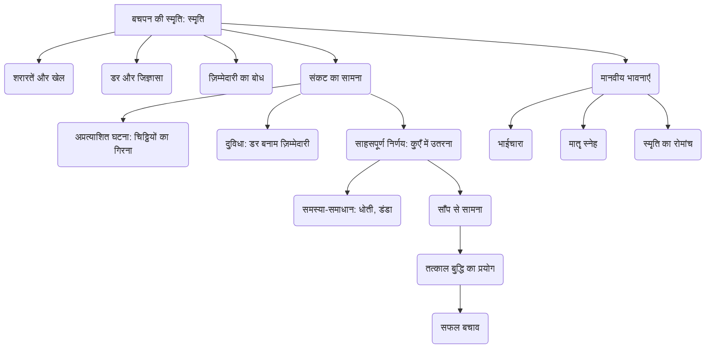

# Class 9 Hindi - Sanchyan Chapter 102
**Language:** हिंदी

```markdown
# [Class 9] Sanchyan - Chapter 102 - स्मृति (Smriti)

## 🌟 Core Concepts (मुख्य अवधारणाएँ)

यह पाठ लेखक श्रीराम शर्मा के बचपन की एक रोमांचक और अविस्मरणीय घटना का वर्णन करता है। इसमें निम्नलिखित मुख्य अवधारणाएँ शामिल हैं:

1.  **बचपन की स्मृति (Childhood Memory):**
    *   शरारतें और खेल (Mischief and Play): झरबेरी के बेर तोड़ना, कुएँ में ढेले फेंकना।
    *   जिज्ञासा और रोमांच (Curiosity and Thrill): साँप की फुफकार सुनने की इच्छा।
    *   डर (Fear): भाई साहब की मार का डर, साँप का डर, पिटने का डर।
    *   साहस और दृढ़ निश्चय (Courage and Determination): डर के बावजूद कुएँ में उतरने का फैसला।
    *   ज़िम्मेदारी का बोध (Sense of Responsibility): चिट्ठियों को सही सलामत डाकखाने पहुँचाने की ज़िम्मेदारी।

2.  **संकट का सामना (Facing Crisis):**
    *   अप्रत्याशित घटना (Unexpected Incident): टोपी उतारते समय चिट्ठियों का कुएँ में गिर जाना।
    *   दुविधा (Dilemma): सच बोलने पर पिटाई का डर और झूठ बोलने पर ज़िम्मेदारी का बोझ।
    *   समस्या-समाधान (Problem Solving): सीमित साधनों (धोती, डंडा) से खतरनाक स्थिति का सामना करने की योजना बनाना।
    *   तत्काल बुद्धि (Presence of Mind): साँप का ध्यान बँटाकर चिट्ठियाँ उठाना और स्वयं को बचाना।

3.  **मानवीय भावनाएँ (Human Emotions):**
    *   भाईचारा (Brotherhood): छोटे भाई की चिंता और लेखक का उसे आश्वासन देना।
    *   मातृ स्नेह (Mother's Love): घटना सुनाने पर माँ की प्रतिक्रिया।
    *   पश्चाताप और गर्व (Reflection and Pride): बचपन की उस घटना को याद कर रोमांच और भय का मिला-जुला अनुभव।

**अवधारणा पदानुक्रम 📊:**



## 📘 Key Learnings (मुख्य शिक्षाएँ)

1.  **बचपन की सहजता और शरारतें:** लेखक और उसके साथियों का झरबेरी के बेर खाना और कुएँ में ढेले फेंककर साँप को छेड़ना बचपन की स्वाभाविक शरारतों और जिज्ञासा को दर्शाता है। यह दिखाता है कि बच्चे अक्सर खतरों से अनजान रहकर रोमांच की तलाश में रहते हैं।

2.  **डर पर साहस की विजय:** भाई साहब की मार के डर और साँप के प्राणघातक भय के बावजूद, लेखक चिट्ठियों को निकालने के लिए कुएँ में उतरने का अत्यंत साहसिक निर्णय लेता है। यह दर्शाता है कि ज़िम्मेदारी का अहसास और दृढ़ निश्चय बड़े से बड़े डर पर भी विजय पा सकता है।

3.  **संकट में बुद्धि का प्रयोग:** कुएँ में साँप के सामने सीमित जगह और खतरनाक स्थिति में, लेखक केवल लाठी के बल पर साँप को मारने की अपनी प्रारंभिक योजना को असंभव पाता है। वह तुरंत अपनी रणनीति बदलता है और साँप का ध्यान भटकाकर चिट्ठियाँ उठाने के लिए अपनी बुद्धि और डंडे का प्रयोग करता है। यह संकट के समय तत्काल बुद्धि और अनुकूलनशीलता के महत्व को सिखाता है।
    *   **Diagram Idea 📈:** (एक साधारण प्रवाह चार्ट)
        *   चिट्ठियाँ गिरीं -> डर और दुविधा -> ज़िम्मेदारी का अहसास -> कुएँ में उतरने का निश्चय -> धोतियों से रस्सी बनाई -> भाई को पकड़ने को कहा -> कुएँ में उतरा -> साँप को देखा, योजना बदली -> डंडे से ध्यान भटकाया -> चिट्ठियाँ उठाईं -> सुरक्षित बाहर निकला।

4.  **ज़िम्मेदारी का महत्व:** लेखक के लिए वे चिट्ठियाँ बहुत महत्वपूर्ण थीं क्योंकि भाई साहब ने उन्हें ज़रूरी बताकर डाक में डालने को कहा था। इसी ज़िम्मेदारी के बोध ने उसे अपनी जान जोखिम में डालने के लिए प्रेरित किया।

5.  **स्मृति का प्रभाव:** यह घटना लेखक के मन पर इतनी गहरी छाप छोड़ती है कि बड़े होने पर भी वह उसे स्पष्ट रूप से याद रखता है। वह उस समय के रोमांच और भय को महसूस करता है और बचपन के उन दिनों को याद करता है जब एक डंडा ही सबसे बड़ा हथियार लगता था।

## 🧩 Active Learning (सक्रिय शिक्षण)

*   **Activity (गतिविधि): शोध-आधारित केस स्टडी विश्लेषण 🔍**
    *   छात्र समूहों में बँटकर ऐसी वास्तविक या काल्पनिक कहानियों/घटनाओं पर शोध करें जहाँ बच्चों ने विषम परिस्थितियों में असाधारण साहस या बुद्धि का परिचय दिया हो।
    *   "स्मृति" पाठ में लेखक के अनुभव के साथ इन घटनाओं की तुलना करें। विश्लेषण करें कि डर, ज़िम्मेदारी और साहस ने उन स्थितियों में क्या भूमिका निभाई। अपनी निष्कर्ष कक्षा में प्रस्तुत करें। (Bloom's: Evaluating)

*   **Discussion (चर्चा): वास्तविक दुनिया के प्रभावों का आलोचनात्मक विश्लेषण 🌍**
    *   इस बात पर कक्षा में चर्चा करें कि क्या लेखक का कुएँ में उतरने का निर्णय सही था? क्या यह बहादुरी थी या मूर्खता? उसके पास और क्या विकल्प हो सकते थे?
    *   आलोचनात्मक विश्लेषण करें: आज के समय में यदि ऐसी घटना हो तो क्या करना उचित होगा? बच्चों की सुरक्षा और ज़िम्मेदारी के बीच संतुलन कैसे बनाया जा सकता है? (Bloom's: Evaluating)
    *   कल्पना करें और चर्चा करें: यदि लेखक चिट्ठियाँ नहीं निकाल पाता तो कहानी का अंत क्या हो सकता था? एक वैकल्पिक अंत लिखें या सुनाएँ। (Bloom's: Creating)

## 📝 Assessment Prep (मूल्यांकन तैयारी)

*   **Case Studies (केस स्टडी):**
    *   **स्थिति 1:** कल्पना कीजिए कि आप लेखक की जगह होते और चिट्ठियाँ कुएँ में गिर जातीं। आप डर, भाई की डाँट और ज़िम्मेदारी के बीच क्या करते? लेखक के कार्यों का मूल्यांकन करते हुए अपने संभावित कदमों का वर्णन करें।
    *   **स्थिति 2:** लेखक ने साँप का ध्यान बँटाने के लिए डंडे और मिट्टी का प्रयोग किया। क्या आपको लगता है कि यह सबसे सुरक्षित तरीका था? यदि नहीं, तो क्यों? और क्या बेहतर तरीका हो सकता था? विश्लेषण करें।
*   **Diagrams (रेखाचित्र):**
    *   कुएँ के अंदर का दृश्य चित्रित करें, जिसमें लेखक, साँप, चिट्ठियाँ, डंडा और धोती की रस्सी दिखाई दे। प्रत्येक तत्व की भूमिका का वर्णन करें।
    *   ऊपर दिए गए प्रवाह चार्ट (Flowchart) को समझें और अपने शब्दों में घटना के क्रम को समझाएँ।
*   **NCERT बोध-प्रश्न:** पाठ के अंत में दिए गए प्रश्नों (जैसे - लेखक के मन में किस बात का डर था? कुएँ में उतरने का निर्णय क्यों लिया? साँप का ध्यान कैसे बँटाया?) के उत्तर लिखने का अभ्यास करें।

## 🌏 Bharatiya Context (भारतीय संदर्भ)

यह कहानी 20वीं सदी की शुरुआत के भारतीय ग्रामीण जीवन की झलक प्रस्तुत करती है:

1.  **ग्रामीण परिवेश:** कहानी में गाँव का जीवन, खेतों के पास झरबेरी के बेर तोड़ना, कच्चे कुएँ (जो उस समय सिंचाई और पानी के स्रोत होते थे और कभी-कभी खतरनाक भी), और बच्चों का प्रकृति के बीच खेलना आम भारतीय ग्रामीण दृश्य को दर्शाता है।
2.  **पारंपरिक वस्त्र और वस्तुएँ:** धोती (dhoti) का प्रयोग न केवल पहनने के लिए बल्कि संकट के समय रस्सी बनाने जैसे बहुउद्देशीय काम के लिए भी किया गया, जो उस समय की संसाधनशीलता को दिखाता है। डंडा (danda) बच्चों के खेलने और आत्मरक्षा का एक सामान्य साधन था।
3.  **संचार माध्यम:** मक्खनपुर डाकखाने (post office) में चिट्ठियाँ डालने जाना उस ज़माने में संचार के महत्व को रेखांकित करता है, जब डाक व्यवस्था दूर-दराज के गाँवों को जोड़ने का एक प्रमुख माध्यम थी। आज के डिजिटल युग की तुलना में यह बहुत भिन्न था।
4.  **पारिवारिक संरचना:** बड़े भाई (भाई साहब) के प्रति छोटे भाइयों का आदर मिश्रित डर उस समय के पारिवारिक मूल्यों और अनुशासन को दर्शाता है।
5.  **साँप और लोक विश्वास:** भारत में साँप अक्सर पाए जाते हैं, और उनसे जुड़ा भय और कभी-कभी लोक कथाएँ आम हैं। लेखक का साँप को 'काला साँप' कहना और उसके विषैले स्वभाव का वर्णन भारतीय संदर्भ में सहज है।
```