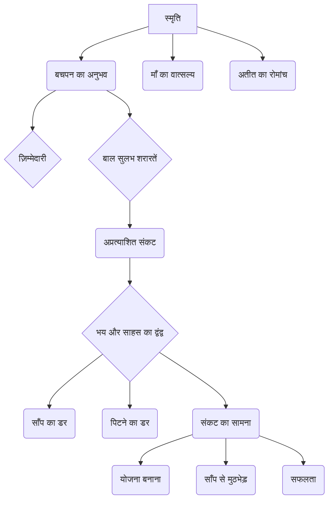
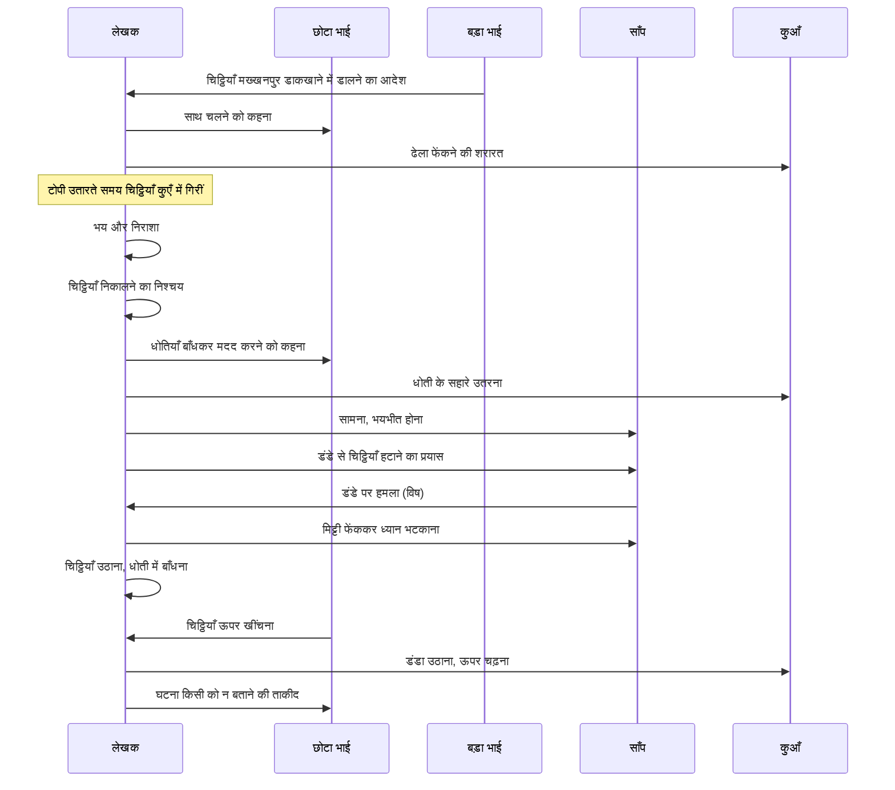

# Class 9 Hindi - Sanchyan Chapter 102
**Language:** हिंदी

```markdown
# [कक्षा 9] संचयन - अध्याय 102: स्मृति

## 🌟 Core Concepts

यह पाठ लेखक श्रीराम शर्मा की बचपन की एक रोमांचक और अविस्मरणीय घटना का वर्णन है। इसमें मुख्य रूप से निम्नलिखित अवधारणाएँ शामिल हैं:

1.  **बचपन की स्मृति (Childhood Memory):**
    *   लेखक का अपने बचपन के दिनों को याद करना।
    *   ग्रामीण परिवेश और उस समय के बच्चों के खेल (झरबेरी के बेर तोड़ना, डंडे से खेलना)।

2.  **ज़िम्मेदारी और कर्तव्य बोध (Responsibility and Duty):**
    *   बड़े भाई द्वारा सौंपी गई चिट्ठियाँ डाक में डालने की ज़िम्मेदारी।
    *   ज़िम्मेदारी के प्रति गंभीरता और उसे पूरा करने का दबाव।

3.  **बाल सुलभ शरारतें और जिज्ञासा (Childish Mischief and Curiosity):**
    *   कुएँ में ढेला फेंककर साँप की फुफकार सुनने की आदत।
    *   खतरों से अनजान होकर कौतूहलवश कार्य करना।

4.  **संकट और भय (Crisis and Fear):**
    *   चिट्ठियों का कुएँ में गिर जाना।
    *   बड़े भाई की मार का डर।
    *   कुएँ में मौजूद विषैले साँप का जानलेवा भय।

5.  **साहस और दृढ़ निश्चय (Courage and Determination):**
    *   भय के बावजूद चिट्ठियाँ निकालने का कठिन निर्णय लेना।
    *   जान जोखिम में डालकर कुएँ में उतरना।
    *   साँप का सामना करने की हिम्मत।

6.  **समस्या-समाधान और युक्ति (Problem-Solving and Strategy):**
    *   धोतियों को जोड़कर रस्सी बनाना।
    *   साँप का ध्यान भटकाने के लिए मिट्टी फेंकना।
    *   डंडे का प्रयोग करके चिट्ठियाँ उठाना।

7.  **मानवीय भावनाएँ (Human Emotions):**
    *   डर, घबराहट, निराशा, पश्चाताप।
    *   भाई के प्रति प्रेम और चिंता (छोटे भाई का रोना)।
    *   सफलता पर राहत और माँ का वात्सल्य।

📊 **अवधारणा पदानुक्रम (Concept Hierarchy):**


## 📘 Key Learnings

इस पाठ से हमें कई महत्वपूर्ण बातें सीखने को मिलती हैं:

1.  **ज़िम्मेदारी का महत्व:** लेखक ने बचपन में ही ज़िम्मेदारी का बोझ महसूस किया और उसे निभाने के लिए अपनी जान तक जोखिम में डाल दी। इससे कर्तव्यनिष्ठा का महत्व पता चलता है।
2.  **भय पर साहस की विजय:** अत्यधिक भय (भाई की मार और साँप का डर) के बावजूद, लेखक ने साहस नहीं खोया और चिट्ठियाँ निकालने का दृढ़ निश्चय किया। यह सिखाता है कि साहस से डर पर काबू पाया जा सकता है।
3.  **संकट में बुद्धि का प्रयोग:** कुएँ में उतरने से लेकर साँप का सामना करने और चिट्ठियाँ निकालने तक, लेखक ने हर कदम पर अपनी बुद्धि और युक्ति का प्रयोग किया। कठिन परिस्थितियों में शांत रहकर सोचना महत्वपूर्ण है।
4.  **बचपन की नादानियाँ और उनके परिणाम:** कुएँ में ढेला फेंकने जैसी सामान्य शरारत अप्रत्याशित रूप से एक बड़े संकट का कारण बन गई। यह दर्शाता है कि कभी-कभी छोटी लगने वाली गलतियाँ गंभीर परिणाम दे सकती हैं।
5.  **मानवीय संबंध और भावनाएँ:** छोटे भाई की चिंता, माँ का स्नेह और लेखक का डर व साहस, ये सभी मानवीय भावनाओं की गहराई को दर्शाते हैं।

📈 **घटना क्रम (Sequence of Events):**


*(यह चित्र घटना के मुख्य चरणों को दर्शाता है: आदेश मिलना, संकट आना, योजना बनाना, सामना करना और समाधान पाना।)*

## 🧩 Active Learning

*   **Activity: स्थिति-आधारित विश्लेषण (Situation-Based Analysis) 🔍**
    *   कल्पना कीजिए कि आप लेखक की जगह होते और चिट्ठियाँ कुएँ में गिर जातीं। आपके सामने क्या-क्या विकल्प होते? आप कौन-सा विकल्प चुनते और क्यों? अपने निर्णय के पक्ष और विपक्ष में तर्क दीजिए। क्या आप भी लेखक की तरह कुएँ में उतरने का साहस करते? पाठ के आधार पर अपने उत्तर का समर्थन करें।

*   **Discussion: आलोचनात्मक विश्लेषण (Critical Analysis) 🌍**
    *   इस कहानी में लेखक द्वारा उठाए गए जोखिम पर चर्चा करें। क्या ज़िम्मेदारी निभाने के लिए जान जोखिम में डालना उचित है? बचपन में किए गए साहसिक कार्यों को बड़े होने पर किस दृष्टि से देखा जाना चाहिए? क्या आज के समय में बच्चों को ऐसे जोखिम उठाने चाहिए? अपने विचार साझा करें।

## 📝 Assessment Prep

*   **केस स्टडी (Case Study):**
    *   **शीर्षक:** संकट में निर्णय लेना: स्मृति पाठ का अध्ययन
    *   **विवरण:** लेखक के सामने चिट्ठियों के कुएँ में गिरने से उत्पन्न संकट, उसके मन में चल रहे द्वंद्व (डर बनाम ज़िम्मेदारी), कुएँ में उतरने का साहसिक निर्णय, साँप से सामना और चिट्ठियों को सफलतापूर्वक निकालने की प्रक्रिया का विश्लेषण करें।
    *   **प्रश्न:**
        1.  लेखक के निर्णय लेने की प्रक्रिया को प्रभावित करने वाले कारक कौन-से थे?
        2.  लेखक द्वारा अपनाई गई युक्तियाँ कितनी प्रभावी थीं?
        3.  इस घटना से लेखक ने क्या सीखा होगा?
        4.  इस केस स्टडी से आप प्रबंधन और साहस के बारे में क्या सीखते हैं?

*   **Diagrams 📝:**
    *   उपरोक्त घटना क्रम (Sequence Diagram) का अध्ययन करें।
    *   कुएँ का एक सरल रेखाचित्र बनाएँ जिसमें लेखक की स्थिति, साँप, चिट्ठियाँ और धोती की रस्सी को दर्शाया गया हो। इससे लेखक की खतरनाक स्थिति को समझने में मदद मिलेगी।

## 🌏 Bharatiya Context

यह कहानी 20वीं सदी की शुरुआत के भारतीय ग्रामीण जीवन की झलक प्रस्तुत करती है:

1.  **संचार का माध्यम:** उस समय डाक (चिट्ठियाँ) संचार का एक महत्वपूर्ण और ज़रूरी माध्यम थी, खासकर महत्वपूर्ण संदेशों के लिए। डाक समय पर पहुँचना आवश्यक माना जाता था।
2.  **ग्रामीण जीवन और खेल:** बच्चों का झरबेरी के बेर तोड़ना, गिल्ली-डंडा की तरह `डंडे` को हथियार और साथी मानना, उस समय के सरल ग्रामीण जीवन और मनोरंजन के साधनों को दर्शाता है।
3.  **पहनावा और उपयोगिता:** `धोती` का पहनावे के साथ-साथ कान बाँधने और रस्सी बनाने जैसे बहु-उपयोगी वस्तु के रूप में प्रयोग तत्कालीन भारतीय जीवन शैली का हिस्सा था।
4.  **जल स्रोत:** `कच्चा कुआँ` पानी का स्रोत होने के साथ-साथ कई बार खतरनाक भी साबित होता था। कुएँ की संरचना (जैसे `डेंग` - जिस पर चरखी टिकती है) भी ग्रामीण वास्तुकला का अंग थी।
5.  **पारिवारिक संरचना और अनुशासन:** बड़े भाई का डर अनुशासन बनाए रखने का एक तरीका था, जो उस समय के पारिवारिक माहौल में आम था।
6.  **प्रकृति और भय:** ग्रामीण भारत में खेतों, कुओं आदि के पास साँपों का पाया जाना आम बात थी और उनसे जुड़ा भय स्वाभाविक था। `विषधर` का डर वास्तविक था।

यह पाठ न केवल एक रोमांचक कहानी है, बल्कि तत्कालीन भारतीय समाज, संस्कृति और जीवन शैली का एक सजीव चित्रण भी प्रस्तुत करता है।
```