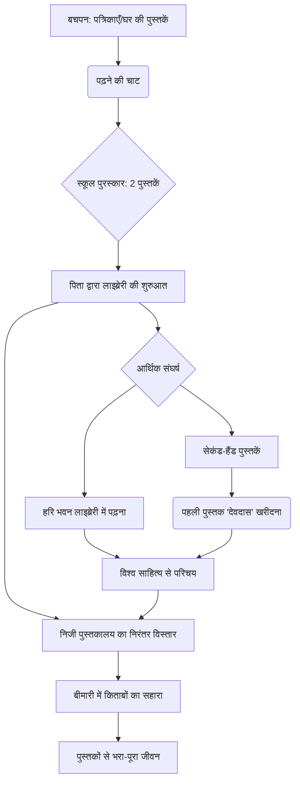

# Class 9 Hindi - Sanchyan Chapter 104
**Language:** हिंदी

```markdown
# [कक्षा 9] संचयन - अध्याय 104 (पाठ: मेरा छोटा-सा निजी पुस्तकालय)

*(नोट: मानक एन.सी.ई.आर.टी. संचयन भाग 1 में यह पाठ अध्याय 5 के रूप में सूचीबद्ध है। यहाँ दिए गए अध्याय संख्या 104 का प्रयोग प्रश्न के अनुसार किया गया है।)*

## 🌟 मुख्य अवधारणाएँ (Core Concepts)

एक विस्तृत अवधारणा पदानुक्रम 📊:

1.  **लेखक का पुस्तक प्रेम:**
    *   बचपन से पढ़ने की तीव्र इच्छा (चाट लगना)।
    *   किताबों को जीवन का आधार मानना (प्राण किताबों में बसना)।
    *   निजी पुस्तकालय का निर्माण और विस्तार।
2.  **पुस्तकें पढ़ने की प्रेरणा:**
    *   पारिवारिक पृष्ठभूमि (आर्य समाज, माता-पिता का प्रभाव)।
    *   बचपन में मिली पत्रिकाएँ (बालसखा, चमचम, सरस्वती आदि)।
    *   स्कूल में पुरस्कार में मिली पुस्तकें।
    *   स्थानीय पुस्तकालय ("हरि भवन") का अनुभव।
3.  **जीवन में पुस्तकों का महत्व:**
    *   ज्ञान और मनोरंजन का स्रोत।
    *   नई दुनियाओं से परिचय (पक्षियों, जहाजों की दुनिया)।
    *   विश्व साहित्य से जुड़ाव।
    *   कठिन समय में मानसिक संबल (बीमारी के दौरान)।
    *   व्यक्तित्व निर्माण में सहायक।
4.  **आर्थिक संघर्ष और पुस्तकें:**
    *   पिता की नौकरी छोड़ने के बाद आर्थिक कठिनाइयाँ।
    *   किताबें खरीदने में असमर्थता।
    *   सेकंड-हैंड पुस्तकें खरीदना।
    *   पहली पुस्तक ("देवदास") खरीदने का मार्मिक प्रसंग।
5.  **निजी पुस्तकालय का भावनात्मक मूल्य:**
    *   पिता द्वारा दी गई पहली जगह।
    *   जीवन भर का संग्रह।
    *   महान लेखकों/विचारकों की उपस्थिति का एहसास।
    *   पुनर्जीवन का स्रोत (विंदा करंदीकर का कथन)।

## 📘 मुख्य सीख (Key Learnings)

विस्तृत व्याख्याएँ और उदाहरण 📈:

1.  **पढ़ने की आदत का विकास:** लेखक को बचपन में घर पर आने वाली पत्रिकाओं ('बालसखा', 'चमचम', 'सरस्वती', 'आर्यमित्र', 'वेदोदम', 'गृहिणी') और स्वामी दयानंद की जीवनी जैसी पुस्तकों से पढ़ने का शौक लगा। यह शौक इतना गहरा था कि वे हर समय, यहाँ तक कि खाना खाते समय भी पढ़ते रहते थे।
2.  **पुस्तकालय की शुरुआत:** पाँचवीं कक्षा में अच्छे अंक लाने पर पुरस्कार में मिली दो अंग्रेजी पुस्तकों ('पक्षियों की खोज' और 'ट्रस्टी द रग') ने लेखक के लिए ज्ञान की नई दुनिया खोली। पिता ने आलमारी में एक खाना खाली करके उन पुस्तकों को रखते हुए कहा, "आज से यह खाना तुम्हारी अपनी किताबों का। यह तुम्हारी अपनी लाइब्रेरी है।" यहीं से लेखक के निजी पुस्तकालय की नींव पड़ी।
3.  **ज्ञान की प्यास और संघर्ष:** पिता की मृत्यु के बाद आर्थिक तंगी के कारण लेखक नई किताबें खरीदने में असमर्थ थे। वे मुहल्ले के पुस्तकालय 'हरि भवन' में बैठकर किताबें पढ़ते थे। यहीं उनका परिचय बंकिमचंद्र, टॉलस्टॉय, विक्टर ह्यूगो, गोर्की, सर्वान्तीस जैसे विश्व-प्रसिद्ध लेखकों की अनूदित रचनाओं से हुआ। वे सेकंड-हैंड पाठ्यपुस्तकें खरीदकर और सहपाठियों से लेकर पढ़ते थे।
4.  **पहली खरीदी गई पुस्तक का महत्व:** इंटरमीडिएट पास करने के बाद पुरानी किताबें बेचकर मिले पैसों में से दो रुपये बचे थे। माँ की सहमति से वे 'देवदास' फिल्म देखने जा रहे थे, लेकिन रास्ते में एक दुकान पर शरतचंद्र चट्टोपाध्याय की 'देवदास' पुस्तक केवल दस आने में मिल रही थी (रियायत के बाद)। लेखक ने फिल्म देखने के बजाय वह पुस्तक खरीद ली। यह उनके अपने पैसों से खरीदी गई उनके निजी पुस्तकालय की पहली पुस्तक थी, जिसका उनके जीवन में विशेष भावनात्मक महत्व है।
5.  **पुस्तकालय का विस्तार और संतोष:** लेखक का पुस्तकालय उनके जीवन के साथ-साथ बढ़ता गया। इसमें हिंदी, अंग्रेजी के उपन्यास, नाटक, कथा-संकलन, जीवनियाँ, संस्मरण, इतिहास, कला, पुरातत्व, राजनीति आदि विषयों की हजारों पुस्तकें जमा हो गईं। इन पुस्तकों के बीच लेखक स्वयं को भरा-भरा और समृद्ध महसूस करते हैं।
6.  **पुस्तकें - जीवन का संबल:** गंभीर बीमारी से उबरने के बाद जब लेखक अपने किताबों वाले कमरे में थे, तो उन्हें लगा कि उनके प्राण शरीर से निकलकर इन्हीं हजारों किताबों में बस गए हैं। मराठी कवि विंदा करंदीकर ने भी कहा कि इन पुस्तक-रूपी महापुरुषों के आशीर्वाद से ही लेखक का जीवन बचा है।

*उदाहरण आरेख (Example Diagram - Conceptual Flow):*



## 🧩 सक्रिय अधिगम (Active Learning)

*   **गतिविधि: शोध-आधारित केस स्टडी विश्लेषण 🔍**
    *   पाठ में उल्लिखित किसी एक भारतीय लेखक (जैसे प्रेमचंद, महादेवी वर्मा, निराला) या विदेशी लेखक (जैसे टॉलस्टॉय, विक्टर ह्यूगो) अथवा आर्य समाज आंदोलन पर शोध करें।
    *   विश्लेषण करें कि उस लेखक की रचनाओं या उस आंदोलन का तत्कालीन भारतीय समाज और शिक्षा पर क्या प्रभाव पड़ा होगा? धर्मवीर भारती के अनुभवों से इसकी तुलना करें। अपने निष्कर्ष कक्षा में प्रस्तुत करें।

*   **चर्चा: वास्तविक दुनिया के प्रभावों का आलोचनात्मक विश्लेषण 🌍**
    *   लेखक धर्मवीर भारती को आर्थिक तंगी के कारण पुस्तकें प्राप्त करने में कठिनाई हुई। आज के समय में ज्ञान/साहित्य तक पहुँच में आर्थिक या अन्य (जैसे डिजिटल डिवाइड) बाधाओं पर चर्चा करें।
    *   लेखक द्वारा फिल्म ('देवदास') के बजाय पुस्तक ('देवदास') चुनने के निर्णय का विश्लेषण करें। मनोरंजन बनाम ज्ञान/साहित्य के महत्व पर अपने विचार व्यक्त करें। क्या आज भी ऐसी स्थितियाँ आती हैं?

## 📝 मूल्यांकन तैयारी (Assessment Prep)

केस स्टडी और मुख्य बिंदु 📝:

1.  **महत्वपूर्ण घटनाएँ:** लेखक की बीमारी और किताबों के प्रति लगाव, बचपन में पढ़ने की आदत का विकास, पुरस्कार में मिली पुस्तकें, पिता द्वारा लाइब्रेरी की शुरुआत, 'हरि भवन' का अनुभव, 'देवदास' पुस्तक खरीदने की घटना, विंदा करंदीकर का कथन – इन घटनाओं को क्रमबद्ध रूप से समझें और इनके महत्व का विश्लेषण करें।
2.  **लेखक की भावनाएँ:** विभिन्न प्रसंगों में लेखक की भावनाओं (जैसे पढ़ने की उत्सुकता, आर्थिक मजबूरी की पीड़ा, पहली पुस्तक खरीदने का रोमांच, किताबों के बीच संतोष) को समझें।
3.  **प्रतीकात्मक अर्थ:** "राजा के प्राण तोते में" की तरह लेखक के प्राण किताबों में बसने का क्या अर्थ है? "यह तुम्हारी अपनी लाइब्रेरी है" – इस कथन का लेखक के जीवन पर क्या प्रभाव पड़ा?
4.  **मूल्य-आधारित प्रश्न:** लेखक के जीवन से मिलने वाली प्रेरणाओं (जैसे पढ़ने का शौक, संघर्षशीलता, ज्ञान का महत्व) पर विचार करें। 'देवदास' खरीदने वाली घटना किन मूल्यों को दर्शाती है?
5.  **उदाहरण:** पाठ से उदाहरण देकर समझाएँ कि पुस्तकों ने लेखक के लिए नई दुनिया के द्वार कैसे खोले।

*केस स्टडी उदाहरण:* 'देवदास' पुस्तक खरीदने की घटना का विश्लेषण:
    *   **स्थिति:** सीमित पैसे (दो रुपये), माँ की फिल्म देखने की अनुमति।
    *   **विकल्प:** डेढ़ रुपये में फिल्म देखना या दस आने में पुस्तक खरीदना।
    *   **निर्णय:** पुस्तक खरीदना।
    *   **कारण:** पुस्तक प्रेम, पैसे बचाने की प्रवृत्ति, साहित्य का आकर्षण।
    *   **परिणाम:** निजी पुस्तकालय की पहली पुस्तक, माँ की भावनात्मक प्रतिक्रिया, आत्म-संतोष।
    *   **महत्व:** लेखक के जीवन में पुस्तकों के गहरे महत्व और उनके चरित्र को दर्शाता है।

## 🌏 भारतीय संदर्भ (Bharatiya Context)

राष्ट्रीय आर्थिक/सामाजिक डेटा और उदाहरण 📊:

पाठ में कई भारतीय सामाजिक, सांस्कृतिक और ऐतिहासिक संदर्भ निहित हैं:

1.  **आर्य समाज आंदोलन:** लेखक के पिता आर्य समाज रानीमंडी के प्रधान थे। आर्य समाज 19वीं सदी का एक प्रमुख भारतीय समाज सुधार आंदोलन था जिसने शिक्षा (विशेषकर स्त्री शिक्षा) और सामाजिक कुरीतियों के खंडन पर जोर दिया। लेखक की माँ द्वारा 'आदर्श कन्या पाठशाला' की स्थापना इसी संदर्भ में थी।
2.  **गांधीजी का आह्वान:** लेखक के पिता ने गांधीजी के आह्वान पर सरकारी नौकरी छोड़ी, जो भारतीय स्वतंत्रता आंदोलन के प्रभाव को दर्शाता है।
3.  **भारतीय पत्रिकाएँ:** 'आर्यमित्र साप्ताहिक', 'वेदोदम', 'सरस्वती', 'गृहिणी', 'बालसखा', 'चमचम' – ये उस समय की लोकप्रिय हिंदी पत्रिकाएँ थीं जिन्होंने हिंदी साहित्य और बाल साहित्य के प्रसार में योगदान दिया।
4.  **भारतीय लेखक और कवि:** पाठ में कबीर, तुलसी, सूर, रसखान, जायसी, प्रेमचंद, पंत, निराला, महादेवी वर्मा जैसे महान भारतीय साहित्यकारों का उल्लेख है, जो भारतीय साहित्य की समृद्ध परंपरा को दर्शाता है।
5.  **शिक्षा केंद्र:** इलाहाबाद (प्रयागराज) का एक प्रमुख शिक्षा केंद्र के रूप में उल्लेख (पब्लिक लाइब्रेरी, भारती भवन, विश्वविद्यालय, वकीलों/अध्यापकों की निजी लाइब्रेरियाँ)।
6.  **सामाजिक-आर्थिक यथार्थ:** आर्थिक कठिनाइयाँ, फीस जुटाने की मुश्किल, सेकंड-हैंड किताबें खरीदने-बेचने का चलन – यह उस दौर के मध्यमवर्गीय भारतीय समाज की वास्तविकता का चित्रण है।

*(नोट: पाठ में प्रत्यक्ष आर्थिक या सामाजिक 'डेटा' (आंकड़े) नहीं हैं, बल्कि सामाजिक-आर्थिक और सांस्कृतिक परिवेश का जीवंत चित्रण है।)*
```