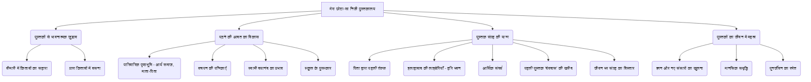
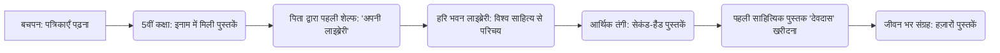
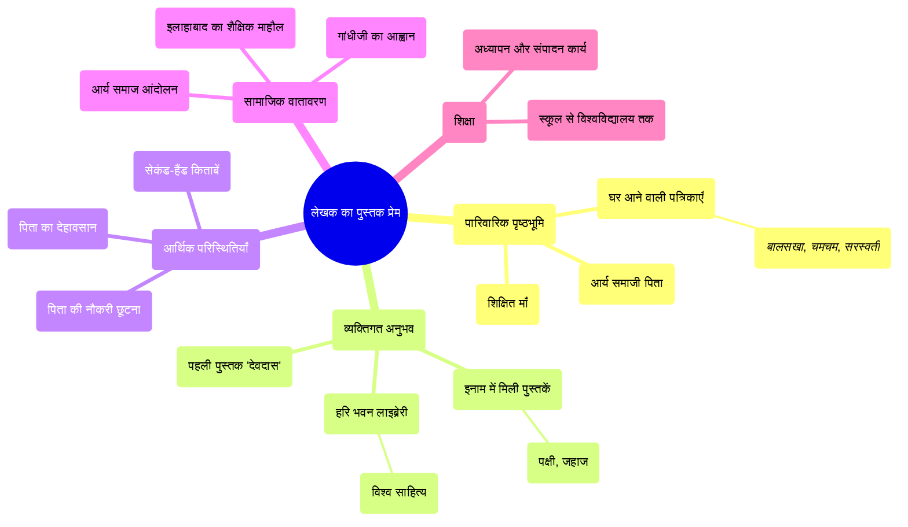

# Class 9 Hindi - Sanchyan Chapter 104
**Language:** हिंदी

```markdown
# [Class 9] Sanchyan - Chapter 104
## पाठ: मेरा छोटा-सा निजी पुस्तकालय (लेखक: धर्मवीर भारती)

## 🌟 Core Concepts (मुख्य अवधारणाएँ)

1.  **पुस्तकों से गहरा लगाव:**
    *   लेखक का जीवन और पुस्तकें: गंभीर बीमारी के दौरान भी किताबों के बीच रहने की इच्छा, यह महसूस करना कि उनके प्राण किताबों में बसे हैं।
    *   पुस्तकालय का महत्व: व्यक्तिगत और सार्वजनिक पुस्तकालयों की भूमिका।
2.  **पढ़ने और संग्रह करने की यात्रा:**
    *   बचपन के प्रभाव: आर्य समाज, माता-पिता, पत्रिकाएँ (*बालसखा*, *चमचम*, *सरस्वती*)।
    *   ज्ञान की प्यास: विभिन्न विषयों और लेखकों को पढ़ने की उत्सुकता।
    *   संग्रह की शुरुआत: पुरस्कार में मिली किताबें और पिता द्वारा समर्पित पहली शेल्फ।
    *   आर्थिक बाधाएँ और समाधान: सीमित साधनों में पढ़ने के तरीके (लाइब्रेरी, सेकंड-हैंड किताबें)।
3.  **पहली पुस्तक का भावनात्मक महत्व:**
    *   निर्णायक क्षण: सिनेमा देखने के बजाय 'देवदास' उपन्यास खरीदना।
    *   आत्म-निर्भरता का प्रतीक: अपने पैसों से खरीदी गई पहली साहित्यिक पुस्तक।
4.  **पुस्तकें: ज्ञान, साथी और जीवनदाता:**
    *   समृद्धि का एहसास: विभिन्न भाषाओं और विधाओं की हजारों किताबों के संग्रह से मिलने वाली मानसिक संतुष्टि।
    *   कृतज्ञता: किताबों और लेखकों को जीवन बचाने और पुनर्जीवन देने का श्रेय देना (विंदा करंदीकर के शब्दों का संदर्भ)।

📊 **अवधारणा पदानुक्रम (Concept Hierarchy):**



## 📘 Key Learnings (मुख्य शिक्षाएँ)

1.  **लेखक की बीमारी और किताबों का सान्निध्य:** लेखक तीन गंभीर हार्ट अटैक के बाद अर्धमृत्यु की अवस्था में घर लाए जाते हैं। वे अपने किताबों वाले कमरे में ही रहने की जिद करते हैं, क्योंकि उन्हें लगता है कि उनके प्राण शरीर से निकलकर हज़ारों किताबों में बस गए हैं जो उन्होंने वर्षों में जमा की हैं। यह पुस्तकों के प्रति उनके गहरे भावनात्मक संबंध को दर्शाता है।

2.  **पढ़ने के शौक की शुरुआत:**
    *   **पारिवारिक माहौल:** लेखक के पिता आर्य समाज के प्रधान थे और माँ स्त्री-शिक्षा के लिए समर्पित थीं। घर में आर्थिक कष्टों के बावजूद नियमित रूप से *आर्यमित्र*, *वेदोदम*, *सरस्वती*, *गृहिणी* जैसी पत्रिकाएँ आती थीं। लेखक के लिए विशेष रूप से *बालसखा* और *चमचम* आती थीं, जिनसे उन्हें पढ़ने की 'चाट' लग गई।
    *   **स्वामी दयानंद का प्रभाव:** स्वामी दयानंद की जीवनी और *सत्यार्थ प्रकाश* ने लेखक के बालमन पर गहरा प्रभाव डाला। दयानंद का साहस, सत्य की खोज और समाज सुधार के प्रति समर्पण लेखक को रोमांचित करता था।
    *   **पिता का प्रोत्साहन:** माँ जहाँ स्कूली पढ़ाई पर जोर देती थीं, वहीं पिता पढ़ने के शौक को जीवन के लिए उपयोगी मानते थे।

3.  **निजी पुस्तकालय का आरंभ:** पाँचवीं कक्षा में प्रथम आने पर इनाम में मिली दो अंग्रेजी पुस्तकों – एक पक्षियों पर और दूसरी जहाजों (*ट्रस्टी द रग*) पर – ने लेखक के लिए ज्ञान की नई दुनिया खोल दी। पिता ने आलमारी का एक खाना खाली करके उन किताबों को रखते हुए कहा, "आज से यह खाना तुम्हारी अपनी किताबों का। यह तुम्हारी अपनी लाइब्रेरी है।" यहीं से लेखक के निजी पुस्तकालय की शुरुआत हुई।

📈 **पुस्तकालय विकास यात्रा (Timeline Diagram):**



4.  **पुस्तक संग्रह की धुन:** इलाहाबाद की 'हरि भवन' लाइब्रेरी में बैठकर विश्व साहित्य के अनुवाद (बंकिमचंद्र, टॉलस्टॉय, ह्यूगो, गोर्की, सर्वान्तीज़ आदि) पढ़ते हुए लेखक के मन में कसक होती थी कि काश वे इन किताबों को खरीद पाते या सदस्य बनकर घर ले जा पाते। पिता की मृत्यु के बाद आर्थिक संकट और गहरा गया। यह अनुभव पुस्तक संग्रह करने की इच्छा को और प्रबल कर गया।

5.  **पहली पुस्तक की खरीद:** इंटरमीडिएट पास करने के बाद पुरानी किताबें बेचकर मिले पैसों में से दो रुपये बचे थे। माँ की सहमति से वे 'देवदास' फिल्म देखने जा रहे थे, लेकिन रास्ते में एक सेकंड-हैंड दुकान पर शरत्चंद्र चट्टोपाध्याय का 'देवदास' उपन्यास केवल एक रुपये (और दुकानदार द्वारा रियायत के बाद दस आने) में दिखा। लेखक ने फिल्म देखने के बजाय वह किताब खरीद ली। यह उनके अपने पैसों से खरीदी गई, उनके निजी पुस्तकालय की पहली किताब थी।

6.  **पुस्तकों से भरा-पूरा जीवन:** आज लेखक अपने विशाल संग्रह को देखकर, जिसमें हिंदी-अंग्रेजी के उपन्यास, नाटक, कथा-संकलन, जीवनियाँ, इतिहास, कला, राजनीति आदि की हजारों पुस्तकें हैं (रेनर मारिया रिल्के से लेकर कबीर, प्रेमचंद, निराला तक), स्वयं को बहुत भरा-भरा महसूस करते हैं। वे मराठी कवि विंदा करंदीकर की बात याद करते हैं जिन्होंने कहा था कि इन्हीं पुस्तक-रूपी महापुरुषों के आशीर्वाद से वे (लेखक) बीमारी से बचे हैं और उन्हें पुनर्जीवन मिला है।

## 🧩 Active Learning (सक्रिय शिक्षण)

*   **Activity (गतिविधि): Research-based case study analysis (शोध-आधारित केस स्टडी विश्लेषण) 🔍**
    *   **विषय:** धर्मवीर भारती की तरह, किसी अन्य प्रसिद्ध भारतीय व्यक्ति (जैसे - जवाहरलाल नेहरू, डॉ. बी.आर. अम्बेडकर, या आपके क्षेत्र के कोई साहित्यकार/विद्वान) के जीवन में पुस्तकों और पुस्तकालय के महत्व पर शोध करें।
    *   **कार्य:** उस व्यक्ति की पढ़ने की आदतों, उनके संग्रह, और पुस्तकों ने उनके जीवन और विचारों को कैसे प्रभावित किया, इस पर एक संक्षिप्त रिपोर्ट (लगभग 250-300 शब्द) तैयार करें। भारती जी के अनुभव से तुलना करें।
    *   **उद्देश्य:** यह समझना कि विभिन्न व्यक्तियों के जीवन में पुस्तकें कैसे प्रेरणा और ज्ञान का स्रोत बनती हैं। (Bloom's Level: Creating/Analyzing)

*   **Discussion (चर्चा): Critical analysis of real-world impacts (वास्तविक दुनिया के प्रभावों का आलोचनात्मक विश्लेषण) 🌍**
    *   **प्रश्न 1:** लेखक धर्मवीर भारती भौतिक पुस्तकों से गहरा भावनात्मक जुड़ाव महसूस करते हैं। क्या आज के डिजिटल युग में ई-बुक्स या ऑडियोबुक्स के साथ वैसा ही जुड़ाव संभव है? पक्ष और विपक्ष में तर्क दें।
    *   **प्रश्न 2:** लेखक के पढ़ने के शौक पर उनके परिवार और तत्कालीन सामाजिक परिवेश (आर्य समाज, आर्थिक स्थिति) का गहरा प्रभाव पड़ा। आज के समय में बच्चों की पढ़ने की आदतों पर कौन-से कारक (जैसे - टेक्नोलॉजी, स्कूल, परिवार, सोशल मीडिया) अधिक प्रभाव डालते हैं? तुलनात्मक विश्लेषण करें।
    *   **प्रश्न 3:** लेखक ने आर्थिक तंगी के बावजूद पढ़ने के रास्ते खोजे (लाइब्रेरी, सेकंड-हैंड किताबें)। क्या आज भी ज्ञान तक पहुँच में आर्थिक बाधाएँ एक बड़ी चुनौती हैं? सार्वजनिक पुस्तकालयों और डिजिटल संसाधनों की इसमें क्या भूमिका हो सकती है? (Bloom's Level: Evaluating/Analyzing)

## 📝 Assessment Prep (मूल्यांकन तैयारी)

*   **Case Study (केस स्टडी):**
    *   **परिदृश्य:** रीना कक्षा 9 की छात्रा है। उसे कहानियाँ और उपन्यास पढ़ना बहुत पसंद है, लेकिन उसके परिवार की आर्थिक स्थिति ऐसी नहीं है कि वह हर महीने नई किताबें खरीद सके। उसके घर के पास कोई बड़ी लाइब्रेरी भी नहीं है। धर्मवीर भारती के अनुभवों से प्रेरणा लेते हुए, रीना अपने पढ़ने के शौक को जारी रखने के लिए क्या-क्या रचनात्मक और व्यावहारिक कदम उठा सकती है? कम से कम तीन सुझावों का वर्णन करें।
    *   **संभावित उत्तर बिंदु:** स्कूल लाइब्रेरी का उपयोग, दोस्तों से किताबों का आदान-प्रदान, पुरानी किताबों की दुकानों की खोज, ऑनलाइन मुफ्त उपलब्ध साहित्यिक संसाधनों (जैसे - प्रोजेक्ट गुटेनबर्ग, सरकारी डिजिटल लाइब्रेरी) का उपयोग, पुस्तक मेले में छूट का लाभ उठाना, आदि। (Bloom's Level: Applying/Creating)

*   **Diagram (आरेख):**
    *   **विषय:** लेखक के पढ़ने के शौक और निजी पुस्तकालय के विकास को प्रभावित करने वाले प्रमुख कारकों का एक माइंड मैप (Mind Map) बनाएँ।
    *   **मुख्य शाखाएँ:** पारिवारिक पृष्ठभूमि, व्यक्तिगत अनुभव, आर्थिक परिस्थितियाँ, सामाजिक वातावरण, शिक्षा।
    *   **उप-शाखाएँ:** (उदाहरण) पारिवारिक पृष्ठभूमि -> आर्य समाजी पिता, शिक्षित माँ, घर आने वाली पत्रिकाएँ; व्यक्तिगत अनुभव -> इनाम में मिली किताबें, हरि भवन लाइब्रेरी, पहली पुस्तक की खरीद; आर्थिक परिस्थितियाँ -> नौकरी छूटना, सेकंड-हैंड किताबें; आदि।



## 🌏 Bharatiya Context (भारतीय संदर्भ)

इस पाठ में कई भारतीय संदर्भ स्पष्ट रूप से दिखाई देते हैं, जो तत्कालीन सामाजिक, सांस्कृतिक और शैक्षिक परिदृश्य को दर्शाते हैं:

1.  **आर्य समाज आंदोलन:** लेखक के पिता का आर्य समाज (रानीमंडी) का प्रधान होना और माँ द्वारा कन्या पाठशाला की स्थापना, उस समय के समाज सुधार आंदोलनों और शिक्षा, विशेषकर स्त्री-शिक्षा, के प्रति जागरूकता को दर्शाता है। स्वामी दयानंद सरस्वती और उनकी पुस्तक *सत्यार्थ प्रकाश* का उल्लेख भी इसी संदर्भ में महत्वपूर्ण है।
2.  **गांधीजी का प्रभाव:** लेखक के पिता का गांधीजी के आह्वान पर सरकारी नौकरी छोड़ देना, भारतीय स्वतंत्रता संग्राम के व्यापक प्रभाव और त्याग की भावना को दर्शाता है।
3.  **इलाहाबाद का शैक्षिक केंद्र:** इलाहाबाद का एक प्रमुख शिक्षा केंद्र के रूप में उल्लेख (पब्लिक लाइब्रेरी, भारती भवन, विश्वविद्यालय, वकीलों/अध्यापकों की निजी लाइब्रेरियाँ) भारत में ज्ञान और शिक्षा के ऐतिहासिक महत्व को रेखांकित करता है। 'हरि भवन' जैसी मोहल्ले की लाइब्रेरी आम लोगों तक पुस्तकों की पहुँच का उदाहरण है।
4.  **भारतीय साहित्य और लेखक:** पाठ में बंकिमचंद्र चट्टोपाध्याय (*दुर्गेशनंदिनी*, *कपालकुंडला*, *आनंदमठ*), शरत्चंद्र चट्टोपाध्याय (*देवदास*), और हिंदी के कवियों/लेखकों (कबीर, तुलसी, सूर, जायसी, प्रेमचंद, पंत, निराला, महादेवी) का उल्लेख भारतीय साहित्यिक धरोहर की समृद्धि को दर्शाता है। मराठी कवि विंदा करंदीकर का जिक्र भाषाई विविधता और साहित्यिक आदान-प्रदान का प्रतीक है।
5.  **आर्थिक-सामाजिक यथार्थ:** सेकंड-हैंड किताबों का बाजार, फीस जुटाने में कठिनाई, दस आने में किताब खरीदना – ये सब उस दौर की आम भारतीय मध्यवर्गीय जीवन की आर्थिक वास्तविकताओं को दर्शाते हैं।

📊 ये उदाहरण दिखाते हैं कि कैसे व्यक्तिगत अनुभव गहरे सामाजिक और राष्ट्रीय संदर्भों से जुड़े होते हैं।
```