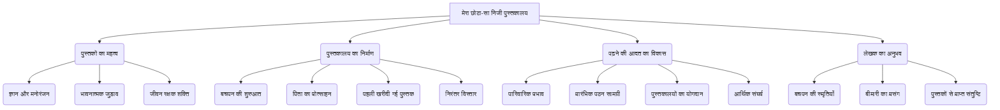
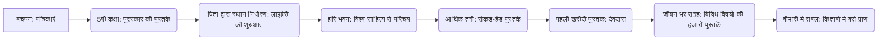

# Class 9 Hindi - Sanchyan Chapter 104
**Language:** हिंदी

```markdown
# [कक्षा 9] संचयन - अध्याय 104 - मेरा छोटा-सा निजी पुस्तकालय

## 🌟 मुख्य अवधारणाएँ (Core Concepts)

यह पाठ लेखक धर्मवीर भारती के जीवन में पुस्तकों के महत्व और उनके व्यक्तिगत पुस्तकालय के निर्माण की कहानी पर केंद्रित है।

1.  **पुस्तकों के प्रति गहरा प्रेम:**
    *   बचपन से पढ़ने की तीव्र इच्छा ('चाट')।
    *   किताबों को जीवन का अभिन्न अंग मानना।
    *   बीमारी में भी किताबों के बीच रहने की ज़िद।
2.  **निजी पुस्तकालय का विकास:**
    *   बचपन में मिली पुरस्कार की पुस्तकों से शुरुआत।
    *   पिता द्वारा स्थान निर्धारित करना।
    *   जीवन के विभिन्न चरणों (स्कूल, कॉलेज, विश्वविद्यालय, नौकरी) में संग्रह का बढ़ना।
    *   पहली पुस्तक ('देवदास') खरीदने का मार्मिक अनुभव।
3.  **पढ़ने की आदत पर प्रभाव डालने वाले कारक:**
    *   **पारिवारिक पृष्ठभूमि:** आर्य समाजी पिता, शिक्षा-प्रेमी माँ।
    *   **उपलब्ध सामग्री:** घर आने वाली पत्रिकाएँ ('बालसखा', 'चमचम', 'सरस्वती', 'आर्यमित्र'), स्वामी दयानंद की जीवनी।
    *   **सामाजिक वातावरण:** इलाहाबाद का शैक्षिक माहौल, मुहल्ले का पुस्तकालय ('हरि भवन')।
    *   **आर्थिक परिस्थितियाँ:** कठिनाइयों के बावजूद पढ़ने का जुनून, सेकंड-हैंड किताबें खरीदना।
4.  **पुस्तकों का जीवनदायी महत्व:**
    *   ज्ञान और मनोरंजन का स्रोत।
    *   नई दुनियाओं से परिचय (पक्षियों, जहाजों की दुनिया)।
    *   कठिन समय (बीमारी, आर्थिक तंगी) में संबल।
    *   लेखक का मानना कि उनके प्राण किताबों में बसे हैं।
    *   विंदा करंदीकर का कथन - पुस्तकों के आशीर्वाद से पुनर्जीवन।

📊 **अवधारणा पदानुक्रम (Concept Hierarchy):**



## 📘 मुख्य सीख (Key Learnings)

1.  **प्रारंभिक प्रभाव और पढ़ने की लत:**
    *   लेखक के घर आर्य समाज का प्रभाव था, पिता आर्य समाज रानीमंडी के प्रधान थे और माँ ने कन्या पाठशाला स्थापित की थी।
    *   घर पर नियमित रूप से 'आर्यमित्र', 'वेदोदम', 'सरस्वती', 'गृहिणी' और बच्चों के लिए 'बालसखा' व 'चमचम' पत्रिकाएँ आती थीं।
    *   इन पत्रिकाओं, विशेषकर बाल पत्रिकाओं की कहानियों और रेखाचित्रों ने लेखक में पढ़ने की ऐसी रुचि जगाई कि वे हर समय, यहाँ तक कि खाना खाते समय भी पढ़ते रहते थे।
    *   स्वामी दयानंद की जीवनी और 'सत्यार्थ प्रकाश' जैसी पुस्तकों ने भी बाल मन पर गहरा प्रभाव डाला।

2.  **निजी पुस्तकालय की नींव:**
    *   पाँचवीं कक्षा में प्रथम आने पर स्कूल से इनाम में दो अंग्रेजी पुस्तकें मिलीं - एक पक्षियों पर और दूसरी जहाजों ('ट्रस्टी द रग') पर।
    *   इन पुस्तकों ने लेखक के लिए ज्ञान की नई दुनिया खोल दी।
    *   पिता ने आलमारी का एक खाना खाली करके उन पुस्तकों को रखते हुए कहा, "आज से यह खाना तुम्हारी अपनी किताबों का। यह तुम्हारी अपनी लाइब्रेरी है।" यहीं से लेखक के निजी पुस्तकालय का आरंभ हुआ।

3.  **ज्ञान की प्यास और संघर्ष:**
    *   पिता की मृत्यु के बाद आर्थिक संकट गहरा गया।
    *   लेखक मुहल्ले के 'हरि भवन' पुस्तकालय में बैठकर किताबें पढ़ते थे, क्योंकि सदस्यता शुल्क देने के पैसे नहीं थे।
    *   वहाँ उन्होंने बंकिमचंद्र, टॉल्स्टॉय, विक्टर ह्यूगो, गोर्की, सर्वान्तेज़ जैसे विश्व साहित्यकारों की अनूदित रचनाएँ पढ़ीं।
    *   पाठ्यपुस्तकें खरीदने के लिए ट्रस्ट से मिलने वाली सहायता और पुरानी किताबें (सेकंड-हैंड) खरीदकर काम चलाना पड़ता था।

4.  **पहली पुस्तक खरीदने का अविस्मरणीय क्षण:**
    *   इंटरमीडिएट पास करने के बाद पुरानी किताबें बेचकर बी.ए. की किताबें खरीदने गए तो दो रुपये बच गए।
    *   माँ की अनिच्छा के बावजूद, उनके गाने ('दुःख के दिन अब बीतत नाहीं') से प्रभावित होकर माँ ने 'देवदास' फिल्म देखने की अनुमति दी।
    *   सिनेमाघर के पास किताबों की दुकान पर शरत्चंद्र चट्टोपाध्याय लिखित 'देवदास' पुस्तक (केवल दस आने में) दिखी।
    *   लेखक ने फिल्म देखने के बजाय वह पुस्तक खरीद ली। यह उनके अपने पैसों से खरीदी गई, उनके निजी पुस्तकालय की पहली पुस्तक थी।

5.  **पुस्तकों का जीवन में स्थान:**
    *   लेखक गंभीर बीमारी से उबरने के दौरान अपने किताबों वाले कमरे में ही रहे, जहाँ उन्हें चारों ओर अपनी हजारों पुस्तकें दिखती थीं।
    *   उन्हें लगता था कि उनके प्राण उन पुस्तकों में ही बसे हैं।
    *   उनका संग्रह हिंदी-अंग्रेजी के उपन्यास, नाटक, कथा-संकलन, जीवनी, संस्मरण, इतिहास, कला, पुरातत्व, राजनीति आदि विविध विषयों की हजारों पुस्तकों से समृद्ध है।
    *   मराठी कवि विंदा करंदीकर ने लेखक से कहा कि वे इन्हीं पुस्तक-रूपी महापुरुषों के आशीर्वाद से बचे हैं।

📈 **पुस्तकालय विकास यात्रा (Conceptual Diagram):**



## 🧩 सक्रिय अधिगम (Active Learning)

*   **गतिविधि: शोध-आधारित केस स्टडी विश्लेषण 🔍**
    *   **कार्य:** विद्यार्थी किसी अन्य प्रसिद्ध भारतीय व्यक्ति (जैसे डॉ. भीमराव आंबेडकर, जवाहरलाल नेहरू, ए.पी.जे. अब्दुल कलाम) के जीवन में पुस्तकों के महत्व पर शोध करें। धर्मवीर भारती के अनुभव से उनकी तुलना करते हुए एक संक्षिप्त रिपोर्ट तैयार करें। वे किन परिस्थितियों में पढ़ते थे? उनकी पढ़ने की आदत कैसे विकसित हुई? पुस्तकें उनके जीवन को कैसे प्रभावित करती थीं?
    *   **उद्देश्य:** तुलनात्मक विश्लेषण, शोध कौशल का विकास, पुस्तकों के सार्वभौमिक महत्व को समझना।
    *   **स्तर (Bloom's):** विश्लेषण (Analyzing), सृजन (Creating)।

*   **चर्चा: वास्तविक दुनिया के प्रभावों का आलोचनात्मक विश्लेषण 🌍**
    *   **विषय:** आज के डिजिटल युग में, जहाँ ई-बुक्स और ऑनलाइन पठन सामग्री सुलभ है, क्या धर्मवीर भारती जैसा भौतिक पुस्तकों और निजी पुस्तकालय से गहरा भावनात्मक जुड़ाव संभव है? इसके क्या फायदे और नुकसान हैं? समाज में सार्वजनिक और व्यक्तिगत पुस्तकालयों की भूमिका पर चर्चा करें।
    *   **उद्देश्य:** आलोचनात्मक चिंतन, वर्तमान परिप्रेक्ष्य से जोड़ना, विचारों का मूल्यांकन।
    *   **स्तर (Bloom's):** मूल्यांकन (Evaluating)।

## 📝 मूल्यांकन तैयारी (Assessment Prep)

*   **केस स्टडी आधारित प्रश्न:**
    *   लेखक द्वारा 'देवदास' पुस्तक खरीदने के निर्णय का विश्लेषण करें। उस समय उनकी मानसिक स्थिति और मूल्यों के बारे में क्या पता चलता है? (विश्लेषण)
    *   'हरि भवन' पुस्तकालय के अनुभव ने लेखक के साहित्यिक ज्ञान को कैसे समृद्ध किया? आर्थिक बाधाओं के बावजूद ज्ञान प्राप्त करने की उनकी ललक पर टिप्पणी करें। (समझ, मूल्यांकन)
*   **आरेख/फ्लोचार्ट आधारित प्रश्न:**
    *   लेखक के पढ़ने की आदत के विकास को प्रभावित करने वाले कारकों का एक माइंड मैप बनाएँ। (सृजन)
    *   लेखक के निजी पुस्तकालय के विकास के प्रमुख पड़ावों को दर्शाने वाला एक टाइमलाइन चार्ट तैयार करें। (सृजन)
*   **उच्च स्तरीय चिंतन प्रश्न (Evaluating/Creating):**
    *   "मुझे लगता था कि मेरे प्राण इस शरीर से तो निकल चुके हैं, वे प्राण इन हज़ारों किताबों में बसे हैं।" - लेखक के इस कथन का आशय स्पष्ट करें। बीमारी के दौरान किताबों ने उन्हें मनोवैज्ञानिक रूप से कैसे सहारा दिया होगा? (मूल्यांकन)
    *   लेखक के पिता ने शुरू में उन्हें स्कूल न भेजकर घर पर पढ़ाने का निर्णय क्यों लिया? क्या आप इस निर्णय से सहमत हैं? तर्क सहित उत्तर दें। (मूल्यांकन)
    *   पाठ के आधार पर सिद्ध कीजिए कि पुस्तकें मनुष्य की सच्ची मित्र और मार्गदर्शक होती हैं। (विश्लेषण, संश्लेषण)

## 🌏 भारतीय संदर्भ (Bharatiya Context)

1.  **आर्य समाज आंदोलन:** पाठ में उल्लेख है कि लेखक के पिता आर्य समाज से जुड़े थे। यह 19वीं सदी का एक प्रमुख भारतीय सामाजिक-धार्मिक सुधार आंदोलन था जिसने शिक्षा (विशेषकर स्त्री शिक्षा) और सामाजिक कुरीतियों के उन्मूलन पर जोर दिया। लेखक की माँ द्वारा कन्या पाठशाला की स्थापना इसी संदर्भ में देखी जा सकती है।
2.  **इलाहाबाद का शैक्षिक वातावरण:** लेखक इलाहाबाद के माहौल का वर्णन करते हैं, जो भारत के प्रमुख शिक्षा केंद्रों में से एक रहा है। पब्लिक लाइब्रेरी, भारती भवन (महामना मालवीय द्वारा स्थापित), विश्वविद्यालय और कॉलेजों के पुस्तकालयों का उल्लेख तत्कालीन शैक्षिक समृद्धि को दर्शाता है।
3.  **भारतीय साहित्य और अनुवाद:** लेखक हिंदी के माध्यम से विश्व साहित्य (टॉल्स्टॉय, ह्यूगो, गोर्की आदि) से परिचित हुए। यह उस दौर को दर्शाता है जब हिंदी में विश्व साहित्य के अनुवाद बड़ी संख्या में हो रहे थे, जिससे हिंदी पाठक वैश्विक रचनाओं से जुड़ सके। साथ ही, कबीर, तुलसी, सूर, जायसी, प्रेमचंद, निराला, महादेवी जैसे भारतीय लेखकों का उल्लेख भारतीय साहित्यिक धरोहर के प्रति लेखक के गहरे जुड़ाव को दिखाता है।
4.  **सामाजिक-आर्थिक यथार्थ:**
    *   गांधीजी के आह्वान पर सरकारी नौकरी छोड़ना भारतीय स्वतंत्रता संग्राम के प्रभाव को दर्शाता है।
    *   आर्थिक कठिनाइयाँ, फीस जुटाने में मुश्किल, सेकंड-हैंड (पुरानी) पाठ्यपुस्तकें खरीदना और बेचना - यह आज भी भारत में अनेक विद्यार्थियों के जीवन का यथार्थ है।
    *   सिनेमा के प्रति शुरुआती दौर की सामाजिक हिचक (माँ का मानना कि इससे बच्चे बिगड़ते हैं) भी तत्कालीन भारतीय सामाजिक मानसिकता का एक पहलू है।

```