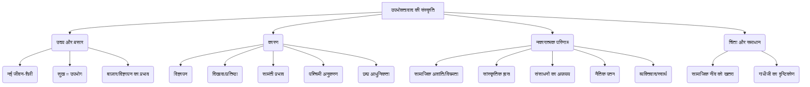

# Class 9 Hindi - Shitij Chapter 103
**Language:** हिंदी

```markdown
# कक्षा 9 | क्षितिज | पाठ: उपभोक्तावाद की संस्कृति (लेखक: श्यामाचरण दुबे)

## 🌟 Core Concepts (मुख्य अवधारणाएँ)

यह पाठ उपभोक्तावाद की संस्कृति, उसके कारणों, प्रभावों और समाज पर पड़ने वाले परिणामों का विश्लेषण करता है। मुख्य अवधारणाओं को इस प्रकार समझा जा सकता है:

1.  **उपभोक्तावाद का उदय (Emergence of Consumerism)**
    *   नई जीवन-शैली: उपभोग को ही सुख मानने वाली सोच का प्रसार।
    *   बदलती सुख की परिभाषा: भौतिक वस्तुओं के भोग को ही जीवन का परम सुख मान लेना।
    *   बाज़ार और विज्ञापन का वर्चस्व: उत्पादन बढ़ाने और लोगों को उपभोग के लिए प्रेरित करने पर ज़ोर।

2.  **उपभोक्तावाद के कारण (Reasons for Consumerism)**
    *   **विज्ञापन की भूमिका:** आकर्षक विज्ञापन लोगों को लुभाते हैं और गैर-ज़रूरी चीज़ें खरीदने को प्रेरित करते हैं (गुणवत्ता पर ध्यान कम)।
    *   **प्रतिष्ठा और दिखावा:** महंगी वस्तुएँ सामाजिक हैसियत (Status) दिखाने का माध्यम बन गई हैं (जैसे महंगी घड़ी, बड़ा म्यूजिक सिस्टम)।
    *   **सामंती संस्कृति का प्रभाव:** पुरानी सामंती प्रवृत्तियों का नया रूप, जहाँ दिखावा महत्वपूर्ण है।
    *   **पश्चिमी संस्कृति का अंधानुकरण:** बिना सोचे-समझे पश्चिमी जीवन-शैली को अपनाना (बौद्धिक दासता)।
    *   **छद्म आधुनिकता:** आधुनिक दिखने की होड़ में अपनी पहचान खोकर बनावटी जीवन जीना।

3.  **उपभोक्तावाद के परिणाम (Consequences of Consumerism)**
    *   **सामाजिक प्रभाव:**
        *   सामाजिक अशांति और विषमता में वृद्धि (अमीर-गरीब के बीच बढ़ता अंतर)।
        *   सामाजिक सरोकारों में कमी, व्यक्ति-केंद्रकता और स्वार्थ का बढ़ना।
    *   **सांस्कृतिक प्रभाव:**
        *   सांस्कृतिक अस्मिता (पहचान) का ह्रास।
        *   परंपराओं और आस्थाओं का अवमूल्यन (कमज़ोर होना)।
        *   अनुकरण की संस्कृति का विकास।
    *   **आर्थिक प्रभाव:**
        *   सीमित संसाधनों का घोर अपव्यय (फिजूलखर्ची)।
    *   **नैतिक प्रभाव:**
        *   नैतिक मूल्यों और मर्यादाओं का टूटना।
        *   लक्ष्यों से भटकना (विकास के बड़े उद्देश्य पीछे छूटना)।

4.  **लेखक की चिंता और गांधीजी का दृष्टिकोण (Author's Concern & Gandhi's View)**
    *   उपभोक्तावाद सामाजिक नींव को कमज़ोर कर रहा है।
    *   यह भविष्य के लिए एक बड़ी चुनौती है।
    *   गांधीजी का मत: बाहरी सांस्कृतिक प्रभाव स्वीकारें, पर अपनी बुनियाद पर कायम रहें।

📊 **अवधारणा पदानुक्रम (Concept Hierarchy):**


## 📘 Key Learnings (मुख्य शिक्षाएँ)

1.  **सुख की नई परिभाषा:** पाठ समझाता है कि कैसे बाज़ार ने 'सुख' की परिभाषा बदल दी है। अब वस्तुओं का अधिक से अधिक उपभोग करना ही सुख माना जाने लगा है। विज्ञापन इसमें महत्वपूर्ण भूमिका निभाते हैं।
    *   *उदाहरण:* टूथपेस्ट का विज्ञापन दांतों को मोती जैसा चमकाने, सांसों को ताज़ा करने और पूर्ण सुरक्षा देने का वादा करता है, भले ही उसकी वास्तविक गुणवत्ता कैसी भी हो।

2.  **विज्ञापन का सम्मोहन:** विज्ञापन हमें वस्तुओं की गुणवत्ता पर ध्यान देने के बजाय उनकी चमक-दमक और सेलिब्रिटी द्वारा प्रचारित होने के कारण खरीदने के लिए प्रेरित करते हैं। वे हमारी मानसिकता को बदलते हैं।
    *   *उदाहरण:* कोई साबुन किसी फिल्मी सितारे का 'सौंदर्य रहस्य' बताकर बेचा जाता है, या 'पवित्र गंगाजल' से बना बताकर बेचा जाता है।

3.  **दिखावे की संस्कृति (Culture of Show-off):** लोग अपनी सामाजिक हैसियत दिखाने के लिए महंगी और गैर-ज़रूरी चीज़ें खरीदते हैं, जैसे लाखों की घड़ियाँ, बड़े म्यूजिक सिस्टम (भले ही संगीत की समझ न हो), या दिखावे के लिए कंप्यूटर।
    *   📈 **वैचारिक चित्र:**
        *   **केंद्र:** दिखावा/प्रतिष्ठा (Status Symbol)
        *   **जुड़े हुए तत्व:** महंगी वस्तुएं (घड़ी, कार, कपड़े), पांच सितारा जीवन-शैली (होटल, अस्पताल, स्कूल), ब्रांड चेतना, सामाजिक दबाव।

4.  **सांस्कृतिक और नैतिक पतन:** पश्चिमी संस्कृति की नकल और उपभोक्तावाद हमारी अपनी सांस्कृतिक पहचान को नष्ट कर रहा है। परंपराएं, आस्थाएं और नैतिक मूल्य कमज़ोर हो रहे हैं। स्वार्थ बढ़ रहा है और हम विकास के वास्तविक लक्ष्यों से भटक रहे हैं।
    *   *उदाहरण:* लेखक कहते हैं कि हम 'बौद्धिक दासता' स्वीकार कर 'पश्चिम के सांस्कृतिक उपनिवेश' बन रहे हैं। पिज़्ज़ा और बर्गर जैसे 'कूड़ा खाद्य' आधुनिकता का प्रतीक माने जाते हैं।

5.  **संसाधनों का अपव्यय:** यह संस्कृति हमारे सीमित प्राकृतिक और आर्थिक संसाधनों की बर्बादी को बढ़ावा देती है।
    *   *उदाहरण:* फैशन के नाम पर हर साल कपड़े बदलना, गैर-ज़रूरी सौंदर्य प्रसाधन खरीदना।

6.  **गांधीजी का प्रासंगिक विचार:** गांधीजी चाहते थे कि हम दुनिया भर के अच्छे विचारों को अपनाएं, लेकिन अपनी जड़ों, अपनी संस्कृति और मूल्यों को न छोड़ें। उपभोक्तावाद हमारी इसी बुनियाद को हिला रहा है।

## 🧩 Active Learning (सक्रिय शिक्षण)

*   **Activity (गतिविधि): शोध-आधारित केस स्टडी विश्लेषण 🔍**
    *   **विषय:** भारत में किसी एक उत्पाद श्रेणी (जैसे: स्मार्टफोन, फास्ट फैशन कपड़े, पैकेज्ड स्नैक्स, या सौंदर्य प्रसाधन) पर विज्ञापनों के प्रभाव का अध्ययन करें।
    *   **कार्य:**
        1.  चुने हुए उत्पाद के कम से कम 3-4 लोकप्रिय विज्ञापनों (टीवी, ऑनलाइन, प्रिंट) को इकट्ठा करें और उनका विश्लेषण करें।
        2.  पहचानें कि विज्ञापन किन भावनाओं, इच्छाओं या सामाजिक दबावों को लक्षित करते हैं (जैसे: सुंदरता, सफलता, आधुनिकता, साथियों का दबाव)।
        3.  विश्लेषण करें कि ये विज्ञापन उत्पाद की गुणवत्ता के बजाय किन अन्य पहलुओं पर ज़ोर देते हैं।
        4.  इस उत्पाद श्रेणी के उपभोग का भारतीय समाज (विशेषकर युवाओं) पर क्या प्रभाव पड़ रहा है? (आर्थिक, सामाजिक, मनोवैज्ञानिक)
        5.  अपने निष्कर्षों को एक संक्षिप्त केस स्टडी रिपोर्ट के रूप में प्रस्तुत करें। (Bloom's: Evaluating/Creating)

*   **Discussion (चर्चा): वास्तविक दुनिया के प्रभावों का आलोचनात्मक विश्लेषण 🌍**
    *   **प्रश्न:** "पाठ में लेखक ने कहा है कि जैसे-जैसे दिखावे की संस्कृति फैलेगी, सामाजिक अशांति और विषमता बढ़ेगी। क्या आप वर्तमान भारतीय समाज में इसके उदाहरण देखते हैं? अपने तर्क प्रस्तुत करें।"
    *   **चर्चा बिंदु:**
        *   आय असमानता और उपभोग पैटर्न में अंतर।
        *   सोशल मीडिया पर दिखावे का दबाव।
        *   कर्ज लेकर उपभोग करने की प्रवृत्ति।
        *   पारंपरिक मूल्यों और आधुनिक उपभोक्तावादी मूल्यों के बीच टकराव।
        *   क्या यह 'विकास' का सही मॉडल है? (Bloom's: Evaluating)

## 📝 Assessment Prep (परीक्षा की तैयारी)

*   **केस स्टडी आधारित प्रश्न:**
    *   *परिदृश्य:* "रोहन एक मध्यमवर्गीय परिवार से है। उसके दोस्त अक्सर नवीनतम ब्रांडेड कपड़े पहनते हैं और महंगे गैजेट्स इस्तेमाल करते हैं। रोहन पर भी वैसा ही करने का दबाव है, जिसके लिए वह अपने माता-पिता से ज़िद करता है, भले ही परिवार की आर्थिक स्थिति इसकी अनुमति न देती हो।"
    *   *प्रश्न:* इस स्थिति का 'उपभोक्तावाद की संस्कृति' पाठ के आधार पर विश्लेषण करें। इसमें कौन-सी उपभोक्तावादी प्रवृत्तियाँ दिखाई देती हैं और इसके क्या संभावित परिणाम हो सकते हैं? (विश्लेषण/मूल्यांकन)

*   **आरेख/चार्ट आधारित प्रश्न:**
    *   नीचे दिए गए वैचारिक आरेख को पूरा करें या इसकी व्याख्या करें:
        ```mermaid
        graph LR
            विज्ञापन --> A(इच्छा जागृत होना);
            A --> B(वस्तु खरीदना);
            B --> C(??);
            C --> D(सामाजिक अशांति/असमानता);
        ```
    *   *प्रश्न:* उपरोक्त आरेख में 'C' के स्थान पर पाठ के आधार पर सबसे उपयुक्त अवधारणा क्या होगी? पूरी श्रृंखला की व्याख्या करें कि विज्ञापन कैसे सामाजिक अशांति तक ले जा सकता है। (समझ/विश्लेषण)

## 🌏 Bharatiya Context (भारतीय संदर्भ)

इस पाठ की अवधारणाएं भारतीय समाज के लिए अत्यंत प्रासंगिक हैं:

1.  **बदलता उपभोग पैटर्न:** भारत में आर्थिक उदारीकरण के बाद उपभोक्ता वस्तुओं की उपलब्धता और खपत तेजी से बढ़ी है। राष्ट्रीय नमूना सर्वेक्षण संगठन (NSSO) के उपभोग व्यय सर्वेक्षण समय के साथ बदलते पैटर्न को दर्शाते हैं, जिसमें गैर-खाद्य वस्तुओं और सेवाओं पर खर्च बढ़ रहा है।
2.  **त्योहारों का व्यावसायीकरण:** दीपावली, होली, ईद जैसे पारंपरिक त्योहार अब बड़े पैमाने पर खरीदारी और उपहारों के लेन-देन के अवसर बन गए हैं, जो उपभोक्तावादी संस्कृति के प्रभाव को दर्शाता है। विज्ञापनों में त्योहारों को खरीदारी से जोड़कर दिखाया जाता है।
3.  **सामाजिक प्रतिष्ठा और विवाह:** भारत में विवाह समारोहों में अत्यधिक खर्च करना अक्सर सामाजिक प्रतिष्ठा से जुड़ा होता है। यह 'दिखावे की संस्कृति' का एक प्रमुख उदाहरण है, जहाँ लोग क्षमता से अधिक खर्च करते हैं।
4.  **ग्रामीण बनाम शहरी उपभोग:** उपभोक्तावाद का प्रभाव अब केवल शहरों तक सीमित नहीं है, बल्कि विज्ञापनों और मीडिया के माध्यम से यह ग्रामीण भारत में भी फैल रहा है, जिससे वहां भी आकांक्षाएं और उपभोग पैटर्न बदल रहे हैं।
5.  **'मेक इन इंडिया' और आत्मनिर्भरता:** उपभोक्तावाद, विशेष रूप से विदेशी ब्रांडों के प्रति आकर्षण, 'मेक इन इंडिया' और आत्मनिर्भर भारत जैसी पहलों के लिए एक चुनौती पेश करता है। पाठ गांधीजी के विचारों के माध्यम से स्वदेशी और अपनी जड़ों से जुड़े रहने के महत्व पर भी प्रकाश डालता है।

यह पाठ हमें भारतीय समाज में उपभोक्तावाद के बढ़ते प्रभाव के प्रति सचेत करता है और इसके सामाजिक, सांस्कृतिक तथा नैतिक परिणामों पर गंभीर चिंतन करने के लिए प्रेरित करता है।
```