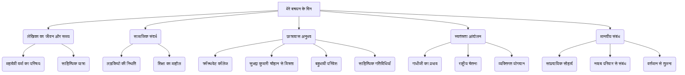

# Class 9 Hindi - Shitij Chapter 106
**Language:** हिंदी

```markdown
# [Class 9] क्षितिज - पाठ 106: मेरे बचपन के दिन (महादेवी वर्मा)

## 🌟 मुख्य अवधारणाएँ (Core Concepts)

यह पाठ लेखिका महादेवी वर्मा का एक संस्मरण है, जिसमें वे अपने बचपन, विशेषकर स्कूली जीवन की यादों को साझा करती हैं। मुख्य अवधारणाएँ इस प्रकार हैं:

1.  **लेखिका का परिचय एवं साहित्यिक पृष्ठभूमि**
    *   महादेवी वर्मा: जीवन परिचय (जन्म, शिक्षा, कार्य)
    *   छायावादी कवयित्री के रूप में स्थान
    *   प्रमुख काव्य और गद्य रचनाएँ (रेखाचित्र, संस्मरण)
    *   पुरस्कार एवं सम्मान (ज्ञानपीठ, पद्मभूषण)
    *   साहित्य पर प्रभाव: स्वतंत्रता आंदोलन और स्त्री जीवन

2.  **तत्कालीन सामाजिक परिदृश्य (विशेषकर लड़कियों के संदर्भ में)**
    *   लड़कियों के प्रति सामाजिक दृष्टिकोण (जन्म पर उदासीनता/विरोध)
    *   कन्या शिशुहत्या जैसी कुप्रथाओं का संकेत
    *   लड़कियों की शिक्षा की स्थिति और उसके प्रति बदलते विचार
    *   महादेवी का सौभाग्यशाली बचपन (परिवार में सम्मान)

3.  **छात्रावास जीवन और शिक्षा**
    *   क्रॉस्थवेट गर्ल्स कॉलेज का वातावरण
    *   विभिन्न पृष्ठभूमि की सहपाठिनें (हिन्दू, ईसाई, मराठी, अवधी, बुंदेली)
    *   साझा मेस और प्रार्थना सभा
    *   बहुभाषी परिवेश और भाषाई सहिष्णुता

4.  **मित्रता और साहित्यिक अभिरुचि**
    *   सुभद्रा कुमारी चौहान से मित्रता
    *   कविता लेखन की शुरुआत और प्रोत्साहन
    *   'स्त्री दर्पण' पत्रिका में प्रकाशन
    *   कवि-सम्मेलनों में भागीदारी

5.  **स्वतंत्रता आंदोलन का प्रभाव**
    *   गांधीजी का प्रभाव और सत्याग्रह
    *   आनंद भवन का स्वतंत्रता संघर्ष के केंद्र के रूप में महत्व
    *   राष्ट्रीय कार्यों के लिए योगदान (जेब खर्च बचाना, चाँदी का कटोरा दान करना)

6.  **सांप्रदायिक सौहार्द और मानवीय संबंध**
    *   विभिन्न धर्मों और क्षेत्रों के लोगों के बीच प्रेम और एकता
    *   जवारा के नवाब के परिवार से आत्मीय संबंध (ताई साहिबा)
    *   साझा त्योहार और रीति-रिवाज (राखी, मुहर्रम, जन्मदिन)
    *   वर्तमान समय से तुलना और उस सौहार्दपूर्ण माहौल का 'सपना' जैसा लगना

7.  **स्मृति और व्यक्तित्व निर्माण**
    *   बचपन के संस्कारों का स्थायी प्रभाव
    *   पारिवारिक माहौल का असर (माँ का हिंदी प्रेम, बाबा की विदुषी बनाने की इच्छा)

📊 **अवधारणा पदानुक्रम (Concept Hierarchy):**



## 📘 मुख्य सीख (Key Learnings)

इस संस्मरण से हमें कई महत्वपूर्ण बातें सीखने को मिलती हैं:

1.  **तत्कालीन समाज में लड़कियों की स्थिति:** लेखिका बताती हैं कि उनके जन्म से पहले परिवार में लड़कियों को पैदा होते ही मार दिया जाता था। हालाँकि, उनके जन्म पर बहुत खुशी मनाई गई और उन्हें वे कष्ट नहीं सहने पड़े जो आमतौर पर लड़कियों को सहने पड़ते थे। इससे पता चलता है कि 20वीं सदी की शुरुआत में लड़कियों के प्रति समाज का रवैया कितना कठोर था, लेकिन धीरे-धीरे बदलाव भी आ रहा था।
    *   *तुलना:* महादेवी का जन्म (स्वागत) <-> अन्य लड़कियाँ (अस्वीकृति/हत्या)

2.  **शिक्षा और व्यक्तिगत विकास:** मिशन स्कूल का माहौल पसंद न आने पर उन्हें क्रॉस्थवेट कॉलेज भेजा गया। वहाँ का अच्छा वातावरण, विभिन्न पृष्ठभूमि की सहेलियाँ और सुभद्रा कुमारी चौहान जैसी वरिष्ठ कवयित्री का साथ उनके साहित्यिक विकास में सहायक हुआ। यह दर्शाता है कि सही माहौल और प्रोत्साहन व्यक्ति के विकास के लिए कितने महत्वपूर्ण हैं।

3.  **छात्रावास का बहुसांस्कृतिक वातावरण:** क्रॉस्थवेट कॉलेज के छात्रावास में हिन्दू, ईसाई, अवध, बुंदेलखंड, कोल्हापुर (मराठी) आदि विभिन्न क्षेत्रों और धर्मों की लड़कियाँ एक साथ रहती थीं। वे अपनी-अपनी भाषाएँ बोलती थीं, पर हिंदी और उर्दू पढ़ती थीं। एक ही मेस में खाना, एक ही प्रार्थना में शामिल होना और किसी तरह का विवाद न होना, उस समय के अद्भुत सांप्रदायिक सौहार्द को दर्शाता है।
    *   *चित्र:* छात्रावास का कमरा (महादेवी, सुभद्रा, ज़ेबुन्निसा) -> विभिन्न भाषाएँ (हिंदी, खड़ी बोली, ब्रजभाषा, अवधी, बुंदेली, मराठी) -> साझा गतिविधियाँ (मेस, प्रार्थना, खेल, कविता) -> एकता

4.  **स्वतंत्रता आंदोलन का प्रभाव:** लेखिका 1917 में इलाहाबाद आईं, जब गांधीजी का सत्याग्रह ज़ोरों पर था और आनंद भवन उसका केंद्र था। स्कूल की छात्राएँ भी जेब खर्च से पैसे बचाकर गांधीजी को देती थीं। महादेवी द्वारा कविता पाठ के लिए मिला चाँदी का कटोरा गांधीजी को दे देना, उस समय के बच्चों में भी व्याप्त राष्ट्रीय चेतना और त्याग की भावना को दर्शाता है।
    *   *प्रवाह चित्र:* कवि सम्मेलन -> पुरस्कार (चाँदी का कटोरा) -> गांधीजी का आगमन -> राष्ट्रीय हित में दान -> व्यक्तिगत खुशी

5.  **मानवीय संबंध और सांप्रदायिक एकता:** लेखिका के परिवार और जवारा के नवाब के परिवार के बीच गहरे आत्मीय संबंध थे। वे एक-दूसरे के त्योहारों (राखी, मुहर्रम) और खुशियों (जन्मदिन) में शामिल होते थे। नवाब की बेगम (ताई साहिबा) द्वारा महादेवी के छोटे भाई का नामकरण (मनमोहन) करना, उस समय के सहज और प्रेमपूर्ण अंतर-सामुदायिक संबंधों का उत्कृष्ट उदाहरण है। लेखिका इसे आज के संदर्भ में 'सपने' जैसा बताती हैं, जो वर्तमान सामाजिक विभाजन पर एक टिप्पणी है।
    *   *वेन आरेख:* महादेवी का परिवार <-> नवाब का परिवार (साझा क्षेत्र: राखी, मुहर्रम, जन्मदिन, नामकरण, आपसी सम्मान - ताई/चाची जान)

6.  **बचपन के संस्कारों का महत्व:** लेखिका मानती हैं कि बचपन के संस्कार व्यक्ति पर जीवन भर प्रभाव डालते हैं। उनकी माँ का हिंदी प्रेम, पूजा-पाठ, और भजन गाना, पिता और बाबा की शिक्षा के प्रति सोच, सुभद्रा जी का प्रोत्साहन, और पड़ोसियों के साथ सौहार्दपूर्ण संबंध - इन सबने मिलकर महादेवी के व्यक्तित्व को गढ़ा।

## 🧩 सक्रिय अधिगम (Active Learning)

*   **गतिविधि: शोध-आधारित केस स्टडी विश्लेषण 🔍**
    *   **विषय:** महादेवी वर्मा के समय (प्रारंभिक 20वीं सदी) और आज के भारत में लड़कियों की शिक्षा और सामाजिक स्थिति की तुलना।
    *   **कार्य:** सरकारी आंकड़ों (जैसे - राष्ट्रीय परिवार स्वास्थ्य सर्वेक्षण (NFHS), जनगणना) और विश्वसनीय स्रोतों का उपयोग करके निम्नलिखित बिंदुओं पर जानकारी एकत्र करें:
        *   महिला साक्षरता दर (तब और अब)
        *   स्कूलों में लड़कियों का नामांकन अनुपात (तब और अब)
        *   कन्या भ्रूण हत्या/शिशु हत्या की स्थिति (तब और अब)
        *   लड़कियों की शिक्षा को बढ़ावा देने वाली सरकारी योजनाएँ (जैसे - बेटी बचाओ, बेटी पढ़ाओ)।
    *   **प्रस्तुति:** अपने शोध के आधार पर एक संक्षिप्त केस स्टडी रिपोर्ट तैयार करें और कक्षा में प्रस्तुत करें। मूल्यांकन करें कि कितना बदलाव आया है और अभी क्या चुनौतियाँ हैं। (Bloom's: Evaluating/Creating)

*   **चर्चा: वास्तविक दुनिया के प्रभावों का आलोचनात्मक विश्लेषण 🌍**
    *   **विषय:** पाठ में वर्णित सांप्रदायिक सौहार्द और आज का भारतीय समाज।
    *   **प्रश्न:**
        *   महादेवी वर्मा द्वारा वर्णित सांप्रदायिक सद्भाव के क्या कारण रहे होंगे?
        *   लेखिका क्यों महसूस करती हैं कि वह माहौल आज 'खो गया सपना' जैसा है?
        *   आपके विचार में, उस समय के सौहार्द और आज की सामाजिक परिस्थितियों में क्या अंतर हैं?
        *   आधुनिक भारतीय समाज पर ऐसे सौहार्द (या उसकी कमी) का क्या प्रभाव पड़ता है? अपने क्षेत्र या समुदाय से उदाहरण दें। (Bloom's: Evaluating/Analyzing)

## 📝 मूल्यांकन तैयारी (Assessment Prep)

*   **केस स्टडी 1:** चाँदी का कटोरा गांधीजी को देने की घटना का विश्लेषण करें। यह महादेवी वर्मा के चरित्र, उस समय के बच्चों पर स्वतंत्रता आंदोलन के प्रभाव और त्याग की भावना के बारे में क्या बताता है?
*   **केस स्टडी 2:** क्रॉस्थवेट छात्रावास के बहुभाषी परिवेश की तुलना अपने स्कूल या समुदाय की भाषाई विविधता से करें। ऐसे बहुभाषी माहौल के क्या लाभ और चुनौतियाँ हो सकती हैं?
*   **आरेख/मानसिक मानचित्र:** एक मानसिक मानचित्र (Mind Map) बनाएँ जो पाठ के अनुसार महादेवी वर्मा के बचपन को प्रभावित करने वाले मुख्य कारकों (परिवार, माँ, स्कूल, मित्र, स्वतंत्रता आंदोलन, पड़ोसी) को दर्शाता हो।

## 🌏 भारतीय संदर्भ (Bharatiya Context)

यह पाठ कई महत्वपूर्ण भारतीय संदर्भों को उजागर करता है:

1.  **लड़कियों की शिक्षा और स्थिति:** पाठ उस दौर को दर्शाता है जब भारत में लड़कियों की शिक्षा आम नहीं थी और कन्या जन्म को अक्सर अशुभ माना जाता था। आज, भारत सरकार की **'बेटी बचाओ, बेटी पढ़ाओ'** जैसी पहलों और शिक्षा के अधिकार के बावजूद, लिंगानुपात और महिला साक्षरता (NFHS-5 के अनुसार लगभग 77% राष्ट्रीय महिला साक्षरता दर) में सुधार की आवश्यकता है। महादेवी का जीवन लड़कियों की शिक्षा के महत्व का प्रतीक है।

2.  **सांप्रदायिक सौहार्द:** पाठ में हिन्दू-मुस्लिम परिवारों (महादेवी का परिवार और नवाब का परिवार) के बीच सहज प्रेम और अपनेपन का चित्रण भारतीय **'गंगा-जमुनी तहज़ीब'** और **धर्मनिरपेक्षता** के संवैधानिक मूल्य का एक ऐतिहासिक उदाहरण प्रस्तुत करता है। यह आज के समाज के लिए एक प्रेरणा और चिंतन का विषय है कि कैसे विभिन्न समुदाय एक साथ सद्भाव से रह सकते हैं, जैसा कि भारत के कई हिस्सों में आज भी देखा जाता है (जैसे - साझा त्योहार मनाना, सामाजिक कार्यों में सहयोग)।

3.  **भाषाई विविधता:** छात्रावास में अवधी, बुंदेली, मराठी मिश्रित हिंदी आदि का प्रयोग भारत की समृद्ध **भाषाई विविधता** को दर्शाता है। भारत के **संविधान की आठवीं अनुसूची** में 22 भाषाओं को मान्यता दी गई है, और देश में सैकड़ों भाषाएँ और बोलियाँ बोली जाती हैं। पाठ यह दिखाता है कि कैसे विभिन्न भाषाएँ बोलने वाले लोग एक साथ रह सकते हैं और साझा भाषा (जैसे हिंदी) के माध्यम से संवाद कर सकते हैं।

4.  **स्वतंत्रता संग्राम में जन भागीदारी:** गांधीजी के आह्वान पर आम लोगों, यहाँ तक कि स्कूली बच्चों का भी, स्वतंत्रता आंदोलन में योगदान देना (जैसे पैसे बचाना, पुरस्कार दान करना) भारतीय स्वतंत्रता संग्राम की व्यापक प्रकृति को दर्शाता है। **आनंद भवन (इलाहाबाद/प्रयागराज)** का उल्लेख एक महत्वपूर्ण ऐतिहासिक स्थल के रूप में है जो स्वतंत्रता संघर्ष का केंद्र था।
```