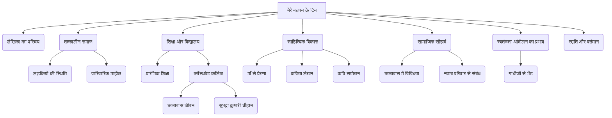

# Class 9 Hindi - Shitij Chapter 106
**Language:** हिंदी

```markdown
# [कक्षा 9] क्षितिज - पाठ 106: मेरे बचपन के दिन (महादेवी वर्मा)

## 🌟 मुख्य अवधारणाएँ (Core Concepts)

यह पाठ लेखिका महादेवी वर्मा का एक संस्मरण है, जिसमें वे अपने बचपन के दिनों को याद करती हैं। मुख्य अवधारणाएँ इस प्रकार हैं:

1.  **लेखिका का परिचय और साहित्यिक योगदान:**
    *   जन्म, शिक्षा, कार्य (प्रयाग महिला विद्यापीठ)।
    *   छायावाद की प्रमुख कवयित्री, प्रमुख रचनाएँ (काव्य और गद्य)।
    *   पुरस्कार और सम्मान (साहित्य अकादमी, ज्ञानपीठ, पद्मभूषण)।
    *   साहित्य पर प्रभाव (स्वतंत्रता आंदोलन, स्त्री जीवन)।
    *   संस्मरण और रेखाचित्र में योगदान।

2.  **तत्कालीन सामाजिक परिप्रेक्ष्य (विशेषकर लड़कियों के प्रति):**
    *   लड़कियों के जन्म पर नकारात्मक दृष्टिकोण (कन्या भ्रूण हत्या/शिशु हत्या)।
    *   महादेवी का सौभाग्यशाली जन्म और परवरिश (परिवार में कई पीढ़ियों बाद लड़की का जन्म)।
    *   शिक्षा के प्रति पारिवारिक दृष्टिकोण (पिता/बाबा का विदुषी बनाने का सपना)।

3.  **शिक्षा और विद्यालयी जीवन:**
    *   प्रारंभिक शिक्षा (माँ द्वारा पंचतंत्र, संस्कृत)।
    *   विभिन्न स्कूलों का अनुभव (मिशन स्कूल, क्रॉस्थवेट गर्ल्स कॉलेज)।
    *   क्रॉस्थवेट कॉलेज का माहौल (छात्रावास, विभिन्न धर्मों की छात्राएँ, साझा मेस)।

4.  **साहित्यिक अभिरुचि का विकास:**
    *   माँ से प्रेरणा (कविता, भजन, मीरा के पद)।
    *   सुभद्रा कुमारी चौहान से मित्रता और साहित्यिक संगति।
    *   कविता लेखन की शुरुआत (ब्रजभाषा से खड़ी बोली)।
    *   'स्त्री दर्पण' पत्रिका में प्रकाशन।
    *   कवि सम्मेलनों में भागीदारी।

5.  **सांप्रदायिक सौहार्द और मानवीय संबंध:**
    *   छात्रावास में विभिन्न भाषा-भाषी और धर्म की लड़कियों का मिलजुल कर रहना (हिन्दू, ईसाई, अवधी, बुंदेली, मराठी)।
    *   जवारा के नवाब परिवार के साथ घनिष्ठ और सौहार्दपूर्ण संबंध (ताई साहिबा, राखी, मुहर्रम, भाई का नामकरण)।
    *   अतीत के सौहार्दपूर्ण माहौल की तुलना वर्तमान से और उस 'सपने' के खो जाने का दुःख।

6.  **स्वतंत्रता आंदोलन का प्रभाव:**
    *   गांधीजी का आगमन और सत्याग्रह।
    *   आनंद भवन का स्वतंत्रता संघर्ष का केंद्र बनना।
    *   देश के लिए योगदान (जेब खर्च बचाना, गांधीजी को चाँदी का कटोरा भेंट करना)।

**अवधारणा पदानुक्रम 📊:**



## 📘 मुख्य सीख (Key Learnings)

1.  **तत्कालीन समाज में लड़कियों की दशा:** लेखिका बताती हैं कि उनके जन्म (1907) से पहले समाज में लड़कियों का स्थान बहुत निम्न था। कई परिवारों में लड़कियों को जन्मते ही मार दिया जाता था ('परमधाम भेज देते थे')। महादेवी भाग्यशाली थीं कि उनका जन्म 200 वर्षों बाद परिवार में हुआ और उनकी बहुत 'खातिर' हुई। इससे उस समय के कठोर सामाजिक रवैये का पता चलता है।
    *   **तुलना:** आज स्थिति बदली है, लेकिन लिंगानुपात और कन्या भ्रूण हत्या जैसी समस्याएँ अभी भी चिंता का विषय हैं।

2.  **शिक्षा का महत्व और पारिवारिक प्रभाव:** महादेवी के बाबा (दादा/पिता) उन्हें 'विदुषी' बनाना चाहते थे। माँ ने उन्हें हिंदी और संस्कृत की प्रारंभिक शिक्षा दी। परिवार के खुले विचारों ने उन्हें पढ़ने और आगे बढ़ने का अवसर दिया, जो उस समय लड़कियों के लिए दुर्लभ था।

3.  **सांप्रदायिक सौहार्द का जीवंत चित्रण:** लेखिका ने क्रॉस्थवेट कॉलेज के छात्रावास और पड़ोस में रहने वाले नवाब परिवार के माध्यम से अद्भुत सांप्रदायिक एकता का वर्णन किया है।
    *   **छात्रावास:** हिन्दू, ईसाई, विभिन्न क्षेत्रों (अवध, बुंदेलखंड, कोल्हापुर) की लड़कियाँ एक साथ रहती थीं, एक मेस में खाती थीं, एक प्रार्थना में खड़ी होती थीं, अपनी-अपनी भाषा बोलती थीं, पर कोई विवाद नहीं था।
    *   **नवाब परिवार:** हिन्दू-मुस्लिम परिवारों के बीच गहरा प्रेम और अपनेपन का रिश्ता था। त्योहार (राखी, मुहर्रम) साथ मनाना, एक-दूसरे के बच्चों को अपना समझना (ताई, चची जान), नामकरण करना आदि। लेखिका इसे आज के संदर्भ में 'सपने जैसा' कहती हैं।

4.  **साहित्यिक प्रेरणा और विकास:** माँ के भजन और कविता पाठ ने महादेवी में बचपन से ही रुचि जगाई। सुभद्रा कुमारी चौहान जैसी वरिष्ठ सहेली का साथ मिलने पर उनकी प्रतिभा को दिशा मिली। वे छिप-छिप कर लिखती थीं, पर सुभद्रा जी ने उन्हें प्रोत्साहित किया। कवि सम्मेलनों में भाग लेने और पुरस्कार जीतने से उनका आत्मविश्वास बढ़ा।

5.  **स्वतंत्रता आंदोलन से जुड़ाव:** बचपन में ही महादेवी और उनकी सहेलियाँ देश के लिए अपने जेब खर्च से पैसे बचाती थीं। गांधीजी के आह्वान पर अपना प्रिय पुरस्कार (चाँदी का कटोरा) सहजता से दे देना, उनके मन में बचपन से ही पनप रही देशप्रेम की भावना को दर्शाता है।

**रेखाचित्र/चार्ट का विचार 📈:**

*   **समयरेखा:** महादेवी वर्मा के बचपन की प्रमुख घटनाओं (जन्म, स्कूल बदलना, सुभद्रा से मिलना, गांधीजी से भेंट) को दर्शाती एक समयरेखा।
*   **प्रभाव मानचित्र:** महादेवी वर्मा के साहित्यिक विकास पर प्रभाव डालने वाले कारक (माँ, सुभद्रा कुमारी चौहान, कवि सम्मेलन, स्वतंत्रता आंदोलन) दिखाने वाला एक माइंड मैप।
*   **तुलनात्मक तालिका:** लेखिका के बचपन के समय और आज के समय में लड़कियों की स्थिति, शिक्षा और सामाजिक सौहार्द की तुलना।

```mermaid
graph LR
    subgraph प्रभाव
        M[माँ] --> MV(महादेवी वर्मा);
        SKC[सुभद्रा कुमारी चौहान] --> MV;
        KS[कवि सम्मेलन] --> MV;
        SA[स्वतंत्रता आंदोलन] --> MV;
        P[पारिवारिक प्रोत्साहन] --> MV;
    end
```

## 🧩 सक्रिय अधिगम (Active Learning)

*   **गतिविधि: शोध-आधारित केस स्टडी विश्लेषण 🔍**
    *   **विषय:** महादेवी वर्मा के समय (प्रारंभिक 20वीं सदी) और वर्तमान भारत में महिला शिक्षा की स्थिति।
    *   **कार्य:** सरकारी आंकड़ों (जैसे - शिक्षा मंत्रालय, NFHS) और लेखों का उपयोग करते हुए, दोनों समयकालों में लड़कियों के नामांकन अनुपात, साक्षरता दर और शिक्षा में आने वाली बाधाओं पर एक तुलनात्मक रिपोर्ट तैयार करें। विश्लेषण करें कि 'बेटी बचाओ, बेटी पढ़ाओ' जैसी योजनाओं का कितना प्रभाव पड़ा है। (मूल्यांकन)
*   **चर्चा: वास्तविक दुनिया के प्रभावों का आलोचनात्मक विश्लेषण 🌍**
    *   **विषय:** महादेवी वर्मा द्वारा वर्णित सांप्रदायिक सौहार्द और आज का भारत।
    *   **प्रश्न:** लेखिका के बचपन में मौजूद सांप्रदायिक सद्भाव के क्या कारण रहे होंगे? आज समाज में बढ़ते विभाजन और असहिष्णुता के क्या कारण और प्रभाव हैं? उस 'खोए हुए सपने' को पुनः कैसे पाया जा सकता है? अपने विचार प्रस्तुत करें और कक्षा में चर्चा करें। (आलोचनात्मक मूल्यांकन, सृजन)

## 📝 मूल्यांकन तैयारी (Assessment Prep)

*   **केस स्टडी आधारित प्रश्न:**
    *   कल्पना कीजिए कि आप क्रॉस्थवेट जैसे छात्रावास में रह रहे हैं जहाँ विभिन्न भाषा और संस्कृति के छात्र हैं। महादेवी के अनुभवों के आधार पर, आप वहाँ सौहार्दपूर्ण माहौल बनाने के लिए क्या कदम उठाएंगे/उठाएंगी? (सृजन)
    *   महादेवी ने अपना पुरस्कार गांधीजी को दे दिया। यदि आपको राष्ट्रीय महत्व के कार्य के लिए अपना कोई प्रिय पुरस्कार देना पड़े, तो आपकी भावनाएँ क्या होंगी और आप यह निर्णय क्यों लेंगे/लेंगी? पाठ के आधार पर अपने उत्तर का समर्थन करें। (मूल्यांकन)
*   **रेखाचित्र/आरेख:**
    *   पाठ में वर्णित महादेवी वर्मा और नवाब परिवार के बीच के संबंधों को दर्शाने वाला एक संबंध मानचित्र (Relationship Map) बनाएँ। (सृजन)
    *   महादेवी वर्मा की साहित्यिक यात्रा के शुरुआती चरणों को दर्शाने वाला एक फ्लोचार्ट बनाएँ। (सृजन)
*   **महत्वपूर्ण प्रश्न (NCERT अभ्यास से):**
    *   प्रश्न 1: उस समय लड़कियों की दशा और आज की परिस्थितियों की तुलना। (विश्लेषण, मूल्यांकन)
    *   प्रश्न 4: जवारा के नवाब के साथ संबंधों को स्वप्न जैसा क्यों कहा गया? (विश्लेषण)
    *   प्रश्न 7: बहुभाषी परिवेश का वर्णन। (वर्णन, विश्लेषण)

## 🌏 भारतीय संदर्भ (Bharatiya Context)

1.  **लिंगानुपात और महिला शिक्षा:** पाठ में वर्णित कन्या शिशु हत्या की प्रथा (लड़कियों को 'परमधाम भेजना') उस समय के गंभीर लिंग भेद को दर्शाती है।
    *   **वर्तमान डेटा 📊:** भारत में आज भी लिंगानुपात चिंताजनक है (जनगणना/NFHS के अनुसार)। हालाँकि, सरकारी प्रयासों जैसे **'बेटी बचाओ, बेटी पढ़ाओ'** अभियान और शिक्षा के अधिकार (RTE) के कारण लड़कियों की शिक्षा में महत्वपूर्ण प्रगति हुई है (उच्च शिक्षा में GER डेटा)। महादेवी का विदुषी बनने का सपना आज कई लड़कियों के लिए यथार्थ बन रहा है, फिर भी चुनौतियाँ बाकी हैं।
2.  **भाषाई विविधता:** छात्रावास में अवधी, बुंदेली, मराठी और हिंदी बोलने वाली लड़कियों का एक साथ रहना भारत की समृद्ध भाषाई विविधता का प्रतीक है।
    *   **राष्ट्रीय संदर्भ:** भारत के संविधान की **आठवीं अनुसूची** में 22 भाषाओं को मान्यता दी गई है। यह विविधता, जैसा कि पाठ में दर्शाया गया है, टकराव का कारण नहीं बल्कि सौहार्द का आधार बन सकती है।
3.  **सांप्रदायिक सौहार्द:** महादेवी वर्मा का बचपन हिन्दू-मुस्लिम एकता और सहिष्णुता का एक उत्कृष्ट उदाहरण प्रस्तुत करता है (नवाब परिवार के साथ संबंध)।
    *   **समकालीन प्रासंगिकता:** यह अनुभव आज के भारत के लिए अत्यंत प्रासंगिक है, जहाँ विविधता में एकता और **धर्मनिरपेक्षता** के संवैधानिक मूल्यों को बनाए रखना महत्वपूर्ण है। लेखिका का यह संस्मरण हमें याद दिलाता है कि आपसी प्रेम और सम्मान पर आधारित समाज संभव है।

```markdown