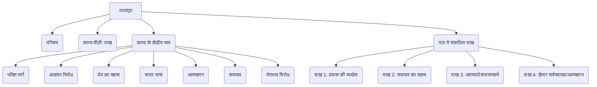

# Class 9 Hindi - Shitij Chapter 108
**Language:** हिंदी

```markdown
# [कक्षा 9] क्षितिज - पाठ 108: वाख (ललद्यद)

## 🌟 मुख्य अवधारणाएँ

यह पाठ कश्मीरी संत कवयित्री ललद्यद और उनके 'वाख' पर केंद्रित है। मुख्य अवधारणाओं को इस प्रकार समझा जा सकता है:

1.  **ललद्यद का परिचय:**
    *   जन्म: सन् 1320 के आसपास (कश्मीर, पाम्पोर, सिमपुरा गाँव)
    *   अन्य नाम: लल्लेश्वरी, लला, ललयोगेश्वरी, ललारिफा
    *   मृत्यु: सन् 1391 के आसपास
    *   महत्व: आधुनिक कश्मीरी भाषा की प्रमुख स्तंभ।

2.  **वाख (काव्य-शैली):**
    *   अर्थ: वाणी, शब्द या कथन।
    *   संरचना: चार पंक्तियों में बद्ध, गेय कश्मीरी शैली।
    *   तुलना: जैसे हिंदी में कबीर के दोहे, मीरा के पद, तुलसी की चौपाई, रसखान के सवैये प्रसिद्ध हैं, वैसे ही ललद्यद के वाख प्रसिद्ध हैं।

3.  **ललद्यद के काव्य का केंद्रीय भाव:**
    *   **भक्ति मार्ग:** जाति और धर्म की संकीर्णताओं से ऊपर उठकर जीवन से जुड़े भक्ति मार्ग पर ज़ोर।
    *   **धार्मिक आडंबरों का विरोध:** बाहरी दिखावे का खंडन।
    *   **प्रेम का महत्व:** प्रेम को सबसे बड़ा मूल्य बताना।
    *   **सरल भाषा का प्रयोग:** तत्कालीन पंडिताऊ संस्कृत और दरबारी फारसी के बजाय आम जनता की सरल भाषा का प्रयोग।
    *   **आत्मज्ञान पर बल:** सच्चे ज्ञान के रूप में आत्मज्ञान को महत्व देना।
    *   **ईश्वर की सर्वव्यापकता:** ईश्वर कण-कण में व्याप्त है।
    *   **भेदभाव का विरोध:** हिन्दू-मुसलमान या किसी भी आधार पर भेदभाव का विरोध।
    *   **समभाव:** इंद्रियों पर नियंत्रण और समानता की भावना पर ज़ोर।

4.  **पाठ में संकलित वाखों का सार:**
    *   **पहला वाख:** ईश्वर प्राप्ति के व्यर्थ हो रहे प्रयासों की चर्चा (कच्चे धागे की रस्सी से जीवन-नाव खींचना)।
    *   **दूसरा वाख:** बाहरी आडंबरों का विरोध और समभावी होने पर चेतना के व्यापक होने का संदेश (मध्यम मार्ग अपनाने का सुझाव)।
    *   **तीसरा वाख:** कवयित्री का आत्मालोचन; भवसागर पार करने के लिए सत्कर्मों की आवश्यकता पर बल (सुषुम्ना नाड़ी पर ध्यान, पर अंत में खाली हाथ)।
    *   **चौथा वाख:** ईश्वर की सर्वव्यापकता (थल-थल में शिव) और आत्मज्ञान ही ईश्वर से पहचान का माध्यम है।

📊 **अवधारणा पदानुक्रम (Concept Hierarchy):**



## 📘 मुख्य शिक्षाएँ

इस पाठ से हमें ललद्यद के माध्यम से भक्ति काल की चेतना और उनके विचारों की गहराई का पता चलता है।

1.  **ईश्वर प्राप्ति के प्रयास और उनकी नश्वरता (पहला वाख):**
    *   कवयित्री अपने जीवन को एक नाव (`नाव`) मानती हैं, जिसे वे साँसों रूपी कच्ची डोरी (`रस्सी कच्चे धागे की`) से खींच रही हैं।
    *   ये प्रयास कमजोर हैं (जैसे मिट्टी के कच्चे बर्तन `कच्चे सकोरे` से पानी टपकता है) और व्यर्थ (`व्यर्थ प्रयास हो रहे मेरे`) जा रहे हैं।
    *   उनके मन में ईश्वर के पास जाने (`घर जाने की चाह`) की तीव्र इच्छा है।
    *   📈 **दृश्यांकन:** कल्पना करें कि एक नाव (जीवन) को एक बहुत ही कमजोर, कच्चे धागे (नश्वर साँसें/प्रयास) से खींचा जा रहा है, और वह धागा कभी भी टूट सकता है।

2.  **संतुलन और समभाव का मार्ग (दूसरा वाख):**
    *   कवयित्री कहती हैं कि केवल सांसारिक भोग (`खा-खाकर`) में लिप्त रहने से कुछ नहीं मिलेगा।
    *   वहीं, सब कुछ त्याग देने (`न खाकर`) से व्यक्ति अहंकारी (`अहंकारी`) बन सकता है।
    *   सही मार्ग है - संतुलन (`सम खा`)। अपनी इन्द्रियों पर नियंत्रण (`सम`) रखते हुए समानता की भावना (`समभावी`) अपनाना।
    *   इसी से मन मुक्त होगा और ज्ञान के बंद दरवाज़े की साँकल (`साँकल बंद द्वार की`) खुलेगी।
    *   📈 **दृश्यांकन:** एक तराजू की कल्पना करें जिसके एक पलड़े में भोग और दूसरे में त्याग है। ललद्यद बीच के संतुलित मार्ग पर चलने को कह रही हैं। भोग <---> **संतुलन (सम खा)** <---> त्याग (अहंकार)।

3.  **आत्मालोचन और सत्कर्मों का महत्व (तीसरा वाख):**
    *   कवयित्री कहती हैं कि वे जीवन में सीधे, सरल मार्ग (`आई सीधी राह से`) पर आईं थीं, पर सांसारिक छल-कपट में उलझकर सीधे मार्ग पर चल नहीं पाईं (`गई न सीधी राह`)।
    *   वे हठयोग (`सुषुम्ना सेतु पर खड़ी थी`) आदि में लगी रहीं, और जीवन बीत गया (`बीत गया दिन आह!`)।
    *   जब जीवन के अंत में उन्होंने आत्मालोचन किया (`जेब टटोली`), तो पाया कि उनके पास सत्कर्म रूपी पूँजी (`कौड़ी न पाई`) नहीं है।
    *   अब वे ईश्वर रूपी माझी (`माझी`) को भवसागर पार कराने की उतराई (`उतराई`) के रूप में क्या देंगी?
    *   📈 **दृश्यांकन:** एक पुल (सुषुम्ना सेतु) की कल्पना करें जिस पर कवयित्री खड़ी हैं, लेकिन उसे पार करके मंज़िल तक पहुँचने के बजाय वहीं समय बिता देती हैं। अंत में नाव वाले (माझी/ईश्वर) को देने के लिए जेब खाली (सत्कर्म नहीं) है।

4.  **ईश्वर की सर्वव्यापकता और आत्मज्ञान (चौथा वाख):**
    *   कवयित्री कहती हैं कि ईश्वर (`शिव`) कण-कण (`थल-थल`) में बसता है।
    *   इसलिए हिन्दू-मुसलमान (`हिंदू-मुसलमां`) का भेद करना व्यर्थ है (`भेद न कर`)।
    *   यदि तुम ज्ञानी (`ज्ञानी`) हो, तो पहले स्वयं को पहचानो (`स्वयं को जान`)।
    *   आत्मज्ञान (`स्वयं को जानना`) ही ईश्वर (`साहिब`) से मिलने का एकमात्र सच्चा मार्ग (`साहिब से पहचान`) है।
    *   📈 **दृश्यांकन:** एक वृत्त की कल्पना करें जिसके केंद्र में 'आत्मज्ञान' है और परिधि पर 'ईश्वर'। स्वयं को जानने से ही केंद्र से परिधि तक पहुँचा जा सकता है। कण-कण में ईश्वर की उपस्थिति दर्शाने के लिए पूरे क्षेत्र में बिंदु बनाए जा सकते हैं।

## 🧩 सक्रिय अधिगम (Active Learning)

*   **गतिविधि: शोध-आधारित केस स्टडी विश्लेषण 🔍**
    *   **विषय:** ललद्यद और अन्य भारतीय महिला भक्त कवयित्रियाँ।
    *   **कार्य:** पाठ में उल्लिखित तमिलनाडु की आंडाल, कर्नाटक की अक्क महादेवी और राजस्थान की मीराबाई के जीवन, उनकी भक्ति के स्वरूप और तत्कालीन सामाजिक परिस्थितियों पर जानकारी एकत्र करें। ललद्यद के साथ उनकी समानताओं और भिन्नताओं पर एक तुलनात्मक रिपोर्ट तैयार करें।
    *   **उद्देश्य:** भक्ति आंदोलन के अखिल भारतीय स्वरूप और उसमें महिलाओं के योगदान को समझना।

*   **चर्चा: वास्तविक दुनिया के प्रभावों का आलोचनात्मक विश्लेषण 🌍**
    *   **विषय:** ललद्यद का भेदभाव-विरोध का संदेश और आज का भारतीय समाज।
    *   **प्रश्न:** ललद्यद ने सदियों पहले जाति और धर्म के आधार पर भेदभाव न करने की बात कही थी। आज भी भारतीय समाज में यह भेदभाव क्यों दिखाई देता है? इस भेदभाव से देश और समाज को क्या हानि हो रही है? आपसी भेदभाव मिटाने के लिए आप क्या सुझाव देंगे? (प्रश्न अभ्यास 8 पर आधारित)
    *   **उद्देश्य:** ललद्यद के विचारों की प्रासंगिकता का मूल्यांकन करना और सामाजिक मुद्दों पर आलोचनात्मक चिंतन विकसित करना।

## 📝 मूल्यांकन तैयारी (Assessment Prep)

*   **केस स्टडी / भाव स्पष्टीकरण:**
    *   "जेब टटोली कौड़ी न पाई" - इस पंक्ति का आशय ललद्यद के जीवन संदर्भ में स्पष्ट करें। इसमें निहित आत्मालोचन के महत्व पर प्रकाश डालें।
    *   "खा-खाकर कुछ पाएगा नहीं, न खाकर बनेगा अहंकारी" - इस पंक्ति द्वारा कवयित्री जीवन जीने का कौन-सा तरीका अपनाने को कह रही हैं? 'समभावी' होने का क्या अर्थ है?
    *   "ज्ञानी है तो स्वयं को जान, वही है साहिब से पहचान" - इस पंक्ति का भाव स्पष्ट करते हुए बताएं कि कवयित्री ने सच्चे ज्ञान का क्या मापदंड बताया है?

*   **रेखाचित्र/अवधारणा मानचित्र:**
    *   पहले वाख में प्रयुक्त प्रतीकों (रस्सी, नाव, कच्चे सकोरे) का उपयोग करते हुए ईश्वर प्राप्ति के प्रयासों की व्यर्थता को दर्शाने वाला एक सरल रेखाचित्र बनाएं।
    *   चौथे वाख के आधार पर 'आत्मज्ञान' और 'ईश्वर से पहचान' के संबंध को दर्शाने वाला एक अवधारणा मानचित्र बनाएं।

*   **तुलनात्मक प्रश्न:**
    *   ललद्यद आडंबरों का विरोध कैसे करती हैं? उनकी तुलना कबीर के विचारों से करें।
    *   'घर जाने की चाह' (पहले वाख में) और 'माझी को दूँ क्या उतराई' (तीसरे वाख में) के बीच क्या संबंध है?

## 🌏 भारतीय संदर्भ (Bharatiya Context)

*   **भक्ति आंदोलन:** ललद्यद मध्यकालीन भक्ति आंदोलन की एक महत्वपूर्ण कड़ी हैं, जिसने पूरे भारत में सामाजिक और धार्मिक सुधारों को प्रेरित किया। उनका कार्य दर्शाता है कि भक्ति की धारा केवल उत्तर या दक्षिण भारत तक सीमित नहीं थी, बल्कि कश्मीर जैसे क्षेत्रों में भी प्रवाहित हो रही थी।
*   **सामाजिक समरसता:** ललद्यद का हिन्दू-मुसलमान में भेद न करने का संदेश (`भेद न कर क्या हिंदू-मुसलमां`) आज भी भारतीय समाज के लिए अत्यंत प्रासंगिक है। यह भारत की अनेकता में एकता की सांस्कृतिक पहचान को मजबूत करता है।
*   **कश्मीरी साहित्य और संस्कृति:** ललद्यद को आधुनिक कश्मीरी भाषा का स्तंभ माना जाता है। उनके वाख आज भी कश्मीर की लोक स्मृति और वाणी में जीवित हैं, जो उनकी गहरी सांस्कृतिक जड़ों को दर्शाता है।
*   **महिला सशक्तिकरण:** मध्ययुगीन समाज में एक महिला होकर भी, ललद्यद ने अपनी आध्यात्मिक अनुभूतियों को निर्भीकता से व्यक्त किया और सामाजिक रूढ़ियों पर प्रश्न उठाए। वे भारतीय इतिहास में महिला चेतना और सशक्तिकरण की प्रतीक हैं।
*   **राष्ट्रीय आंकड़े/सामाजिक स्थिति (पाठ के प्रश्न 8 के संदर्भ में):** यद्यपि पाठ में सीधे आर्थिक आंकड़े नहीं हैं, पर प्रश्न 8 सामाजिक भेदभाव की ओर इशारा करता है। छात्र इस पर चर्चा करते हुए भारत में सामाजिक समानता से संबंधित समकालीन आंकड़ों (जैसे साक्षरता दर, विभिन्न सामाजिक समूहों की आर्थिक स्थिति आदि पर उपलब्ध सामान्य जानकारी) का संदर्भ दे सकते हैं कि कैसे भेदभाव विकास को बाधित करता है। (Note: Specific economic data isn't in the chapter, but the discussion prompt allows connecting to broader social realities in India).

```