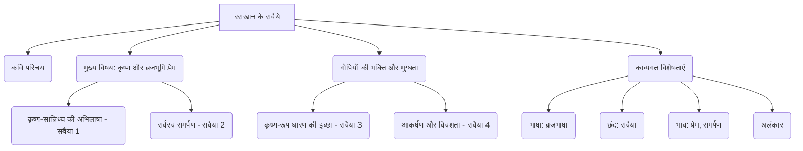

# Class 9 Hindi - Shitij Chapter 109
**Language:** हिंदी

```markdown
# [Class 9] क्षितिज - पाठ 109: रसखान के सवैये

## 🌟 मुख्य अवधारणाएँ (Core Concepts)

यह खंड रसखान के सवैयों में निहित केंद्रीय विचारों और विषयों की रूपरेखा प्रस्तुत करता है।

1.  **कवि परिचय:**
    *   रसखान (सैयद इब्राहिम): जन्म ~1548, मृत्यु ~1628
    *   कृष्ण भक्त कवि, गोस्वामी विट्ठलनाथ के शिष्य।
    *   प्रमुख रचनाएँ: 'सुजान रसखान', 'प्रेमवाटिका'।
    *   काव्य भाषा: सरस और मनोरम ब्रजभाषा।

2.  **मुख्य विषय: कृष्ण और ब्रजभूमि के प्रति अनन्य प्रेम (Unconditional Love for Krishna and Braj)**
    *   **कृष्ण-सान्निध्य की अभिलाषा:**
        *   किसी भी रूप में (मनुष्य, पशु, पत्थर, पक्षी) ब्रज में ही बसने की तीव्र इच्छा (सवैया 1)।
        *   कारण: कृष्ण से किसी न किसी रूप में जुड़े रहना।
    *   **सर्वस्व समर्पण का भाव:**
        *   कृष्ण की वस्तुओं (लकुटी, कामरिया) के लिए तीनों लोकों का राज्य त्यागने की तत्परता (सवैया 2)।
        *   नंद की गाय चराने के सुख के लिए आठों सिद्धियों और नौ निधियों को भुला देना (सवैया 2)।
        *   ब्रज के करील कुंजों के लिए करोड़ों सोने के महलों को न्योछावर करने की इच्छा (सवैया 2)।

3.  **गोपियों की कृष्ण-भक्ति और मुग्धता (Gopis' Devotion and Fascination)**
    *   **कृष्ण का रूप धारण करने की इच्छा:**
        *   मोरपंख, गुंज की माला, पीतांबर, लकुटी धारण कर कृष्ण जैसा स्वाँग रचना (सवैया 3)।
        *   अपवाद: कृष्ण की मुरली को होठों पर न रखना (कृष्ण के अधरों का स्पर्श होने के कारण)।
    *   **कृष्ण के आकर्षण का प्रभाव और गोपियों की विवशता:**
        *   मुरली की मधुर धुन का जादू (सवैया 4)।
        *   कृष्ण की मोहक मुस्कान का अचूक प्रभाव, जिससे बचना असंभव (सवैया 4)।
        *   लोक-लाज खोने का भय, फिर भी आकर्षण के प्रति विवशता।

4.  **काव्यगत विशेषताएँ (Poetic Features):**
    *   **भाषा:** ब्रजभाषा का अत्यंत सरस, सहज और मार्मिक प्रयोग; शब्दाडंबर का अभाव।
    *   **छंद:** सवैया (वर्णिक छंद)।
    *   **भाव:** प्रेम की तन्मयता, भाव-विह्वलता, आसक्ति का उल्लास, समर्पण।
    *   **अलंकार:** अनुप्रास (जैसे - कालिंदी कूल कदंब की डारन), यमक (जैसे - अधरान धरी अधरा न धरौंगी)।

📊 **अवधारणा पदानुक्रम (Concept Hierarchy):**



## 📘 मुख्य शिक्षाएँ (Key Learnings)

इस खंड में सवैयों की विस्तृत व्याख्या और उनसे मिलने वाली मुख्य शिक्षाएँ शामिल हैं।

1.  **अनन्य भक्ति और समर्पण (Unconditional Devotion and Surrender):**
    *   रसखान किसी भी योनि में जन्म लेकर बस ब्रजभूमि में रहना चाहते हैं, चाहे ग्वाला बनकर, गाय बनकर, गोवर्धन पर्वत का पत्थर बनकर या यमुना किनारे कदंब पर पक्षी बनकर। यह कृष्ण और उनकी लीला भूमि के प्रति उनके गहरे, बिना शर्त वाले प्रेम को दर्शाता है (सवैया 1)।
    *   वे कृष्ण से जुड़ी साधारण वस्तुओं (लाठी और कंबल) के लिए सांसारिक और अलौकिक सुखों (तीनों लोकों का राज, आठ सिद्धि, नौ निधि) को तुच्छ समझते हैं। ब्रज के प्राकृतिक परिवेश (वन, बाग, तालाब, करील के कुंजन) के सामने सोने के महल भी फीके हैं (सवैया 2)।
    *   📈 **चित्रण:** त्याग का स्तर
        *   सांसारिक राजपाट < कृष्ण की लकुटी-कामरिया
        *   अलौकिक सिद्धियाँ/निधियाँ < नंद की गाय चराने का सुख
        *   स्वर्ण महल < ब्रज के करील कुंजन

2.  **प्रेम में तन्मयता और स्वाँग (Absorption in Love and Imitation):**
    *   गोपियाँ कृष्ण के प्रेम में इतनी डूबी हुई हैं कि वे उनका रूप धारण कर लेना चाहती हैं। वे कृष्ण के जैसे ही मोरपंख का मुकुट, गुंज की माला, पीले वस्त्र और लाठी लेकर ग्वालों संग घूमना चाहती हैं (सवैया 3)।
    *   लेकिन, वे कृष्ण द्वारा बजाई गई मुरली को अपने होठों से लगाने को तैयार नहीं हैं। यह मुरली के प्रति उनकी ईर्ष्या या सौत-भाव को दर्शाता है, क्योंकि वह कृष्ण के अधरों के सबसे निकट रहती है। यह प्रेम की एक जटिल भावना है।

3.  **कृष्ण के सौंदर्य और संगीत का मोहक प्रभाव (Captivating Effect of Krishna's Beauty and Music):**
    *   कृष्ण की मुरली की धुन इतनी मधुर और मोहक है कि गोपियाँ उसे सुनकर अपने वश में नहीं रह पातीं। वे कानों में उंगली डालकर उससे बचने का प्रयास करने की बात कहती हैं (सवैया 4)।
    *   मुरली की धुन से भी अधिक मादक और irresistible कृष्ण की मुस्कान है। गोपी कहती है कि कृष्ण की मुस्कान देखकर स्वयं को संभाल पाना असंभव है ("सँभारी न जैहै, न जैहै, न जैहै")। यह उनकी पूर्ण विवशता को प्रकट करता है (सवैया 4)।
    *   📈 **प्रभाव:** कृष्ण का आकर्षण -> मुरली की धुन + मोहक मुस्कान -> गोपियों पर प्रभाव -> सुध-बुध खोना / विवशता।

4.  **ब्रजभाषा का माधुर्य (Sweetness of Brajbhasha):**
    *   रसखान ने ब्रजभाषा का अत्यंत स्वाभाविक, सरल और हृदयस्पर्शी प्रयोग किया है। भाषा में कृत्रिमता या भारीपन नहीं है। शब्द चयन सटीक और भावानुकूल है, जैसे 'मानुष हौं तो वही रसखानि', 'या लकुटी अरु कामरिया', 'माइ री वा मुख की मुसकानि'।

## 🧩 सक्रिय अधिगम (Active Learning)

1.  **गतिविधि: शोध-आधारित केस स्टडी विश्लेषण (Research-based Case Study Analysis) 🔍**
    *   **विषय:** रसखान और अन्य कृष्ण भक्त कवियों (जैसे सूरदास, मीराबाई) की भक्ति-भावना की तुलना।
    *   **कार्य:** छात्र समूहों में सूरदास या मीराबाई के कुछ पद पढ़ें और उनकी तुलना रसखान के सवैयों से करें। निम्नलिखित बिंदुओं पर ध्यान दें:
        *   कृष्ण के प्रति प्रेम की अभिव्यक्ति में समानताएँ और अंतर।
        *   क्या अन्य कवियों ने भी रसखान की तरह 'ब्रजभूमि' के प्रति इतना गहरा अनुराग व्यक्त किया है?
        *   भाषा और शैली में क्या भिन्नताएँ हैं?
    *   **प्रस्तुति:** अपने निष्कर्षों को कक्षा में प्रस्तुत करें। (Bloom's: Analyzing, Evaluating)

2.  **चर्चा: वास्तविक दुनिया के प्रभावों का आलोचनात्मक विश्लेषण (Critical Analysis of Real-world Impacts) 🌍**
    *   **विषय 1:** सवैया 3 में गोपी द्वारा कृष्ण का स्वाँग रचने की इच्छा और मुरली को धारण न करने के पीछे की मनोभावना पर चर्चा करें। यह प्रेम के किस स्वरूप को दर्शाता है? (Bloom's: Analyzing, Evaluating)
    *   **विषय 2:** रसखान द्वारा व्यक्त 'अनन्य प्रेम' और 'सर्वस्व समर्पण' की भावना पर विचार-विमर्श करें। क्या आज के भौतिकवादी युग में इस प्रकार की भक्ति या प्रेम प्रासंगिक है? अपने विचार तर्क सहित प्रस्तुत करें। (Bloom's: Evaluating, Creating)

## 📝 मूल्यांकन तैयारी (Assessment Prep)

1.  **भाव स्पष्टीकरण (Explaining the Meaning):**
    *   "कोटिक ए कलधौत के धाम करील के कुंजन ऊपर वारौं।"
        *   **अर्थ:** रसखान कहते हैं कि मैं ब्रजभूमि की कांटेदार करील झाड़ियों के ऊपर करोड़ों सोने-चांदी के महलों को भी न्योछावर करने को तैयार हूँ।
        *   **भाव:** ब्रजभूमि का प्राकृतिक सौंदर्य और कृष्ण से जुड़ाव उनके लिए सांसारिक धन-संपदा से कहीं अधिक मूल्यवान है। यह ब्रज के प्रति उनका गहरा अनुराग दर्शाता है।
    *   "माइ री वा मुख की मुसकानि सँभारी न जैहै, न जैहै, न जैहै।"
        *   **अर्थ:** हे माँ! कृष्ण के मुख की वह मुस्कान ऐसी मोहक है कि उसे देखकर मैं स्वयं को संभाल नहीं पाऊँगी, नहीं पाऊँगी, नहीं पाऊँगी।
        *   **भाव:** कृष्ण की मुस्कान का प्रभाव इतना तीव्र और अचूक है कि गोपी अपनी सुध-बुध खो बैठती है और पूरी तरह विवश हो जाती है। 'न जैहै' की पुनरावृत्ति इस विवशता की गहनता को दर्शाती है।

2.  **काव्य-सौंदर्य (Poetic Beauty):**
    *   "या मुरली मुरलीधर की अधरान धरी अधरा न धरौंगी।"
        *   **भाव-सौंदर्य:** गोपी कृष्ण का सब स्वाँग करने को तैयार है, पर मुरली को होठों पर नहीं रखेगी। इसमें मुरली के प्रति सौतिया डाह (ईर्ष्या) का भाव है, क्योंकि वह कृष्ण के अधरों का स्पर्श पाती है। यह प्रेम की निश्छल अभिव्यक्ति है।
        *   **शिल्प-सौंदर्य:**
            *   **भाषा:** सरस ब्रजभाषा।
            *   **अलंकार:** 'मुरली मुरलीधर' में अनुप्रास। 'अधरान धरी अधरा न' में यमक अलंकार है ('अधरान' - होठों पर, 'अधरा न' - होठों पर नहीं)।
            *   **लय और प्रवाह:** पंक्ति में गेयता और प्रवाह है।

3.  **विश्लेषणात्मक प्रश्न (Analytical Questions):**
    *   रसखान पशु, पक्षी और पहाड़ के रूप में भी कृष्ण का सान्निध्य क्यों प्राप्त करना चाहते हैं? इससे उनकी भक्ति की किस विशेषता का पता चलता है? (संकेत: अनन्य प्रेम, हर रूप में कृष्ण से जुड़ाव की इच्छा)
    *   गोपियाँ कृष्ण की मुरली की धुन सुनने से क्यों बचना चाहती हैं? फिर भी वे क्यों विवश हो जाती हैं? चौथे सवैये के आधार पर स्पष्ट करें। (संकेत: मोहक प्रभाव, लोक-लाज का भय, मुस्कान का अचूक असर)

4.  **रेखाचित्र/मानसिक मानचित्र (Diagrams/Mind Maps):**
    *   सवैया 1 में रसखान की इच्छाओं का एक प्रवाह चार्ट बनाएँ।
    *   सवैया 3 में गोपी द्वारा कृष्ण के स्वाँग के तत्वों का एक मानसिक मानचित्र बनाएँ।

## 🌏 भारतीय संदर्भ (Bharatiya Context)

1.  **भक्ति आंदोलन (Bhakti Movement):** रसखान (सैयद इब्राहिम) का कृष्ण भक्त होना मध्यकालीन भक्ति आंदोलन की उस समावेशी भावना का प्रतीक है, जहाँ धर्म और जाति की सीमाएँ टूट रही थीं। यह भारत की गंगा-जमुनी तहज़ीब का उत्कृष्ट उदाहरण है।
2.  **कृष्ण-भक्ति परंपरा (Krishna Devotion Tradition):** रसखान के सवैये भारत में फैली कृष्ण-भक्ति की समृद्ध परंपरा का महत्वपूर्ण हिस्सा हैं। वे विशेष रूप से ब्रज क्षेत्र (मथुरा, वृन्दावन, गोकुल) की महिमा और कृष्ण लीलाओं को सरस ढंग से प्रस्तुत करते हैं, जो आज भी भारतीय जनमानस में गहरे बसे हुए हैं।
3.  **गुरु-शिष्य परंपरा (Guru-Disciple Tradition):** रसखान का गोस्वामी विट्ठलनाथ से दीक्षा लेना भारत की प्राचीन और महत्वपूर्ण गुरु-शिष्य परंपरा को दर्शाता है, जो आध्यात्मिक ज्ञान और मार्गदर्शन का आधार रही है।
4.  **सांस्कृतिक मूल्य (Cultural Values):** सवैयों में व्यक्त समर्पण, अनन्य प्रेम, प्रकृति प्रेम (ब्रजभूमि के प्रति), और कला (संगीत/मुरली) के प्रति संवेदनशीलता जैसे मूल्य भारतीय संस्कृति के अभिन्न अंग हैं।
```