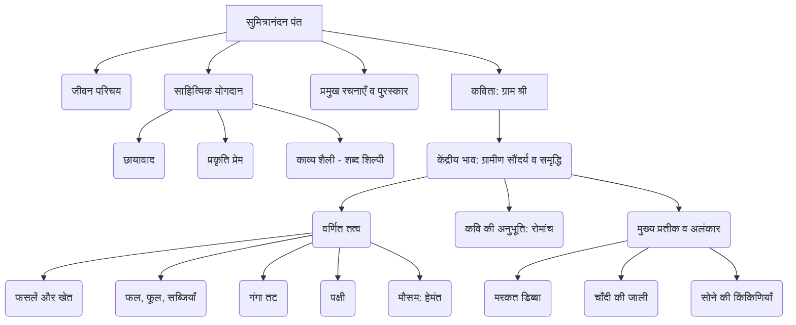

# Class 9 Hindi - Shitij Chapter 111
**Language:** हिंदी

```markdown
# [कक्षा 9] क्षितिज - अध्याय 111: ग्राम श्री (सुमित्रानंदन पंत)

## 🌟 मुख्य अवधारणाएँ (Core Concepts)

1.  **कवि परिचय: सुमित्रानंदन पंत**
    *   **जीवन:** जन्म 1900 (कौसानी, उत्तराखंड), शिक्षा (बनारस, इलाहाबाद), गाँधीजी के आह्वान पर कॉलेज त्याग, मृत्यु 1977।
    *   **साहित्यिक महत्व:** छायावाद के प्रमुख स्तंभ, प्रकृति और मनुष्य के अंतरंग संबंधों के कवि।
    *   **प्रभाव:** छायावाद, प्रगतिवाद, अरविंद दर्शन।
    *   **प्रमुख रचनाएँ:** वीणा, ग्रंथि, गुंजन, ग्राम्या, पल्लव, युगांत, स्वर्ण किरण, स्वर्णधूलि, कला और बूढ़ा चाँद, लोकायतन, चिदंबरा।
    *   **सम्मान:** साहित्य अकादमी, भारतीय ज्ञानपीठ, सोवियत लैंड नेहरू पुरस्कार।
    *   **काव्य शैली:** नवीन अभिव्यंजना पद्धति, सटीक शब्द चयन ('शब्द शिल्पी'), प्रकृति चित्रण।

2.  **कविता: ग्राम श्री**
    *   **केंद्रीय भाव:** गाँव की प्राकृतिक सुषमा (सुंदरता) और समृद्धि का मनोहारी वर्णन।
    *   **मुख्य विषय:**
        *   खेतों में फैली हरियाली और फसलें (जौ, गेहूँ, अरहर, सनई, सरसों, मटर, तीसी)।
        *   फल-फूलों से लदे पेड़ (आम, कटहल, जामुन, बेर, आड़ू, नींबू, अनार, आँवला)।
        *   सब्जियों की बहुतायत (आलू, गोभी, बैंगन, मूली, पालक, धनिया, लौकी, सेम, टमाटर, मिर्च)।
        *   गंगा तट का सौंदर्य (रेत, तरबूज की खेती, बगुले, सुरखाब)।
        *   मौसम का प्रभाव (हेमंत ऋतु की धूप, शांत वातावरण)।
        *   कवि की अनुभूति (रोमांच, मुग्धता)।
    *   **प्रतीक और अलंकार:**
        *   'मरकत डिब्बे सा खुला ग्राम': गाँव की हरियाली और सुंदरता की तुलना पन्ना रत्न के खुले डिब्बे से।
        *   'चाँदी की सी उजली जाली': ओस कणों पर पड़ती सूर्य किरणों का चित्रण।
        *   'सोने की किंकिणियाँ': अरहर और सनई की फलियों का चित्रण।

📊 **अवधारणा पदानुक्रम (Concept Hierarchy):**



## 📘 मुख्य शिक्षाएँ (Key Learnings)

*   **प्रकृति का सजीव चित्रण:** पंत जी ने गाँव के खेतों, फसलों, पेड़-पौधों, नदी तट और मौसम का अत्यंत सजीव और मनमोहक वर्णन किया है। उन्होंने प्रकृति को मानवीय भावनाओं के साथ प्रस्तुत किया है (जैसे, 'रोमांचित सी लगती वसुधा', 'हँसमुख हरियाली')।
*   **समृद्धि का अनुभव:** कविता में विभिन्न फसलों (गेहूँ, जौ, अरहर, सनई, सरसों), फलों (आम, अमरूद, बेर, अनार) और सब्जियों (पालक, धनिया, टमाटर, मिर्च) का वर्णन ग्रामीण समृद्धि को दर्शाता है।
*   **शब्द-चित्रण:** कवि 'शब्द शिल्पी' हैं। उन्होंने सटीक शब्दों और उपमाओं का प्रयोग कर दृश्य को आँखों के सामने जीवंत कर दिया है।
    *   **उदाहरण:**
        *   `मखमल सी कोमल हरियाली`: खेतों की मुलायम हरियाली।
        *   `रजत-स्वर्ण मंजरियाँ`: आम के बौर का चाँदी-सुनहरा रंग।
        *   `बालू के साँपों से अंकित`: गंगा की रेती पर लहरदार निशान।
        *   `मरकत डिब्बे सा खुला ग्राम`: पन्ना रत्न जैसे हरे-भरे खुले गाँव का बिंब।
*   **हेमंत ऋतु का सौंदर्य:** कविता में विशेष रूप से हेमंत (सर्दी की शुरुआत) ऋतु की धूप (`हिम-आतप`), शांत और स्निग्ध वातावरण का सुंदर चित्रण है।
*   **मानव और प्रकृति का संबंध:** कविता दर्शाती है कि कवि प्रकृति के सौंदर्य से कितना गहराई से जुड़ा और प्रभावित है। गाँव की शोभा उसके मन को हर लेती है (`हरता जन मन`)।

📈 **कविता में वर्णित ग्रामीण दृश्य (Visual Flow):**


## 🧩 सक्रिय अधिगम (Active Learning)

*   **गतिविधि: शोध-आधारित केस स्टडी विश्लेषण 🔍**
    *   **विषय:** "तब और अब का गाँव: पंत की 'ग्राम श्री' (1940 के दशक) और आज के भारतीय गाँव।"
    *   **कार्य:** छात्र समूह में विभाजित होकर शोध करें कि पंत द्वारा कविता लिखे जाने के समय (लगभग 1940 का दशक) के भारतीय गाँवों और आज के गाँवों में कृषि, जीवनशैली, पर्यावरण और आर्थिक स्थिति में क्या मुख्य परिवर्तन आए हैं। वे सरकारी कृषि डेटा (जैसे फसल उत्पादन, सिंचाई के तरीके) और सामाजिक बदलावों पर जानकारी एकत्र कर सकते हैं। निष्कर्षों को कक्षा में प्रस्तुत करें। (Bloom's Level: Evaluating/Creating)
*   **चर्चा: वास्तविक दुनिया के प्रभावों का आलोचनात्मक विश्लेषण 🌍**
    *   **प्रश्न:** क्या पंत द्वारा चित्रित田园诗般的 (idyllic) ग्रामीण सौंदर्य आज भी भारत में आम है? आधुनिकीकरण, शहरीकरण और जलवायु परिवर्तन ने भारतीय गाँवों की प्राकृतिक सुंदरता और समृद्धि को कैसे प्रभावित किया है? क्या 'ग्राम श्री' में वर्णित समृद्धि आज के किसानों की आर्थिक वास्तविकता से मेल खाती है? इन मुद्दों पर कक्षा में गहन चर्चा करें। (Bloom's Level: Evaluating/Analyzing)

## 📝 मूल्यांकन तैयारी (Assessment Prep)

*   **केस स्टडी / भाव स्पष्टीकरण:**
    1.  'मरकत डिब्बे सा खुला ग्राम' - इस पंक्ति का आशय स्पष्ट करते हुए बताइए कि कवि ने गाँव के लिए यह उपमा क्यों प्रयोग की है? गाँव की किन विशेषताओं के कारण यह उपमा सटीक लगती है?
    2.  'बालू के साँपों से अंकित गंगा की सतरंगी रेती' - इस पंक्ति में निहित दृश्य सौंदर्य और अलंकार को स्पष्ट कीजिए।
    3.  'हँसमुख हरियाली हिम-आतप सुख से अलसाए-से सोए' - इस पंक्ति का भाव अपने शब्दों में लिखिए। इसमें प्रकृति का मानवीकरण कैसे किया गया है?
*   **आरेख / चित्रण:**
    *   कविता में वर्णित गंगा तट के दृश्य का एक चित्र बनाइए, जिसमें रेती, तरबूज की खेती, बगुले और सुरखाब पक्षी शामिल हों। (Creating)
*   **अलंकार पहचान:**
    *   'तिनकों के हरे हरे तन पर हिल हरित रुधिर है रहा झलक' - पंक्ति में प्रयुक्त अलंकार पहचानिए और समझाइए। (Analyzing)
*   **पाठ्यपुस्तक आधारित प्रश्न:** (जैसा कि मूल पाठ में दिए गए हैं)
    *   कवि ने गाँव को 'हरता जन मन' क्यों कहा है?
    *   कविता में किस मौसम के सौंदर्य का वर्णन है?
    *   अरहर और सनई के खेत कवि को कैसे दिखाई देते हैं?

## 🌏 भारतीय संदर्भ (Bharatiya Context)

*   **भौगोलिक संकेत:** कविता में **गंगा नदी** और उसके तट का वर्णन उत्तर भारत के मैदानी इलाकों, संभवतः **उत्तराखंड** (कवि का गृह राज्य) या **उत्तर प्रदेश** के ग्रामीण परिवेश की ओर संकेत करता है।
*   **कृषि आधारित अर्थव्यवस्था:** कविता भारत की कृषि प्रधानता को दर्शाती है। **गेहूँ, जौ, सरसों, अरहर, आम, अमरूद, सब्जियाँ** जैसी फसलें और फल भारतीय कृषि के अभिन्न अंग हैं। यह कविता उस समय के भारतीय गाँव की आत्मनिर्भरता और प्राकृतिक संसाधनों पर निर्भरता का चित्र प्रस्तुत करती है।
*   **राष्ट्रीय आर्थिक/सामाजिक डेटा 📊:**
    *   कविता में चित्रित कृषि समृद्धि की तुलना आज के **भारतीय कृषि आंकड़ों** (जैसे, विभिन्न फसलों का उत्पादन, जीडीपी में कृषि का योगदान, किसानों की आय) से की जा सकती है।
    *   **सनई (Sanai/Sunn Hemp):** यह एक पारंपरिक भारतीय रेशा फसल है, जिसका उल्लेख ग्रामीण अर्थव्यवस्था में इसके महत्व को रेखांकित करता है।
    *   यह कविता भारतीय **ग्रामीण जीवन** की सांस्कृतिक और प्राकृतिक धरोहर का एक साहित्यिक दस्तावेज़ है, जो बदलते समय के साथ हो रहे परिवर्तनों को समझने का आधार प्रदान करती है।
```