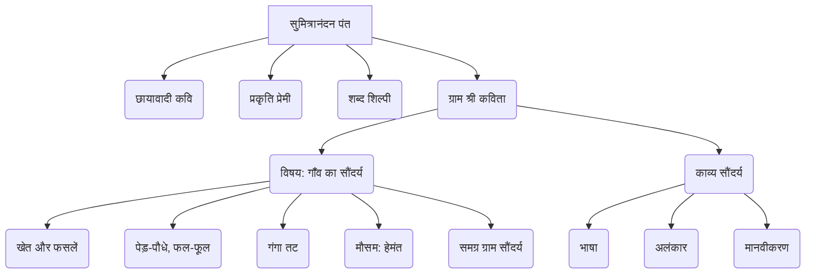

# Class 9 Hindi - Shitij Chapter 111
**Language:** हिंदी

```markdown
# [कक्षा 9] क्षितिज - पाठ: ग्राम श्री (सुमित्रानंदन पंत)

*(कृपया ध्यान दें: प्रदान किए गए पाठ में अध्याय संख्या 111 गलत प्रतीत होती है। यह सामग्री सुमित्रानंदन पंत की कविता "ग्राम श्री" से संबंधित है।)*

## 🌟 मुख्य अवधारणाएँ (Core Concepts) 📊

1.  **कवि परिचय:**
    *   **सुमित्रानंदन पंत:**
        *   जन्म: 1900, कौसानी (उत्तराखंड)
        *   मृत्यु: 1977
        *   प्रमुख कवि: छायावाद के स्तंभ
        *   प्रभाव: छायावाद, प्रगतिवाद, अरविंद दर्शन
        *   प्रमुख रचनाएँ: वीणा, ग्रंथि, गुंजन, ग्राम्या, पल्लव, युगांत, स्वर्ण किरण, स्वर्णधूलि, कला और बूढ़ा चाँद, लोकायतन, चिदंबरा
        *   पुरस्कार: साहित्य अकादमी, भारतीय ज्ञानपीठ, सोवियत लैंड नेहरू पुरस्कार
        *   विशेषता: प्रकृति और मनुष्य के अंतरंग संबंध, नवीन अभिव्यंजना पद्धति, सटीक शब्द चयन ('शब्द शिल्पी कवि')

2.  **कविता: ग्राम श्री:**
    *   **विषय:** गाँव की प्राकृतिक सुषमा और समृद्धि का मनोहारी वर्णन।
    *   **मुख्य तत्व:**
        *   खेतों की हरियाली (मखमल सी)
        *   फसलें (जौ, गेहूँ, अरहर, सनई, सरसों, तीसी, मटर)
        *   फल-फूलों से लदे पेड़ (आम, पीपल, कटहल, जामुन, झरबेरी, आड़ू, नींबू, दाड़िम, बेर, आँवला)
        *   सब्जियाँ (आलू, गोभी, बैंगन, मूली, पालक, धनिया, लौकी, सेम, टमाटर, मिर्च)
        *   गंगा का तट (रेत, तरबूजों की खेती, बगुले, सुरखाब)
        *   मौसम: हेमंत ऋतु (सर्दी की धूप - हिम-आतप)
        *   गाँव का समग्र सौंदर्य ('मरकत डिब्बे सा खुला ग्राम')

3.  **काव्य सौंदर्य:**
    *   **भाषा:** सरल, सहज, चित्रात्मक हिंदी, तत्सम शब्दों का प्रयोग।
    *   **शैली:** वर्णनात्मक, प्रकृति चित्रण।
    *   **अलंकार:** उपमा ('मखमल की कोमल हरियाली', 'चाँदी की सी उजली जाली', 'मरकत डिब्बे सा खुला ग्राम'), रूपक ('हिल हरित रुधिर'), मानवीकरण ('हँस रही सखियाँ मटर खड़ी', 'रोमांचित-सी लगती वसुधा', 'हँसमुख हरियाली हिम-आतप सुख से अलसाए-से सोए'), अनुप्रास ('हरे हरे तन', 'रंग रंग')।
    *   **भाव:** प्रकृति प्रेम, रोमांच, शांति, समृद्धि का भाव।

**अवधारणा पदानुक्रम (Concept Hierarchy):**



## 📘 मुख्य सीखें (Key Learnings) 📈

1.  **प्रकृति का सजीव चित्रण:** पंत जी ने गाँव की प्राकृतिक सुंदरता को अत्यंत सजीव रूप में प्रस्तुत किया है। खेतों में दूर तक फैली मखमल जैसी हरियाली, जिस पर पड़ती सूर्य की किरणें चाँदी की जाली सी लगती हैं, पाठक के मन में एक सुंदर दृश्य उत्पन्न करती है।
    *   **उदाहरण:** `फैली खेतों में दूर तलक मखमल की कोमल हरियाली, लिपटीं जिससे रवि की किरणें चाँदी की सी उजली जाली!`

2.  **फसलों और वनस्पतियों की समृद्धि:** कविता में विभिन्न फसलों (जौ, गेहूँ, अरहर, सनई, सरसों, तीसी, मटर), फलों (आम, अमरूद, बेर, आँवला, कटहल, जामुन), और सब्जियों (पालक, धनिया, लौकी, सेम, टमाटर, मिर्च, आलू, गोभी, बैंगन, मूली) का विस्तृत वर्णन है, जो गाँव की समृद्धि और विविधता को दर्शाता है।
    *   **उदाहरण:** `अरहर सनई की सोने की किंकिनियाँ हैं शोभाशाली!`, `लद गई आम्र तरु की डाली!`, `लहलह पालक, महमह धनिया, लौकी औ' सेम फलीं, फैलीं`

3.  **गंगा तट का सौंदर्य:** कवि गंगा के रेतीले तट का सुंदर वर्णन करते हैं। बालू पर टेढ़ी-मेढ़ी रेखाएँ साँपों जैसी लगती हैं (बालू के साँपों से अंकित), तट पर तरबूजों की खेती, अपने सिर को सँवारते बगुले और जल में तैरते सुरखाब (चक्रवाक) पक्षी एक शांत और मनोरम दृश्य बनाते हैं।
    *   **उदाहरण:** `बालू के साँपों से अंकित गंगा की सतरंगी रेती`

4.  **मानवीकरण अलंकार का प्रयोग:** कवि ने प्रकृति के तत्वों का मानवीकरण किया है, जिससे वर्णन अधिक जीवंत हो गया है। जैसे - मटर की फलियों का सखियों की तरह हँसना, धरती का रोमांचित होना, हरियाली का अलसाकर सोना।
    *   **उदाहरण:** `हँस रही सखियाँ मटर खड़ी`, `रोमांचित-सी लगती वसुधा`, `हँसमुख हरियाली हिम-आतप सुख से अलसाए-से सोए`

5.  **गाँव की उपमा:** कवि ने पूरे गाँव की सुंदरता को पन्ना (मरकत) रत्न के खुले डिब्बे के समान बताया है, जिस पर नीला आकाश ढक्कन जैसा लगता है। यह उपमा गाँव के खुले, हरे-भरे और मूल्यवान सौंदर्य को दर्शाती है।
    *   **उदाहरण:** `मरकत डिब्बे सा खुला ग्राम - जिस पर नीलम नभ आच्छादन`

6.  **हेमंत ऋतु का प्रभाव:** कविता में सर्दी की धूप ('हिम-आतप') का उल्लेख है, जिसमें हरियाली सुख से अलसाई हुई सी लगती है। यह हेमंत ऋतु के शांत और स्निग्ध वातावरण को दर्शाता है।

**गाँव के सौंदर्य तत्व (Diagrammatic Representation):**

```mermaid
mindMap
  root((ग्राम श्री: गाँव का सौंदर्य))
    ::icon(fa fa-tree)
    खेत
      ::icon(fa fa-leaf)
      हरियाली (मखमल सी)
      फसलें
        ::icon(fa fa-seedling)
        जौ, गेहूँ
        अरहर, सनई (सोने की किंकिनियाँ)
        सरसों (पीली-पीली)
        तीसी (नीली कली)
        मटर (हँसती सखियाँ)
    पेड़-पौधे
      ::icon(fa fa-apple-alt)
      आम (रजत-स्वर्ण मंजरियाँ)
      पीपल, ढाक
      कटहल, जामुन, झरबेरी
      आड़ू, नींबू, दाड़िम
      बेर, आँवला
    सब्जियाँ
      ::icon(fa fa-carrot)
      पालक, धनिया
      लौकी, सेम
      टमाटर (लाल), मिर्च (हरी थैली)
      आलू, गोभी, बैंगन, मूली
    गंगा तट
      ::icon(fa fa-water)
      सतरंगी रेत (बालू के साँप)
      तरबूजों की खेती
      बगुले, सुरखाब
    वातावरण
      ::icon(fa fa-sun)
      हेमंत ऋतु (हिम-आतप)
      शांत, स्निग्ध
      'मरकत डिब्बे सा खुला ग्राम'
      'हरता जन मन'
```

## 🧩 सक्रिय अधिगम (Active Learning)

1.  **गतिविधि: शोध-आधारित केस स्टडी विश्लेषण (Research-based case study analysis) 🔍**
    *   **विषय:** सुमित्रानंदन पंत द्वारा वर्णित (लगभग 1940 के दशक) गाँव और आज के भारतीय गाँव में परिवर्तन।
    *   **कार्य:** विद्यार्थी समूह में विभाजित होकर पंत की कविता में वर्णित गाँव (फसलें, जीवनशैली, प्रकृति) के तत्वों की सूची बनाएँ। फिर इंटरनेट, पुस्तकालय या बड़ों से बातचीत के माध्यम से आज के किसी भारतीय गाँव (विशेषकर गंगा के मैदानी इलाके या उत्तराखंड के गाँव) की जानकारी एकत्र करें। दोनों की तुलना करते हुए एक रिपोर्ट तैयार करें जिसमें निम्नलिखित बिंदुओं पर ध्यान केंद्रित हो:
        *   कृषि पद्धतियों में बदलाव (फसलें, तकनीक)।
        *   प्राकृतिक पर्यावरण में परिवर्तन (पेड़-पौधे, नदी तट, प्रदूषण)।
        *   गाँव के सामाजिक और आर्थिक जीवन में बदलाव।
        *   क्या आज भी गाँव 'मरकत डिब्बे सा' या 'जन मन हरने वाला' लगता है? क्यों या क्यों नहीं?
    *   **प्रस्तुति:** समूह अपनी रिपोर्ट कक्षा में प्रस्तुत करें।

2.  **चर्चा: वास्तविक दुनिया के प्रभावों का आलोचनात्मक विश्लेषण (Critical analysis of real-world impacts) 🌍**
    *   **प्रश्न:**
        *   कविता में चित्रित प्राकृतिक सौंदर्य आज के गाँवों में कितना बचा है? शहरीकरण और आधुनिकीकरण ने ग्रामीण सुंदरता को कैसे प्रभावित किया है?
        *   'ग्राम श्री' कविता में व्यक्त प्रकृति प्रेम और शांति का भाव आज के जीवन में कितना प्रासंगिक है?
        *   क्या विकास और प्राकृतिक सौंदर्य का संतुलन संभव है? भारत के संदर्भ में उदाहरण दें।
        *   कविता में वर्णित समृद्धि (फसलें, फल, सब्जियाँ) क्या आज भी भारतीय गाँवों की वास्तविकता है? कृषि संकट और किसानों की समस्याओं पर चर्चा करें।

## 📝 मूल्यांकन तैयारी (Assessment Prep) 📝

1.  **केस स्टडी आधारित प्रश्न:**
    *   'ग्राम श्री' कविता के आधार पर गंगा तट के सौंदर्य का वर्णन करें। कवि ने रेत की तुलना किससे की है और क्यों? तट पर कौन-कौन से जीव-जंतु दिखाई देते हैं? (`बालू के साँपों से अंकित...मगरौठी रहती सोई!` पंक्तियों का विश्लेषण करें)।
    *   कविता में विभिन्न फसलों और सब्जियों का वर्णन गाँव की समृद्धि को कैसे दर्शाता है? 'अरहर सनई की सोने की किंकिनियाँ' और 'मिर्चों की बड़ी हरी थैली' जैसे प्रयोगों का अर्थ स्पष्ट करें।

2.  **आरेख/चित्र आधारित प्रश्न:**
    *   दिए गए आरेख (ऊपर 'गाँव के सौंदर्य तत्व' जैसा) के आधार पर, कविता में वर्णित किसी एक तत्व (जैसे - आम के पेड़ या मटर की बेल) का विस्तृत वर्णन अपने शब्दों में लिखें।
    *   'मरकत डिब्बे सा खुला ग्राम' - इस पंक्ति का आशय स्पष्ट करते हुए एक चित्र बनाइए या कल्पना का वर्णन कीजिए।

3.  **भाव स्पष्टीकरण:**
    *   `रोमांचित-सी लगती वसुधा आई जौ गेहूँ में बाली,`
    *   `हँसमुख हरियाली हिम-आतप सुख से अलसाए-से सोए,`
    *   `हिल हरित रुधिर है रहा झलक`

4.  **अलंकार पहचान:**
    *   `चाँदी की सी उजली जाली` - में कौन सा अलंकार है?
    *   `मखमल की कोमल हरियाली` - में कौन सा अलंकार है?
    *   `हँस रही सखियाँ मटर खड़ी` - में कौन सा अलंकार है?

5.  **उच्च स्तरीय चिंतन प्रश्न (Evaluating/Creating):**
    *   'ग्राम श्री' कविता की भाषा और भाव आपको कैसे लगे? क्या यह कविता आज भी उतनी ही प्रासंगिक है जितनी पंत के समय में थी? अपने विचार लिखिए।
    *   यदि आपको अपने आसपास के किसी प्राकृतिक दृश्य (जैसे पार्क, खेत, नदी किनारे) का वर्णन करना हो, तो आप पंत की शैली से क्या सीखेंगे? वर्णन कीजिए।

## 🌏 भारतीय संदर्भ (Bharatiya Context) 📊

1.  **कृषि प्रधानता:** यह कविता भारत की कृषि प्रधान संस्कृति और अर्थव्यवस्था का सुंदर चित्रण करती है। इसमें वर्णित विविध फसलें (गेहूँ, जौ, अरहर, सनई, सरसों, तीसी), फल और सब्जियाँ भारतीय कृषि की विविधता और ग्रामीण जीवन की आत्मनिर्भरता को दर्शाती हैं। यह उस दौर के भारत की झलक है जहाँ गाँव अन्न और समृद्धि के स्रोत थे।
    *   **उदाहरण:** अरहर, सनई, आम, जामुन, बेर, आँवला, पालक, धनिया आदि विशिष्ट भारतीय फसलें और वनस्पतियाँ हैं।

2.  **गंगा का सांस्कृतिक महत्व:** कविता में गंगा नदी के तट का वर्णन केवल प्राकृतिक सौंदर्य तक सीमित नहीं है, बल्कि यह भारत में गंगा के सांस्कृतिक और जीवनदायिनी महत्व को भी दर्शाता है। गंगा के किनारे खेती होना (तरबूजों की खेती) और विभिन्न पक्षियों का पाया जाना नदी पर आधारित जीवन को दिखाता है।

3.  **उत्तराखंड से जुड़ाव:** कवि सुमित्रानंदन पंत का जन्म उत्तराखंड के कौसानी गाँव में हुआ था, जो अपनी प्राकृतिक सुंदरता के लिए प्रसिद्ध है। यद्यपि कविता किसी विशिष्ट गाँव का नाम नहीं लेती, पर इसमें चित्रित प्रकृति में पहाड़ी और मैदानी, दोनों तरह के परिदृश्यों की झलक मिलती है, जो कवि के अपने परिवेश से प्रेरित हो सकती है। गंगा का उल्लेख उत्तर भारत के मैदानी इलाकों से संबंध जोड़ता है।

4.  **ग्रामीण सौंदर्य का आदर्श:** कविता में प्रस्तुत गाँव का चित्र (शांत, सुंदर, समृद्ध, प्रकृति से भरपूर) एक आदर्श भारतीय गाँव की छवि प्रस्तुत करता है। यह उस सौंदर्य को सहेजने और महत्व देने की प्रेरणा देता है जो आधुनिकीकरण की दौड़ में कहीं खोता जा रहा है। यह कविता भारतीय जनमानस में गाँव और प्रकृति के प्रति गहरे लगाव को दर्शाती है।
```