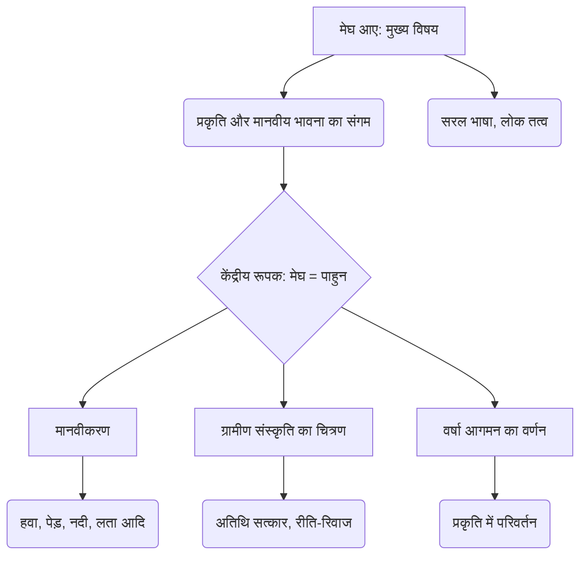
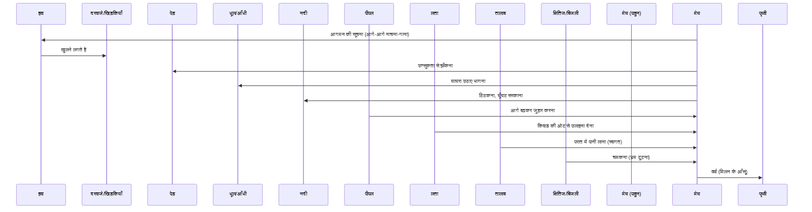

# Class 9 Hindi - Shitij Chapter 112
**Language:** हिंदी

```markdown
# [कक्षा 9] क्षितिज - पाठ 112: मेघ आए (सर्वेश्वर दयाल सक्सेना)

*(कृपया ध्यान दें: NCERT क्षितिज भाग 1 (कक्षा 9) में सामान्यतः इतने पाठ नहीं होते हैं। यह पाठ संख्या संभवतः सांकेतिक है। सामग्री सर्वेश्वर दयाल सक्सेना की कविता "मेघ आए" पर आधारित है।)*

## 🌟 मुख्य अवधारणाएँ (Core Concepts)

यह कविता प्रकृति और मानवीय भावनाओं के सुंदर समन्वय का उदाहरण है। मुख्य अवधारणाएँ इस प्रकार हैं:

1.  **प्रकृति का मानवीकरण (Personification of Nature):**
    *   कवि ने बादल, हवा, पेड़, धूल, नदी, लता, पीपल, तालाब जैसे प्राकृतिक तत्वों को मानवीय क्रियाएँ और भावनाएँ करते हुए दिखाया है।
    *   **उदाहरण:** हवा का नाचना-गाना, पेड़ों का गर्दन उचकाकर झाँकना, नदी का ठिठकना, लता का शरमाना और उलाहना देना, पीपल का स्वागत करना, तालाब का पानी लाना।

2.  **रूपक अलंकार (Metaphor):**
    *   **मेघ (बादल) = पाहुन (अतिथि/दामाद):** कविता का केंद्रीय रूपक, जिसमें मेघों के आगमन की तुलना गाँव में शहर से आए सजे-सँवरे अतिथि (विशेषकर दामाद) से की गई है।
    *   **क्षितिज अटारी:** क्षितिज की तुलना अटारी (ऊँचा स्थान) से।

3.  **ग्रामीण संस्कृति और परंपराएँ (Rural Culture & Traditions):**
    *   अतिथि (विशेषकर दामाद) के आगमन पर गाँव में उल्लास का वातावरण।
    *   स्वागत की रीतियाँ: बुजुर्गों द्वारा अगवानी (पीपल का जुहार करना), पानी देना (ताल का परात भर लाना), स्त्रियों का संकोच (नदी का ठिठकना, लता का किवाड़ की ओट लेना)।
    *   इंतजार और उलाहना ('बरस बाद सुधि लीन्ही')।

4.  **वर्षा ऋतु का आगमन (Arrival of Monsoon):**
    *   गर्मी के बाद मेघों के आने की प्रतीक्षा और उनके आने पर प्रकृति में होने वाले सजीव परिवर्तन (हवा चलना, धूल उड़ना, बिजली चमकना, वर्षा होना)।

5.  **भाषा और शैली (Language & Style):**
    *   सरल, सहज और प्रवाहमयी भाषा।
    *   लोक भाषा और आंचलिक शब्दों का प्रयोग (जैसे - बन-ठन के, पाहुन, जुहार, किवार, परात, सुधि लीन्ही)।
    *   चित्रमय और सजीव वर्णन।

📊 **अवधारणा पदानुक्रम (Concept Hierarchy):**



## 📘 मुख्य सीख (Key Learnings)

1.  **मेघों का पाहुन रूप:** कवि ने मेघों को गाँव में आने वाले सजे-सँवरे शहरी मेहमान (दामाद) के रूप में चित्रित किया है। जैसे मेहमान के आने से गाँव में खुशी और हलचल होती है, वैसे ही मेघों के आने से प्रकृति में उल्लास छा जाता है। मेघ 'बन-ठन के, सँवर के' आते हैं।

2.  **प्रकृति का सजीव चित्रण (मानवीकरण):**
    *   **हवा:** मेहमान के आगे नाचती-गाती चलती है, सूचना देती हुई।
    *   **पेड़:** उत्सुक गाँव वालों की तरह गर्दन उचकाकर झाँकते हैं।
    *   **धूल:** गाँव की लड़की की तरह घाघरा उठाए भागती है (आँधी)।
    *   **नदी:** गाँव की स्त्री की तरह ठिठकती है, घूँघट सरकाती है (तिरछी नजर से देखती है)।
    *   **पीपल:** गाँव के बड़े-बुजुर्ग की तरह आगे बढ़कर स्वागत (जुहार) करता है।
    *   **लता:** व्याकुल नायिका की तरह किवाड़ की ओट से उलाहना देती है ('बरस बाद सुधि लीन्ही')।
    *   **तालाब:** खुशी से मेहमान के पैर धोने के लिए परात में पानी भरकर लाता है।
    *   **बिजली (दामिनी):** अटारी पर नायिका की तरह चमकती है, भ्रम दूर करती है।

3.  **ग्रामीण जीवन और संस्कृति:** कविता में ग्रामीण संस्कृति में अतिथि, विशेषकर दामाद, के महत्व और उनके स्वागत की परंपराओं (जैसे - झुककर प्रणाम करना, पैर धोने के लिए पानी लाना, स्त्रियों का पर्दा करना) का सुंदर चित्रण है।

4.  **प्रतीकात्मक अर्थ:**
    *   **'गाँठ खुल गई अब भरम की':** यह भ्रम कि बादल नहीं बरसेंगे, टूट गया। या, नायिका का यह भ्रम कि नायक (प्रियतम) नहीं आएगा, टूट गया।
    *   **'बाँध टूटा झर-झर मिलन के अश्रु ढरके':** बादलों से वर्षा होने लगी, मानो लंबे इंतजार के बाद मिलन के खुशी के आँसू बह रहे हों।

📈 **मेघों के आगमन का क्रम (Sequence of Cloud Arrival):**



## 🧩 सक्रिय अधिगम (Active Learning)

*   **गतिविधि (Activity): शोध-आधारित केस स्टडी विश्लेषण 🔍**
    *   अपने दादा-दादी/नाना-नानी या गाँव के किसी बुजुर्ग से बातचीत करें और जानें कि उनके समय में दामाद या अन्य विशेष अतिथियों के आगमन पर गाँव का माहौल कैसा होता था? क्या कविता में वर्णित रीति-रिवाज आज भी प्रचलित हैं? शहरी और ग्रामीण क्षेत्रों में इन परंपराओं में आए बदलावों पर एक रिपोर्ट तैयार करें। (Evaluating/Creating)

*   **चर्चा (Discussion): वास्तविक दुनिया के प्रभावों का आलोचनात्मक विश्लेषण 🌍**
    *   कक्षा में चर्चा करें: कविता में चित्रित ग्रामीण संस्कृति और अतिथि सत्कार की परंपरा आज के आधुनिक, शहरीकृत और व्यस्त जीवन में कितनी प्रासंगिक है? क्या 'पाहुन' वाली भावना आज भी उतनी ही मजबूत है? इसके बदलने के क्या कारण हो सकते हैं? (Evaluating)

## 📝 मूल्यांकन तैयारी (Assessment Prep)

*   **केस स्टडी/परिदृश्य आधारित प्रश्न:**
    *   कल्पना कीजिए कि आप कविता में वर्णित 'लता' हैं। एक साल के लम्बे इंतज़ार के बाद 'मेघ रूपी पाहुन' को देखकर आपके मन में क्या भाव आए? अपनी भावनाओं को डायरी के रूप में लिखें।
    *   कविता में प्रकृति के विभिन्न अंगों (हवा, पेड़, नदी आदि) के मानवीकरण को दर्शाने वाला एक चित्र बनाइए और प्रत्येक के कार्य को संक्षेप में लिखिए।

*   **अलंकार पहचान और व्याख्या:**
    *   कविता से मानवीकरण और रूपक अलंकार के कम से कम दो-दो उदाहरण छाँटकर लिखिए और उनका अर्थ स्पष्ट कीजिए।
    *   पंक्ति का भाव स्पष्ट करें: "क्षमा करो गाँठ खुल गई अब भरम की"। यहाँ किस 'भरम' की बात हो रही है और उसकी 'गाँठ' कैसे खुली?

*   **सांस्कृतिक समझ:**
    *   कविता में चित्रित ग्रामीण रीति-रिवाजों का वर्णन अपने शब्दों में करें। पीपल को ही 'बूढ़ा' या बड़ा-बुजुर्ग क्यों कहा गया है?

## 🌏 भारतीय संदर्भ (Bharatiya Context)

1.  **ग्रामीण भारतीय रीति-रिवाज:** कविता भारतीय ग्रामीण समाज में प्रचलित अतिथि सत्कार की परंपरा ('अतिथि देवो भव:') को दर्शाती है। विशेषकर दामाद (पाहुन) के आगमन पर होने वाला उल्लास और सम्मान भारतीय संस्कृति का अभिन्न अंग रहा है।
    *   **उदाहरण:** बुजुर्गों द्वारा झुककर स्वागत (जुहार), पैर धोने के लिए पानी लाना (परात में पानी), स्त्रियों का संकोच और पर्दा (घूँघट)।

2.  **पीपल का सांस्कृतिक महत्व:** भारतीय संस्कृति में पीपल के वृक्ष को पवित्र और पूजनीय माना जाता है। इसे अक्सर ज्ञान, दीर्घायु और स्थिरता का प्रतीक माना जाता है, इसीलिए कवि ने उसे गाँव के सबसे 'बूढ़े' (अनुभवी और सम्माननीय) सदस्य के रूप में चित्रित किया है जो अतिथि का स्वागत करता है।

3.  **मानसून का महत्व:** भारत एक कृषि प्रधान देश है जहाँ मानसून का आगमन जीवन और अर्थव्यवस्था के लिए अत्यंत महत्वपूर्ण है। कविता में मेघों के आगमन पर छाया उल्लास केवल सांस्कृतिक नहीं, बल्कि जीवनदायी वर्षा की प्रतीक्षा और उसके आगमन की खुशी को भी दर्शाता है। यह भारतीय जनमानस में मानसून के गहरे प्रभाव को दिखाता है।

4.  **सामाजिक परिवर्तन:** कविता उस दौर की पृष्ठभूमि में रची गई है जब ये परंपराएँ अधिक प्रचलित थीं। आज शहरीकरण, एकल परिवारों के चलन और जीवनशैली में बदलाव के कारण इन परंपराओं में परिवर्तन आया है (जैसा कि अभ्यास प्रश्न 13 में संकेत दिया गया है)। यह कविता हमें उन पारंपरिक मूल्यों और सामाजिक बंधनों पर विचार करने का अवसर देती है।

*(यह सारांश NCERT द्वारा प्रदान की गई सामग्री और सामान्य पाठ्यक्रम अपेक्षाओं पर आधारित है।)*
```